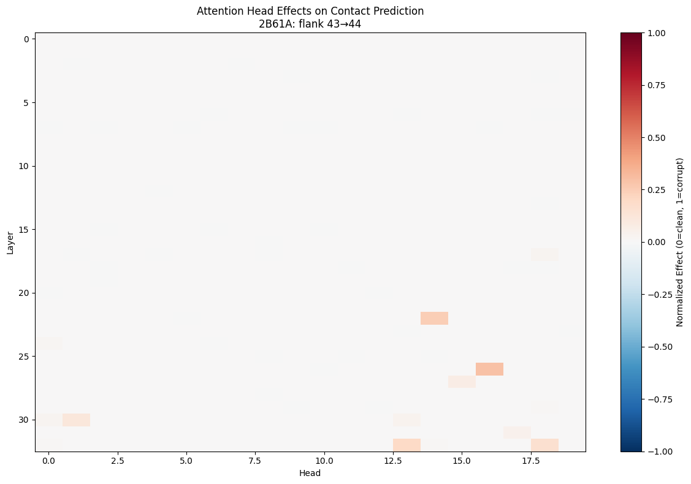
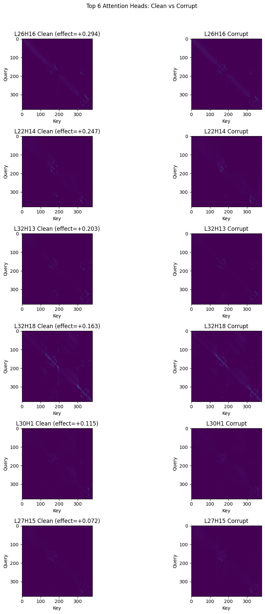

# Attention Circuit Analysis: Contact Prediction Jump

## Setup

### Contact Prediction in ESM2

ESM2 can predict which amino acid pairs are in physical contact in the 3D structure directly from attention patterns. The `contact_head` takes attention weights from all 33 layers × 20 heads and predicts pairwise contact probabilities.

### The Contact Jump Phenomenon

We study protein **2B61A** (MetXA), focusing on a known contact pair at positions 182 and 316. The experiment:

1. **Mask** the entire sequence with `<mask>` tokens
2. **Unmask** the contact regions (±5 residues around positions 182 and 316)
3. **Unmask flanking residues** on either side

The key finding: **changing the flank by just 1 residue causes a ~50% jump in contact prediction accuracy**.

| Flank Size | Unmasked Residues | Patching Metric |
|------------|-------------------|-----------------|
| 43 (corrupt) | ~108 / 377 | 0.028 |
| 44 (clean) | ~110 / 377 | 0.574 |

Unmasking just **2 additional residues** (out of ~400 total) flips the model's prediction from nearly zero to over 50% accuracy.

### Why This Matters for Circuit Analysis

This setup is ideal for mechanistic interpretability:
- **Minimal input change**: Only 2 tokens differ between clean and corrupt
- **Maximal output change**: ~50% swing in the target metric
- **Localized effect**: We know exactly which residues matter (the flanks)

The question: **Which attention heads are responsible for this jump?**

---

## Direct Effect Analysis

### Method

We perform **attention patching** to find heads with direct effects on contact prediction:

1. Cache attention for clean (flank=44) and corrupt (flank=43) sequences
2. For each of 660 heads (33 layers × 20 heads):
   - Start with clean attention
   - Replace that single head with its corrupt version
   - Measure contact prediction accuracy
3. Compute normalized effect: `(patched - clean) / (corrupt - clean)`
   - Effect ≈ 0: Head doesn't matter
   - Effect ≈ 1: This head fully explains the gap

### Results

**Top 6 heads by absolute effect:**

| Layer | Head | Effect |
|-------|------|--------|
| 26 | 16 | +0.294 |
| 22 | 14 | +0.247 |
| 32 | 13 | +0.203 |
| 32 | 18 | +0.163 |
| 30 | 1 | +0.115 |
| 27 | 15 | +0.072 |

### Observations

1. **Late layers dominate**: All top heads are in layers 22-32 (of 33 total). The circuit for contact prediction operates in the final third of the network.

2. **Positive effects only**: All top heads have positive effects, meaning corrupting them hurts performance. No heads show strong negative (compensatory) effects.

3. **Sparse responsibility**: The top head (L26H16) alone accounts for ~30% of the gap. A small number of heads drive most of the effect.

### Attention Pattern Analysis

Comparing clean vs corrupt attention patterns for top heads reveals a striking pattern:

- **Clean patterns**: Show clear attention to the contact region (the block where positions 182 and 316 interact)
- **Corrupt patterns**: This contact block is **entirely missing**

This means the model has already "figured out" the contact by these late layers in the clean run, but never develops this representation in the corrupt run. The flanking residues somehow enable the model to build this contact-aware attention pattern.

---

## Next Steps

### 1. Better Attention Visualization

Current matplotlib heatmaps are inadequate for 379×379 attention matrices. We need:
- **Interactive HTML viewer**: Scroll/zoom, hover for values
- **Token annotations**: Show which tokens are masked, contact region, or flank
- **Region highlighting**: Mark the ss1 (177-187) and ss2 (311-321) segments

### 2. Interpret Direct Effect Heads

For each top head, understand:
- What information flows through it?
- Why does the flank enable the contact pattern?
- Are these heads specialized for contact prediction or general-purpose?

### 3. Indirect Effect Analysis (Path Patching)

The direct effect heads are in late layers (22-32). But something earlier must compute the relevant features. Next experiment:

- For each direct-effect head, find **upstream heads** that affect it
- This reveals the full circuit: early heads → intermediate processing → direct effect heads → contact prediction

The goal: trace the complete path from the 2 critical flank residues to the final contact prediction.
