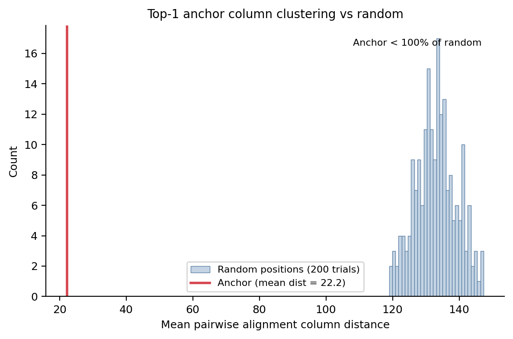
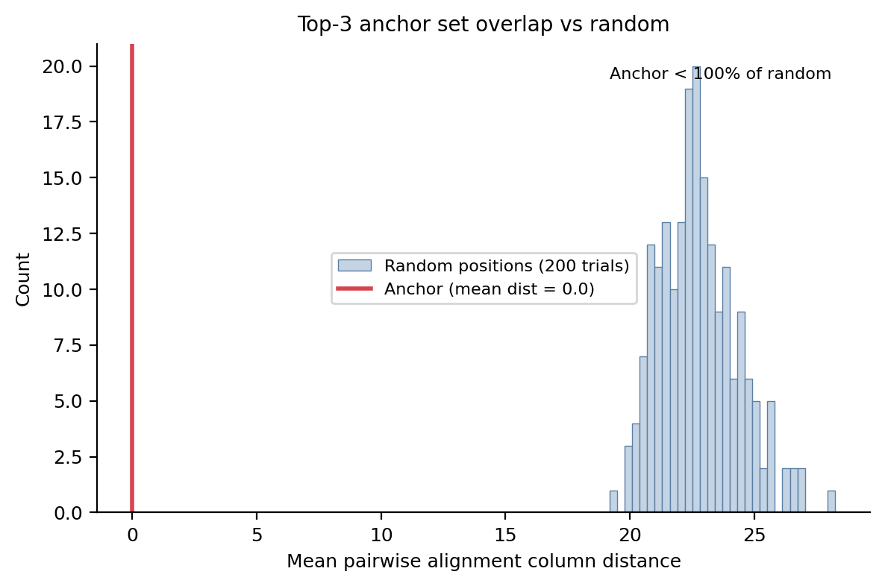
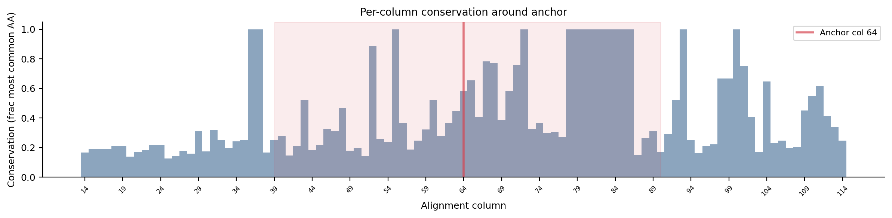
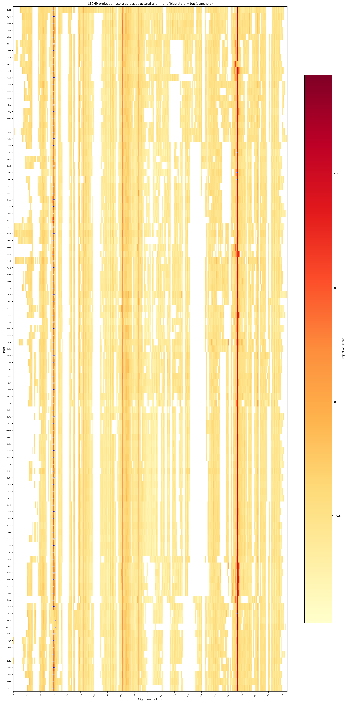
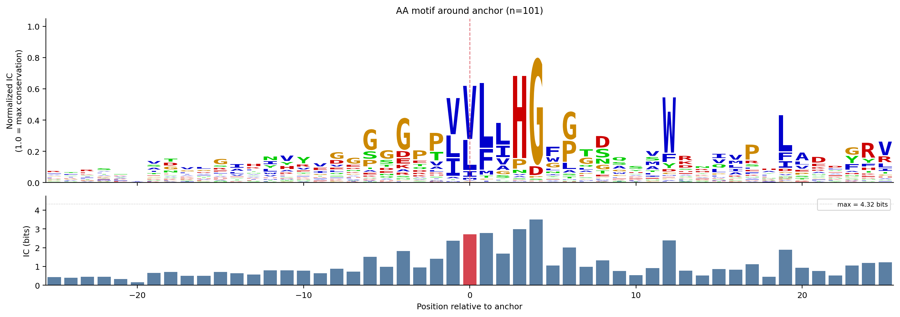
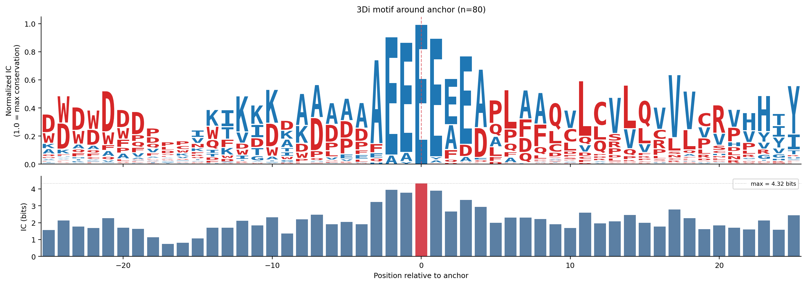

# Structure Anchor Transfer v2

## Data

Foldmason structural alignment of 175 entries (167 unique PDB IDs) from Foldseek top-2 hits for 1PVGA (TM > 0.6, seq id < 0.20).
After assembly collapse (175 -> 167) and deduplication at 90% identity (167 -> 101): 101 proteins.
Alignment length: 431 columns.

### Deduplication log

- Kept 6hgv, dropped ['7a7g', '7p4k'] (>90% identity)
- Kept 6kxh, dropped ['6kxr', '7clz'] (>90% identity)
- Kept 7jqx, dropped ['7jqy'] (>90% identity)
- Kept 3pi6, dropped ['4dmc', '4dln', '4dmk', '3kd2', '4dmf'] (>90% identity)
- Kept 4inz, dropped ['4o08', '4io0'] (>90% identity)
- Kept 3r3z, dropped ['5k3b', '6qkt', '3r41', '5t4t', '5k3f', '5k3d', '5swn', '6qkw', '3r3v', '3r3w', '5k3e', '5k3c', '5o2g', '6qi1', '3r3x', '3r40'] (>90% identity)
- Kept 4b9a, dropped ['4baz'] (>90% identity)
- Kept 3bf7, dropped ['3bf8'] (>90% identity)
- Kept 8ckp, dropped ['8ooh'] (>90% identity)
- Kept 6jra, dropped ['5c7y', '6jqz'] (>90% identity)
- Kept 3wi7, dropped ['3wib'] (>90% identity)
- Kept 1m33, dropped ['4etw'] (>90% identity)
- Kept 5z9g, dropped ['5z9h'] (>90% identity)
- Kept 5cbk, dropped ['8dvc'] (>90% identity)
- Kept 5z89, dropped ['7c8l'] (>90% identity)
- Kept 6uh8, dropped ['4dnq', '4dnp', '6uh9', '6o5j'] (>90% identity)
- Kept 4ih4, dropped ['5hzg'] (>90% identity)
- Kept 7f5w, dropped ['5zhs'] (>90% identity)
- Kept 6atx, dropped ['6azb', '6azc'] (>90% identity)
- Kept 3e3a, dropped ['7ld8'] (>90% identity)
- Kept 5ie4, dropped ['5ie7', '3wzl'] (>90% identity)
- Kept 5xo7, dropped ['5xo6', '5z7j'] (>90% identity)
- Kept 6l4h, dropped ['6l4b', '6l4g'] (>90% identity)
- Kept 2xmr, dropped ['2xms', '2qmq', '2xmq'] (>90% identity)
- Kept 2og1, dropped ['2puh', '3v1l', '3v1k', '2pu7'] (>90% identity)
- Kept 5jz9, dropped ['2wue'] (>90% identity)
- Kept 1iun, dropped ['2d0d'] (>90% identity)
- Kept 2ock, dropped ['2oci', '2ocl'] (>90% identity)
- Kept 4lxh, dropped ['4lxg', '4lyd'] (>90% identity)

## Phase 1: Anchor behavior audit

Reference search direction: d_ref from 2B61A.
Sanity check: cos(d_ref_2B61A, d_ref_1PVGA) = 0.9482.
Anchor-like thresholds: top1_mass > 0.15, rank_corr > 0.3.

| PDB | N res | top1_mass | rank_corr | cos(d_self, d_ref) | Anchor pos | Anchor AA | Anchor-like |
|-----|-------|-----------|-----------|--------------------|-----------:|-----------|:-----------:|
| 2b61 | 357 | 0.484 | 0.937 | 0.999 | 42 | L | YES |
| 5yhp | 318 | 0.633 | 0.949 | 0.997 | 36 | V | YES |
| 1azw | 313 | 0.610 | 0.905 | 0.995 | 37 | V | YES |
| 1x2e | 313 | 0.682 | 0.925 | 0.995 | 37 | V | YES |
| 6hgv | 319 | 0.636 | 0.945 | 0.995 | 33 | C | YES |
| 6kxh | 293 | 0.632 | 0.936 | 0.995 | 40 | L | YES |
| 7jqz | 294 | 0.615 | 0.956 | 0.995 | 38 | V | YES |
| 7jqx | 294 | 0.593 | 0.932 | 0.996 | 41 | V | YES |
| 4psu | 286 | 0.564 | 0.929 | 0.990 | 40 | L | YES |
| 3pi6 | 298 | 0.557 | 0.950 | 0.995 | 33 | M | YES |
| 7ac0 | 283 | 0.716 | 0.935 | 0.995 | 25 | V | YES |
| 5nfq | 298 | 0.654 | 0.928 | 0.995 | 29 | I | YES |
| 8sdc | 296 | 0.686 | 0.946 | 0.996 | 31 | L | YES |
| 5bov | 302 | 0.770 | 0.911 | 0.997 | 32 | I | YES |
| 4inz | 284 | 0.707 | 0.930 | 0.996 | 21 | L | YES |
| 1ehy | 282 | 0.771 | 0.921 | 0.996 | 31 | L | YES |
| 5w15 | 270 | 0.675 | 0.925 | 0.992 | 29 | V | YES |
| 8hgu | 294 | 0.681 | 0.917 | 0.994 | 33 | L | YES |
| 3r3z | 304 | 0.711 | 0.944 | 0.997 | 36 | L | YES |
| 4b9a | 298 | 0.679 | 0.936 | 0.996 | 31 | L | YES |
| 3kxp | 268 | 0.477 | 0.950 | 0.994 | 25 | L | YES |
| 7c4d | 261 | 0.494 | 0.967 | 0.994 | 207 | L | YES |
| 4ose | 283 | 0.459 | 0.951 | 0.993 | 39 | L | YES |
| 4pw0 | 275 | 0.620 | 0.913 | 0.995 | 31 | I | YES |
| 3bf7 | 254 | 0.634 | 0.972 | 0.992 | 198 | L | YES |
| 5frd | 252 | 0.494 | 0.975 | 0.993 | 192 | L | YES |
| 6eb3 | 268 | 0.534 | 0.962 | 0.994 | 22 | L | YES |
| 5egn | 258 | 0.574 | 0.951 | 0.993 | 21 | V | YES |
| 2xua | 260 | 0.584 | 0.959 | 0.991 | 25 | V | YES |
| 3v48 | 263 | 0.541 | 0.941 | 0.990 | 17 | V | YES |
| 4q3l | 275 | 0.581 | 0.945 | 0.996 | 25 | V | YES |
| 3om8 | 265 | 0.489 | 0.949 | 0.990 | 29 | A | YES |
| 4opm | 299 | 0.557 | 0.949 | 0.994 | 47 | L | YES |
| 8ckp | 300 | 0.677 | 0.946 | 0.995 | 50 | L | YES |
| 4ns4 | 271 | 0.561 | 0.949 | 0.995 | 42 | L | YES |
| 4mys | 252 | 0.539 | 0.932 | 0.991 | 17 | V | YES |
| 6ra2 | 261 | 0.545 | 0.949 | 0.990 | 23 | V | YES |
| 4mj3 | 302 | 0.699 | 0.967 | 0.995 | 49 | L | YES |
| 6y9g | 285 | 0.719 | 0.957 | 0.995 | 25 | L | YES |
| 4wdr | 292 | 0.720 | 0.957 | 0.995 | 29 | L | YES |
| 7pw1 | 292 | 0.729 | 0.952 | 0.996 | 29 | V | YES |
| 4brz | 290 | 0.731 | 0.935 | 0.997 | 28 | V | YES |
| 7ots | 292 | 0.530 | 0.968 | 0.991 | 30 | L | YES |
| 8ik2 | 270 | 0.502 | 0.944 | 0.991 | 29 | M | YES |
| 4uhd | 274 | 0.598 | 0.952 | 0.992 | 28 | L | YES |
| 6jra | 268 | 0.566 | 0.932 | 0.994 | 26 | V | YES |
| 4rpc | 250 | 0.664 | 0.951 | 0.989 | 13 | L | YES |
| 5a62 | 272 | 0.596 | 0.948 | 0.995 | 25 | V | YES |
| 7dq9 | 265 | 0.538 | 0.956 | 0.993 | 25 | V | YES |
| 3wi7 | 291 | 0.668 | 0.949 | 0.996 | 32 | V | YES |
| 8b5o | 282 | 0.720 | 0.941 | 0.995 | 22 | V | YES |
| 1a8q | 274 | 0.625 | 0.956 | 0.995 | 22 | V | YES |
| 4rnc | 275 | 0.649 | 0.944 | 0.992 | 27 | V | YES |
| 7yii | 273 | 0.618 | 0.947 | 0.992 | 26 | V | YES |
| 1a8s | 273 | 0.670 | 0.953 | 0.995 | 22 | V | YES |
| 1brt | 277 | 0.634 | 0.950 | 0.995 | 26 | V | YES |
| 3fob | 276 | 0.663 | 0.954 | 0.996 | 25 | V | YES |
| 4x00 | 272 | 0.565 | 0.949 | 0.994 | 26 | I | YES |
| 6t6y | 253 | 0.640 | 0.958 | 0.984 | 26 | V | YES |
| 3e0x | 243 | 0.554 | 0.971 | 0.991 | 17 | L | YES |
| 5z7w | 269 | 0.703 | 0.952 | 0.995 | 19 | V | YES |
| 1m33 | 256 | 0.590 | 0.954 | 0.988 | 14 | V | YES |
| 4nmw | 254 | 0.568 | 0.959 | 0.989 | 14 | V | YES |
| 6azd | 266 | 0.624 | 0.952 | 0.994 | 20 | V | YES |
| 5z9g | 267 | 0.680 | 0.948 | 0.994 | 19 | V | YES |
| 7k38 | 270 | 0.703 | 0.947 | 0.995 | 20 | V | YES |
| 5dnu | 267 | 0.639 | 0.960 | 0.994 | 18 | V | YES |
| 5cbk | 271 | 0.661 | 0.961 | 0.994 | 20 | V | YES |
| 5h3h | 268 | 0.621 | 0.950 | 0.993 | 24 | V | YES |
| 5z7x | 270 | 0.660 | 0.960 | 0.994 | 21 | V | YES |
| 6j2r | 267 | 0.631 | 0.940 | 0.992 | 19 | V | YES |
| 7uoc | 265 | 0.697 | 0.945 | 0.995 | 18 | V | YES |
| 5z89 | 268 | 0.653 | 0.949 | 0.992 | 18 | V | YES |
| 6uh8 | 264 | 0.680 | 0.956 | 0.993 | 20 | V | YES |
| 6xfo | 264 | 0.589 | 0.968 | 0.993 | 19 | V | YES |
| 4ih4 | 261 | 0.624 | 0.968 | 0.995 | 17 | F | YES |
| 1wom | 270 | 0.534 | 0.964 | 0.995 | 22 | M | YES |
| 7f5w | 268 | 0.628 | 0.955 | 0.993 | 22 | V | YES |
| 3qvm | 273 | 0.626 | 0.971 | 0.995 | 26 | L | YES |
| 6atx | 265 | 0.684 | 0.956 | 0.995 | 17 | V | YES |
| 7ukb | 263 | 0.653 | 0.962 | 0.993 | 18 | V | YES |
| 3e3a | 274 | 0.500 | 0.967 | 0.993 | 27 | V | YES |
| 5ie4 | 264 | 0.569 | 0.926 | 0.995 | 26 | V | YES |
| 5xo7 | 264 | 0.663 | 0.952 | 0.995 | 27 | V | YES |
| 5xwz | 262 | 0.635 | 0.963 | 0.995 | 26 | V | YES |
| 6l7m | 267 | 0.671 | 0.933 | 0.994 | 26 | V | YES |
| 8jlv | 264 | 0.626 | 0.925 | 0.995 | 26 | V | YES |
| 4myd | 250 | 0.553 | 0.934 | 0.992 | 16 | V | YES |
| 4i3f | 283 | 0.712 | 0.951 | 0.995 | 27 | L | YES |
| 6l4h | 289 | 0.505 | 0.952 | 0.992 | 228 | L | YES |
| 2xmr | 281 | 0.569 | 0.969 | 0.994 | 28 | L | YES |
| 6zmm | 252 | 0.515 | 0.974 | 0.988 | 25 | L | YES |
| 1c4x | 281 | 0.724 | 0.955 | 0.995 | 29 | V | YES |
| 2og1 | 285 | 0.660 | 0.946 | 0.995 | 35 | I | YES |
| 5jz9 | 284 | 0.520 | 0.965 | 0.996 | 33 | V | YES |
| 1iun | 276 | 0.691 | 0.943 | 0.993 | 27 | I | YES |
| 1u2e | 285 | 0.600 | 0.966 | 0.994 | 35 | V | YES |
| 2ock | 254 | 0.677 | 0.964 | 0.994 | 26 | L | YES |
| 4lxh | 276 | 0.636 | 0.948 | 0.994 | 28 | V | YES |
| 8hgw | 288 | 0.567 | 0.961 | 0.996 | 23 | L | YES |
| 1j1i | 258 | 0.660 | 0.951 | 0.995 | 25 | I | YES |

101/101 proteins pass the anchor-like gate.

### Protein family annotations (RCSB/Pfam)

| PDB | Pfam | Title |
|-----|------|-------|
| 2b61 | PF00561 alpha/beta hydrolase fold (Abhydrolase_1) | Crystal Structure of Homoserine Transacetylase |
| 5yhp | N/A | Proline iminopeptidase from Psychrophilic yeast glaciozyma a |
| 1azw | N/A | PROLINE IMINOPEPTIDASE FROM XANTHOMONAS CAMPESTRIS PV. CITRI |
| 1x2e | N/A | The crystal structure of prolyl aminopeptidase complexed wit |
| 6hgv | PF00561 alpha/beta hydrolase fold (Abhydrolase_1) | Soluble epoxide hydrolase in complex with talinolol |
| 6kxh | N/A | Alp1U_Y247F mutant in complex with Fluostatin C |
| 7jqz | N/A | Crystal structure of Cfl2 wild-type from Burkholderia cenoce |
| 7jqx | N/A | Crystal structure of Cfl1 wild-type from Burkholderia cenoce |
| 4psu | PF12697 Alpha/beta hydrolase family (Abhydrolase_6) | Crystal structure of alpha/beta hydrolase from Rhodopseudomo |
| 3pi6 | N/A | Crystal structure of the CFTR inhibitory factor Cif with the |
| 7ac0 | N/A | Epoxide hydrolase CorEH without ligand |
| 5nfq | N/A | Novel epoxide hydrolases belonging to the alpha/beta hydrola |
| 8sdc | N/A | Crystal structure of fluoroacetate dehalogenase Daro3835 apo |
| 5bov | N/A | Crystal structure of a putative epoxide hydrolase (KPN_01808 |
| 4inz | N/A | The crystal structure of M145A mutant of an epoxide hydrolas |
| 1ehy | N/A | X-ray structure of the epoxide hydrolase from agrobacterium  |
| 5w15 | N/A | Crystal structure of an alpha/beta hydrolase fold protein fr |
| 8hgu | PF00561 alpha/beta hydrolase fold (Abhydrolase_1) | Epoxide hydrolase from Bosea sp. PAMC 26642 |
| 3r3z | N/A | Crystal Structure of the Fluoroacetate Dehalogenase RPA1163  |
| 4b9a | PF00561 alpha/beta hydrolase fold (Abhydrolase_1) | Structure of a putative epoxide hydrolase from Pseudomonas a |
| 3kxp | N/A | Crystal Structure of E-2-(Acetamidomethylene)succinate Hydro |
| 7c4d | N/A | Marine microorganism esterase |
| 4ose | N/A | X-ray Crystal Structure of a Putative Hydrolase from Rickett |
| 4pw0 | N/A | Alpha/beta hydrolase fold protein from Chitinophaga pinensis |
| 3bf7 | PF12697 Alpha/beta hydrolase family (Abhydrolase_6) | 1.1 resolution structure of ybfF, a new esterase from Escher |
| 5frd | PF12697 Alpha/beta hydrolase family (Abhydrolase_6) | Structure of a thermophilic esterase |
| 6eb3 | N/A | Structural and enzymatic characterization of an esterase fro |
| 5egn | N/A | Est816 as an N-Acyl homoserine lactone degrading enzyme |
| 2xua | PF00561 alpha/beta hydrolase fold (Abhydrolase_1) | Crystal structure of the enol-lactonase from Burkholderia xe |
| 3v48 | N/A | Crystal Structure of the putative alpha/beta hydrolase RutD  |
| 4q3l | N/A | Crystal structure of MGS-M2, an alpha/beta hydrolase enzyme  |
| 3om8 | PF00561 alpha/beta hydrolase fold (Abhydrolase_1) | The crystal structure of a hydrolase from Pseudomonas aerugi |
| 4opm | N/A | Crystal structure of a putative lipase (lip1) from Acinetoba |
| 8ckp | N/A | X-ray structure of the crystallization-prone form of subfami |
| 4ns4 | N/A | Crystal structure of cold-active estarase from Psychrobacter |
| 4mys | PF12697 Alpha/beta hydrolase family (Abhydrolase_6) | 1.4 Angstrom Crystal Structure of 2-succinyl-6-hydroxy-2,4-c |
| 6ra2 | PF00561 alpha/beta hydrolase fold (Abhydrolase_1) | Structural basis for recognition and ring-cleavage of the Ps |
| 4mj3 | N/A | Haloalkane dehalogenase DmrA from Mycobacterium rhodesiae JS |
| 6y9g | N/A | Crystal structure of putative ancestral haloalkane dehalogen |
| 4wdr | PF00561 alpha/beta hydrolase fold (Abhydrolase_1) | Crystal structure of haloalkane dehalogenase LinB 140A+143L+ |
| 7pw1 | N/A | Crystal structure of ancestral haloalkane dehalogenase AncLi |
| 4brz | N/A | Haloalkane dehalogenase |
| 7ots | PF00561 alpha/beta hydrolase fold (Abhydrolase_1) | Crystal structure of human Monoacylglycerol Lipase ABHD6 in  |
| 8ik2 | PF00561 alpha/beta hydrolase fold (Abhydrolase_1) | RhlA exhibits dual thioesterase and acyltransferase activiti |
| 4uhd | N/A | Structural studies of a thermophilic esterase from Thermogut |
| 6jra | N/A | ZHD/W183F complex with hydrolyzed aZOL |
| 4rpc | N/A | Crystal structure of the putative alpha/beta hydrolase famil |
| 5a62 | PF00561 alpha/beta hydrolase fold (Abhydrolase_1) | Hydrolytic potential of the ammonia-oxidizing Thaumarchaeon  |
| 7dq9 | PF12697 Alpha/beta hydrolase family (Abhydrolase_6) | Crystal structure of a type-A feruloyl esterase from gut Ali |
| 3wi7 | PF00561 alpha/beta hydrolase fold (Abhydrolase_1) | Crystal Structure of the Novel Haloalkane Dehalogenase DatA  |
| 8b5o | PF00561 alpha/beta hydrolase fold (Abhydrolase_1) | Structure of haloalkane dehalogenase DmmarA from Mycobacteri |
| 1a8q | N/A | BROMOPEROXIDASE A1 |
| 4rnc | N/A | Crystal structure of an esterase RhEst1 from Rhodococcus sp. |
| 7yii | N/A | Carboxylesterase - RoCE |
| 1a8s | N/A | CHLOROPEROXIDASE F/PROPIONATE COMPLEX |
| 1brt | N/A | BROMOPEROXIDASE A2 MUTANT M99T |
| 3fob | PF00561 alpha/beta hydrolase fold (Abhydrolase_1) | Crystal structure of bromoperoxidase from Bacillus anthracis |
| 4x00 | N/A | X-ray crystal structure of a putative aryl esterase from Bur |
| 6t6y | N/A | Structure of the Bottromycin epimerase BotH in complex with  |
| 3e0x | PF00561 alpha/beta hydrolase fold (Abhydrolase_1) | The crystal structure of a Lipase-esterase related protein f |
| 5z7w | N/A | Crystal structure of Striga hermonthica HTL1 (ShHTL1) |
| 1m33 | PF00561 alpha/beta hydrolase fold (Abhydrolase_1) | Crystal Structure of BioH at 1.7 A |
| 4nmw | PF00561 alpha/beta hydrolase fold (Abhydrolase_1) | Crystal Structure of Carboxylesterase BioH from Salmonella e |
| 6azd | PF00561 alpha/beta hydrolase fold (Abhydrolase_1) | Crystal structure of Physcomitrella patens KAI2-like H |
| 5z9g | PF12697 Alpha/beta hydrolase family (Abhydrolase_6) | Crystal structure of KAI2 |
| 7k38 | N/A | Crystal structure of Pisum sativum KAI2 in complex with GR24 |
| 5dnu | N/A | Crystal structure of Striga KAI2-like protein in complex wit |
| 5cbk | N/A | Crystal structure of the strigolactone receptor ShHTL5 from  |
| 5h3h | N/A | Esterase (EaEST) from Exiguobacterium antarcticum |
| 5z7x | N/A | Crystal structure of Striga hermonthica HTL4 (ShHTL4) |
| 6j2r | N/A | Crystal structure of Striga hermonthica HTL8 (ShHTL8) |
| 7uoc | N/A | Crystal structure of Orobanche minor KAI2d4 |
| 5z89 | N/A | Structural basis for specific inhibition of highly sensitive |
| 6uh8 | N/A | Crystal structure of DAD2 N242I mutant |
| 6xfo | N/A | Orthorhombic crystal form of Striga hermonthica Dwarf14 (ShD |
| 4ih4 | PF12697 Alpha/beta hydrolase family (Abhydrolase_6) | Crystal structure of Arabidopsis DWARF14 orthologue, AtD14 |
| 1wom | PF00561 alpha/beta hydrolase fold (Abhydrolase_1) | Crystal structure of RsbQ |
| 7f5w | N/A | Conserved and divergent strigolactone signaling in Saccharum |
| 3qvm | N/A | The structure of olei00960, a hydrolase from Oleispira antar |
| 6atx | PF12697 Alpha/beta hydrolase family (Abhydrolase_6) | Crystal structure of Physcomitrella patens KAI2-like C |
| 7ukb | N/A | Ancestral reconstruction of a plant alpha/beta-hydrolase |
| 3e3a | PF00561 alpha/beta hydrolase fold (Abhydrolase_1) | The Structure of Rv0554 from Mycobacterium tuberculosis |
| 5ie4 | N/A | Crystal structure of a lactonase mutant in complex with subs |
| 5xo7 | PF00561 alpha/beta hydrolase fold (Abhydrolase_1) | Crystal structure of a novel ZEN lactonase mutant with ligan |
| 5xwz | N/A | Crystal structure of a lactonase from Cladophialophora banti |
| 6l7m | N/A | Characterization and structural analysis of a thermostable z |
| 8jlv | PF00561 alpha/beta hydrolase fold (Abhydrolase_1) | Beneficial flip of substrate orientation enable determine su |
| 4myd | PF12697 Alpha/beta hydrolase family (Abhydrolase_6) | 1.37 Angstrom Crystal Structure of E. Coli 2-succinyl-6-hydr |
| 4i3f | N/A | Crystal structure of serine hydrolase CCSP0084 from the poly |
| 6l4h | PF03096 Ndr family (Ndr) | Crystal structure of human NDRG3 C30S mutant |
| 2xmr | PF03096 Ndr family (Ndr) | Crystal structure of human NDRG2 protein provides insight in |
| 6zmm | PF03096 Ndr family (Ndr) | Crystal structure of human NDRG1 |
| 1c4x | N/A | 2-HYDROXY-6-OXO-6-PHENYLHEXA-2,4-DIENOATE HYDROLASE (BPHD) F |
| 2og1 | PF00561 alpha/beta hydrolase fold (Abhydrolase_1) | Crystal Structure of BphD, a C-C hydrolase from Burkholderia |
| 5jz9 | PF00561 alpha/beta hydrolase fold (Abhydrolase_1) | Crystal structure of HsaD bound to 3,5-dichloro-4-hydroxyben |
| 1iun | N/A | meta-Cleavage product hydrolase from Pseudomonas fluorescens |
| 1u2e | PF00561 alpha/beta hydrolase fold (Abhydrolase_1) | Crystal Structure of the C-C bond hydrolase MhpC |
| 2ock | PF00561 alpha/beta hydrolase fold (Abhydrolase_1) | Crystal structure of valacyclovir hydrolase D123N mutant |
| 4lxh | N/A | Crystal Structure of the S105A mutant of a carbon-carbon bon |
| 8hgw | N/A | Crystal structure of MehpH in complex with MBP |
| 1j1i | N/A | Crystal structure of a His-tagged Serine Hydrolase Involved  |

Pfam family distribution:
- N/A: 63 proteins
- PF00561 alpha/beta hydrolase fold (Abhydrolase_1): 26 proteins
- PF12697 Alpha/beta hydrolase family (Abhydrolase_6): 9 proteins
- PF03096 Ndr family (Ndr): 3 proteins

## Phase 2: Top-1 anchor column concordance

### Anchor positions in alignment coordinates

| PDB | Anchor seq pos | Anchor aln col |
|-----|---------------:|---------------:|
| 2b61 | 42 | 64 |
| 5yhp | 36 | 64 |
| 1azw | 37 | 64 |
| 1x2e | 37 | 64 |
| 6hgv | 33 | 64 |
| 6kxh | 40 | 64 |
| 7jqz | 38 | 64 |
| 7jqx | 41 | 64 |
| 4psu | 40 | 64 |
| 3pi6 | 33 | 64 |
| 7ac0 | 25 | 64 |
| 5nfq | 29 | 64 |
| 8sdc | 31 | 64 |
| 5bov | 32 | 64 |
| 4inz | 21 | 64 |
| 1ehy | 31 | 64 |
| 5w15 | 29 | 64 |
| 8hgu | 33 | 64 |
| 3r3z | 36 | 64 |
| 4b9a | 31 | 64 |
| 3kxp | 25 | 64 |
| 7c4d | 207 | 352 |
| 4ose | 39 | 64 |
| 4pw0 | 31 | 64 |
| 3bf7 | 198 | 352 |
| 5frd | 192 | 352 |
| 6eb3 | 22 | 64 |
| 5egn | 21 | 64 |
| 2xua | 25 | 64 |
| 3v48 | 17 | 64 |
| 4q3l | 25 | 64 |
| 3om8 | 29 | 64 |
| 4opm | 47 | 64 |
| 8ckp | 50 | 64 |
| 4ns4 | 42 | 64 |
| 4mys | 17 | 64 |
| 6ra2 | 23 | 64 |
| 4mj3 | 49 | 64 |
| 6y9g | 25 | 64 |
| 4wdr | 29 | 64 |
| 7pw1 | 29 | 64 |
| 4brz | 28 | 64 |
| 7ots | 30 | 64 |
| 8ik2 | 29 | 64 |
| 4uhd | 28 | 64 |
| 6jra | 26 | 64 |
| 4rpc | 13 | 64 |
| 5a62 | 25 | 64 |
| 7dq9 | 25 | 64 |
| 3wi7 | 32 | 64 |
| 8b5o | 22 | 64 |
| 1a8q | 22 | 64 |
| 4rnc | 27 | 64 |
| 7yii | 26 | 64 |
| 1a8s | 22 | 64 |
| 1brt | 26 | 64 |
| 3fob | 25 | 64 |
| 4x00 | 26 | 64 |
| 6t6y | 26 | 64 |
| 3e0x | 17 | 64 |
| 5z7w | 19 | 64 |
| 1m33 | 14 | 64 |
| 4nmw | 14 | 64 |
| 6azd | 20 | 64 |
| 5z9g | 19 | 64 |
| 7k38 | 20 | 64 |
| 5dnu | 18 | 64 |
| 5cbk | 20 | 64 |
| 5h3h | 24 | 64 |
| 5z7x | 21 | 64 |
| 6j2r | 19 | 64 |
| 7uoc | 18 | 64 |
| 5z89 | 18 | 64 |
| 6uh8 | 20 | 64 |
| 6xfo | 19 | 64 |
| 4ih4 | 17 | 64 |
| 1wom | 22 | 64 |
| 7f5w | 22 | 64 |
| 3qvm | 26 | 64 |
| 6atx | 17 | 64 |
| 7ukb | 18 | 64 |
| 3e3a | 27 | 64 |
| 5ie4 | 26 | 64 |
| 5xo7 | 27 | 64 |
| 5xwz | 26 | 64 |
| 6l7m | 26 | 64 |
| 8jlv | 26 | 64 |
| 4myd | 16 | 64 |
| 4i3f | 27 | 64 |
| 6l4h | 228 | 352 |
| 2xmr | 28 | 66 |
| 6zmm | 25 | 66 |
| 1c4x | 29 | 64 |
| 2og1 | 35 | 64 |
| 5jz9 | 33 | 64 |
| 1iun | 27 | 64 |
| 1u2e | 35 | 64 |
| 2ock | 26 | 64 |
| 4lxh | 28 | 64 |
| 8hgw | 23 | 64 |
| 1j1i | 25 | 64 |

Mean pairwise distance: 22.2 columns.
Median: 0.0.
Exact match (dist=0): 4472/5050.
Within 5: 4662/5050.
Within 10: 4662/5050.

### Random position control

Anchor mean pairwise distance: 22.2.
Random mean (200 trials): 133.1 +/- 6.2.
Anchor tighter than 100% of random.

### Projection score transfer

10100 non-gap transfers, 0 gaps.
Top-1: 28.0%, Top-3: 95.2%, Top-5: 95.2%, Top-10: 95.3%.
Mean projection rank: 4.1.

## Phase 3: Top-3 anchor column concordance

### Consensus anchor columns (tolerance=5)

| Column | N proteins | Fraction |
|-------:|-----------:|---------:|
| 64 | 101 | 100% |
| 352 | 101 | 100% |
| 171 | 46 | 46% |
| 196 | 27 | 27% |
| 111 | 13 | 13% |
| 177 | 1 | 1% |

Pairwise min set distance: mean=0.0, median=0.0.
Exact match: 5047/5050.
Within 5: 5050/5050.

## Phase 4: Local sequence conservation

Anchor column: 64.
Global mean conservation: 0.302.
Anchor window (+-25) mean conservation: 0.505.
Global mean pairwise seq identity: 0.182.
Local (+-25) mean pairwise seq identity: 0.242.
Paired t-test (local vs global identity): t=54.12, p=0.00e+00.
Local identity is significantly higher than global around the anchor.

## Phase 5: AA flank motif

n proteins: 101.
IC at anchor: 2.709 bits (max possible: 4.322).
Max IC: 3.491 bits at offset 4.
Anchor AA: {'V': 56, 'L': 32, 'I': 7, 'M': 3, 'C': 1}.
Hydrophobic fraction: 99.0%.

## Phase 6: 3Di flank motif

n proteins: 80.
IC at anchor: 4.322 bits.
Max IC: 4.322 bits at offset 0.

### IC comparison (AA vs 3Di)

At anchor: AA=2.709, 3Di=4.322.
Max: AA=3.491, 3Di=4.322.
Mean: AA=1.097, 3Di=2.144.

## Interpretation

Top-1 concordance: POSITIVE. Anchor positions cluster in structural alignment space.
Local conservation: local sequence identity around anchor IS higher than global. Cannot fully separate structural signal from local sequence signal.
3Di vs AA: 3Di IC at anchor (4.322) > AA IC (2.709). Structural conservation exceeds sequence conservation at the anchor.

## Plots

