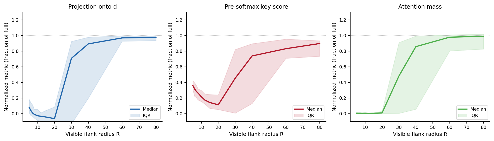
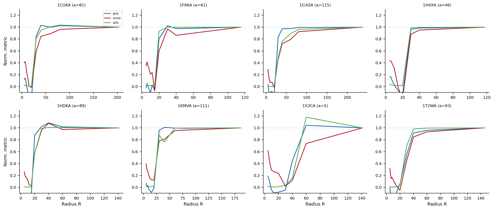
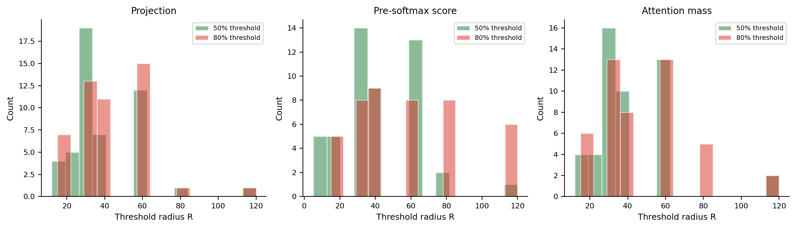
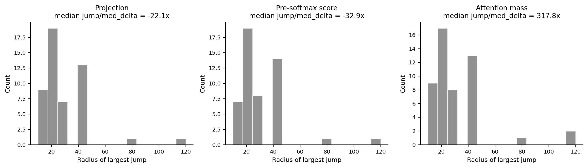
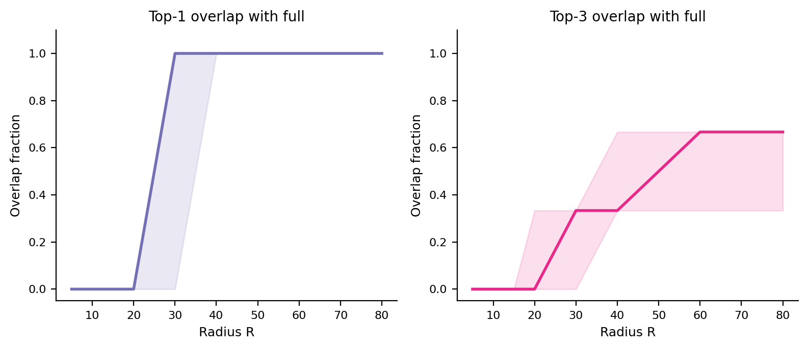

# Anchor Local Flank Reconstruction Analysis

Proteins analyzed: 50 (top 50 by top3_mass from behavior audit).
Search direction d: W_K^T @ q_mean from 2B61A.
Radii schedule: 5, 6, 7, 8, 10, 12, 15, 20, 30, 40, 60, 80, 120, full.

## Key findings

### Recovery shape

Median 50% recovery radius: projection R=30, pre-softmax score R=40, attention mass R=40.

Median 80% recovery radius: projection R=40, pre-softmax score R=50, attention mass R=40.

### Jump detection

Median largest-jump radius: projection R=20, score R=20, attention R=20.

Median jump/median-delta ratio: projection -22.1x, score -32.9x, attention 317.8x.

### Metric ordering

Projection recovers before attention in 7/50 proteins; attention recovers before projection in 0/50.

## Threshold radii summary (median across proteins)

| Metric | R_25 | R_50 | R_80 | R_90 |
|--------|------|------|------|------|
| Projection | 30 | 30 | 40 | 40 |
| Score | 5 | 40 | 50 | 60 |
| Attention | 30 | 40 | 40 | 40 |

## Figures

