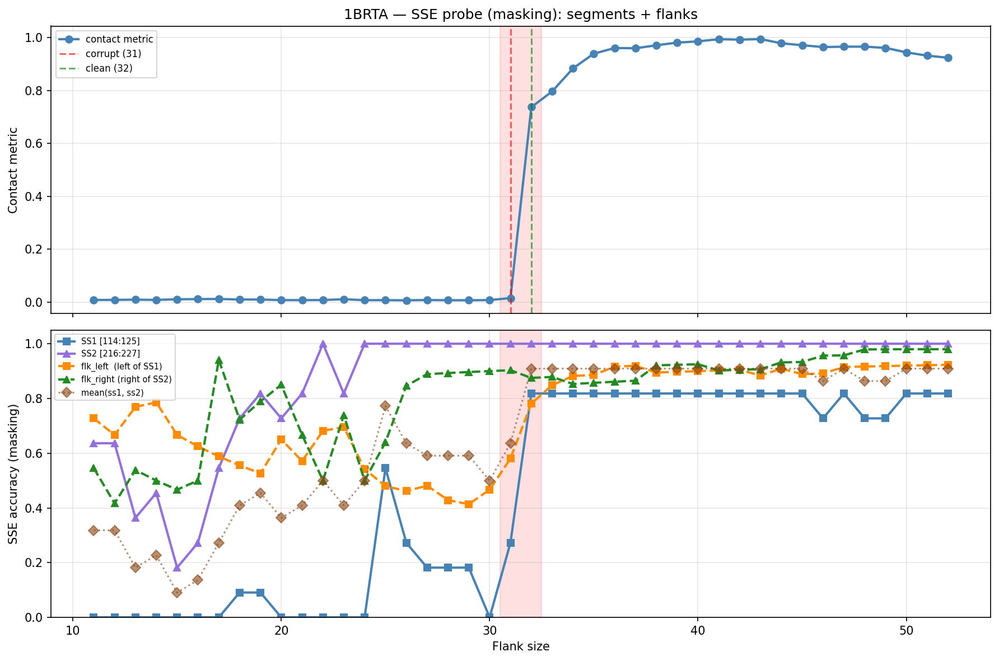

# SSE Probe Analysis: 1BRTA

Generated: 2026-03-03 15:56:30   Model: facebook/esm2_t33_650M_UR50D

## Configuration

| Parameter | Value |
|-----------|-------|
| Protein | 1BRTA |
| Contact pair | (119, 221) |
| ss1 | [114, 125) |
| ss2 | [216, 227) |
| Clean flank | 32 |
| Corrupt flank | 31 |
| Segment radius | 5 |
| Flank sweep | [11, 52] |
| Train sequences | 1,000 |
| Val sequences | 100 |
| Test sequences | 100 |

## SSE Probe Performance

| Split | Accuracy |
|-------|----------|
| Val   | 0.8240 |
| Test  | 0.8259 |

**Test classification report:**

```
              precision    recall  f1-score   support

           H       0.87      0.86      0.86     13101
           E       0.78      0.86      0.82     11471
           C       0.82      0.78      0.80     18602

    accuracy                           0.83     43174
   macro avg       0.83      0.83      0.83     43174
weighted avg       0.83      0.83      0.83     43174

```

## Ground-Truth SSE (full-sequence probe)

| Segment | Sequence |
|---------|----------|
| SS1 [114:125] | `CECEEEEEECE` |
| SS2 [216:227] | `CCCEEEEECCC` |

## Flank Sweep Results

| flank | contact | mk_ss1 | mk_ss2 | mk_mean | mk_flkL | mk_flkR | mk_flk |
|-------|---------|--------|--------|---------|---------|---------|--------|
| 11 | 0.0080 | 0.000 | 0.636 | 0.318 | 0.727 | 0.545 | 0.636 |
| 12 | 0.0085 | 0.000 | 0.636 | 0.318 | 0.667 | 0.417 | 0.542 |
| 13 | 0.0092 | 0.000 | 0.364 | 0.182 | 0.769 | 0.538 | 0.654 |
| 14 | 0.0083 | 0.000 | 0.455 | 0.227 | 0.786 | 0.500 | 0.643 |
| 15 | 0.0107 | 0.000 | 0.182 | 0.091 | 0.667 | 0.467 | 0.567 |
| 16 | 0.0113 | 0.000 | 0.273 | 0.136 | 0.625 | 0.500 | 0.562 |
| 17 | 0.0119 | 0.000 | 0.545 | 0.273 | 0.588 | 0.941 | 0.765 |
| 18 | 0.0098 | 0.091 | 0.727 | 0.409 | 0.556 | 0.722 | 0.639 |
| 19 | 0.0098 | 0.091 | 0.818 | 0.455 | 0.526 | 0.789 | 0.658 |
| 20 | 0.0076 | 0.000 | 0.727 | 0.364 | 0.650 | 0.850 | 0.750 |
| 21 | 0.0075 | 0.000 | 0.818 | 0.409 | 0.571 | 0.667 | 0.619 |
| 22 | 0.0078 | 0.000 | 1.000 | 0.500 | 0.682 | 0.500 | 0.591 |
| 23 | 0.0108 | 0.000 | 0.818 | 0.409 | 0.696 | 0.739 | 0.717 |
| 24 | 0.0074 | 0.000 | 1.000 | 0.500 | 0.542 | 0.500 | 0.521 |
| 25 | 0.0074 | 0.545 | 1.000 | 0.773 | 0.480 | 0.640 | 0.560 |
| 26 | 0.0068 | 0.273 | 1.000 | 0.636 | 0.462 | 0.846 | 0.654 |
| 27 | 0.0079 | 0.182 | 1.000 | 0.591 | 0.481 | 0.889 | 0.685 |
| 28 | 0.0072 | 0.182 | 1.000 | 0.591 | 0.429 | 0.893 | 0.661 |
| 29 | 0.0070 | 0.182 | 1.000 | 0.591 | 0.414 | 0.897 | 0.655 |
| 30 | 0.0077 | 0.000 | 1.000 | 0.500 | 0.467 | 0.900 | 0.683 |
| 31 | 0.0152 | 0.273 | 1.000 | 0.636 | 0.581 | 0.903 | 0.742 |
| 32 | 0.7367 | 0.818 | 1.000 | 0.909 | 0.781 | 0.875 | 0.828 |
| 33 | 0.7962 | 0.818 | 1.000 | 0.909 | 0.848 | 0.879 | 0.864 |
| 34 | 0.8833 | 0.818 | 1.000 | 0.909 | 0.882 | 0.853 | 0.868 |
| 35 | 0.9390 | 0.818 | 1.000 | 0.909 | 0.886 | 0.857 | 0.871 |
| 36 | 0.9603 | 0.818 | 1.000 | 0.909 | 0.917 | 0.861 | 0.889 |
| 37 | 0.9593 | 0.818 | 1.000 | 0.909 | 0.919 | 0.865 | 0.892 |
| 38 | 0.9706 | 0.818 | 1.000 | 0.909 | 0.895 | 0.921 | 0.908 |
| 39 | 0.9807 | 0.818 | 1.000 | 0.909 | 0.897 | 0.923 | 0.910 |
| 40 | 0.9854 | 0.818 | 1.000 | 0.909 | 0.900 | 0.925 | 0.913 |
| 41 | 0.9937 | 0.818 | 1.000 | 0.909 | 0.902 | 0.902 | 0.902 |
| 42 | 0.9919 | 0.818 | 1.000 | 0.909 | 0.905 | 0.905 | 0.905 |
| 43 | 0.9940 | 0.818 | 1.000 | 0.909 | 0.884 | 0.907 | 0.895 |
| 44 | 0.9782 | 0.818 | 1.000 | 0.909 | 0.909 | 0.932 | 0.920 |
| 45 | 0.9708 | 0.818 | 1.000 | 0.909 | 0.889 | 0.933 | 0.911 |
| 46 | 0.9638 | 0.727 | 1.000 | 0.864 | 0.891 | 0.957 | 0.924 |
| 47 | 0.9654 | 0.818 | 1.000 | 0.909 | 0.915 | 0.957 | 0.936 |
| 48 | 0.9654 | 0.727 | 1.000 | 0.864 | 0.917 | 0.979 | 0.948 |
| 49 | 0.9607 | 0.727 | 1.000 | 0.864 | 0.918 | 0.980 | 0.949 |
| 50 | 0.9439 | 0.818 | 1.000 | 0.909 | 0.920 | 0.980 | 0.950 |
| 51 | 0.9314 | 0.818 | 1.000 | 0.909 | 0.922 | 0.980 | 0.951 |
| 52 | 0.9235 | 0.818 | 1.000 | 0.909 | 0.923 | 0.980 | 0.952 |

## Residue-Level Prediction Changes (clean=32, focus ±2)

### Flank 29 → 30

| Seg | Direction | Pos | gt | prev | now |
|-----|-----------|-----|----|------|-----|
| SS1 | corr→incorr | 114 | C | C | E |
| SS1 | corr→incorr | 121 | E | E | H |
| flk_L | incorr→corr | 91 | E | C | E |
| flk_L | incorr→corr | 103 | H | C | H |

### Flank 30 → 31

| Seg | Direction | Pos | gt | prev | now |
|-----|-----------|-----|----|------|-----|
| SS1 | incorr→corr | 114 | C | E | C |
| SS1 | incorr→corr | 116 | C | H | C |
| SS1 | incorr→corr | 119 | E | H | E |
| flk_L | incorr→corr | 102 | H | C | H |
| flk_L | incorr→corr | 104 | H | E | H |
| flk_L | incorr→corr | 106 | H | E | H |
| flk_L | incorr→corr | 107 | H | E | H |

### Flank 31 → 32

| Seg | Direction | Pos | gt | prev | now |
|-----|-----------|-----|----|------|-----|
| SS1 | incorr→corr | 115 | E | H | E |
| SS1 | incorr→corr | 117 | E | H | E |
| SS1 | incorr→corr | 118 | E | H | E |
| SS1 | incorr→corr | 120 | E | H | E |
| SS1 | incorr→corr | 121 | E | H | E |
| SS1 | incorr→corr | 123 | C | H | C |
| flk_L | incorr→corr | 85 | H | C | H |
| flk_L | incorr→corr | 100 | H | C | H |
| flk_L | incorr→corr | 101 | H | C | H |
| flk_L | incorr→corr | 105 | H | E | H |
| flk_L | incorr→corr | 108 | H | C | H |
| flk_L | incorr→corr | 109 | H | C | H |
| flk_L | incorr→corr | 112 | C | H | C |

### Flank 32 → 33

| Seg | Direction | Pos | gt | prev | now |
|-----|-----------|-----|----|------|-----|
| flk_L | incorr→corr | 82 | H | C | H |
| flk_L | incorr→corr | 83 | H | C | H |
| flk_L | incorr→corr | 84 | H | C | H |
| flk_L | corr→incorr | 112 | C | C | H |
| flk_R | incorr→corr | 230 | C | E | C |

### Flank 33 → 34

| Seg | Direction | Pos | gt | prev | now |
|-----|-----------|-----|----|------|-----|
| flk_L | incorr→corr | 112 | C | H | C |

## Plot


