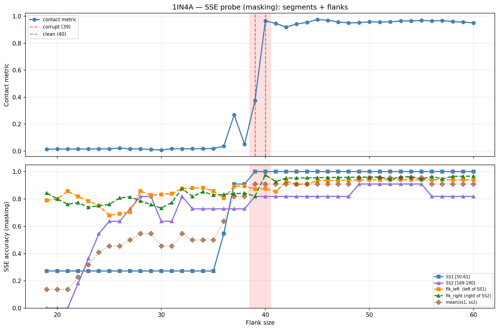

# SSE Probe Analysis: 1IN4A

Generated: 2026-03-03 15:56:37   Model: facebook/esm2_t33_650M_UR50D

## Configuration

| Parameter | Value |
|-----------|-------|
| Protein | 1IN4A |
| Contact pair | (55, 174) |
| ss1 | [50, 61) |
| ss2 | [169, 180) |
| Clean flank | 40 |
| Corrupt flank | 39 |
| Segment radius | 5 |
| Flank sweep | [19, 60] |
| Train sequences | 1,000 |
| Val sequences | 100 |
| Test sequences | 100 |

## SSE Probe Performance

| Split | Accuracy |
|-------|----------|
| Val   | 0.8240 |
| Test  | 0.8259 |

**Test classification report:**

```
              precision    recall  f1-score   support

           H       0.87      0.86      0.86     13101
           E       0.78      0.86      0.82     11471
           C       0.82      0.78      0.80     18602

    accuracy                           0.83     43174
   macro avg       0.83      0.83      0.83     43174
weighted avg       0.83      0.83      0.83     43174

```

## Ground-Truth SSE (full-sequence probe)

| Segment | Sequence |
|---------|----------|
| SS1 [50:61] | `CCEEEEEECCC` |
| SS2 [169:180] | `HCCCEEECCCC` |

## Flank Sweep Results

| flank | contact | mk_ss1 | mk_ss2 | mk_mean | mk_flkL | mk_flkR | mk_flk |
|-------|---------|--------|--------|---------|---------|---------|--------|
| 19 | 0.0139 | 0.273 | 0.000 | 0.136 | 0.789 | 0.842 | 0.816 |
| 20 | 0.0146 | 0.273 | 0.000 | 0.136 | 0.800 | 0.800 | 0.800 |
| 21 | 0.0147 | 0.273 | 0.000 | 0.136 | 0.857 | 0.762 | 0.810 |
| 22 | 0.0146 | 0.273 | 0.182 | 0.227 | 0.818 | 0.773 | 0.795 |
| 23 | 0.0151 | 0.273 | 0.364 | 0.318 | 0.783 | 0.739 | 0.761 |
| 24 | 0.0160 | 0.273 | 0.545 | 0.409 | 0.750 | 0.750 | 0.750 |
| 25 | 0.0162 | 0.273 | 0.636 | 0.455 | 0.680 | 0.760 | 0.720 |
| 26 | 0.0210 | 0.273 | 0.636 | 0.455 | 0.692 | 0.808 | 0.750 |
| 27 | 0.0159 | 0.273 | 0.727 | 0.500 | 0.704 | 0.815 | 0.759 |
| 28 | 0.0154 | 0.273 | 0.818 | 0.545 | 0.857 | 0.786 | 0.821 |
| 29 | 0.0123 | 0.273 | 0.818 | 0.545 | 0.828 | 0.759 | 0.793 |
| 30 | 0.0082 | 0.273 | 0.636 | 0.455 | 0.833 | 0.733 | 0.783 |
| 31 | 0.0173 | 0.273 | 0.636 | 0.455 | 0.839 | 0.774 | 0.806 |
| 32 | 0.0164 | 0.273 | 0.818 | 0.545 | 0.875 | 0.875 | 0.875 |
| 33 | 0.0168 | 0.273 | 0.727 | 0.500 | 0.879 | 0.818 | 0.848 |
| 34 | 0.0172 | 0.273 | 0.727 | 0.500 | 0.882 | 0.853 | 0.868 |
| 35 | 0.0180 | 0.273 | 0.727 | 0.500 | 0.857 | 0.829 | 0.843 |
| 36 | 0.0367 | 0.545 | 0.727 | 0.636 | 0.806 | 0.833 | 0.819 |
| 37 | 0.2679 | 0.909 | 0.727 | 0.818 | 0.892 | 0.838 | 0.865 |
| 38 | 0.0503 | 0.909 | 0.727 | 0.818 | 0.895 | 0.842 | 0.868 |
| 39 | 0.3736 | 1.000 | 0.818 | 0.909 | 0.872 | 0.821 | 0.846 |
| 40 | 0.9656 | 1.000 | 0.818 | 0.909 | 0.875 | 0.975 | 0.925 |
| 41 | 0.9465 | 1.000 | 0.818 | 0.909 | 0.854 | 0.927 | 0.890 |
| 42 | 0.9190 | 1.000 | 0.818 | 0.909 | 0.929 | 0.952 | 0.940 |
| 43 | 0.9425 | 1.000 | 0.818 | 0.909 | 0.907 | 0.953 | 0.930 |
| 44 | 0.9539 | 1.000 | 0.818 | 0.909 | 0.909 | 0.955 | 0.932 |
| 45 | 0.9755 | 1.000 | 0.818 | 0.909 | 0.933 | 0.956 | 0.944 |
| 46 | 0.9699 | 1.000 | 0.818 | 0.909 | 0.935 | 0.957 | 0.946 |
| 47 | 0.9572 | 1.000 | 0.818 | 0.909 | 0.936 | 0.957 | 0.947 |
| 48 | 0.9502 | 1.000 | 0.818 | 0.909 | 0.938 | 0.958 | 0.948 |
| 49 | 0.9522 | 1.000 | 0.909 | 0.955 | 0.939 | 0.959 | 0.949 |
| 50 | 0.9579 | 1.000 | 0.909 | 0.955 | 0.940 | 0.960 | 0.950 |
| 51 | 0.9573 | 1.000 | 0.909 | 0.955 | 0.940 | 0.961 | 0.950 |
| 52 | 0.9577 | 1.000 | 0.909 | 0.955 | 0.940 | 0.942 | 0.941 |
| 53 | 0.9653 | 1.000 | 0.909 | 0.955 | 0.940 | 0.962 | 0.951 |
| 54 | 0.9652 | 1.000 | 0.909 | 0.955 | 0.940 | 0.963 | 0.951 |
| 55 | 0.9685 | 1.000 | 0.909 | 0.955 | 0.940 | 0.945 | 0.943 |
| 56 | 0.9655 | 1.000 | 0.818 | 0.909 | 0.940 | 0.964 | 0.952 |
| 57 | 0.9677 | 1.000 | 0.818 | 0.909 | 0.940 | 0.947 | 0.944 |
| 58 | 0.9600 | 1.000 | 0.818 | 0.909 | 0.940 | 0.966 | 0.953 |
| 59 | 0.9563 | 1.000 | 0.818 | 0.909 | 0.940 | 0.966 | 0.953 |
| 60 | 0.9504 | 1.000 | 0.818 | 0.909 | 0.940 | 0.967 | 0.953 |

## Residue-Level Prediction Changes (clean=40, focus ±2)

### Flank 37 → 38

| Seg | Direction | Pos | gt | prev | now |
|-----|-----------|-----|----|------|-----|
| SS2 | corr→incorr | 171 | C | C | E |
| SS2 | incorr→corr | 172 | C | E | C |
| flk_L | incorr→corr | 15 | H | C | H |
| flk_L | corr→incorr | 16 | C | C | H |
| flk_L | corr→incorr | 17 | C | C | H |
| flk_L | incorr→corr | 24 | H | C | H |
| flk_R | incorr→corr | 197 | C | H | C |

### Flank 38 → 39

| Seg | Direction | Pos | gt | prev | now |
|-----|-----------|-----|----|------|-----|
| SS1 | incorr→corr | 57 | E | C | E |
| SS2 | incorr→corr | 171 | C | E | C |
| SS2 | corr→incorr | 172 | C | C | E |
| SS2 | incorr→corr | 175 | E | C | E |
| flk_L | corr→incorr | 29 | C | C | H |
| flk_R | corr→incorr | 194 | H | H | C |
| flk_R | incorr→corr | 200 | C | H | C |

### Flank 39 → 40

| Seg | Direction | Pos | gt | prev | now |
|-----|-----------|-----|----|------|-----|
| flk_L | incorr→corr | 17 | C | H | C |
| flk_R | incorr→corr | 194 | H | C | H |
| flk_R | incorr→corr | 195 | H | C | H |
| flk_R | incorr→corr | 198 | E | C | E |
| flk_R | incorr→corr | 216 | H | C | H |
| flk_R | incorr→corr | 217 | H | C | H |
| flk_R | incorr→corr | 218 | H | C | H |

### Flank 40 → 41

| Seg | Direction | Pos | gt | prev | now |
|-----|-----------|-----|----|------|-----|
| flk_L | corr→incorr | 17 | C | C | H |
| flk_R | corr→incorr | 195 | H | H | C |
| flk_R | corr→incorr | 211 | C | C | H |

### Flank 41 → 42

| Seg | Direction | Pos | gt | prev | now |
|-----|-----------|-----|----|------|-----|
| flk_L | incorr→corr | 17 | C | H | C |
| flk_L | incorr→corr | 26 | E | C | E |
| flk_L | incorr→corr | 29 | C | H | C |
| flk_R | incorr→corr | 211 | C | H | C |

## Plot


