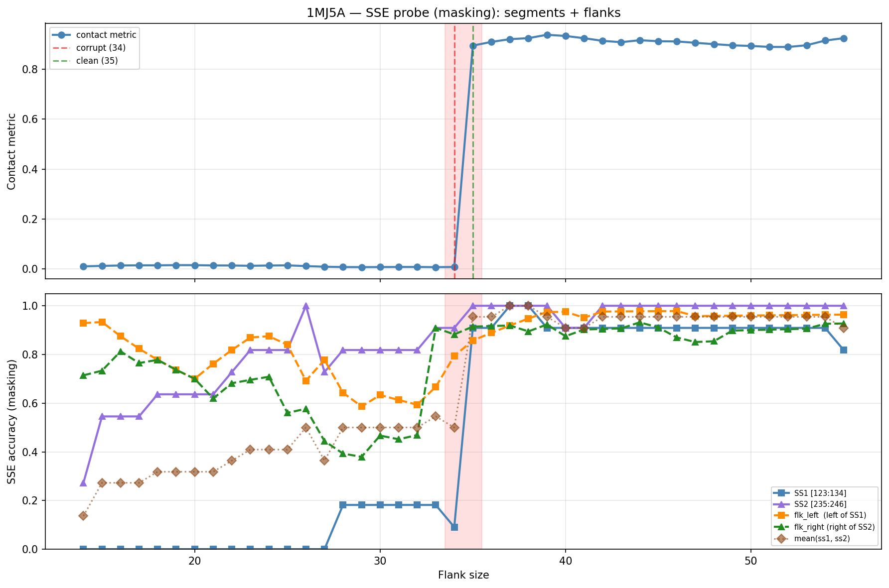

# SSE Probe Analysis: 1MJ5A

Generated: 2026-03-03 15:56:43   Model: facebook/esm2_t33_650M_UR50D

## Configuration

| Parameter | Value |
|-----------|-------|
| Protein | 1MJ5A |
| Contact pair | (128, 240) |
| ss1 | [123, 134) |
| ss2 | [235, 246) |
| Clean flank | 35 |
| Corrupt flank | 34 |
| Segment radius | 5 |
| Flank sweep | [14, 55] |
| Train sequences | 1,000 |
| Val sequences | 100 |
| Test sequences | 100 |

## SSE Probe Performance

| Split | Accuracy |
|-------|----------|
| Val   | 0.8240 |
| Test  | 0.8259 |

**Test classification report:**

```
              precision    recall  f1-score   support

           H       0.87      0.86      0.86     13101
           E       0.78      0.86      0.82     11471
           C       0.82      0.78      0.80     18602

    accuracy                           0.83     43174
   macro avg       0.83      0.83      0.83     43174
weighted avg       0.83      0.83      0.83     43174

```

## Ground-Truth SSE (full-sequence probe)

| Segment | Sequence |
|---------|----------|
| SS1 [123:134] | `CEEEEEEECCC` |
| SS2 [235:246] | `CCEEEEECCCC` |

## Flank Sweep Results

| flank | contact | mk_ss1 | mk_ss2 | mk_mean | mk_flkL | mk_flkR | mk_flk |
|-------|---------|--------|--------|---------|---------|---------|--------|
| 14 | 0.0102 | 0.000 | 0.273 | 0.136 | 0.929 | 0.714 | 0.821 |
| 15 | 0.0121 | 0.000 | 0.545 | 0.273 | 0.933 | 0.733 | 0.833 |
| 16 | 0.0137 | 0.000 | 0.545 | 0.273 | 0.875 | 0.812 | 0.844 |
| 17 | 0.0143 | 0.000 | 0.545 | 0.273 | 0.824 | 0.765 | 0.794 |
| 18 | 0.0144 | 0.000 | 0.636 | 0.318 | 0.778 | 0.778 | 0.778 |
| 19 | 0.0152 | 0.000 | 0.636 | 0.318 | 0.737 | 0.737 | 0.737 |
| 20 | 0.0151 | 0.000 | 0.636 | 0.318 | 0.700 | 0.700 | 0.700 |
| 21 | 0.0139 | 0.000 | 0.636 | 0.318 | 0.762 | 0.619 | 0.690 |
| 22 | 0.0136 | 0.000 | 0.727 | 0.364 | 0.818 | 0.682 | 0.750 |
| 23 | 0.0124 | 0.000 | 0.818 | 0.409 | 0.870 | 0.696 | 0.783 |
| 24 | 0.0136 | 0.000 | 0.818 | 0.409 | 0.875 | 0.708 | 0.792 |
| 25 | 0.0142 | 0.000 | 0.818 | 0.409 | 0.840 | 0.560 | 0.700 |
| 26 | 0.0113 | 0.000 | 1.000 | 0.500 | 0.692 | 0.577 | 0.635 |
| 27 | 0.0088 | 0.000 | 0.727 | 0.364 | 0.778 | 0.444 | 0.611 |
| 28 | 0.0074 | 0.182 | 0.818 | 0.500 | 0.643 | 0.393 | 0.518 |
| 29 | 0.0072 | 0.182 | 0.818 | 0.500 | 0.586 | 0.379 | 0.483 |
| 30 | 0.0074 | 0.182 | 0.818 | 0.500 | 0.633 | 0.467 | 0.550 |
| 31 | 0.0077 | 0.182 | 0.818 | 0.500 | 0.613 | 0.452 | 0.532 |
| 32 | 0.0078 | 0.182 | 0.818 | 0.500 | 0.594 | 0.469 | 0.531 |
| 33 | 0.0071 | 0.182 | 0.909 | 0.545 | 0.667 | 0.909 | 0.788 |
| 34 | 0.0078 | 0.091 | 0.909 | 0.500 | 0.794 | 0.882 | 0.838 |
| 35 | 0.8945 | 0.909 | 1.000 | 0.955 | 0.857 | 0.914 | 0.886 |
| 36 | 0.9094 | 0.909 | 1.000 | 0.955 | 0.889 | 0.917 | 0.903 |
| 37 | 0.9204 | 1.000 | 1.000 | 1.000 | 0.919 | 0.919 | 0.919 |
| 38 | 0.9245 | 1.000 | 1.000 | 1.000 | 0.947 | 0.895 | 0.921 |
| 39 | 0.9380 | 0.909 | 1.000 | 0.955 | 0.974 | 0.923 | 0.949 |
| 40 | 0.9332 | 0.909 | 0.909 | 0.909 | 0.975 | 0.875 | 0.925 |
| 41 | 0.9243 | 0.909 | 0.909 | 0.909 | 0.951 | 0.902 | 0.927 |
| 42 | 0.9136 | 0.909 | 1.000 | 0.955 | 0.976 | 0.905 | 0.940 |
| 43 | 0.9083 | 0.909 | 1.000 | 0.955 | 0.977 | 0.907 | 0.942 |
| 44 | 0.9162 | 0.909 | 1.000 | 0.955 | 0.977 | 0.932 | 0.955 |
| 45 | 0.9122 | 0.909 | 1.000 | 0.955 | 0.978 | 0.911 | 0.944 |
| 46 | 0.9112 | 0.909 | 1.000 | 0.955 | 0.978 | 0.870 | 0.924 |
| 47 | 0.9058 | 0.909 | 1.000 | 0.955 | 0.957 | 0.851 | 0.904 |
| 48 | 0.9004 | 0.909 | 1.000 | 0.955 | 0.958 | 0.854 | 0.906 |
| 49 | 0.8956 | 0.909 | 1.000 | 0.955 | 0.959 | 0.898 | 0.929 |
| 50 | 0.8932 | 0.909 | 1.000 | 0.955 | 0.960 | 0.900 | 0.930 |
| 51 | 0.8893 | 0.909 | 1.000 | 0.955 | 0.961 | 0.902 | 0.931 |
| 52 | 0.8890 | 0.909 | 1.000 | 0.955 | 0.962 | 0.904 | 0.933 |
| 53 | 0.8960 | 0.909 | 1.000 | 0.955 | 0.962 | 0.906 | 0.934 |
| 54 | 0.9147 | 0.909 | 1.000 | 0.955 | 0.963 | 0.926 | 0.944 |
| 55 | 0.9244 | 0.818 | 1.000 | 0.909 | 0.964 | 0.927 | 0.945 |

## Residue-Level Prediction Changes (clean=35, focus ±2)

### Flank 32 → 33

| Seg | Direction | Pos | gt | prev | now |
|-----|-----------|-----|----|------|-----|
| SS2 | incorr→corr | 237 | E | C | E |
| SS2 | incorr→corr | 241 | E | C | E |
| SS2 | corr→incorr | 242 | C | C | E |
| flk_L | incorr→corr | 91 | H | C | H |
| flk_L | incorr→corr | 92 | H | E | H |
| flk_L | incorr→corr | 93 | H | C | H |
| flk_L | incorr→corr | 94 | H | C | H |
| flk_L | corr→incorr | 95 | C | C | H |
| flk_L | corr→incorr | 112 | H | H | C |
| flk_L | incorr→corr | 115 | H | C | H |
| flk_R | incorr→corr | 247 | C | E | C |
| flk_R | incorr→corr | 249 | H | C | H |
| flk_R | incorr→corr | 250 | H | C | H |
| flk_R | incorr→corr | 252 | H | C | H |
| flk_R | incorr→corr | 253 | H | E | H |
| flk_R | incorr→corr | 254 | H | C | H |
| flk_R | incorr→corr | 255 | H | C | H |
| flk_R | incorr→corr | 263 | E | C | E |
| flk_R | incorr→corr | 264 | E | C | E |
| flk_R | incorr→corr | 265 | E | C | E |
| flk_R | incorr→corr | 266 | E | C | E |
| flk_R | incorr→corr | 267 | E | C | E |
| flk_R | incorr→corr | 272 | C | E | C |
| flk_R | incorr→corr | 274 | E | C | E |
| flk_R | incorr→corr | 275 | H | C | H |

### Flank 33 → 34

| Seg | Direction | Pos | gt | prev | now |
|-----|-----------|-----|----|------|-----|
| SS1 | corr→incorr | 133 | C | C | H |
| flk_L | incorr→corr | 90 | H | C | H |
| flk_L | incorr→corr | 111 | H | C | H |
| flk_L | incorr→corr | 113 | H | C | H |
| flk_L | incorr→corr | 114 | H | C | H |
| flk_R | corr→incorr | 273 | C | C | H |
| flk_R | corr→incorr | 274 | E | E | C |
| flk_R | incorr→corr | 278 | H | C | H |

### Flank 34 → 35

| Seg | Direction | Pos | gt | prev | now |
|-----|-----------|-----|----|------|-----|
| SS1 | incorr→corr | 123 | C | H | C |
| SS1 | incorr→corr | 124 | E | H | E |
| SS1 | incorr→corr | 125 | E | C | E |
| SS1 | incorr→corr | 126 | E | C | E |
| SS1 | incorr→corr | 127 | E | C | E |
| SS1 | incorr→corr | 128 | E | C | E |
| SS1 | incorr→corr | 129 | E | H | E |
| SS1 | incorr→corr | 130 | E | H | E |
| SS1 | incorr→corr | 131 | C | H | C |
| SS1 | corr→incorr | 132 | C | C | E |
| SS1 | incorr→corr | 133 | C | H | C |
| SS2 | incorr→corr | 242 | C | E | C |
| flk_L | incorr→corr | 95 | C | H | C |
| flk_L | incorr→corr | 100 | C | E | C |
| flk_L | incorr→corr | 112 | H | C | H |
| flk_L | incorr→corr | 120 | C | H | C |
| flk_L | corr→incorr | 121 | H | H | C |
| flk_L | corr→incorr | 122 | H | H | C |
| flk_R | incorr→corr | 273 | C | H | C |

### Flank 35 → 36

| Seg | Direction | Pos | gt | prev | now |
|-----|-----------|-----|----|------|-----|
| flk_L | incorr→corr | 108 | H | C | H |

### Flank 36 → 37

| Seg | Direction | Pos | gt | prev | now |
|-----|-----------|-----|----|------|-----|
| SS1 | incorr→corr | 132 | C | E | C |
| flk_L | incorr→corr | 122 | H | C | H |

## Plot


