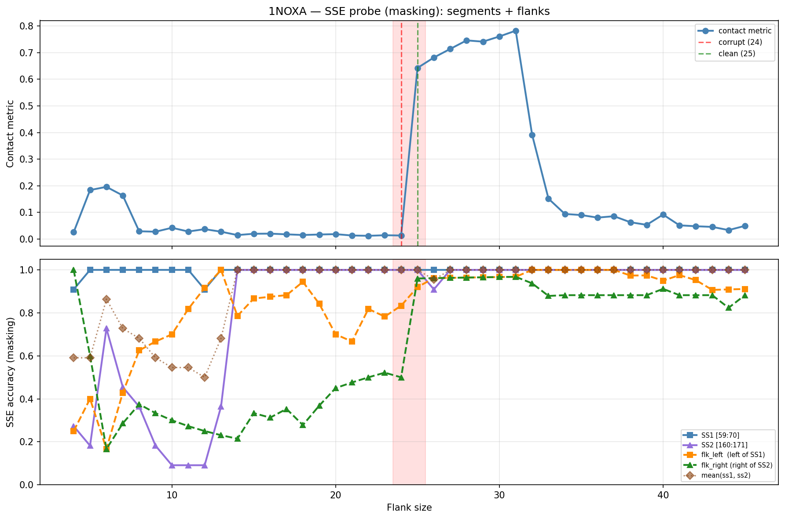

# SSE Probe Analysis: 1NOXA

Generated: 2026-03-03 15:56:48   Model: facebook/esm2_t33_650M_UR50D

## Configuration

| Parameter | Value |
|-----------|-------|
| Protein | 1NOXA |
| Contact pair | (64, 165) |
| ss1 | [59, 70) |
| ss2 | [160, 171) |
| Clean flank | 25 |
| Corrupt flank | 24 |
| Segment radius | 5 |
| Flank sweep | [4, 45] |
| Train sequences | 1,000 |
| Val sequences | 100 |
| Test sequences | 100 |

## SSE Probe Performance

| Split | Accuracy |
|-------|----------|
| Val   | 0.8240 |
| Test  | 0.8259 |

**Test classification report:**

```
              precision    recall  f1-score   support

           H       0.87      0.86      0.86     13101
           E       0.78      0.86      0.82     11471
           C       0.82      0.78      0.80     18602

    accuracy                           0.83     43174
   macro avg       0.83      0.83      0.83     43174
weighted avg       0.83      0.83      0.83     43174

```

## Ground-Truth SSE (full-sequence probe)

| Segment | Sequence |
|---------|----------|
| SS1 [59:70] | `HHHHHHHHHHH` |
| SS2 [160:171] | `CHHHHHHHHCC` |

## Flank Sweep Results

| flank | contact | mk_ss1 | mk_ss2 | mk_mean | mk_flkL | mk_flkR | mk_flk |
|-------|---------|--------|--------|---------|---------|---------|--------|
| 4 | 0.0257 | 0.909 | 0.273 | 0.591 | 0.250 | 1.000 | 0.625 |
| 5 | 0.1839 | 1.000 | 0.182 | 0.591 | 0.400 | 0.600 | 0.500 |
| 6 | 0.1959 | 1.000 | 0.727 | 0.864 | 0.167 | 0.167 | 0.167 |
| 7 | 0.1635 | 1.000 | 0.455 | 0.727 | 0.429 | 0.286 | 0.357 |
| 8 | 0.0291 | 1.000 | 0.364 | 0.682 | 0.625 | 0.375 | 0.500 |
| 9 | 0.0274 | 1.000 | 0.182 | 0.591 | 0.667 | 0.333 | 0.500 |
| 10 | 0.0422 | 1.000 | 0.091 | 0.545 | 0.700 | 0.300 | 0.500 |
| 11 | 0.0282 | 1.000 | 0.091 | 0.545 | 0.818 | 0.273 | 0.545 |
| 12 | 0.0370 | 0.909 | 0.091 | 0.500 | 0.917 | 0.250 | 0.583 |
| 13 | 0.0275 | 1.000 | 0.364 | 0.682 | 1.000 | 0.231 | 0.615 |
| 14 | 0.0148 | 1.000 | 1.000 | 1.000 | 0.786 | 0.214 | 0.500 |
| 15 | 0.0197 | 1.000 | 1.000 | 1.000 | 0.867 | 0.333 | 0.600 |
| 16 | 0.0202 | 1.000 | 1.000 | 1.000 | 0.875 | 0.312 | 0.594 |
| 17 | 0.0175 | 1.000 | 1.000 | 1.000 | 0.882 | 0.353 | 0.618 |
| 18 | 0.0151 | 1.000 | 1.000 | 1.000 | 0.944 | 0.278 | 0.611 |
| 19 | 0.0169 | 1.000 | 1.000 | 1.000 | 0.842 | 0.368 | 0.605 |
| 20 | 0.0183 | 1.000 | 1.000 | 1.000 | 0.700 | 0.450 | 0.575 |
| 21 | 0.0132 | 1.000 | 1.000 | 1.000 | 0.667 | 0.476 | 0.571 |
| 22 | 0.0121 | 1.000 | 1.000 | 1.000 | 0.818 | 0.500 | 0.659 |
| 23 | 0.0141 | 1.000 | 1.000 | 1.000 | 0.783 | 0.522 | 0.652 |
| 24 | 0.0132 | 1.000 | 1.000 | 1.000 | 0.833 | 0.500 | 0.667 |
| 25 | 0.6427 | 1.000 | 1.000 | 1.000 | 0.920 | 0.960 | 0.940 |
| 26 | 0.6817 | 1.000 | 0.909 | 0.955 | 0.962 | 0.962 | 0.962 |
| 27 | 0.7141 | 1.000 | 1.000 | 1.000 | 0.963 | 0.963 | 0.963 |
| 28 | 0.7461 | 1.000 | 1.000 | 1.000 | 0.964 | 0.964 | 0.964 |
| 29 | 0.7414 | 1.000 | 1.000 | 1.000 | 0.966 | 0.966 | 0.966 |
| 30 | 0.7608 | 1.000 | 1.000 | 1.000 | 0.967 | 0.967 | 0.967 |
| 31 | 0.7825 | 1.000 | 1.000 | 1.000 | 0.968 | 0.968 | 0.968 |
| 32 | 0.3918 | 1.000 | 1.000 | 1.000 | 1.000 | 0.938 | 0.969 |
| 33 | 0.1516 | 1.000 | 1.000 | 1.000 | 1.000 | 0.879 | 0.939 |
| 34 | 0.0942 | 1.000 | 1.000 | 1.000 | 1.000 | 0.882 | 0.941 |
| 35 | 0.0900 | 1.000 | 1.000 | 1.000 | 1.000 | 0.882 | 0.941 |
| 36 | 0.0804 | 1.000 | 1.000 | 1.000 | 1.000 | 0.882 | 0.941 |
| 37 | 0.0857 | 1.000 | 1.000 | 1.000 | 1.000 | 0.882 | 0.941 |
| 38 | 0.0630 | 1.000 | 1.000 | 1.000 | 0.974 | 0.882 | 0.928 |
| 39 | 0.0532 | 1.000 | 1.000 | 1.000 | 0.974 | 0.882 | 0.928 |
| 40 | 0.0918 | 1.000 | 1.000 | 1.000 | 0.950 | 0.912 | 0.931 |
| 41 | 0.0514 | 1.000 | 1.000 | 1.000 | 0.976 | 0.882 | 0.929 |
| 42 | 0.0480 | 1.000 | 1.000 | 1.000 | 0.952 | 0.882 | 0.917 |
| 43 | 0.0456 | 1.000 | 1.000 | 1.000 | 0.907 | 0.882 | 0.895 |
| 44 | 0.0335 | 1.000 | 1.000 | 1.000 | 0.909 | 0.824 | 0.866 |
| 45 | 0.0494 | 1.000 | 1.000 | 1.000 | 0.911 | 0.882 | 0.897 |

## Residue-Level Prediction Changes (clean=25, focus ±2)

### Flank 22 → 23

| Seg | Direction | Pos | gt | prev | now |
|-----|-----------|-----|----|------|-----|
| flk_L | corr→incorr | 52 | E | E | H |

### Flank 23 → 24

| Seg | Direction | Pos | gt | prev | now |
|-----|-----------|-----|----|------|-----|
| flk_L | incorr→corr | 52 | E | H | E |
| flk_R | corr→incorr | 172 | C | C | H |

### Flank 24 → 25

| Seg | Direction | Pos | gt | prev | now |
|-----|-----------|-----|----|------|-----|
| flk_L | incorr→corr | 43 | C | H | C |
| flk_L | incorr→corr | 50 | C | H | C |
| flk_L | corr→incorr | 51 | C | C | E |
| flk_L | incorr→corr | 53 | E | H | E |
| flk_L | incorr→corr | 56 | E | C | E |
| flk_L | corr→incorr | 57 | C | C | E |
| flk_R | incorr→corr | 172 | C | H | C |
| flk_R | incorr→corr | 173 | C | H | C |
| flk_R | incorr→corr | 174 | C | H | C |
| flk_R | incorr→corr | 175 | E | H | E |
| flk_R | incorr→corr | 176 | E | H | E |
| flk_R | incorr→corr | 177 | E | H | E |
| flk_R | incorr→corr | 178 | E | H | E |
| flk_R | incorr→corr | 179 | E | H | E |
| flk_R | incorr→corr | 180 | E | H | E |
| flk_R | incorr→corr | 181 | E | C | E |
| flk_R | incorr→corr | 182 | E | C | E |
| flk_R | incorr→corr | 183 | E | C | E |
| flk_R | corr→incorr | 184 | C | C | E |

### Flank 25 → 26

| Seg | Direction | Pos | gt | prev | now |
|-----|-----------|-----|----|------|-----|
| SS2 | corr→incorr | 168 | H | H | C |
| flk_L | incorr→corr | 51 | C | E | C |

### Flank 26 → 27

| Seg | Direction | Pos | gt | prev | now |
|-----|-----------|-----|----|------|-----|
| SS2 | incorr→corr | 168 | H | C | H |

## Plot


