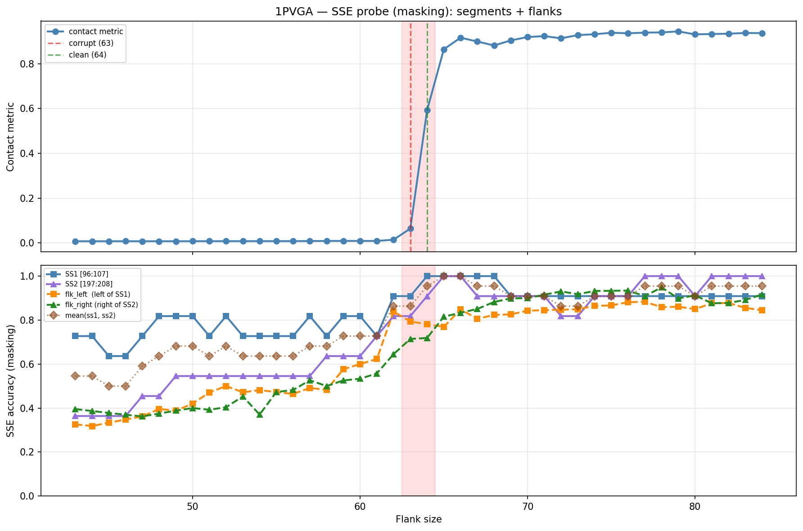

# SSE Probe Analysis: 1PVGA

Generated: 2026-03-03 15:56:55   Model: facebook/esm2_t33_650M_UR50D

## Configuration

| Parameter | Value |
|-----------|-------|
| Protein | 1PVGA |
| Contact pair | (101, 202) |
| ss1 | [96, 107) |
| ss2 | [197, 208) |
| Clean flank | 64 |
| Corrupt flank | 63 |
| Segment radius | 5 |
| Flank sweep | [43, 84] |
| Train sequences | 1,000 |
| Val sequences | 100 |
| Test sequences | 100 |

## SSE Probe Performance

| Split | Accuracy |
|-------|----------|
| Val   | 0.8240 |
| Test  | 0.8259 |

**Test classification report:**

```
              precision    recall  f1-score   support

           H       0.87      0.86      0.86     13101
           E       0.78      0.86      0.82     11471
           C       0.82      0.78      0.80     18602

    accuracy                           0.83     43174
   macro avg       0.83      0.83      0.83     43174
weighted avg       0.83      0.83      0.83     43174

```

## Ground-Truth SSE (full-sequence probe)

| Segment | Sequence |
|---------|----------|
| SS1 [96:107] | `CCEEEEECCCC` |
| SS2 [197:208] | `CEEEEEEECCC` |

## Flank Sweep Results

| flank | contact | mk_ss1 | mk_ss2 | mk_mean | mk_flkL | mk_flkR | mk_flk |
|-------|---------|--------|--------|---------|---------|---------|--------|
| 43 | 0.0079 | 0.727 | 0.364 | 0.545 | 0.326 | 0.395 | 0.360 |
| 44 | 0.0080 | 0.727 | 0.364 | 0.545 | 0.318 | 0.386 | 0.352 |
| 45 | 0.0079 | 0.636 | 0.364 | 0.500 | 0.333 | 0.378 | 0.356 |
| 46 | 0.0080 | 0.636 | 0.364 | 0.500 | 0.348 | 0.370 | 0.359 |
| 47 | 0.0080 | 0.727 | 0.455 | 0.591 | 0.362 | 0.362 | 0.362 |
| 48 | 0.0079 | 0.818 | 0.455 | 0.636 | 0.396 | 0.375 | 0.385 |
| 49 | 0.0080 | 0.818 | 0.545 | 0.682 | 0.388 | 0.388 | 0.388 |
| 50 | 0.0081 | 0.818 | 0.545 | 0.682 | 0.420 | 0.400 | 0.410 |
| 51 | 0.0082 | 0.727 | 0.545 | 0.636 | 0.471 | 0.392 | 0.431 |
| 52 | 0.0082 | 0.818 | 0.545 | 0.682 | 0.500 | 0.404 | 0.452 |
| 53 | 0.0083 | 0.727 | 0.545 | 0.636 | 0.472 | 0.453 | 0.462 |
| 54 | 0.0083 | 0.727 | 0.545 | 0.636 | 0.481 | 0.370 | 0.426 |
| 55 | 0.0084 | 0.727 | 0.545 | 0.636 | 0.473 | 0.473 | 0.473 |
| 56 | 0.0084 | 0.727 | 0.545 | 0.636 | 0.464 | 0.482 | 0.473 |
| 57 | 0.0088 | 0.818 | 0.545 | 0.682 | 0.491 | 0.526 | 0.509 |
| 58 | 0.0092 | 0.727 | 0.636 | 0.682 | 0.483 | 0.500 | 0.491 |
| 59 | 0.0094 | 0.818 | 0.636 | 0.727 | 0.576 | 0.525 | 0.551 |
| 60 | 0.0092 | 0.818 | 0.636 | 0.727 | 0.600 | 0.533 | 0.567 |
| 61 | 0.0091 | 0.727 | 0.727 | 0.727 | 0.623 | 0.557 | 0.590 |
| 62 | 0.0150 | 0.909 | 0.818 | 0.864 | 0.839 | 0.645 | 0.742 |
| 63 | 0.0644 | 0.909 | 0.818 | 0.864 | 0.794 | 0.714 | 0.754 |
| 64 | 0.5922 | 1.000 | 0.909 | 0.955 | 0.781 | 0.719 | 0.750 |
| 65 | 0.8647 | 1.000 | 1.000 | 1.000 | 0.769 | 0.815 | 0.792 |
| 66 | 0.9164 | 1.000 | 1.000 | 1.000 | 0.848 | 0.833 | 0.841 |
| 67 | 0.8993 | 1.000 | 0.909 | 0.955 | 0.806 | 0.851 | 0.828 |
| 68 | 0.8815 | 1.000 | 0.909 | 0.955 | 0.824 | 0.882 | 0.853 |
| 69 | 0.9042 | 0.909 | 0.909 | 0.909 | 0.826 | 0.899 | 0.862 |
| 70 | 0.9193 | 0.909 | 0.909 | 0.909 | 0.843 | 0.900 | 0.871 |
| 71 | 0.9234 | 0.909 | 0.909 | 0.909 | 0.845 | 0.915 | 0.880 |
| 72 | 0.9137 | 0.909 | 0.818 | 0.864 | 0.847 | 0.931 | 0.889 |
| 73 | 0.9279 | 0.909 | 0.818 | 0.864 | 0.849 | 0.918 | 0.884 |
| 74 | 0.9317 | 0.909 | 0.909 | 0.909 | 0.865 | 0.932 | 0.899 |
| 75 | 0.9383 | 0.909 | 0.909 | 0.909 | 0.867 | 0.933 | 0.900 |
| 76 | 0.9361 | 0.909 | 0.909 | 0.909 | 0.882 | 0.934 | 0.908 |
| 77 | 0.9389 | 0.909 | 1.000 | 0.955 | 0.883 | 0.909 | 0.896 |
| 78 | 0.9399 | 0.909 | 1.000 | 0.955 | 0.859 | 0.949 | 0.904 |
| 79 | 0.9444 | 0.909 | 1.000 | 0.955 | 0.861 | 0.899 | 0.880 |
| 80 | 0.9312 | 0.909 | 0.909 | 0.909 | 0.850 | 0.912 | 0.881 |
| 81 | 0.9328 | 0.909 | 1.000 | 0.955 | 0.877 | 0.877 | 0.877 |
| 82 | 0.9342 | 0.909 | 1.000 | 0.955 | 0.878 | 0.878 | 0.878 |
| 83 | 0.9374 | 0.909 | 1.000 | 0.955 | 0.855 | 0.892 | 0.873 |
| 84 | 0.9368 | 0.909 | 1.000 | 0.955 | 0.845 | 0.917 | 0.881 |

## Residue-Level Prediction Changes (clean=64, focus ±2)

### Flank 61 → 62

| Seg | Direction | Pos | gt | prev | now |
|-----|-----------|-----|----|------|-----|
| SS1 | incorr→corr | 97 | C | E | C |
| SS1 | incorr→corr | 106 | C | E | C |
| SS2 | incorr→corr | 199 | E | C | E |
| flk_L | corr→incorr | 35 | C | C | E |
| flk_L | corr→incorr | 37 | C | C | E |
| flk_L | incorr→corr | 58 | E | C | E |
| flk_L | incorr→corr | 63 | H | C | H |
| flk_L | incorr→corr | 64 | H | C | H |
| flk_L | incorr→corr | 65 | H | E | H |
| flk_L | incorr→corr | 66 | H | E | H |
| flk_L | incorr→corr | 67 | H | E | H |
| flk_L | incorr→corr | 68 | H | C | H |
| flk_L | incorr→corr | 70 | H | E | H |
| flk_L | incorr→corr | 72 | H | E | H |
| flk_L | incorr→corr | 73 | H | E | H |
| flk_L | incorr→corr | 74 | H | E | H |
| flk_L | incorr→corr | 75 | H | C | H |
| flk_L | incorr→corr | 76 | H | C | H |
| flk_L | incorr→corr | 81 | C | E | C |
| flk_L | incorr→corr | 87 | E | C | E |
| flk_R | incorr→corr | 208 | H | C | H |
| flk_R | incorr→corr | 212 | C | E | C |
| flk_R | incorr→corr | 233 | E | C | E |
| flk_R | incorr→corr | 244 | E | C | E |
| flk_R | incorr→corr | 251 | H | C | H |
| flk_R | incorr→corr | 262 | H | C | H |

### Flank 62 → 63

| Seg | Direction | Pos | gt | prev | now |
|-----|-----------|-----|----|------|-----|
| flk_L | incorr→corr | 35 | C | E | C |
| flk_L | incorr→corr | 37 | C | E | C |
| flk_L | incorr→corr | 39 | C | E | C |
| flk_L | corr→incorr | 40 | E | E | C |
| flk_L | corr→incorr | 41 | E | E | C |
| flk_L | corr→incorr | 47 | E | E | C |
| flk_L | corr→incorr | 48 | C | C | H |
| flk_L | corr→incorr | 58 | E | E | C |
| flk_L | corr→incorr | 76 | H | H | C |
| flk_R | incorr→corr | 217 | H | C | H |
| flk_R | incorr→corr | 218 | H | C | H |
| flk_R | incorr→corr | 219 | H | C | H |
| flk_R | incorr→corr | 220 | H | C | H |
| flk_R | corr→incorr | 233 | E | E | C |
| flk_R | incorr→corr | 247 | C | E | C |

### Flank 63 → 64

| Seg | Direction | Pos | gt | prev | now |
|-----|-----------|-----|----|------|-----|
| SS1 | incorr→corr | 103 | C | E | C |
| SS2 | incorr→corr | 204 | E | C | E |
| flk_L | corr→incorr | 33 | C | C | E |
| flk_L | corr→incorr | 35 | C | C | E |
| flk_L | corr→incorr | 36 | C | C | E |
| flk_L | corr→incorr | 37 | C | C | E |
| flk_L | incorr→corr | 40 | E | C | E |
| flk_L | incorr→corr | 41 | E | C | E |
| flk_L | incorr→corr | 47 | E | C | E |
| flk_L | incorr→corr | 48 | C | H | C |
| flk_L | incorr→corr | 58 | E | C | E |
| flk_L | corr→incorr | 86 | C | C | E |
| flk_R | corr→incorr | 208 | H | H | C |
| flk_R | corr→incorr | 217 | H | H | C |
| flk_R | incorr→corr | 221 | H | C | H |
| flk_R | incorr→corr | 222 | H | C | H |
| flk_R | incorr→corr | 223 | H | E | H |
| flk_R | corr→incorr | 248 | C | C | H |
| flk_R | corr→incorr | 250 | C | C | H |
| flk_R | incorr→corr | 263 | H | C | H |

### Flank 64 → 65

| Seg | Direction | Pos | gt | prev | now |
|-----|-----------|-----|----|------|-----|
| SS2 | incorr→corr | 198 | E | C | E |
| flk_L | incorr→corr | 35 | C | E | C |
| flk_L | corr→incorr | 39 | C | C | E |
| flk_L | corr→incorr | 61 | C | C | E |
| flk_L | incorr→corr | 77 | H | C | H |
| flk_R | incorr→corr | 208 | H | C | H |
| flk_R | incorr→corr | 224 | H | C | H |
| flk_R | incorr→corr | 226 | H | C | H |
| flk_R | corr→incorr | 234 | E | E | C |
| flk_R | incorr→corr | 235 | C | E | C |
| flk_R | incorr→corr | 236 | C | E | C |
| flk_R | incorr→corr | 248 | C | H | C |
| flk_R | incorr→corr | 250 | C | H | C |

### Flank 65 → 66

| Seg | Direction | Pos | gt | prev | now |
|-----|-----------|-----|----|------|-----|
| flk_L | incorr→corr | 32 | C | E | C |
| flk_L | incorr→corr | 33 | C | E | C |
| flk_L | incorr→corr | 36 | C | E | C |
| flk_L | incorr→corr | 37 | C | E | C |
| flk_L | incorr→corr | 39 | C | E | C |
| flk_L | incorr→corr | 61 | C | E | C |
| flk_L | corr→incorr | 85 | C | C | E |
| flk_L | incorr→corr | 86 | C | E | C |
| flk_R | corr→incorr | 218 | H | H | C |
| flk_R | incorr→corr | 225 | H | E | H |
| flk_R | incorr→corr | 228 | H | C | H |

## Plot


