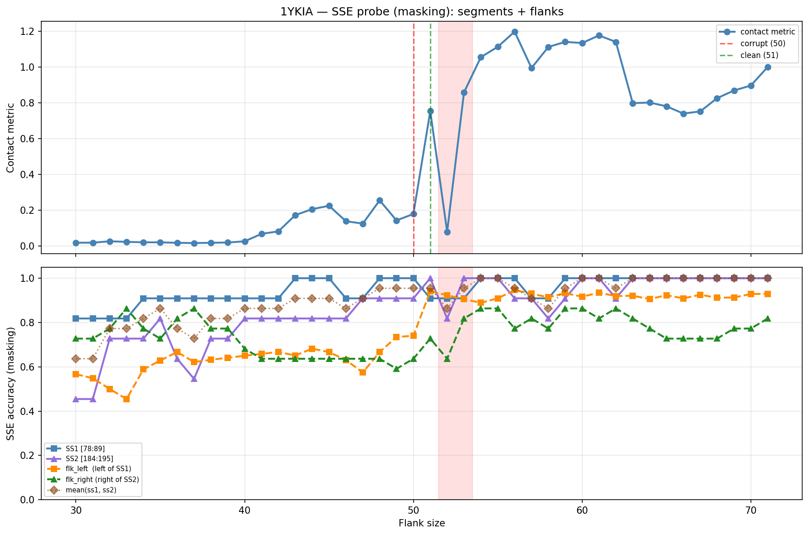

# SSE Probe Analysis: 1YKIA

Generated: 2026-03-03 15:57:00   Model: facebook/esm2_t33_650M_UR50D

## Configuration

| Parameter | Value |
|-----------|-------|
| Protein | 1YKIA |
| Contact pair | (83, 189) |
| ss1 | [78, 89) |
| ss2 | [184, 195) |
| Clean flank | 51 |
| Corrupt flank | 50 |
| Segment radius | 5 |
| Flank sweep | [30, 71] |
| Train sequences | 1,000 |
| Val sequences | 100 |
| Test sequences | 100 |

## SSE Probe Performance

| Split | Accuracy |
|-------|----------|
| Val   | 0.8240 |
| Test  | 0.8259 |

**Test classification report:**

```
              precision    recall  f1-score   support

           H       0.87      0.86      0.86     13101
           E       0.78      0.86      0.82     11471
           C       0.82      0.78      0.80     18602

    accuracy                           0.83     43174
   macro avg       0.83      0.83      0.83     43174
weighted avg       0.83      0.83      0.83     43174

```

## Ground-Truth SSE (full-sequence probe)

| Segment | Sequence |
|---------|----------|
| SS1 [78:89] | `CEEEEEEEECC` |
| SS2 [184:195] | `EEEEEEEECCC` |

## Flank Sweep Results

| flank | contact | mk_ss1 | mk_ss2 | mk_mean | mk_flkL | mk_flkR | mk_flk |
|-------|---------|--------|--------|---------|---------|---------|--------|
| 30 | 0.0185 | 0.818 | 0.455 | 0.636 | 0.567 | 0.727 | 0.647 |
| 31 | 0.0187 | 0.818 | 0.455 | 0.636 | 0.548 | 0.727 | 0.638 |
| 32 | 0.0264 | 0.818 | 0.727 | 0.773 | 0.500 | 0.773 | 0.636 |
| 33 | 0.0234 | 0.818 | 0.727 | 0.773 | 0.455 | 0.864 | 0.659 |
| 34 | 0.0208 | 0.909 | 0.727 | 0.818 | 0.588 | 0.773 | 0.680 |
| 35 | 0.0205 | 0.909 | 0.818 | 0.864 | 0.629 | 0.727 | 0.678 |
| 36 | 0.0180 | 0.909 | 0.636 | 0.773 | 0.667 | 0.818 | 0.742 |
| 37 | 0.0165 | 0.909 | 0.545 | 0.727 | 0.622 | 0.864 | 0.743 |
| 38 | 0.0181 | 0.909 | 0.727 | 0.818 | 0.632 | 0.773 | 0.702 |
| 39 | 0.0195 | 0.909 | 0.727 | 0.818 | 0.641 | 0.773 | 0.707 |
| 40 | 0.0263 | 0.909 | 0.818 | 0.864 | 0.650 | 0.682 | 0.666 |
| 41 | 0.0679 | 0.909 | 0.818 | 0.864 | 0.659 | 0.636 | 0.647 |
| 42 | 0.0821 | 0.909 | 0.818 | 0.864 | 0.667 | 0.636 | 0.652 |
| 43 | 0.1728 | 1.000 | 0.818 | 0.909 | 0.651 | 0.636 | 0.644 |
| 44 | 0.2061 | 1.000 | 0.818 | 0.909 | 0.682 | 0.636 | 0.659 |
| 45 | 0.2251 | 1.000 | 0.818 | 0.909 | 0.667 | 0.636 | 0.652 |
| 46 | 0.1389 | 0.909 | 0.818 | 0.864 | 0.630 | 0.636 | 0.633 |
| 47 | 0.1251 | 0.909 | 0.909 | 0.909 | 0.574 | 0.636 | 0.605 |
| 48 | 0.2554 | 1.000 | 0.909 | 0.955 | 0.667 | 0.636 | 0.652 |
| 49 | 0.1431 | 1.000 | 0.909 | 0.955 | 0.735 | 0.591 | 0.663 |
| 50 | 0.1791 | 1.000 | 0.909 | 0.955 | 0.740 | 0.636 | 0.688 |
| 51 | 0.7543 | 0.909 | 1.000 | 0.955 | 0.941 | 0.727 | 0.834 |
| 52 | 0.0792 | 0.909 | 0.818 | 0.864 | 0.923 | 0.636 | 0.780 |
| 53 | 0.8596 | 0.909 | 1.000 | 0.955 | 0.906 | 0.818 | 0.862 |
| 54 | 1.0566 | 1.000 | 1.000 | 1.000 | 0.889 | 0.864 | 0.876 |
| 55 | 1.1142 | 1.000 | 1.000 | 1.000 | 0.909 | 0.864 | 0.886 |
| 56 | 1.1991 | 1.000 | 0.909 | 0.955 | 0.946 | 0.773 | 0.860 |
| 57 | 0.9958 | 0.909 | 0.909 | 0.909 | 0.930 | 0.818 | 0.874 |
| 58 | 1.1136 | 0.909 | 0.818 | 0.864 | 0.914 | 0.773 | 0.843 |
| 59 | 1.1418 | 1.000 | 0.909 | 0.955 | 0.932 | 0.864 | 0.898 |
| 60 | 1.1354 | 1.000 | 1.000 | 1.000 | 0.917 | 0.864 | 0.890 |
| 61 | 1.1779 | 1.000 | 1.000 | 1.000 | 0.934 | 0.818 | 0.876 |
| 62 | 1.1417 | 1.000 | 0.909 | 0.955 | 0.919 | 0.864 | 0.891 |
| 63 | 0.7992 | 1.000 | 1.000 | 1.000 | 0.921 | 0.818 | 0.869 |
| 64 | 0.8025 | 1.000 | 1.000 | 1.000 | 0.906 | 0.773 | 0.839 |
| 65 | 0.7816 | 1.000 | 1.000 | 1.000 | 0.923 | 0.727 | 0.825 |
| 66 | 0.7408 | 1.000 | 1.000 | 1.000 | 0.909 | 0.727 | 0.818 |
| 67 | 0.7529 | 1.000 | 1.000 | 1.000 | 0.925 | 0.727 | 0.826 |
| 68 | 0.8269 | 1.000 | 1.000 | 1.000 | 0.912 | 0.727 | 0.820 |
| 69 | 0.8698 | 1.000 | 1.000 | 1.000 | 0.913 | 0.773 | 0.843 |
| 70 | 0.8977 | 1.000 | 1.000 | 1.000 | 0.929 | 0.773 | 0.851 |
| 71 | 1.0017 | 1.000 | 1.000 | 1.000 | 0.930 | 0.818 | 0.874 |

## Residue-Level Prediction Changes (clean=51, focus ±2)

### Flank 48 → 49

| Seg | Direction | Pos | gt | prev | now |
|-----|-----------|-----|----|------|-----|
| flk_L | incorr→corr | 30 | H | C | H |
| flk_L | incorr→corr | 31 | H | C | H |
| flk_L | incorr→corr | 32 | H | E | H |
| flk_L | incorr→corr | 33 | H | E | H |
| flk_R | corr→incorr | 201 | C | C | H |

### Flank 49 → 50

| Seg | Direction | Pos | gt | prev | now |
|-----|-----------|-----|----|------|-----|
| flk_L | incorr→corr | 29 | H | C | H |
| flk_R | incorr→corr | 201 | C | H | C |

### Flank 50 → 51

| Seg | Direction | Pos | gt | prev | now |
|-----|-----------|-----|----|------|-----|
| SS1 | corr→incorr | 86 | E | E | C |
| SS2 | incorr→corr | 190 | E | C | E |
| flk_L | incorr→corr | 28 | H | C | H |
| flk_L | incorr→corr | 34 | H | C | H |
| flk_L | incorr→corr | 51 | E | C | E |
| flk_L | incorr→corr | 63 | H | C | H |
| flk_L | incorr→corr | 67 | C | E | C |
| flk_L | incorr→corr | 70 | H | C | H |
| flk_L | incorr→corr | 71 | H | C | H |
| flk_L | incorr→corr | 72 | H | C | H |
| flk_L | incorr→corr | 73 | H | C | H |
| flk_L | incorr→corr | 74 | H | C | H |
| flk_L | incorr→corr | 75 | H | C | H |
| flk_L | corr→incorr | 76 | C | C | H |
| flk_R | incorr→corr | 198 | C | H | C |
| flk_R | incorr→corr | 204 | C | H | C |

### Flank 51 → 52

| Seg | Direction | Pos | gt | prev | now |
|-----|-----------|-----|----|------|-----|
| SS2 | corr→incorr | 190 | E | E | C |
| SS2 | corr→incorr | 191 | E | E | C |
| flk_L | corr→incorr | 64 | C | C | H |
| flk_R | corr→incorr | 198 | C | C | H |
| flk_R | corr→incorr | 201 | C | C | H |

### Flank 52 → 53

| Seg | Direction | Pos | gt | prev | now |
|-----|-----------|-----|----|------|-----|
| SS2 | incorr→corr | 190 | E | C | E |
| SS2 | incorr→corr | 191 | E | C | E |
| flk_L | incorr→corr | 64 | C | H | C |
| flk_L | corr→incorr | 70 | H | H | C |
| flk_R | incorr→corr | 195 | C | H | C |
| flk_R | incorr→corr | 196 | C | H | C |
| flk_R | incorr→corr | 197 | C | H | C |
| flk_R | incorr→corr | 198 | C | H | C |
| flk_R | corr→incorr | 199 | H | H | C |
| flk_R | incorr→corr | 201 | C | H | C |

## Plot


