# EVCoupling--Attention Overlap Analysis: 2B61A

Contact pair: (182, 316)  ss1: [177, 188)  ss2: [311, 322)
Clean metric: 0.5738  Corrupt metric: 0.0279  Gap: 0.5459
Circuit size: 45 heads  Attention source: full-seq
EVCouplings: 54615 total pairs, analysis uses top 500
Cross-segment couplings (ss1 x ss2): 121 pairs
Causal cells: top-2000 globally (sufficiency-tested set)

## Summary

We compared each circuit head's attention pattern against the top 500 EVCouplings for 2B61A to identify "interaction heads" whose attention aligns with evolutionary couplings.
Of 45 circuit heads, 37 show >1.5x enrichment for coupling pairs in their high-attention cells, and 10 qualify as strong interaction heads (>5x enrichment and >3x coupling/average attention ratio).

The top cross-segment coupling pairs N180--R313 (score 14.9) and I181--Y314 (score 14.0) sit directly adjacent to the contact pair (182, 316), and multiple late-layer circuit heads attend strongly to exactly these coupled positions.

## Enrichment Bar Chart (all circuit heads)

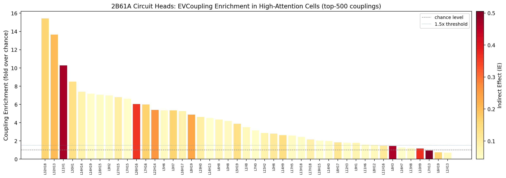

## Causal Importance vs Coupling Enrichment

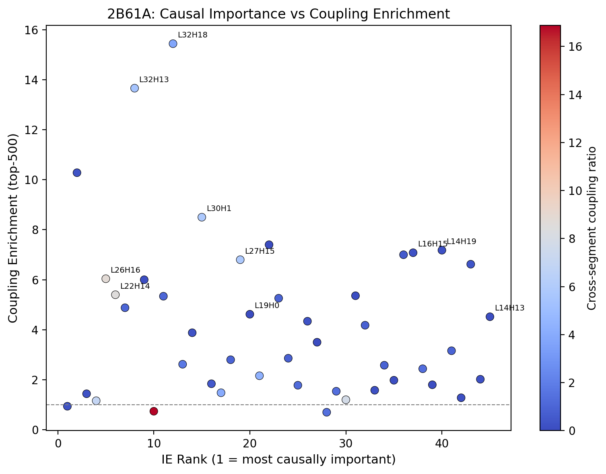

## Top Interaction Heads

| Rank | Head | IE | Enrichment | Coupling/All Ratio | Cross-Seg Ratio | Causal Cells | Causal on Couplings |
|------|------|----|------------|--------------------|-----------------|----|-----|
| #5 | L26H16 | +0.3608 | 6.0x | 10.5x | 8.8x | 39 | 11 |
| #19 | L27H15 | +0.0991 | 6.8x | 11.9x | 5.8x | 29 | 10 |
| #12 | L32H18 | +0.1627 | 15.4x | 21.0x | 3.7x | 14 | 8 |
| #8 | L32H13 | +0.2030 | 13.7x | 27.9x | 5.4x | 15 | 8 |
| #15 | L30H1 | +0.1371 | 8.5x | 8.0x | 5.8x | 18 | 7 |
| #6 | L22H14 | +0.2608 | 5.4x | 7.8x | 8.6x | 31 | 7 |
| #37 | L16H15 | +0.0514 | 7.1x | 5.6x | 0.2x | 51 | 5 |
| #40 | L14H19 | +0.0493 | 7.2x | 4.8x | 0.2x | 37 | 4 |
| #20 | L19H0 | +0.0975 | 4.6x | 8.3x | 0.0x | 32 | 4 |
| #45 | L14H13 | +0.0434 | 4.5x | 3.2x | 0.1x | 58 | 4 |

### Causal Cells Overlapping with EVCouplings

For each top interaction head, the causal cells (top-2000 globally by gradient attribution, verified by sufficiency test) that also correspond to top-500 EVCoupling pairs:

**L26H16 (#5, 39 causal cells)**:

| Position | Residues | Cell Attr | EV Score |
|----------|----------|-----------|----------|
| (181, 314) | I181--Y314 | +0.0413 | 13.95 |
| (180, 313) | N180--R313 | +0.0278 | 14.86 |
| (156, 180) | A156--N180 | +0.0044 | 10.95 |
| (318, 348) | S318--E348 | +0.0022 | 3.97 |
| (313, 343) | R313--D343 | +0.0017 | 8.88 |
| (182, 317) | V182--V317 | +0.0010 | 3.37 |
| (181, 312) | I181--A312 | +0.0009 | 4.14 |
| (180, 156) | N180--A156 | +0.0009 | 10.95 |
| (181, 178) | I181--M178 | +0.0008 | 3.79 |
| (317, 365) | V317--F365 | +0.0006 | 6.64 |

**L27H15 (#19, 29 causal cells)**:

| Position | Residues | Cell Attr | EV Score |
|----------|----------|-----------|----------|
| (313, 180) | R313--N180 | +0.0164 | 14.86 |
| (180, 156) | N180--A156 | +0.0113 | 10.95 |
| (312, 181) | A312--I181 | +0.0048 | 4.14 |
| (316, 333) | L316--S333 | +0.0023 | 4.92 |
| (314, 181) | Y314--I181 | +0.0013 | 13.95 |
| (182, 158) | V182--I158 | +0.0010 | 4.61 |
| (312, 314) | A312--Y314 | +0.0010 | 4.73 |
| (315, 182) | T315--V182 | +0.0009 | 8.87 |
| (316, 337) | L316--L337 | +0.0007 | 6.03 |
| (178, 157) | M178--I157 | +0.0006 | 6.51 |

**L32H18 (#12, 14 causal cells)**:

| Position | Residues | Cell Attr | EV Score |
|----------|----------|-----------|----------|
| (313, 180) | R313--N180 | +0.0438 | 14.86 |
| (314, 181) | Y314--I181 | +0.0125 | 13.95 |
| (312, 181) | A312--I181 | +0.0076 | 4.14 |
| (181, 314) | I181--Y314 | +0.0034 | 13.95 |
| (180, 313) | N180--R313 | +0.0014 | 14.86 |
| (181, 312) | I181--A312 | +0.0013 | 4.14 |
| (317, 182) | V317--V182 | +0.0011 | 3.37 |
| (182, 317) | V182--V317 | +0.0008 | 3.37 |

**L32H13 (#8, 15 causal cells)**:

| Position | Residues | Cell Attr | EV Score |
|----------|----------|-----------|----------|
| (313, 180) | R313--N180 | +0.0189 | 14.86 |
| (312, 181) | A312--I181 | +0.0170 | 4.14 |
| (181, 314) | I181--Y314 | +0.0163 | 13.95 |
| (180, 313) | N180--R313 | +0.0114 | 14.86 |
| (314, 181) | Y314--I181 | +0.0089 | 13.95 |
| (181, 312) | I181--A312 | +0.0051 | 4.14 |
| (182, 317) | V182--V317 | +0.0026 | 3.37 |
| (317, 182) | V317--V182 | +0.0013 | 3.37 |

**L30H1 (#15, 18 causal cells)**:

| Position | Residues | Cell Attr | EV Score |
|----------|----------|-----------|----------|
| (180, 313) | N180--R313 | +0.0149 | 14.86 |
| (314, 181) | Y314--I181 | +0.0095 | 13.95 |
| (182, 315) | V182--T315 | +0.0088 | 8.87 |
| (312, 313) | A312--R313 | +0.0030 | 15.03 |
| (313, 343) | R313--D343 | +0.0030 | 8.88 |
| (312, 181) | A312--I181 | +0.0011 | 4.14 |
| (181, 312) | I181--A312 | +0.0007 | 4.14 |

**L22H14 (#6, 31 causal cells)**:

| Position | Residues | Cell Attr | EV Score |
|----------|----------|-----------|----------|
| (314, 181) | Y314--I181 | +0.0196 | 13.95 |
| (180, 156) | N180--A156 | +0.0122 | 10.95 |
| (313, 180) | R313--N180 | +0.0108 | 14.86 |
| (317, 182) | V317--V182 | +0.0058 | 3.37 |
| (313, 179) | R313--D179 | +0.0057 | 5.88 |
| (312, 181) | A312--I181 | +0.0013 | 4.14 |
| (337, 310) | L337--I310 | +0.0008 | 4.02 |

**L16H15 (#37, 51 causal cells)**:

| Position | Residues | Cell Attr | EV Score |
|----------|----------|-----------|----------|
| (181, 178) | I181--M178 | +0.0147 | 3.79 |
| (183, 186) | N183--S186 | +0.0009 | 18.65 |
| (314, 310) | Y314--I310 | +0.0007 | 7.77 |
| (177, 178) | F177--M178 | +0.0006 | 5.19 |
| (174, 175) | Y174--P175 | +0.0005 | 5.73 |

**L14H19 (#40, 37 causal cells)**:

| Position | Residues | Cell Attr | EV Score |
|----------|----------|-----------|----------|
| (180, 183) | N180--N183 | +0.0016 | 4.79 |
| (176, 175) | D176--P175 | +0.0010 | 4.31 |
| (157, 167) | I157--A167 | +0.0009 | 12.37 |
| (181, 183) | I181--N183 | +0.0007 | 12.22 |

**L19H0 (#20, 32 causal cells)**:

| Position | Residues | Cell Attr | EV Score |
|----------|----------|-----------|----------|
| (183, 181) | N183--I181 | +0.0518 | 12.22 |
| (316, 314) | L316--Y314 | +0.0040 | 8.58 |
| (314, 312) | Y314--A312 | +0.0024 | 4.73 |
| (183, 182) | N183--V182 | +0.0006 | 3.77 |

**L14H13 (#45, 58 causal cells)**:

| Position | Residues | Cell Attr | EV Score |
|----------|----------|-----------|----------|
| (181, 171) | I181--A171 | +0.0015 | 20.33 |
| (181, 183) | I181--N183 | +0.0014 | 12.22 |
| (181, 167) | I181--A167 | +0.0009 | 15.23 |
| (181, 178) | I181--M178 | +0.0008 | 3.79 |

## Per-Head Full-Sequence Attention with Coupling Overlay

For each top interaction head, full-sequence (AA x AA) attention is shown with EVCoupling pairs (cyan circles), causal cells from the top-2000 global set (white stars), and cells that are both causal and coupled (green stars). White dashed boxes mark ss1 x ss2 / ss2 x ss1; yellow dashed boxes mark ss1 x ss1 / ss2 x ss2. This captures both local coupling patterns (e.g. L11H1: I181--A171 within ss1 neighborhood) and cross-segment patterns (e.g. L32H13: R313--N180 across ss1--ss2).

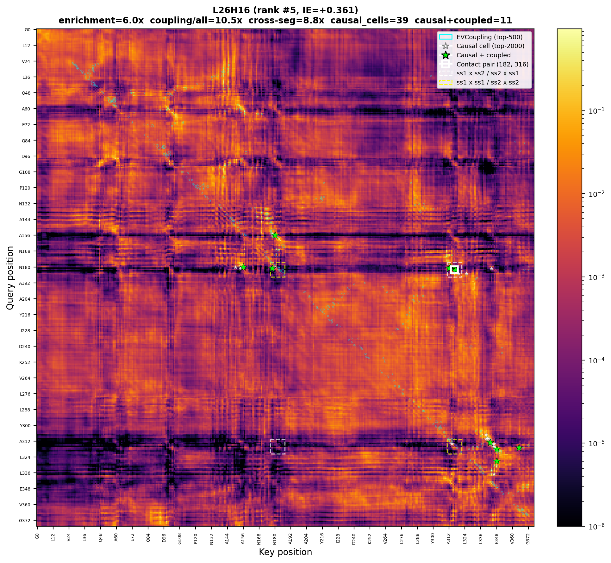

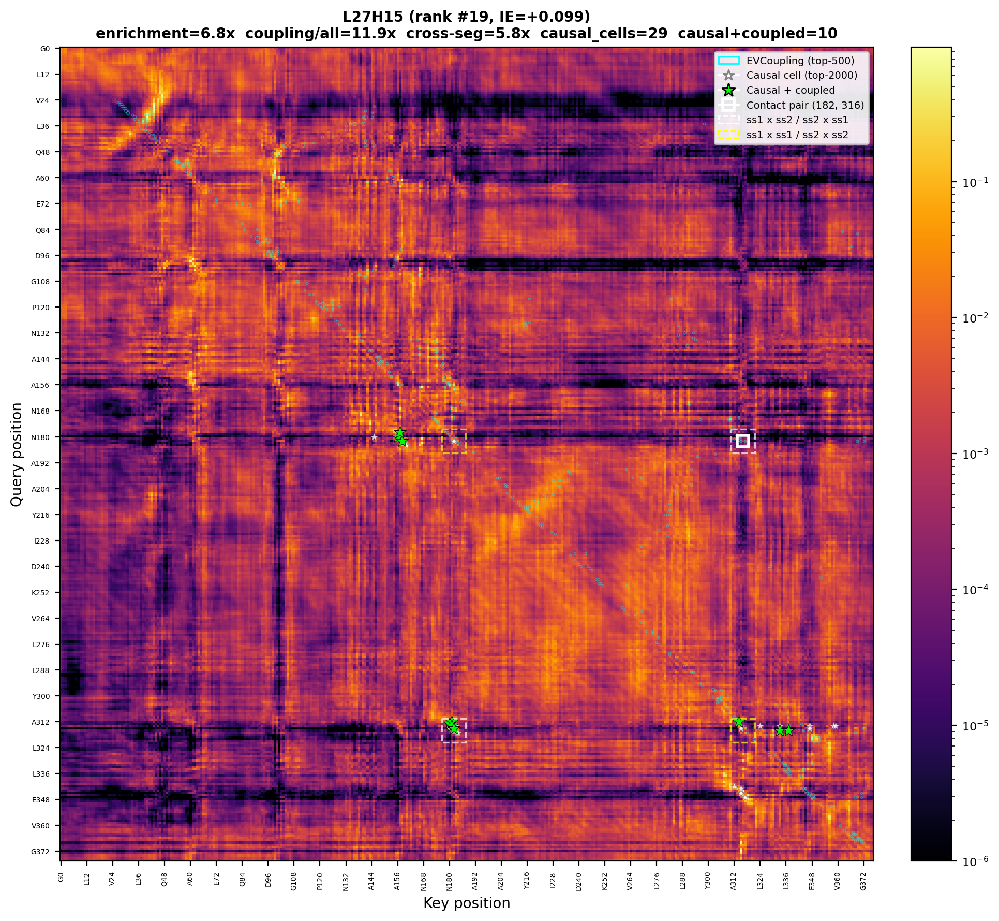

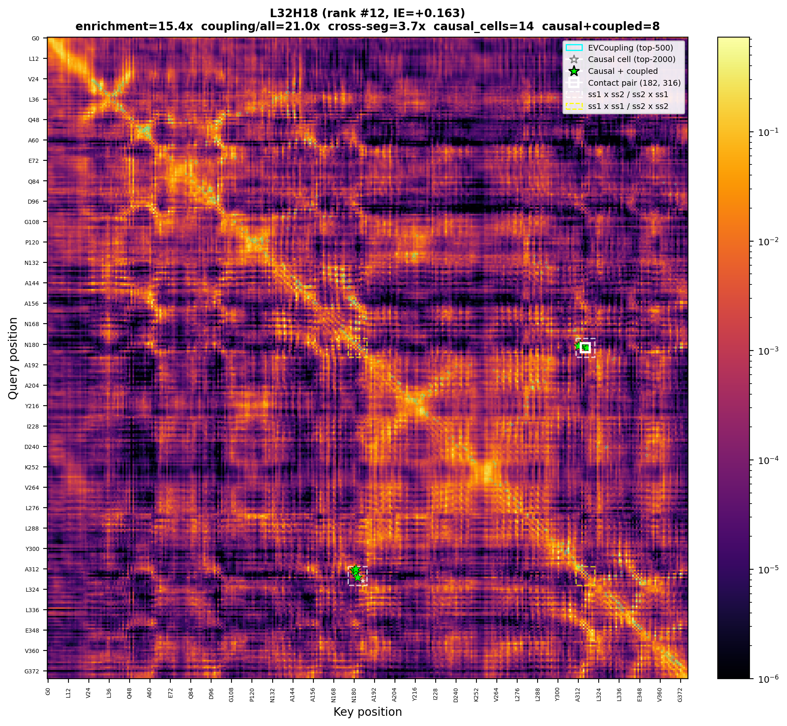

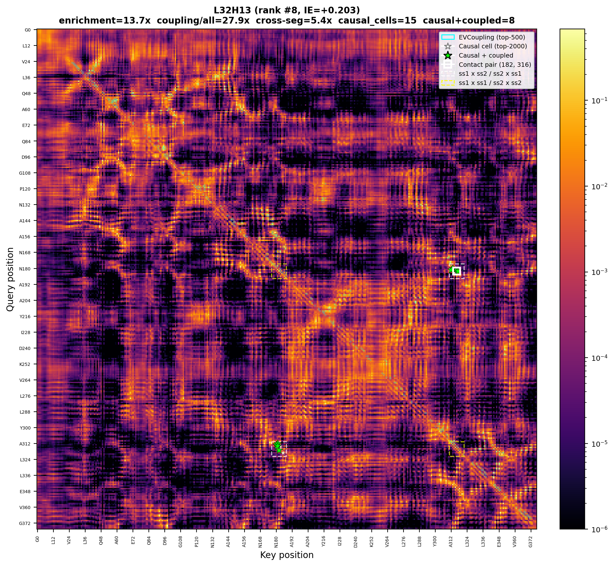

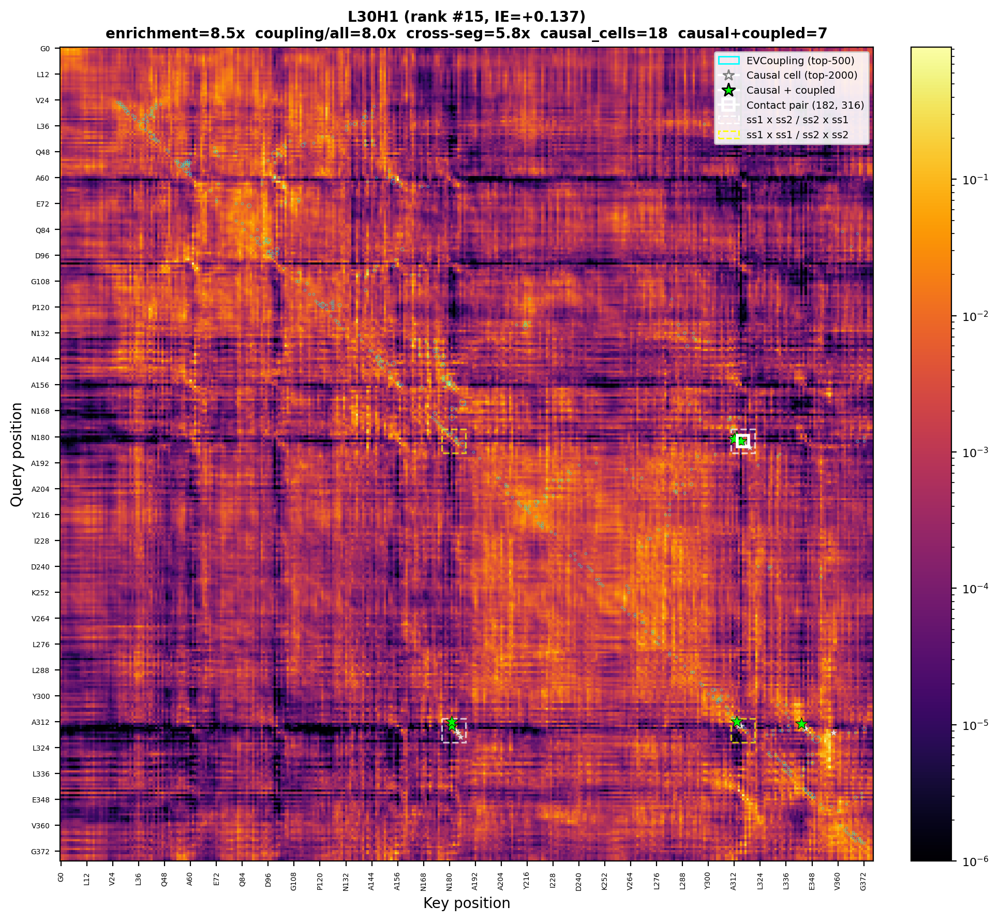

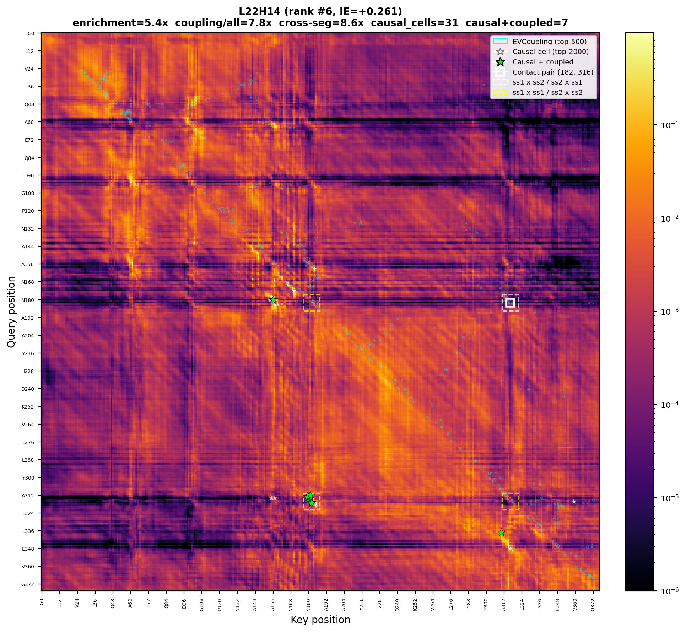

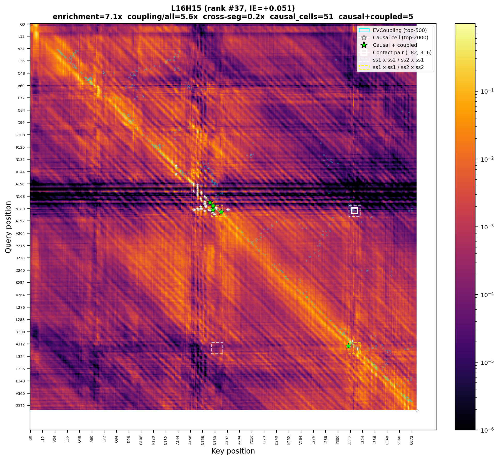

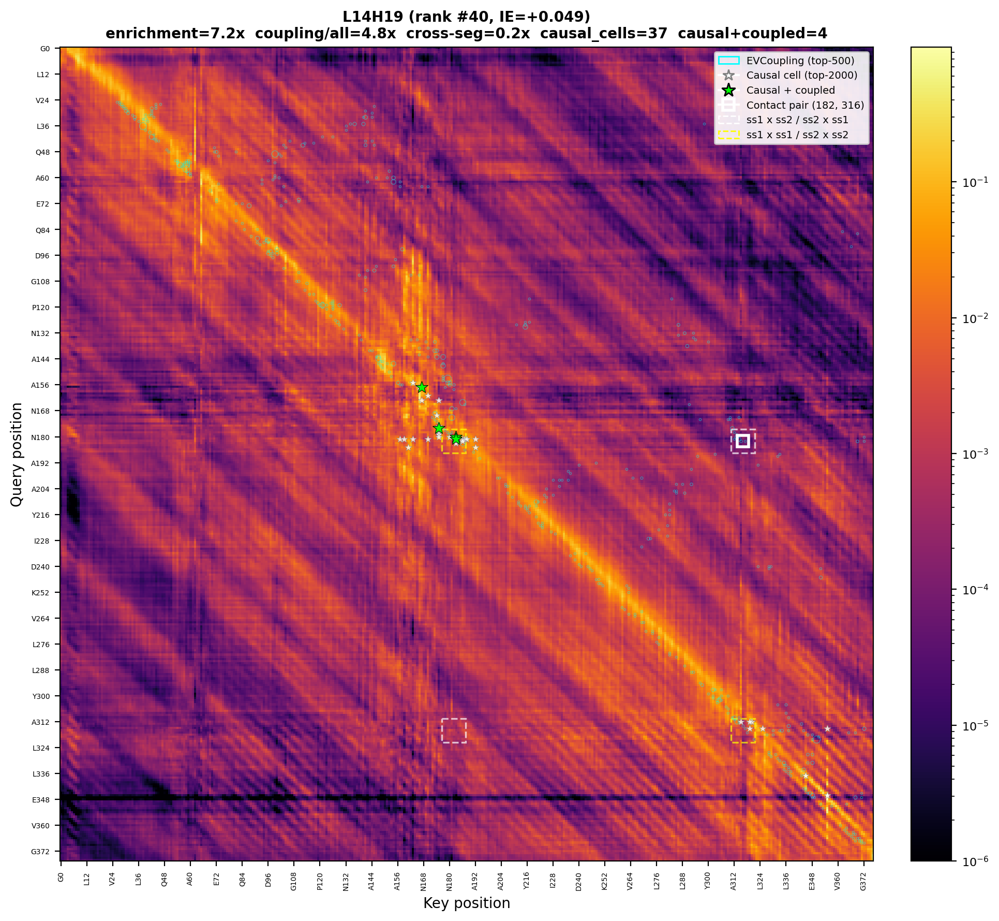

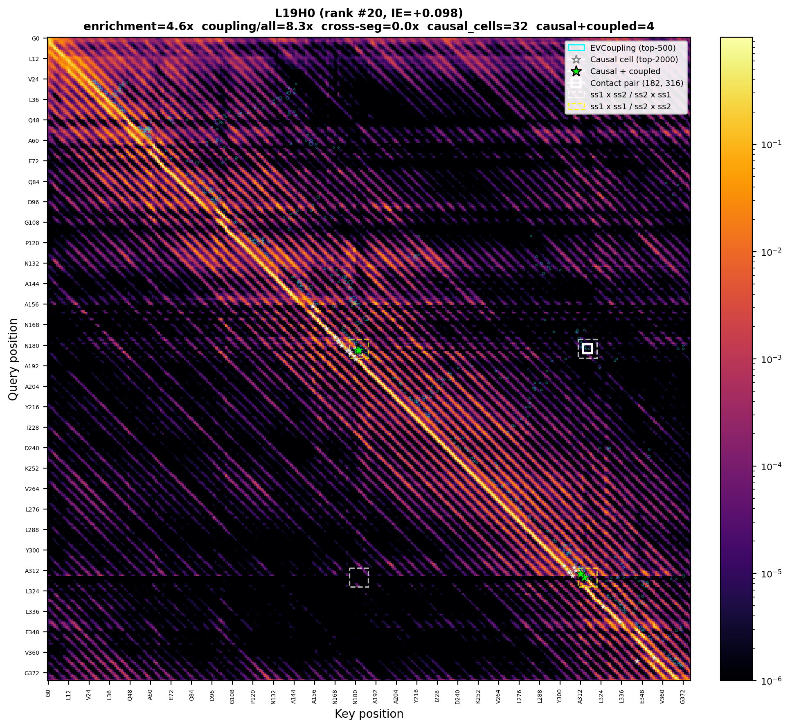

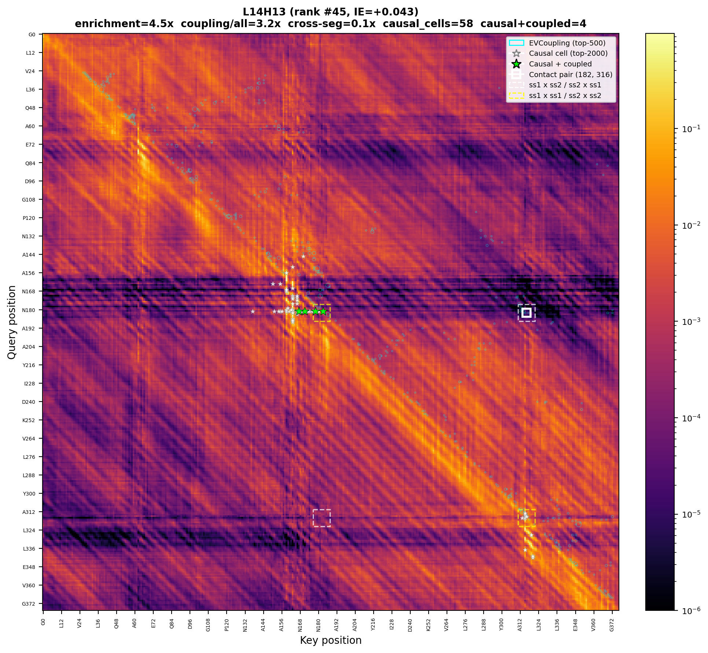

## EVCoupling Score vs Attention Weight

For each top interaction head, scatter of EV coupling score vs attention weight across all top-500 coupling pairs. Red points are cross-segment (ss1--ss2) couplings. Green stars are causal cells (top-2000) that overlap with couplings.

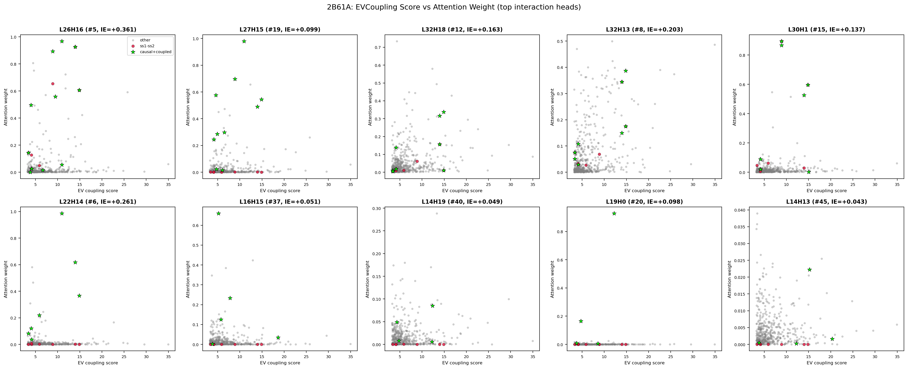

## Cross-Segment Coupling Attention

Ratio of mean attention on cross-segment (ss1--ss2) EVCoupling pairs vs overall mean attention, for all circuit heads.

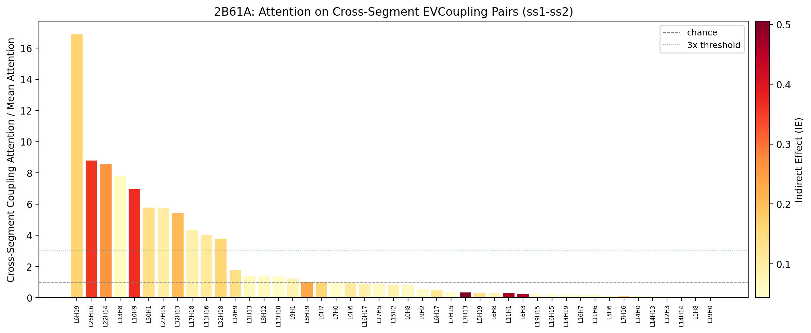

Top cross-segment coupling heads:

| Head | IE | Cross-Seg Ratio |
|------|----|-----------------|
| L6H19 (#10) | +0.1657 | 16.9x |
| L26H16 (#5) | +0.3608 | 8.8x |
| L22H14 (#6) | +0.2608 | 8.6x |
| L13H8 (#30) | +0.0611 | 7.8x |
| L10H9 (#4) | +0.3677 | 7.0x |
| L30H1 (#15) | +0.1371 | 5.8x |
| L27H15 (#19) | +0.0991 | 5.8x |
| L32H13 (#8) | +0.2030 | 5.4x |
| L17H18 (#21) | +0.0870 | 4.3x |
| L11H16 (#17) | +0.1118 | 4.0x |

## Top Cross-Segment EVCouplings (ss1 x ss2)

| Position | Residues | EV Score | CN |
|----------|----------|----------|-----|
| (180, 313) | N180--R313 | 14.86 | 0.8274 |
| (181, 314) | I181--Y314 | 13.95 | 0.7833 |
| (182, 315) | V182--T315 | 8.87 | 0.5326 |
| (179, 313) | D179--R313 | 5.88 | 0.3862 |
| (181, 312) | I181--A312 | 4.14 | 0.2995 |
| (178, 312) | M178--A312 | 4.08 | 0.2984 |
| (182, 317) | V182--V317 | 3.37 | 0.2622 |
| (185, 319) | C185--V319 | 3.12 | 0.2538 |
| (183, 316) | N183--L316 | 2.83 | 0.2369 |
| (180, 315) | N180--T315 | 2.12 | 0.2042 |
| (179, 312) | D179--A312 | 1.22 | 0.1581 |
| (184, 319) | L184--V319 | 1.00 | 0.1482 |
| (183, 314) | N183--Y314 | 0.87 | 0.1406 |
| (184, 317) | L184--V317 | 0.45 | 0.1202 |
| (178, 311) | M178--K311 | 0.32 | 0.1166 |

## Full Circuit Head Table

| Rank | Head | IE | Enrichment | Coup/All | Cross-Seg | Causal Cells | Causal on Coupling |
|------|------|----|------------|----------|-----------|------|------|
| #12 | L32H18 | +0.1627 | 15.4x | 21.0x | 3.7x | 14 | 8 |
| #8 | L32H13 | +0.2030 | 13.7x | 27.9x | 5.4x | 15 | 8 |
| #2 | L11H1 | +0.4676 | 10.3x | 6.1x | 0.3x | 31 | 1 |
| #15 | L30H1 | +0.1371 | 8.5x | 8.0x | 5.8x | 18 | 7 |
| #22 | L14H14 | +0.0859 | 7.4x | 5.0x | 0.1x | 50 | 2 |
| #40 | L14H19 | +0.0493 | 7.2x | 4.8x | 0.2x | 37 | 4 |
| #37 | L16H15 | +0.0514 | 7.1x | 5.6x | 0.2x | 51 | 5 |
| #36 | L9H2 | +0.0516 | 7.0x | 6.2x | 0.5x | 18 | 2 |
| #19 | L27H15 | +0.0991 | 6.8x | 11.9x | 5.8x | 29 | 10 |
| #43 | L7H15 | +0.0456 | 6.6x | 4.1x | 0.4x | 12 | 0 |
| #5 | L26H16 | +0.3608 | 6.0x | 10.5x | 8.8x | 39 | 11 |
| #9 | L7H16 | +0.1690 | 6.0x | 3.3x | 0.1x | 31 | 1 |
| #6 | L22H14 | +0.2608 | 5.4x | 7.8x | 8.6x | 31 | 7 |
| #31 | L5H6 | +0.0595 | 5.4x | 4.0x | 0.1x | 24 | 1 |
| #11 | L0H7 | +0.1641 | 5.3x | 1.8x | 1.0x | 84 | 1 |
| #23 | L16H17 | +0.0858 | 5.3x | 4.7x | 0.9x | 40 | 2 |
| #7 | L8H19 | +0.2333 | 4.9x | 2.5x | 1.0x | 35 | 1 |
| #20 | L19H0 | +0.0975 | 4.6x | 8.3x | 0.0x | 32 | 4 |
| #45 | L14H13 | +0.0434 | 4.5x | 3.2x | 0.1x | 58 | 4 |
| #26 | L6H8 | +0.0723 | 4.3x | 2.3x | 0.3x | 10 | 0 |
| #32 | L0H8 | +0.0583 | 4.2x | 1.7x | 0.8x | 59 | 1 |
| #14 | L5H19 | +0.1371 | 3.9x | 2.0x | 0.3x | 18 | 0 |
| #27 | L1H8 | +0.0649 | 3.5x | 12.8x | 0.1x | 59 | 4 |
| #41 | L7H0 | +0.0484 | 3.2x | 1.6x | 1.0x | 11 | 0 |
| #24 | L15H2 | +0.0842 | 2.9x | 1.3x | 0.8x | 40 | 1 |
| #18 | L0H6 | +0.1093 | 2.8x | 1.0x | 0.9x | 68 | 1 |
| #13 | L14H9 | +0.1421 | 2.6x | 2.1x | 1.8x | 61 | 2 |
| #34 | L17H5 | +0.0565 | 2.6x | 1.6x | 0.9x | 35 | 0 |
| #38 | L13H18 | +0.0507 | 2.4x | 1.8x | 1.4x | 65 | 3 |
| #21 | L17H18 | +0.0870 | 2.2x | 2.7x | 4.3x | 36 | 4 |
| #44 | L19H15 | +0.0438 | 2.0x | 2.5x | 0.2x | 21 | 0 |
| #35 | L14H0 | +0.0530 | 2.0x | 1.7x | 0.1x | 47 | 3 |
| #16 | L6H17 | +0.1189 | 1.8x | 1.4x | 0.5x | 174 | 3 |
| #39 | L12H3 | +0.0494 | 1.8x | 1.6x | 0.1x | 35 | 3 |
| #25 | L9H1 | +0.0800 | 1.8x | 1.6x | 1.2x | 28 | 0 |
| #33 | L11H6 | +0.0572 | 1.6x | 1.9x | 0.2x | 16 | 1 |
| #29 | L8H12 | +0.0629 | 1.5x | 1.8x | 1.4x | 25 | 0 |
| #17 | L11H16 | +0.1118 | 1.5x | 1.0x | 4.0x | 68 | 3 |
| #3 | L6H3 | +0.4633 | 1.4x | 1.3x | 0.2x | 42 | 0 |
| #42 | L16H7 | +0.0463 | 1.3x | 0.4x | 0.2x | 65 | 2 |
| #30 | L13H8 | +0.0611 | 1.2x | 1.2x | 7.8x | 37 | 0 |
| #4 | L10H9 | +0.3677 | 1.2x | 1.0x | 7.0x | 37 | 1 |
| #1 | L7H13 | +0.5055 | 0.9x | 0.7x | 0.3x | 170 | 2 |
| #10 | L6H19 | +0.1657 | 0.7x | 2.3x | 16.9x | 82 | 2 |
| #28 | L1H13 | +0.0634 | 0.7x | 0.7x | 1.4x | 42 | 2 |
