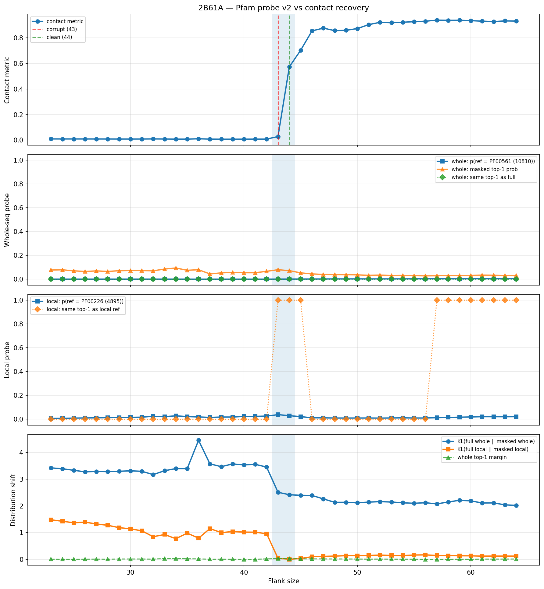

# Pfam Probe v2 Analysis: 2B61A

Generated: 2026-03-17 15:28:28   Model: facebook/esm2_t33_650M_UR50D

## Configuration

| Parameter | Value |
|-----------|-------|
| Protein | 2B61A |
| Contact pair | (182, 316) |
| ss1 | [177, 188) |
| ss2 | [311, 322) |
| Clean flank | 44 |
| Corrupt flank | 43 |
| Segment radius | 5 |
| Flank sweep | [23, 64] |
| Train sequences | 50,000 |
| Val sequences | 5,000 |
| Test sequences | 5,000 |
| Num Pfam classes | 702 |
| Best C (regularization) | 10.0 |
| L2 normalization | yes |
| Stratified splits | yes |

## Pfam Probe Performance

| Split | Accuracy | Top-5 Accuracy |
|-------|----------|----------------|
| Train | 0.9866 | - |
| Val   | 0.9840 | 0.9966 |
| Test  | 0.9750 | 0.9924 |

Train-Val gap: 0.0026

## Full-sequence Pfam reference

| Rank | Pfam | Prob |
|------|------|------|
| 1 | PF00561 (10810) | 0.1823 |
| 2 | PF01116 (9262) | 0.0101 |
| 3 | PF01070 (9198) | 0.0099 |
| 4 | PF12697 (5492) | 0.0080 |
| 5 | PF00232 (11815) | 0.0071 |

## Flank Sweep Results

| flank | contact | whole_ref_p | whole_same | KL_full | local_ref_p | local_same | KL_local | top1_label | top1_prob | margin |
|-------|---------|-------------|------------|---------|-------------|------------|----------|------------|-----------|--------|
| 23 | 0.0093 | 0.0005 | 0 | 3.4272 | 0.0071 | 0 | 1.4801 | PF00808 (11175) | 0.0771 | 0.0034 |
| 24 | 0.0091 | 0.0005 | 0 | 3.3943 | 0.0080 | 0 | 1.4262 | PF00808 (11175) | 0.0790 | 0.0009 |
| 25 | 0.0091 | 0.0005 | 0 | 3.3363 | 0.0096 | 0 | 1.3682 | PF00808 (11175) | 0.0703 | 0.0012 |
| 26 | 0.0091 | 0.0006 | 0 | 3.2782 | 0.0107 | 0 | 1.3914 | PF00808 (11175) | 0.0652 | 0.0029 |
| 27 | 0.0089 | 0.0006 | 0 | 3.2940 | 0.0118 | 0 | 1.3247 | PF00808 (11175) | 0.0698 | 0.0057 |
| 28 | 0.0088 | 0.0006 | 0 | 3.2858 | 0.0135 | 0 | 1.2732 | PF00808 (11175) | 0.0654 | 0.0021 |
| 29 | 0.0086 | 0.0006 | 0 | 3.3004 | 0.0150 | 0 | 1.1863 | PF00808 (11175) | 0.0713 | 0.0092 |
| 30 | 0.0086 | 0.0006 | 0 | 3.3156 | 0.0161 | 0 | 1.1409 | PF00808 (11175) | 0.0734 | 0.0098 |
| 31 | 0.0087 | 0.0006 | 0 | 3.2990 | 0.0175 | 0 | 1.0675 | PF00808 (11175) | 0.0728 | 0.0092 |
| 32 | 0.0093 | 0.0007 | 0 | 3.1749 | 0.0247 | 0 | 0.8468 | PF00808 (11175) | 0.0705 | 0.0045 |
| 33 | 0.0088 | 0.0006 | 0 | 3.3205 | 0.0215 | 0 | 0.9274 | PF00808 (11175) | 0.0853 | 0.0298 |
| 34 | 0.0080 | 0.0005 | 0 | 3.4013 | 0.0290 | 0 | 0.7720 | PF00808 (11175) | 0.0942 | 0.0295 |
| 35 | 0.0080 | 0.0004 | 0 | 3.3988 | 0.0222 | 0 | 0.9809 | PF00808 (11175) | 0.0750 | 0.0204 |
| 36 | 0.0103 | 0.0001 | 0 | 4.4635 | 0.0192 | 0 | 0.7926 | PF00249 (3393) | 0.0797 | 0.0137 |
| 37 | 0.0081 | 0.0003 | 0 | 3.5783 | 0.0155 | 0 | 1.1497 | PF00808 (11175) | 0.0444 | 0.0017 |
| 38 | 0.0073 | 0.0003 | 0 | 3.4729 | 0.0184 | 0 | 1.0014 | PF00808 (11175) | 0.0533 | 0.0036 |
| 39 | 0.0075 | 0.0003 | 0 | 3.5752 | 0.0184 | 0 | 1.0367 | PF00808 (11175) | 0.0575 | 0.0016 |
| 40 | 0.0078 | 0.0003 | 0 | 3.5405 | 0.0236 | 0 | 1.0184 | PF00505 (8326) | 0.0546 | 0.0004 |
| 41 | 0.0080 | 0.0003 | 0 | 3.5594 | 0.0241 | 0 | 1.0156 | PF00505 (8326) | 0.0545 | 0.0003 |
| 42 | 0.0082 | 0.0003 | 0 | 3.4576 | 0.0267 | 0 | 0.9584 | PF00808 (11175) | 0.0663 | 0.0136 |
| 43 | 0.0279 | 0.0009 | 0 | 2.5122 | 0.0385 | 1 | 0.0368 | PF00808 (11175) | 0.0797 | 0.0285 |
| 44 | 0.5738 | 0.0013 | 0 | 2.4211 | 0.0303 | 1 | 0.0000 | PF00808 (11175) | 0.0720 | 0.0241 |
| 45 | 0.7039 | 0.0015 | 0 | 2.3986 | 0.0218 | 1 | 0.0300 | PF00808 (11175) | 0.0534 | 0.0137 |
| 46 | 0.8554 | 0.0017 | 0 | 2.3930 | 0.0123 | 0 | 0.0964 | PF00808 (11175) | 0.0445 | 0.0149 |
| 47 | 0.8769 | 0.0020 | 0 | 2.2643 | 0.0114 | 0 | 0.1088 | PF00808 (11175) | 0.0400 | 0.0118 |
| 48 | 0.8571 | 0.0025 | 0 | 2.1349 | 0.0102 | 0 | 0.1207 | PF00808 (11175) | 0.0389 | 0.0107 |
| 49 | 0.8598 | 0.0025 | 0 | 2.1368 | 0.0100 | 0 | 0.1344 | PF00808 (11175) | 0.0381 | 0.0103 |
| 50 | 0.8737 | 0.0026 | 0 | 2.1167 | 0.0101 | 0 | 0.1369 | PF00808 (11175) | 0.0365 | 0.0081 |
| 51 | 0.9044 | 0.0025 | 0 | 2.1452 | 0.0103 | 0 | 0.1429 | PF00808 (11175) | 0.0326 | 0.0044 |
| 52 | 0.9225 | 0.0026 | 0 | 2.1600 | 0.0097 | 0 | 0.1588 | PF00808 (11175) | 0.0347 | 0.0076 |
| 53 | 0.9193 | 0.0026 | 0 | 2.1476 | 0.0105 | 0 | 0.1426 | PF00808 (11175) | 0.0312 | 0.0045 |
| 54 | 0.9230 | 0.0028 | 0 | 2.1169 | 0.0115 | 0 | 0.1392 | PF00808 (11175) | 0.0321 | 0.0036 |
| 55 | 0.9274 | 0.0032 | 0 | 2.0998 | 0.0103 | 0 | 0.1598 | PF00808 (11175) | 0.0297 | 0.0036 |
| 56 | 0.9311 | 0.0032 | 0 | 2.1204 | 0.0103 | 0 | 0.1650 | PF00808 (11175) | 0.0282 | 0.0006 |
| 57 | 0.9395 | 0.0033 | 0 | 2.0764 | 0.0131 | 1 | 0.1431 | PF00226 (4895) | 0.0290 | 0.0003 |
| 58 | 0.9381 | 0.0033 | 0 | 2.1486 | 0.0155 | 1 | 0.1376 | PF00505 (8326) | 0.0302 | 0.0010 |
| 59 | 0.9386 | 0.0031 | 0 | 2.2118 | 0.0172 | 1 | 0.1307 | PF00505 (8326) | 0.0313 | 0.0029 |
| 60 | 0.9353 | 0.0033 | 0 | 2.1888 | 0.0192 | 1 | 0.1293 | PF00505 (8326) | 0.0317 | 0.0013 |
| 61 | 0.9316 | 0.0034 | 0 | 2.1112 | 0.0213 | 1 | 0.1192 | PF00226 (4895) | 0.0346 | 0.0060 |
| 62 | 0.9279 | 0.0033 | 0 | 2.1136 | 0.0213 | 1 | 0.1204 | PF00226 (4895) | 0.0333 | 0.0066 |
| 63 | 0.9336 | 0.0036 | 0 | 2.0415 | 0.0210 | 1 | 0.1202 | PF00226 (4895) | 0.0306 | 0.0074 |
| 64 | 0.9324 | 0.0037 | 0 | 2.0196 | 0.0215 | 1 | 0.1191 | PF00226 (4895) | 0.0315 | 0.0096 |

## Summary

- Corr(contact, whole_ref_pfam_prob) = 0.9531
- Corr(contact, local_ref_pfam_prob) = -0.2856
- Corr(contact, -KL_full) = 0.9365
- Corr(contact, -KL_local) = 0.8933

## Plot

