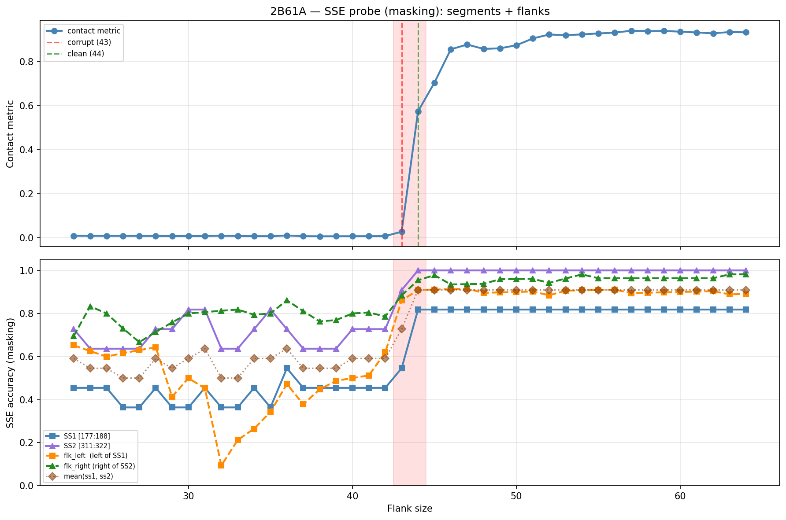

# SSE Probe Analysis: 2B61A

Generated: 2026-03-03 15:57:07   Model: facebook/esm2_t33_650M_UR50D

## Configuration

| Parameter | Value |
|-----------|-------|
| Protein | 2B61A |
| Contact pair | (182, 316) |
| ss1 | [177, 188) |
| ss2 | [311, 322) |
| Clean flank | 44 |
| Corrupt flank | 43 |
| Segment radius | 5 |
| Flank sweep | [23, 64] |
| Train sequences | 1,000 |
| Val sequences | 100 |
| Test sequences | 100 |

## SSE Probe Performance

| Split | Accuracy |
|-------|----------|
| Val   | 0.8240 |
| Test  | 0.8259 |

**Test classification report:**

```
              precision    recall  f1-score   support

           H       0.87      0.86      0.86     13101
           E       0.78      0.86      0.82     11471
           C       0.82      0.78      0.80     18602

    accuracy                           0.83     43174
   macro avg       0.83      0.83      0.83     43174
weighted avg       0.83      0.83      0.83     43174

```

## Ground-Truth SSE (full-sequence probe)

| Segment | Sequence |
|---------|----------|
| SS1 [177:188] | `HHCEEEEECCC` |
| SS2 [311:322] | `CCEEEEEECCC` |

## Flank Sweep Results

| flank | contact | mk_ss1 | mk_ss2 | mk_mean | mk_flkL | mk_flkR | mk_flk |
|-------|---------|--------|--------|---------|---------|---------|--------|
| 23 | 0.0093 | 0.455 | 0.727 | 0.591 | 0.652 | 0.696 | 0.674 |
| 24 | 0.0091 | 0.455 | 0.636 | 0.545 | 0.625 | 0.833 | 0.729 |
| 25 | 0.0091 | 0.455 | 0.636 | 0.545 | 0.600 | 0.800 | 0.700 |
| 26 | 0.0091 | 0.364 | 0.636 | 0.500 | 0.615 | 0.731 | 0.673 |
| 27 | 0.0089 | 0.364 | 0.636 | 0.500 | 0.630 | 0.667 | 0.648 |
| 28 | 0.0088 | 0.455 | 0.727 | 0.591 | 0.643 | 0.714 | 0.679 |
| 29 | 0.0086 | 0.364 | 0.727 | 0.545 | 0.414 | 0.759 | 0.586 |
| 30 | 0.0086 | 0.364 | 0.818 | 0.591 | 0.500 | 0.800 | 0.650 |
| 31 | 0.0087 | 0.455 | 0.818 | 0.636 | 0.452 | 0.806 | 0.629 |
| 32 | 0.0093 | 0.364 | 0.636 | 0.500 | 0.094 | 0.812 | 0.453 |
| 33 | 0.0088 | 0.364 | 0.636 | 0.500 | 0.212 | 0.818 | 0.515 |
| 34 | 0.0080 | 0.455 | 0.727 | 0.591 | 0.265 | 0.794 | 0.529 |
| 35 | 0.0080 | 0.364 | 0.818 | 0.591 | 0.343 | 0.800 | 0.571 |
| 36 | 0.0103 | 0.545 | 0.727 | 0.636 | 0.472 | 0.861 | 0.667 |
| 37 | 0.0081 | 0.455 | 0.636 | 0.545 | 0.378 | 0.811 | 0.595 |
| 38 | 0.0073 | 0.455 | 0.636 | 0.545 | 0.447 | 0.763 | 0.605 |
| 39 | 0.0075 | 0.455 | 0.636 | 0.545 | 0.487 | 0.769 | 0.628 |
| 40 | 0.0078 | 0.455 | 0.727 | 0.591 | 0.500 | 0.800 | 0.650 |
| 41 | 0.0080 | 0.455 | 0.727 | 0.591 | 0.512 | 0.805 | 0.659 |
| 42 | 0.0082 | 0.455 | 0.727 | 0.591 | 0.619 | 0.786 | 0.702 |
| 43 | 0.0279 | 0.545 | 0.909 | 0.727 | 0.860 | 0.884 | 0.872 |
| 44 | 0.5738 | 0.818 | 1.000 | 0.909 | 0.909 | 0.955 | 0.932 |
| 45 | 0.7039 | 0.818 | 1.000 | 0.909 | 0.911 | 0.978 | 0.944 |
| 46 | 0.8554 | 0.818 | 1.000 | 0.909 | 0.913 | 0.935 | 0.924 |
| 47 | 0.8769 | 0.818 | 1.000 | 0.909 | 0.915 | 0.936 | 0.926 |
| 48 | 0.8571 | 0.818 | 1.000 | 0.909 | 0.896 | 0.938 | 0.917 |
| 49 | 0.8598 | 0.818 | 1.000 | 0.909 | 0.898 | 0.959 | 0.929 |
| 50 | 0.8737 | 0.818 | 1.000 | 0.909 | 0.900 | 0.960 | 0.930 |
| 51 | 0.9044 | 0.818 | 1.000 | 0.909 | 0.902 | 0.961 | 0.931 |
| 52 | 0.9225 | 0.818 | 1.000 | 0.909 | 0.885 | 0.942 | 0.913 |
| 53 | 0.9193 | 0.818 | 1.000 | 0.909 | 0.906 | 0.962 | 0.934 |
| 54 | 0.9230 | 0.818 | 1.000 | 0.909 | 0.907 | 0.981 | 0.944 |
| 55 | 0.9274 | 0.818 | 1.000 | 0.909 | 0.909 | 0.964 | 0.936 |
| 56 | 0.9311 | 0.818 | 1.000 | 0.909 | 0.911 | 0.964 | 0.937 |
| 57 | 0.9395 | 0.818 | 1.000 | 0.909 | 0.895 | 0.964 | 0.929 |
| 58 | 0.9381 | 0.818 | 1.000 | 0.909 | 0.897 | 0.964 | 0.930 |
| 59 | 0.9386 | 0.818 | 1.000 | 0.909 | 0.898 | 0.964 | 0.931 |
| 60 | 0.9353 | 0.818 | 1.000 | 0.909 | 0.900 | 0.964 | 0.932 |
| 61 | 0.9316 | 0.818 | 1.000 | 0.909 | 0.902 | 0.964 | 0.933 |
| 62 | 0.9279 | 0.818 | 1.000 | 0.909 | 0.903 | 0.964 | 0.933 |
| 63 | 0.9336 | 0.818 | 1.000 | 0.909 | 0.889 | 0.982 | 0.935 |
| 64 | 0.9324 | 0.818 | 1.000 | 0.909 | 0.891 | 0.982 | 0.936 |

## Residue-Level Prediction Changes (clean=44, focus ±2)

### Flank 41 → 42

| Seg | Direction | Pos | gt | prev | now |
|-----|-----------|-----|----|------|-----|
| flk_L | incorr→corr | 136 | H | C | H |
| flk_L | incorr→corr | 151 | C | H | C |
| flk_L | corr→incorr | 152 | C | C | H |
| flk_L | corr→incorr | 161 | H | H | C |
| flk_L | incorr→corr | 165 | H | C | H |
| flk_L | incorr→corr | 166 | H | C | H |
| flk_L | incorr→corr | 169 | H | C | H |
| flk_L | incorr→corr | 171 | H | C | H |

### Flank 42 → 43

| Seg | Direction | Pos | gt | prev | now |
|-----|-----------|-----|----|------|-----|
| SS1 | corr→incorr | 177 | H | H | C |
| SS1 | incorr→corr | 181 | E | H | E |
| SS1 | incorr→corr | 182 | E | H | E |
| SS1 | incorr→corr | 183 | E | H | E |
| SS1 | corr→incorr | 185 | C | C | E |
| SS2 | incorr→corr | 314 | E | C | E |
| SS2 | incorr→corr | 319 | C | E | C |
| flk_L | corr→incorr | 135 | H | H | C |
| flk_L | corr→incorr | 136 | H | H | C |
| flk_L | incorr→corr | 149 | C | H | C |
| flk_L | incorr→corr | 152 | C | H | C |
| flk_L | incorr→corr | 153 | C | H | C |
| flk_L | incorr→corr | 154 | C | H | C |
| flk_L | incorr→corr | 155 | C | H | C |
| flk_L | incorr→corr | 156 | E | H | E |
| flk_L | incorr→corr | 157 | E | H | E |
| flk_L | incorr→corr | 158 | E | H | E |
| flk_L | incorr→corr | 159 | E | C | E |
| flk_L | incorr→corr | 162 | H | C | H |
| flk_L | incorr→corr | 163 | H | C | H |
| flk_L | incorr→corr | 164 | H | C | H |
| flk_L | incorr→corr | 173 | H | C | H |
| flk_L | corr→incorr | 175 | H | H | C |
| flk_R | incorr→corr | 328 | H | C | H |
| flk_R | incorr→corr | 339 | H | C | H |
| flk_R | incorr→corr | 344 | E | C | E |
| flk_R | incorr→corr | 346 | E | C | E |
| flk_R | incorr→corr | 347 | E | C | E |
| flk_R | incorr→corr | 348 | E | C | E |
| flk_R | incorr→corr | 349 | E | C | E |
| flk_R | corr→incorr | 357 | C | C | H |
| flk_R | corr→incorr | 359 | E | E | C |
| flk_R | corr→incorr | 362 | C | C | H |
| flk_R | incorr→corr | 363 | H | C | H |

### Flank 43 → 44

| Seg | Direction | Pos | gt | prev | now |
|-----|-----------|-----|----|------|-----|
| SS1 | corr→incorr | 178 | H | H | E |
| SS1 | incorr→corr | 179 | C | H | C |
| SS1 | incorr→corr | 180 | E | C | E |
| SS1 | incorr→corr | 184 | E | C | E |
| SS1 | incorr→corr | 185 | C | E | C |
| SS2 | incorr→corr | 313 | E | C | E |
| flk_L | incorr→corr | 135 | H | C | H |
| flk_L | incorr→corr | 136 | H | C | H |
| flk_L | corr→incorr | 154 | C | C | E |
| flk_L | incorr→corr | 176 | C | H | C |
| flk_R | incorr→corr | 359 | E | C | E |
| flk_R | incorr→corr | 362 | C | H | C |
| flk_R | incorr→corr | 364 | H | C | H |

### Flank 44 → 45

| Seg | Direction | Pos | gt | prev | now |
|-----|-----------|-----|----|------|-----|
| flk_R | incorr→corr | 357 | C | H | C |

### Flank 45 → 46

| Seg | Direction | Pos | gt | prev | now |
|-----|-----------|-----|----|------|-----|
| flk_R | corr→incorr | 355 | C | C | E |
| flk_R | corr→incorr | 359 | E | E | C |

## Plot


