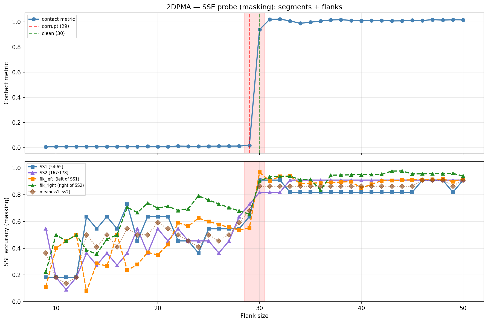

# SSE Probe Analysis: 2DPMA

Generated: 2026-03-03 15:57:13   Model: facebook/esm2_t33_650M_UR50D

## Configuration

| Parameter | Value |
|-----------|-------|
| Protein | 2DPMA |
| Contact pair | (59, 172) |
| ss1 | [54, 65) |
| ss2 | [167, 178) |
| Clean flank | 30 |
| Corrupt flank | 29 |
| Segment radius | 5 |
| Flank sweep | [9, 50] |
| Train sequences | 1,000 |
| Val sequences | 100 |
| Test sequences | 100 |

## SSE Probe Performance

| Split | Accuracy |
|-------|----------|
| Val   | 0.8240 |
| Test  | 0.8259 |

**Test classification report:**

```
              precision    recall  f1-score   support

           H       0.87      0.86      0.86     13101
           E       0.78      0.86      0.82     11471
           C       0.82      0.78      0.80     18602

    accuracy                           0.83     43174
   macro avg       0.83      0.83      0.83     43174
weighted avg       0.83      0.83      0.83     43174

```

## Ground-Truth SSE (full-sequence probe)

| Segment | Sequence |
|---------|----------|
| SS1 [54:65] | `CCEEEEECCCH` |
| SS2 [167:178] | `HCCCEEEECCH` |

## Flank Sweep Results

| flank | contact | mk_ss1 | mk_ss2 | mk_mean | mk_flkL | mk_flkR | mk_flk |
|-------|---------|--------|--------|---------|---------|---------|--------|
| 9 | 0.0064 | 0.182 | 0.545 | 0.364 | 0.111 | 0.222 | 0.167 |
| 10 | 0.0071 | 0.182 | 0.182 | 0.182 | 0.400 | 0.500 | 0.450 |
| 11 | 0.0080 | 0.182 | 0.091 | 0.136 | 0.455 | 0.455 | 0.455 |
| 12 | 0.0080 | 0.182 | 0.182 | 0.182 | 0.500 | 0.500 | 0.500 |
| 13 | 0.0073 | 0.636 | 0.364 | 0.500 | 0.077 | 0.385 | 0.231 |
| 14 | 0.0086 | 0.545 | 0.273 | 0.409 | 0.286 | 0.357 | 0.321 |
| 15 | 0.0081 | 0.636 | 0.364 | 0.500 | 0.267 | 0.467 | 0.367 |
| 16 | 0.0085 | 0.545 | 0.273 | 0.409 | 0.500 | 0.500 | 0.500 |
| 17 | 0.0076 | 0.727 | 0.364 | 0.545 | 0.235 | 0.706 | 0.471 |
| 18 | 0.0085 | 0.455 | 0.545 | 0.500 | 0.278 | 0.667 | 0.472 |
| 19 | 0.0097 | 0.636 | 0.364 | 0.500 | 0.368 | 0.737 | 0.553 |
| 20 | 0.0075 | 0.636 | 0.545 | 0.591 | 0.350 | 0.700 | 0.525 |
| 21 | 0.0075 | 0.636 | 0.455 | 0.545 | 0.429 | 0.714 | 0.571 |
| 22 | 0.0119 | 0.455 | 0.545 | 0.500 | 0.591 | 0.682 | 0.636 |
| 23 | 0.0101 | 0.455 | 0.455 | 0.455 | 0.565 | 0.696 | 0.630 |
| 24 | 0.0097 | 0.364 | 0.455 | 0.409 | 0.625 | 0.792 | 0.708 |
| 25 | 0.0108 | 0.545 | 0.455 | 0.500 | 0.600 | 0.760 | 0.680 |
| 26 | 0.0114 | 0.545 | 0.364 | 0.455 | 0.577 | 0.731 | 0.654 |
| 27 | 0.0117 | 0.545 | 0.455 | 0.500 | 0.556 | 0.704 | 0.630 |
| 28 | 0.0123 | 0.545 | 0.636 | 0.591 | 0.536 | 0.679 | 0.607 |
| 29 | 0.0169 | 0.636 | 0.727 | 0.682 | 0.552 | 0.655 | 0.603 |
| 30 | 0.9394 | 0.909 | 0.818 | 0.864 | 0.967 | 0.900 | 0.933 |
| 31 | 1.0209 | 0.909 | 0.818 | 0.864 | 0.903 | 0.935 | 0.919 |
| 32 | 1.0226 | 0.909 | 0.818 | 0.864 | 0.938 | 0.938 | 0.938 |
| 33 | 1.0080 | 0.818 | 0.909 | 0.864 | 0.939 | 0.939 | 0.939 |
| 34 | 0.9892 | 0.818 | 0.909 | 0.864 | 0.882 | 0.912 | 0.897 |
| 35 | 0.9981 | 0.818 | 0.909 | 0.864 | 0.886 | 0.914 | 0.900 |
| 36 | 1.0068 | 0.818 | 0.909 | 0.864 | 0.889 | 0.833 | 0.861 |
| 37 | 1.0161 | 0.818 | 0.909 | 0.864 | 0.892 | 0.946 | 0.919 |
| 38 | 1.0178 | 0.818 | 0.909 | 0.864 | 0.895 | 0.947 | 0.921 |
| 39 | 1.0122 | 0.818 | 0.909 | 0.864 | 0.897 | 0.949 | 0.923 |
| 40 | 1.0093 | 0.818 | 0.909 | 0.864 | 0.850 | 0.950 | 0.900 |
| 41 | 1.0112 | 0.818 | 0.909 | 0.864 | 0.878 | 0.951 | 0.915 |
| 42 | 1.0120 | 0.818 | 0.909 | 0.864 | 0.905 | 0.952 | 0.929 |
| 43 | 1.0081 | 0.818 | 0.909 | 0.864 | 0.907 | 0.977 | 0.942 |
| 44 | 1.0088 | 0.818 | 0.909 | 0.864 | 0.909 | 0.977 | 0.943 |
| 45 | 1.0129 | 0.818 | 0.909 | 0.864 | 0.911 | 0.956 | 0.933 |
| 46 | 1.0111 | 0.909 | 0.909 | 0.909 | 0.913 | 0.957 | 0.935 |
| 47 | 1.0183 | 0.909 | 0.909 | 0.909 | 0.915 | 0.957 | 0.936 |
| 48 | 1.0147 | 0.909 | 0.909 | 0.909 | 0.917 | 0.958 | 0.938 |
| 49 | 1.0174 | 0.818 | 0.909 | 0.864 | 0.898 | 0.959 | 0.929 |
| 50 | 1.0167 | 0.909 | 0.909 | 0.909 | 0.920 | 0.940 | 0.930 |

## Residue-Level Prediction Changes (clean=30, focus ±2)

### Flank 27 → 28

| Seg | Direction | Pos | gt | prev | now |
|-----|-----------|-----|----|------|-----|
| SS2 | incorr→corr | 171 | E | C | E |
| SS2 | incorr→corr | 173 | E | C | E |
| flk_L | incorr→corr | 37 | E | C | E |
| flk_L | corr→incorr | 42 | C | C | E |

### Flank 28 → 29

| Seg | Direction | Pos | gt | prev | now |
|-----|-----------|-----|----|------|-----|
| SS1 | incorr→corr | 58 | E | C | E |
| SS2 | incorr→corr | 174 | E | C | E |
| flk_L | incorr→corr | 42 | C | E | C |
| flk_R | corr→incorr | 198 | C | C | E |
| flk_R | incorr→corr | 205 | C | E | C |

### Flank 29 → 30

| Seg | Direction | Pos | gt | prev | now |
|-----|-----------|-----|----|------|-----|
| SS1 | incorr→corr | 56 | E | C | E |
| SS1 | incorr→corr | 57 | E | C | E |
| SS1 | incorr→corr | 59 | E | C | E |
| SS2 | incorr→corr | 177 | H | C | H |
| flk_L | incorr→corr | 25 | H | C | H |
| flk_L | incorr→corr | 26 | H | C | H |
| flk_L | incorr→corr | 27 | H | E | H |
| flk_L | incorr→corr | 28 | H | E | H |
| flk_L | incorr→corr | 29 | H | E | H |
| flk_L | incorr→corr | 30 | H | C | H |
| flk_L | incorr→corr | 38 | E | C | E |
| flk_L | incorr→corr | 39 | E | C | E |
| flk_L | corr→incorr | 40 | C | C | E |
| flk_L | incorr→corr | 47 | H | E | H |
| flk_L | incorr→corr | 48 | H | E | H |
| flk_L | incorr→corr | 49 | H | E | H |
| flk_L | incorr→corr | 50 | H | E | H |
| flk_L | incorr→corr | 51 | H | E | H |
| flk_R | incorr→corr | 178 | H | C | H |
| flk_R | incorr→corr | 179 | H | E | H |
| flk_R | incorr→corr | 180 | H | E | H |
| flk_R | incorr→corr | 182 | C | E | C |
| flk_R | incorr→corr | 183 | C | E | C |
| flk_R | incorr→corr | 198 | C | E | C |
| flk_R | incorr→corr | 203 | C | E | C |

### Flank 30 → 31

| Seg | Direction | Pos | gt | prev | now |
|-----|-----------|-----|----|------|-----|
| SS1 | corr→incorr | 60 | E | E | C |
| SS1 | incorr→corr | 64 | H | C | H |
| flk_L | corr→incorr | 29 | H | H | C |
| flk_R | incorr→corr | 181 | H | C | H |

### Flank 31 → 32

| Seg | Direction | Pos | gt | prev | now |
|-----|-----------|-----|----|------|-----|
| flk_L | incorr→corr | 23 | H | C | H |

## Plot


