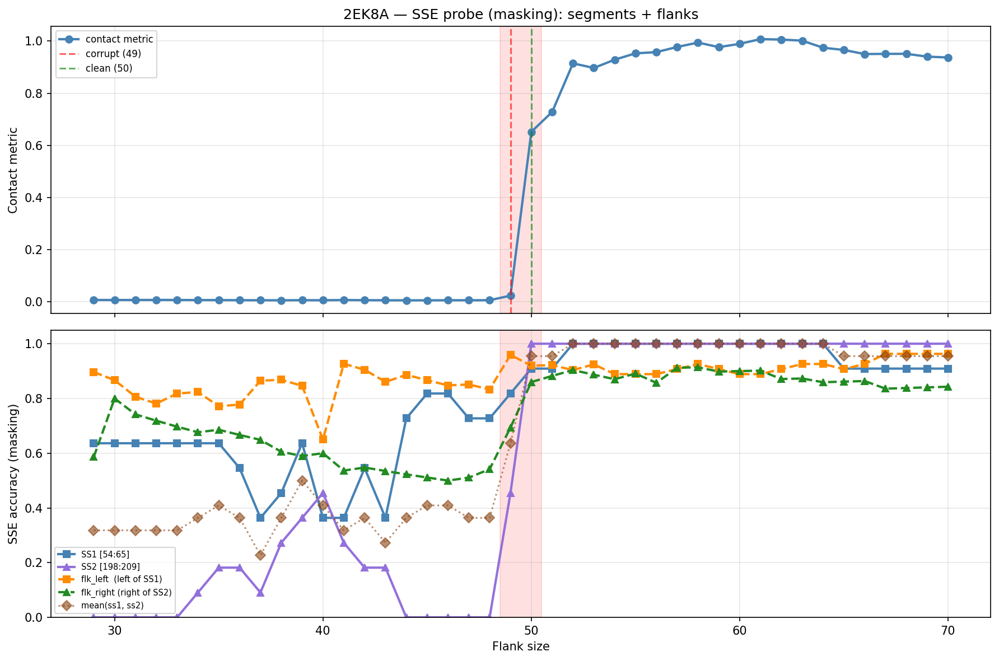

# SSE Probe Analysis: 2EK8A

Generated: 2026-03-03 15:57:21   Model: facebook/esm2_t33_650M_UR50D

## Configuration

| Parameter | Value |
|-----------|-------|
| Protein | 2EK8A |
| Contact pair | (59, 203) |
| ss1 | [54, 65) |
| ss2 | [198, 209) |
| Clean flank | 50 |
| Corrupt flank | 49 |
| Segment radius | 5 |
| Flank sweep | [29, 70] |
| Train sequences | 1,000 |
| Val sequences | 100 |
| Test sequences | 100 |

## SSE Probe Performance

| Split | Accuracy |
|-------|----------|
| Val   | 0.8240 |
| Test  | 0.8259 |

**Test classification report:**

```
              precision    recall  f1-score   support

           H       0.87      0.86      0.86     13101
           E       0.78      0.86      0.82     11471
           C       0.82      0.78      0.80     18602

    accuracy                           0.83     43174
   macro avg       0.83      0.83      0.83     43174
weighted avg       0.83      0.83      0.83     43174

```

## Ground-Truth SSE (full-sequence probe)

| Segment | Sequence |
|---------|----------|
| SS1 [54:65] | `EEEEEEEEEEC` |
| SS2 [198:209] | `EEEEEEEEEEE` |

## Flank Sweep Results

| flank | contact | mk_ss1 | mk_ss2 | mk_mean | mk_flkL | mk_flkR | mk_flk |
|-------|---------|--------|--------|---------|---------|---------|--------|
| 29 | 0.0069 | 0.636 | 0.000 | 0.318 | 0.897 | 0.586 | 0.741 |
| 30 | 0.0068 | 0.636 | 0.000 | 0.318 | 0.867 | 0.800 | 0.833 |
| 31 | 0.0068 | 0.636 | 0.000 | 0.318 | 0.806 | 0.742 | 0.774 |
| 32 | 0.0071 | 0.636 | 0.000 | 0.318 | 0.781 | 0.719 | 0.750 |
| 33 | 0.0069 | 0.636 | 0.000 | 0.318 | 0.818 | 0.697 | 0.758 |
| 34 | 0.0066 | 0.636 | 0.091 | 0.364 | 0.824 | 0.676 | 0.750 |
| 35 | 0.0064 | 0.636 | 0.182 | 0.409 | 0.771 | 0.686 | 0.729 |
| 36 | 0.0061 | 0.545 | 0.182 | 0.364 | 0.778 | 0.667 | 0.722 |
| 37 | 0.0059 | 0.364 | 0.091 | 0.227 | 0.865 | 0.649 | 0.757 |
| 38 | 0.0057 | 0.455 | 0.273 | 0.364 | 0.868 | 0.605 | 0.737 |
| 39 | 0.0062 | 0.636 | 0.364 | 0.500 | 0.846 | 0.590 | 0.718 |
| 40 | 0.0058 | 0.364 | 0.455 | 0.409 | 0.650 | 0.600 | 0.625 |
| 41 | 0.0067 | 0.364 | 0.273 | 0.318 | 0.927 | 0.537 | 0.732 |
| 42 | 0.0061 | 0.545 | 0.182 | 0.364 | 0.905 | 0.548 | 0.726 |
| 43 | 0.0058 | 0.364 | 0.182 | 0.273 | 0.860 | 0.535 | 0.698 |
| 44 | 0.0056 | 0.727 | 0.000 | 0.364 | 0.886 | 0.523 | 0.705 |
| 45 | 0.0056 | 0.818 | 0.000 | 0.409 | 0.867 | 0.511 | 0.689 |
| 46 | 0.0059 | 0.818 | 0.000 | 0.409 | 0.848 | 0.500 | 0.674 |
| 47 | 0.0059 | 0.727 | 0.000 | 0.364 | 0.851 | 0.511 | 0.681 |
| 48 | 0.0059 | 0.727 | 0.000 | 0.364 | 0.833 | 0.542 | 0.688 |
| 49 | 0.0235 | 0.818 | 0.455 | 0.636 | 0.959 | 0.694 | 0.827 |
| 50 | 0.6519 | 0.909 | 1.000 | 0.955 | 0.920 | 0.860 | 0.890 |
| 51 | 0.7282 | 0.909 | 1.000 | 0.955 | 0.922 | 0.882 | 0.902 |
| 52 | 0.9147 | 1.000 | 1.000 | 1.000 | 0.904 | 0.904 | 0.904 |
| 53 | 0.8970 | 1.000 | 1.000 | 1.000 | 0.925 | 0.887 | 0.906 |
| 54 | 0.9287 | 1.000 | 1.000 | 1.000 | 0.889 | 0.870 | 0.880 |
| 55 | 0.9531 | 1.000 | 1.000 | 1.000 | 0.889 | 0.891 | 0.890 |
| 56 | 0.9577 | 1.000 | 1.000 | 1.000 | 0.889 | 0.857 | 0.873 |
| 57 | 0.9775 | 1.000 | 1.000 | 1.000 | 0.907 | 0.912 | 0.910 |
| 58 | 0.9945 | 1.000 | 1.000 | 1.000 | 0.926 | 0.914 | 0.920 |
| 59 | 0.9769 | 1.000 | 1.000 | 1.000 | 0.907 | 0.898 | 0.903 |
| 60 | 0.9895 | 1.000 | 1.000 | 1.000 | 0.889 | 0.900 | 0.894 |
| 61 | 1.0077 | 1.000 | 1.000 | 1.000 | 0.889 | 0.902 | 0.895 |
| 62 | 1.0060 | 1.000 | 1.000 | 1.000 | 0.907 | 0.871 | 0.889 |
| 63 | 1.0017 | 1.000 | 1.000 | 1.000 | 0.926 | 0.873 | 0.899 |
| 64 | 0.9747 | 1.000 | 1.000 | 1.000 | 0.926 | 0.859 | 0.893 |
| 65 | 0.9660 | 0.909 | 1.000 | 0.955 | 0.907 | 0.862 | 0.884 |
| 66 | 0.9504 | 0.909 | 1.000 | 0.955 | 0.926 | 0.864 | 0.895 |
| 67 | 0.9510 | 0.909 | 1.000 | 0.955 | 0.963 | 0.836 | 0.899 |
| 68 | 0.9513 | 0.909 | 1.000 | 0.955 | 0.963 | 0.838 | 0.901 |
| 69 | 0.9404 | 0.909 | 1.000 | 0.955 | 0.963 | 0.841 | 0.902 |
| 70 | 0.9372 | 0.909 | 1.000 | 0.955 | 0.963 | 0.843 | 0.903 |

## Residue-Level Prediction Changes (clean=50, focus ±2)

### Flank 47 → 48

| Seg | Direction | Pos | gt | prev | now |
|-----|-----------|-----|----|------|-----|
| flk_R | incorr→corr | 251 | H | C | H |

### Flank 48 → 49

| Seg | Direction | Pos | gt | prev | now |
|-----|-----------|-----|----|------|-----|
| SS1 | incorr→corr | 61 | E | C | E |
| SS2 | incorr→corr | 200 | E | C | E |
| SS2 | incorr→corr | 205 | E | C | E |
| SS2 | incorr→corr | 206 | E | C | E |
| SS2 | incorr→corr | 207 | E | C | E |
| SS2 | incorr→corr | 208 | E | C | E |
| flk_L | incorr→corr | 6 | H | C | H |
| flk_L | incorr→corr | 7 | H | C | H |
| flk_L | incorr→corr | 8 | H | C | H |
| flk_L | incorr→corr | 9 | H | C | H |
| flk_L | incorr→corr | 11 | H | C | H |
| flk_L | incorr→corr | 13 | C | H | C |
| flk_R | incorr→corr | 209 | E | C | E |
| flk_R | incorr→corr | 225 | E | C | E |
| flk_R | incorr→corr | 247 | H | C | H |
| flk_R | incorr→corr | 248 | H | C | H |
| flk_R | incorr→corr | 249 | H | C | H |
| flk_R | incorr→corr | 253 | H | C | H |
| flk_R | incorr→corr | 255 | H | C | H |

### Flank 49 → 50

| Seg | Direction | Pos | gt | prev | now |
|-----|-----------|-----|----|------|-----|
| SS1 | incorr→corr | 62 | E | C | E |
| SS2 | incorr→corr | 198 | E | C | E |
| SS2 | incorr→corr | 199 | E | C | E |
| SS2 | incorr→corr | 201 | E | C | E |
| SS2 | incorr→corr | 202 | E | C | E |
| SS2 | incorr→corr | 203 | E | C | E |
| SS2 | incorr→corr | 204 | E | C | E |
| flk_L | corr→incorr | 11 | H | H | C |
| flk_L | corr→incorr | 13 | C | C | H |
| flk_L | corr→incorr | 29 | C | C | E |
| flk_L | incorr→corr | 50 | H | C | H |
| flk_R | incorr→corr | 226 | E | C | E |
| flk_R | incorr→corr | 227 | E | C | E |
| flk_R | corr→incorr | 230 | C | C | E |
| flk_R | incorr→corr | 241 | H | C | H |
| flk_R | incorr→corr | 242 | H | C | H |
| flk_R | incorr→corr | 243 | H | C | H |
| flk_R | incorr→corr | 244 | H | C | H |
| flk_R | incorr→corr | 245 | H | C | H |
| flk_R | incorr→corr | 246 | H | C | H |
| flk_R | incorr→corr | 252 | H | C | H |
| flk_R | incorr→corr | 254 | H | C | H |
| flk_R | corr→incorr | 256 | C | C | H |

### Flank 50 → 51

| Seg | Direction | Pos | gt | prev | now |
|-----|-----------|-----|----|------|-----|
| flk_L | incorr→corr | 13 | C | H | C |
| flk_R | incorr→corr | 230 | C | E | C |

### Flank 51 → 52

| Seg | Direction | Pos | gt | prev | now |
|-----|-----------|-----|----|------|-----|
| SS1 | incorr→corr | 63 | E | C | E |
| flk_R | incorr→corr | 238 | E | C | E |

## Plot


