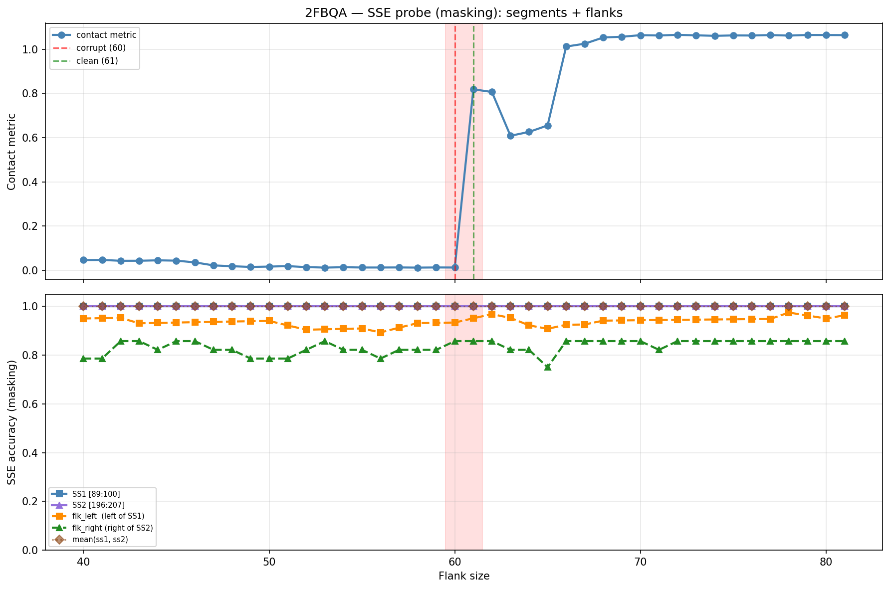

# SSE Probe Analysis: 2FBQA

Generated: 2026-03-03 15:57:26   Model: facebook/esm2_t33_650M_UR50D

## Configuration

| Parameter | Value |
|-----------|-------|
| Protein | 2FBQA |
| Contact pair | (94, 201) |
| ss1 | [89, 100) |
| ss2 | [196, 207) |
| Clean flank | 61 |
| Corrupt flank | 60 |
| Segment radius | 5 |
| Flank sweep | [40, 81] |
| Train sequences | 1,000 |
| Val sequences | 100 |
| Test sequences | 100 |

## SSE Probe Performance

| Split | Accuracy |
|-------|----------|
| Val   | 0.8240 |
| Test  | 0.8259 |

**Test classification report:**

```
              precision    recall  f1-score   support

           H       0.87      0.86      0.86     13101
           E       0.78      0.86      0.82     11471
           C       0.82      0.78      0.80     18602

    accuracy                           0.83     43174
   macro avg       0.83      0.83      0.83     43174
weighted avg       0.83      0.83      0.83     43174

```

## Ground-Truth SSE (full-sequence probe)

| Segment | Sequence |
|---------|----------|
| SS1 [89:100] | `HHHHHHHHHHH` |
| SS2 [196:207] | `HHHHHHHHHHH` |

## Flank Sweep Results

| flank | contact | mk_ss1 | mk_ss2 | mk_mean | mk_flkL | mk_flkR | mk_flk |
|-------|---------|--------|--------|---------|---------|---------|--------|
| 40 | 0.0467 | 1.000 | 1.000 | 1.000 | 0.950 | 0.786 | 0.868 |
| 41 | 0.0473 | 1.000 | 1.000 | 1.000 | 0.951 | 0.786 | 0.868 |
| 42 | 0.0434 | 1.000 | 1.000 | 1.000 | 0.952 | 0.857 | 0.905 |
| 43 | 0.0435 | 1.000 | 1.000 | 1.000 | 0.930 | 0.857 | 0.894 |
| 44 | 0.0454 | 1.000 | 1.000 | 1.000 | 0.932 | 0.821 | 0.877 |
| 45 | 0.0440 | 1.000 | 1.000 | 1.000 | 0.933 | 0.857 | 0.895 |
| 46 | 0.0362 | 1.000 | 1.000 | 1.000 | 0.935 | 0.857 | 0.896 |
| 47 | 0.0226 | 1.000 | 1.000 | 1.000 | 0.936 | 0.821 | 0.879 |
| 48 | 0.0189 | 1.000 | 1.000 | 1.000 | 0.938 | 0.821 | 0.879 |
| 49 | 0.0156 | 1.000 | 1.000 | 1.000 | 0.939 | 0.786 | 0.862 |
| 50 | 0.0172 | 1.000 | 1.000 | 1.000 | 0.940 | 0.786 | 0.863 |
| 51 | 0.0192 | 1.000 | 1.000 | 1.000 | 0.922 | 0.786 | 0.854 |
| 52 | 0.0148 | 1.000 | 1.000 | 1.000 | 0.904 | 0.821 | 0.863 |
| 53 | 0.0127 | 1.000 | 1.000 | 1.000 | 0.906 | 0.857 | 0.881 |
| 54 | 0.0143 | 1.000 | 1.000 | 1.000 | 0.907 | 0.821 | 0.864 |
| 55 | 0.0130 | 1.000 | 1.000 | 1.000 | 0.909 | 0.821 | 0.865 |
| 56 | 0.0130 | 1.000 | 1.000 | 1.000 | 0.893 | 0.786 | 0.839 |
| 57 | 0.0133 | 1.000 | 1.000 | 1.000 | 0.912 | 0.821 | 0.867 |
| 58 | 0.0126 | 1.000 | 1.000 | 1.000 | 0.931 | 0.821 | 0.876 |
| 59 | 0.0132 | 1.000 | 1.000 | 1.000 | 0.932 | 0.821 | 0.877 |
| 60 | 0.0130 | 1.000 | 1.000 | 1.000 | 0.933 | 0.857 | 0.895 |
| 61 | 0.8185 | 1.000 | 1.000 | 1.000 | 0.951 | 0.857 | 0.904 |
| 62 | 0.8066 | 1.000 | 1.000 | 1.000 | 0.968 | 0.857 | 0.912 |
| 63 | 0.6084 | 1.000 | 1.000 | 1.000 | 0.952 | 0.821 | 0.887 |
| 64 | 0.6260 | 1.000 | 1.000 | 1.000 | 0.922 | 0.821 | 0.872 |
| 65 | 0.6551 | 1.000 | 1.000 | 1.000 | 0.908 | 0.750 | 0.829 |
| 66 | 1.0118 | 1.000 | 1.000 | 1.000 | 0.924 | 0.857 | 0.891 |
| 67 | 1.0247 | 1.000 | 1.000 | 1.000 | 0.925 | 0.857 | 0.891 |
| 68 | 1.0529 | 1.000 | 1.000 | 1.000 | 0.941 | 0.857 | 0.899 |
| 69 | 1.0561 | 1.000 | 1.000 | 1.000 | 0.942 | 0.857 | 0.900 |
| 70 | 1.0633 | 1.000 | 1.000 | 1.000 | 0.943 | 0.857 | 0.900 |
| 71 | 1.0619 | 1.000 | 1.000 | 1.000 | 0.944 | 0.821 | 0.883 |
| 72 | 1.0648 | 1.000 | 1.000 | 1.000 | 0.944 | 0.857 | 0.901 |
| 73 | 1.0626 | 1.000 | 1.000 | 1.000 | 0.945 | 0.857 | 0.901 |
| 74 | 1.0603 | 1.000 | 1.000 | 1.000 | 0.946 | 0.857 | 0.902 |
| 75 | 1.0621 | 1.000 | 1.000 | 1.000 | 0.947 | 0.857 | 0.902 |
| 76 | 1.0618 | 1.000 | 1.000 | 1.000 | 0.947 | 0.857 | 0.902 |
| 77 | 1.0637 | 1.000 | 1.000 | 1.000 | 0.948 | 0.857 | 0.903 |
| 78 | 1.0614 | 1.000 | 1.000 | 1.000 | 0.974 | 0.857 | 0.916 |
| 79 | 1.0643 | 1.000 | 1.000 | 1.000 | 0.962 | 0.857 | 0.910 |
| 80 | 1.0640 | 1.000 | 1.000 | 1.000 | 0.950 | 0.857 | 0.904 |
| 81 | 1.0636 | 1.000 | 1.000 | 1.000 | 0.963 | 0.857 | 0.910 |

## Residue-Level Prediction Changes (clean=61, focus ±2)

### Flank 58 → 59

| Seg | Direction | Pos | gt | prev | now |
|-----|-----------|-----|----|------|-----|
| flk_L | incorr→corr | 83 | H | C | H |

### Flank 59 → 60

| Seg | Direction | Pos | gt | prev | now |
|-----|-----------|-----|----|------|-----|
| flk_L | corr→incorr | 36 | C | C | H |
| flk_L | incorr→corr | 45 | H | C | H |
| flk_R | incorr→corr | 221 | H | C | H |

### Flank 60 → 61

| Seg | Direction | Pos | gt | prev | now |
|-----|-----------|-----|----|------|-----|
| flk_L | incorr→corr | 41 | H | C | H |
| flk_R | incorr→corr | 210 | C | H | C |
| flk_R | corr→incorr | 219 | H | H | C |

### Flank 61 → 62

| Seg | Direction | Pos | gt | prev | now |
|-----|-----------|-----|----|------|-----|
| flk_L | incorr→corr | 30 | H | C | H |

### Flank 62 → 63

| Seg | Direction | Pos | gt | prev | now |
|-----|-----------|-----|----|------|-----|
| flk_L | corr→incorr | 41 | H | H | C |
| flk_R | corr→incorr | 212 | C | C | H |

## Plot


