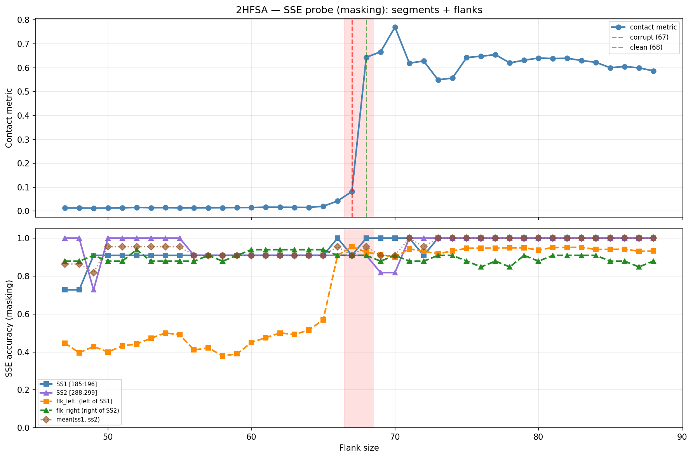

# SSE Probe Analysis: 2HFSA

Generated: 2026-03-03 15:57:33   Model: facebook/esm2_t33_650M_UR50D

## Configuration

| Parameter | Value |
|-----------|-------|
| Protein | 2HFSA |
| Contact pair | (190, 293) |
| ss1 | [185, 196) |
| ss2 | [288, 299) |
| Clean flank | 68 |
| Corrupt flank | 67 |
| Segment radius | 5 |
| Flank sweep | [47, 88] |
| Train sequences | 1,000 |
| Val sequences | 100 |
| Test sequences | 100 |

## SSE Probe Performance

| Split | Accuracy |
|-------|----------|
| Val   | 0.8240 |
| Test  | 0.8259 |

**Test classification report:**

```
              precision    recall  f1-score   support

           H       0.87      0.86      0.86     13101
           E       0.78      0.86      0.82     11471
           C       0.82      0.78      0.80     18602

    accuracy                           0.83     43174
   macro avg       0.83      0.83      0.83     43174
weighted avg       0.83      0.83      0.83     43174

```

## Ground-Truth SSE (full-sequence probe)

| Segment | Sequence |
|---------|----------|
| SS1 [185:196] | `CCEEEEEEECC` |
| SS2 [288:299] | `CCEEEEEECCH` |

## Flank Sweep Results

| flank | contact | mk_ss1 | mk_ss2 | mk_mean | mk_flkL | mk_flkR | mk_flk |
|-------|---------|--------|--------|---------|---------|---------|--------|
| 47 | 0.0133 | 0.727 | 1.000 | 0.864 | 0.447 | 0.879 | 0.663 |
| 48 | 0.0133 | 0.727 | 1.000 | 0.864 | 0.396 | 0.879 | 0.637 |
| 49 | 0.0127 | 0.909 | 0.727 | 0.818 | 0.429 | 0.909 | 0.669 |
| 50 | 0.0130 | 0.909 | 1.000 | 0.955 | 0.400 | 0.879 | 0.639 |
| 51 | 0.0137 | 0.909 | 1.000 | 0.955 | 0.431 | 0.879 | 0.655 |
| 52 | 0.0154 | 0.909 | 1.000 | 0.955 | 0.442 | 0.939 | 0.691 |
| 53 | 0.0143 | 0.909 | 1.000 | 0.955 | 0.472 | 0.879 | 0.675 |
| 54 | 0.0146 | 0.909 | 1.000 | 0.955 | 0.500 | 0.879 | 0.689 |
| 55 | 0.0139 | 0.909 | 1.000 | 0.955 | 0.491 | 0.879 | 0.685 |
| 56 | 0.0139 | 0.909 | 0.909 | 0.909 | 0.411 | 0.879 | 0.645 |
| 57 | 0.0141 | 0.909 | 0.909 | 0.909 | 0.421 | 0.909 | 0.665 |
| 58 | 0.0144 | 0.909 | 0.909 | 0.909 | 0.379 | 0.879 | 0.629 |
| 59 | 0.0149 | 0.909 | 0.909 | 0.909 | 0.390 | 0.909 | 0.649 |
| 60 | 0.0150 | 0.909 | 0.909 | 0.909 | 0.450 | 0.939 | 0.695 |
| 61 | 0.0165 | 0.909 | 0.909 | 0.909 | 0.475 | 0.939 | 0.707 |
| 62 | 0.0163 | 0.909 | 0.909 | 0.909 | 0.500 | 0.939 | 0.720 |
| 63 | 0.0159 | 0.909 | 0.909 | 0.909 | 0.492 | 0.939 | 0.716 |
| 64 | 0.0155 | 0.909 | 0.909 | 0.909 | 0.516 | 0.939 | 0.728 |
| 65 | 0.0204 | 0.909 | 0.909 | 0.909 | 0.569 | 0.939 | 0.754 |
| 66 | 0.0422 | 1.000 | 0.909 | 0.955 | 0.909 | 0.909 | 0.909 |
| 67 | 0.0822 | 0.909 | 0.909 | 0.909 | 0.955 | 0.909 | 0.932 |
| 68 | 0.6438 | 1.000 | 0.909 | 0.955 | 0.926 | 0.909 | 0.918 |
| 69 | 0.6667 | 1.000 | 0.818 | 0.909 | 0.913 | 0.879 | 0.896 |
| 70 | 0.7701 | 1.000 | 0.818 | 0.909 | 0.900 | 0.909 | 0.905 |
| 71 | 0.6192 | 1.000 | 1.000 | 1.000 | 0.944 | 0.879 | 0.911 |
| 72 | 0.6282 | 0.909 | 1.000 | 0.955 | 0.931 | 0.879 | 0.905 |
| 73 | 0.5496 | 1.000 | 1.000 | 1.000 | 0.918 | 0.909 | 0.913 |
| 74 | 0.5565 | 1.000 | 1.000 | 1.000 | 0.932 | 0.909 | 0.921 |
| 75 | 0.6427 | 1.000 | 1.000 | 1.000 | 0.947 | 0.879 | 0.913 |
| 76 | 0.6481 | 1.000 | 1.000 | 1.000 | 0.947 | 0.848 | 0.898 |
| 77 | 0.6549 | 1.000 | 1.000 | 1.000 | 0.948 | 0.879 | 0.913 |
| 78 | 0.6201 | 1.000 | 1.000 | 1.000 | 0.949 | 0.848 | 0.899 |
| 79 | 0.6316 | 1.000 | 1.000 | 1.000 | 0.949 | 0.909 | 0.929 |
| 80 | 0.6406 | 1.000 | 1.000 | 1.000 | 0.938 | 0.879 | 0.908 |
| 81 | 0.6385 | 1.000 | 1.000 | 1.000 | 0.951 | 0.909 | 0.930 |
| 82 | 0.6396 | 1.000 | 1.000 | 1.000 | 0.951 | 0.909 | 0.930 |
| 83 | 0.6303 | 1.000 | 1.000 | 1.000 | 0.952 | 0.909 | 0.930 |
| 84 | 0.6224 | 1.000 | 1.000 | 1.000 | 0.940 | 0.909 | 0.925 |
| 85 | 0.6002 | 1.000 | 1.000 | 1.000 | 0.941 | 0.879 | 0.910 |
| 86 | 0.6049 | 1.000 | 1.000 | 1.000 | 0.942 | 0.879 | 0.910 |
| 87 | 0.5995 | 1.000 | 1.000 | 1.000 | 0.931 | 0.848 | 0.890 |
| 88 | 0.5870 | 1.000 | 1.000 | 1.000 | 0.932 | 0.879 | 0.905 |

## Residue-Level Prediction Changes (clean=68, focus ±2)

### Flank 65 → 66

| Seg | Direction | Pos | gt | prev | now |
|-----|-----------|-----|----|------|-----|
| SS1 | incorr→corr | 193 | E | C | E |
| flk_L | incorr→corr | 120 | H | C | H |
| flk_L | incorr→corr | 129 | C | H | C |
| flk_L | incorr→corr | 135 | H | C | H |
| flk_L | incorr→corr | 136 | H | C | H |
| flk_L | incorr→corr | 137 | H | C | H |
| flk_L | incorr→corr | 139 | H | E | H |
| flk_L | incorr→corr | 140 | H | C | H |
| flk_L | incorr→corr | 141 | H | E | H |
| flk_L | incorr→corr | 142 | H | E | H |
| flk_L | incorr→corr | 143 | H | E | H |
| flk_L | incorr→corr | 144 | H | E | H |
| flk_L | incorr→corr | 146 | H | C | H |
| flk_L | incorr→corr | 147 | H | C | H |
| flk_L | incorr→corr | 150 | C | E | C |
| flk_L | incorr→corr | 159 | H | C | H |
| flk_L | incorr→corr | 160 | H | C | H |
| flk_L | incorr→corr | 161 | H | C | H |
| flk_L | incorr→corr | 162 | H | C | H |
| flk_L | incorr→corr | 163 | H | C | H |
| flk_L | incorr→corr | 165 | C | E | C |
| flk_L | incorr→corr | 172 | E | C | E |
| flk_L | incorr→corr | 175 | E | C | E |
| flk_R | corr→incorr | 323 | E | E | C |

### Flank 66 → 67

| Seg | Direction | Pos | gt | prev | now |
|-----|-----------|-----|----|------|-----|
| SS1 | corr→incorr | 194 | C | C | E |
| flk_L | incorr→corr | 145 | H | C | H |
| flk_L | incorr→corr | 148 | H | C | H |
| flk_L | incorr→corr | 182 | C | E | C |
| flk_R | corr→incorr | 327 | C | C | H |
| flk_R | incorr→corr | 329 | H | C | H |

### Flank 67 → 68

| Seg | Direction | Pos | gt | prev | now |
|-----|-----------|-----|----|------|-----|
| SS1 | incorr→corr | 194 | C | E | C |
| flk_L | corr→incorr | 149 | C | C | H |
| flk_L | corr→incorr | 155 | C | C | H |
| flk_L | incorr→corr | 158 | H | C | H |
| flk_L | corr→incorr | 175 | E | E | C |
| flk_R | incorr→corr | 327 | C | H | C |
| flk_R | corr→incorr | 329 | H | H | C |

### Flank 68 → 69

| Seg | Direction | Pos | gt | prev | now |
|-----|-----------|-----|----|------|-----|
| SS2 | corr→incorr | 296 | C | C | E |
| flk_L | corr→incorr | 171 | E | E | C |
| flk_R | corr→incorr | 322 | E | E | C |

### Flank 69 → 70

| Seg | Direction | Pos | gt | prev | now |
|-----|-----------|-----|----|------|-----|
| flk_L | corr→incorr | 163 | H | H | C |
| flk_R | incorr→corr | 322 | E | C | E |

## Plot


