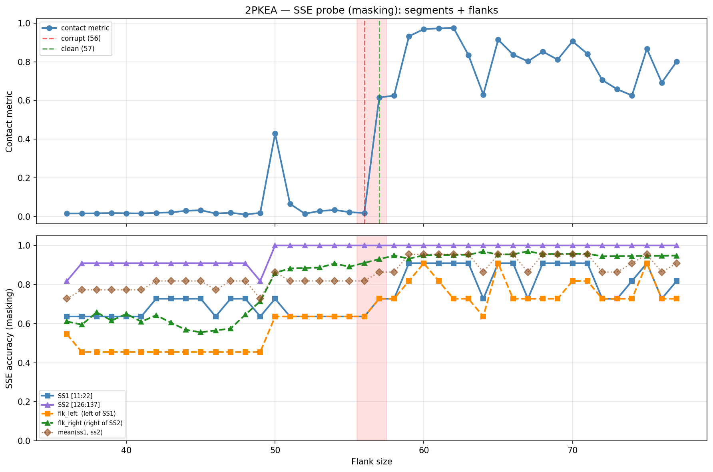

# SSE Probe Analysis: 2PKEA

Generated: 2026-03-03 15:57:38   Model: facebook/esm2_t33_650M_UR50D

## Configuration

| Parameter | Value |
|-----------|-------|
| Protein | 2PKEA |
| Contact pair | (16, 131) |
| ss1 | [11, 22) |
| ss2 | [126, 137) |
| Clean flank | 57 |
| Corrupt flank | 56 |
| Segment radius | 5 |
| Flank sweep | [36, 77] |
| Train sequences | 1,000 |
| Val sequences | 100 |
| Test sequences | 100 |

## SSE Probe Performance

| Split | Accuracy |
|-------|----------|
| Val   | 0.8240 |
| Test  | 0.8259 |

**Test classification report:**

```
              precision    recall  f1-score   support

           H       0.87      0.86      0.86     13101
           E       0.78      0.86      0.82     11471
           C       0.82      0.78      0.80     18602

    accuracy                           0.83     43174
   macro avg       0.83      0.83      0.83     43174
weighted avg       0.83      0.83      0.83     43174

```

## Ground-Truth SSE (full-sequence probe)

| Segment | Sequence |
|---------|----------|
| SS1 [11:22] | `CCCEEEECCCC` |
| SS2 [126:137] | `CCEEEEEECCC` |

## Flank Sweep Results

| flank | contact | mk_ss1 | mk_ss2 | mk_mean | mk_flkL | mk_flkR | mk_flk |
|-------|---------|--------|--------|---------|---------|---------|--------|
| 36 | 0.0161 | 0.636 | 0.818 | 0.727 | 0.545 | 0.611 | 0.578 |
| 37 | 0.0161 | 0.636 | 0.909 | 0.773 | 0.455 | 0.595 | 0.525 |
| 38 | 0.0169 | 0.636 | 0.909 | 0.773 | 0.455 | 0.658 | 0.556 |
| 39 | 0.0183 | 0.636 | 0.909 | 0.773 | 0.455 | 0.615 | 0.535 |
| 40 | 0.0171 | 0.636 | 0.909 | 0.773 | 0.455 | 0.650 | 0.552 |
| 41 | 0.0162 | 0.636 | 0.909 | 0.773 | 0.455 | 0.610 | 0.532 |
| 42 | 0.0193 | 0.727 | 0.909 | 0.818 | 0.455 | 0.643 | 0.549 |
| 43 | 0.0216 | 0.727 | 0.909 | 0.818 | 0.455 | 0.605 | 0.530 |
| 44 | 0.0299 | 0.727 | 0.909 | 0.818 | 0.455 | 0.568 | 0.511 |
| 45 | 0.0328 | 0.727 | 0.909 | 0.818 | 0.455 | 0.556 | 0.505 |
| 46 | 0.0159 | 0.636 | 0.909 | 0.773 | 0.455 | 0.565 | 0.510 |
| 47 | 0.0197 | 0.727 | 0.909 | 0.818 | 0.455 | 0.574 | 0.515 |
| 48 | 0.0110 | 0.727 | 0.909 | 0.818 | 0.455 | 0.646 | 0.550 |
| 49 | 0.0188 | 0.636 | 0.818 | 0.727 | 0.455 | 0.714 | 0.584 |
| 50 | 0.4289 | 0.727 | 1.000 | 0.864 | 0.636 | 0.860 | 0.748 |
| 51 | 0.0661 | 0.636 | 1.000 | 0.818 | 0.636 | 0.882 | 0.759 |
| 52 | 0.0149 | 0.636 | 1.000 | 0.818 | 0.636 | 0.885 | 0.760 |
| 53 | 0.0289 | 0.636 | 1.000 | 0.818 | 0.636 | 0.887 | 0.762 |
| 54 | 0.0340 | 0.636 | 1.000 | 0.818 | 0.636 | 0.907 | 0.772 |
| 55 | 0.0231 | 0.636 | 1.000 | 0.818 | 0.636 | 0.891 | 0.764 |
| 56 | 0.0182 | 0.636 | 1.000 | 0.818 | 0.636 | 0.911 | 0.774 |
| 57 | 0.6155 | 0.727 | 1.000 | 0.864 | 0.727 | 0.930 | 0.829 |
| 58 | 0.6252 | 0.727 | 1.000 | 0.864 | 0.727 | 0.948 | 0.838 |
| 59 | 0.9319 | 0.909 | 1.000 | 0.955 | 0.818 | 0.932 | 0.875 |
| 60 | 0.9687 | 0.909 | 1.000 | 0.955 | 0.909 | 0.950 | 0.930 |
| 61 | 0.9729 | 0.909 | 1.000 | 0.955 | 0.818 | 0.951 | 0.885 |
| 62 | 0.9750 | 0.909 | 1.000 | 0.955 | 0.727 | 0.952 | 0.839 |
| 63 | 0.8349 | 0.909 | 1.000 | 0.955 | 0.727 | 0.952 | 0.840 |
| 64 | 0.6303 | 0.727 | 1.000 | 0.864 | 0.636 | 0.969 | 0.803 |
| 65 | 0.9143 | 0.909 | 1.000 | 0.955 | 0.909 | 0.954 | 0.931 |
| 66 | 0.8373 | 0.909 | 1.000 | 0.955 | 0.727 | 0.955 | 0.841 |
| 67 | 0.8026 | 0.727 | 1.000 | 0.864 | 0.727 | 0.970 | 0.849 |
| 68 | 0.8523 | 0.909 | 1.000 | 0.955 | 0.727 | 0.956 | 0.842 |
| 69 | 0.8112 | 0.909 | 1.000 | 0.955 | 0.727 | 0.957 | 0.842 |
| 70 | 0.9058 | 0.909 | 1.000 | 0.955 | 0.818 | 0.957 | 0.888 |
| 71 | 0.8410 | 0.909 | 1.000 | 0.955 | 0.818 | 0.958 | 0.888 |
| 72 | 0.7057 | 0.727 | 1.000 | 0.864 | 0.727 | 0.944 | 0.836 |
| 73 | 0.6581 | 0.727 | 1.000 | 0.864 | 0.727 | 0.945 | 0.836 |
| 74 | 0.6260 | 0.818 | 1.000 | 0.909 | 0.727 | 0.946 | 0.837 |
| 75 | 0.8675 | 0.909 | 1.000 | 0.955 | 0.909 | 0.947 | 0.928 |
| 76 | 0.6922 | 0.727 | 1.000 | 0.864 | 0.727 | 0.947 | 0.837 |
| 77 | 0.8006 | 0.818 | 1.000 | 0.909 | 0.727 | 0.948 | 0.838 |

## Residue-Level Prediction Changes (clean=57, focus ±2)

### Flank 54 → 55

_(no prediction changes)_

### Flank 55 → 56

| Seg | Direction | Pos | gt | prev | now |
|-----|-----------|-----|----|------|-----|
| flk_R | incorr→corr | 151 | H | C | H |
| flk_R | incorr→corr | 188 | H | C | H |

### Flank 56 → 57

| Seg | Direction | Pos | gt | prev | now |
|-----|-----------|-----|----|------|-----|
| SS1 | incorr→corr | 12 | C | E | C |
| flk_L | incorr→corr | 2 | C | E | C |
| flk_R | incorr→corr | 192 | H | C | H |

### Flank 57 → 58

| Seg | Direction | Pos | gt | prev | now |
|-----|-----------|-----|----|------|-----|
| flk_R | incorr→corr | 185 | C | E | C |

### Flank 58 → 59

| Seg | Direction | Pos | gt | prev | now |
|-----|-----------|-----|----|------|-----|
| SS1 | incorr→corr | 11 | C | E | C |
| SS1 | incorr→corr | 17 | E | C | E |
| flk_L | incorr→corr | 7 | C | E | C |
| flk_R | corr→incorr | 185 | C | C | E |

## Plot


