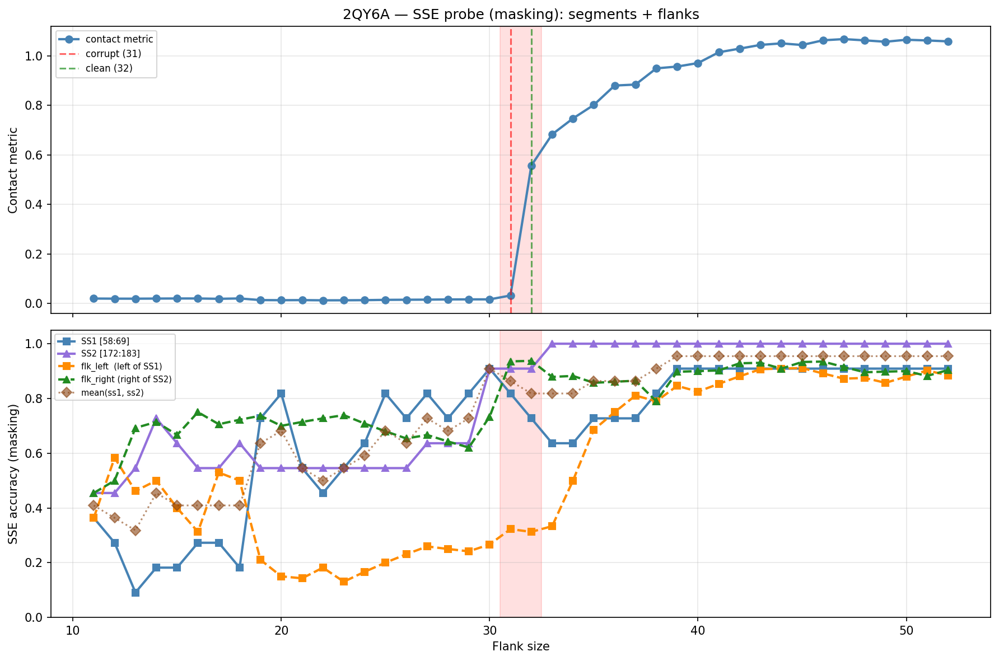

# SSE Probe Analysis: 2QY6A

Generated: 2026-03-03 15:57:44   Model: facebook/esm2_t33_650M_UR50D

## Configuration

| Parameter | Value |
|-----------|-------|
| Protein | 2QY6A |
| Contact pair | (63, 177) |
| ss1 | [58, 69) |
| ss2 | [172, 183) |
| Clean flank | 32 |
| Corrupt flank | 31 |
| Segment radius | 5 |
| Flank sweep | [11, 52] |
| Train sequences | 1,000 |
| Val sequences | 100 |
| Test sequences | 100 |

## SSE Probe Performance

| Split | Accuracy |
|-------|----------|
| Val   | 0.8240 |
| Test  | 0.8259 |

**Test classification report:**

```
              precision    recall  f1-score   support

           H       0.87      0.86      0.86     13101
           E       0.78      0.86      0.82     11471
           C       0.82      0.78      0.80     18602

    accuracy                           0.83     43174
   macro avg       0.83      0.83      0.83     43174
weighted avg       0.83      0.83      0.83     43174

```

## Ground-Truth SSE (full-sequence probe)

| Segment | Sequence |
|---------|----------|
| SS1 [58:69] | `CCEEEEEEECC` |
| SS2 [172:183] | `CECEEEECCCC` |

## Flank Sweep Results

| flank | contact | mk_ss1 | mk_ss2 | mk_mean | mk_flkL | mk_flkR | mk_flk |
|-------|---------|--------|--------|---------|---------|---------|--------|
| 11 | 0.0194 | 0.364 | 0.455 | 0.409 | 0.364 | 0.455 | 0.409 |
| 12 | 0.0190 | 0.273 | 0.455 | 0.364 | 0.583 | 0.500 | 0.542 |
| 13 | 0.0189 | 0.091 | 0.545 | 0.318 | 0.462 | 0.692 | 0.577 |
| 14 | 0.0193 | 0.182 | 0.727 | 0.455 | 0.500 | 0.714 | 0.607 |
| 15 | 0.0197 | 0.182 | 0.636 | 0.409 | 0.400 | 0.667 | 0.533 |
| 16 | 0.0197 | 0.273 | 0.545 | 0.409 | 0.312 | 0.750 | 0.531 |
| 17 | 0.0184 | 0.273 | 0.545 | 0.409 | 0.529 | 0.706 | 0.618 |
| 18 | 0.0198 | 0.182 | 0.636 | 0.409 | 0.500 | 0.722 | 0.611 |
| 19 | 0.0132 | 0.727 | 0.545 | 0.636 | 0.211 | 0.737 | 0.474 |
| 20 | 0.0128 | 0.818 | 0.545 | 0.682 | 0.150 | 0.700 | 0.425 |
| 21 | 0.0131 | 0.545 | 0.545 | 0.545 | 0.143 | 0.714 | 0.429 |
| 22 | 0.0123 | 0.455 | 0.545 | 0.500 | 0.182 | 0.727 | 0.455 |
| 23 | 0.0124 | 0.545 | 0.545 | 0.545 | 0.130 | 0.739 | 0.435 |
| 24 | 0.0129 | 0.636 | 0.545 | 0.591 | 0.167 | 0.708 | 0.438 |
| 25 | 0.0141 | 0.818 | 0.545 | 0.682 | 0.200 | 0.680 | 0.440 |
| 26 | 0.0146 | 0.727 | 0.545 | 0.636 | 0.231 | 0.654 | 0.442 |
| 27 | 0.0150 | 0.818 | 0.636 | 0.727 | 0.259 | 0.667 | 0.463 |
| 28 | 0.0158 | 0.727 | 0.636 | 0.682 | 0.250 | 0.643 | 0.446 |
| 29 | 0.0161 | 0.818 | 0.636 | 0.727 | 0.241 | 0.621 | 0.431 |
| 30 | 0.0161 | 0.909 | 0.909 | 0.909 | 0.267 | 0.733 | 0.500 |
| 31 | 0.0317 | 0.818 | 0.909 | 0.864 | 0.323 | 0.935 | 0.629 |
| 32 | 0.5565 | 0.727 | 0.909 | 0.818 | 0.312 | 0.938 | 0.625 |
| 33 | 0.6827 | 0.636 | 1.000 | 0.818 | 0.333 | 0.879 | 0.606 |
| 34 | 0.7468 | 0.636 | 1.000 | 0.818 | 0.500 | 0.882 | 0.691 |
| 35 | 0.8015 | 0.727 | 1.000 | 0.864 | 0.686 | 0.857 | 0.771 |
| 36 | 0.8798 | 0.727 | 1.000 | 0.864 | 0.750 | 0.861 | 0.806 |
| 37 | 0.8837 | 0.727 | 1.000 | 0.864 | 0.811 | 0.865 | 0.838 |
| 38 | 0.9492 | 0.818 | 1.000 | 0.909 | 0.789 | 0.789 | 0.789 |
| 39 | 0.9564 | 0.909 | 1.000 | 0.955 | 0.846 | 0.897 | 0.872 |
| 40 | 0.9706 | 0.909 | 1.000 | 0.955 | 0.825 | 0.900 | 0.863 |
| 41 | 1.0142 | 0.909 | 1.000 | 0.955 | 0.854 | 0.902 | 0.878 |
| 42 | 1.0289 | 0.909 | 1.000 | 0.955 | 0.881 | 0.929 | 0.905 |
| 43 | 1.0440 | 0.909 | 1.000 | 0.955 | 0.907 | 0.930 | 0.919 |
| 44 | 1.0501 | 0.909 | 1.000 | 0.955 | 0.909 | 0.909 | 0.909 |
| 45 | 1.0435 | 0.909 | 1.000 | 0.955 | 0.911 | 0.933 | 0.922 |
| 46 | 1.0625 | 0.909 | 1.000 | 0.955 | 0.891 | 0.935 | 0.913 |
| 47 | 1.0674 | 0.909 | 1.000 | 0.955 | 0.872 | 0.915 | 0.894 |
| 48 | 1.0622 | 0.909 | 1.000 | 0.955 | 0.875 | 0.896 | 0.885 |
| 49 | 1.0567 | 0.909 | 1.000 | 0.955 | 0.857 | 0.898 | 0.878 |
| 50 | 1.0647 | 0.909 | 1.000 | 0.955 | 0.880 | 0.900 | 0.890 |
| 51 | 1.0618 | 0.909 | 1.000 | 0.955 | 0.902 | 0.882 | 0.892 |
| 52 | 1.0582 | 0.909 | 1.000 | 0.955 | 0.885 | 0.904 | 0.894 |

## Residue-Level Prediction Changes (clean=32, focus ±2)

### Flank 29 → 30

| Seg | Direction | Pos | gt | prev | now |
|-----|-----------|-----|----|------|-----|
| SS1 | incorr→corr | 66 | E | C | E |
| SS2 | incorr→corr | 175 | E | C | E |
| SS2 | incorr→corr | 177 | E | C | E |
| SS2 | incorr→corr | 178 | E | C | E |
| flk_R | incorr→corr | 209 | E | C | E |
| flk_R | incorr→corr | 210 | E | C | E |
| flk_R | incorr→corr | 211 | E | C | E |

### Flank 30 → 31

| Seg | Direction | Pos | gt | prev | now |
|-----|-----------|-----|----|------|-----|
| SS1 | corr→incorr | 65 | E | E | C |
| SS1 | corr→incorr | 66 | E | E | C |
| SS1 | incorr→corr | 68 | C | E | C |
| flk_L | incorr→corr | 32 | C | E | C |
| flk_L | incorr→corr | 48 | C | E | C |
| flk_R | incorr→corr | 188 | H | C | H |
| flk_R | incorr→corr | 189 | C | H | C |
| flk_R | incorr→corr | 191 | C | H | C |
| flk_R | incorr→corr | 201 | C | H | C |
| flk_R | incorr→corr | 206 | E | C | E |
| flk_R | incorr→corr | 207 | E | C | E |

### Flank 31 → 32

| Seg | Direction | Pos | gt | prev | now |
|-----|-----------|-----|----|------|-----|
| SS1 | corr→incorr | 60 | E | E | C |
| flk_L | corr→incorr | 28 | E | E | C |

### Flank 32 → 33

| Seg | Direction | Pos | gt | prev | now |
|-----|-----------|-----|----|------|-----|
| SS1 | corr→incorr | 59 | C | C | H |
| SS2 | incorr→corr | 173 | E | C | E |
| flk_R | corr→incorr | 188 | H | H | C |

### Flank 33 → 34

| Seg | Direction | Pos | gt | prev | now |
|-----|-----------|-----|----|------|-----|
| flk_L | incorr→corr | 27 | E | C | E |
| flk_L | incorr→corr | 31 | C | E | C |
| flk_L | incorr→corr | 35 | H | C | H |
| flk_L | incorr→corr | 39 | H | E | H |
| flk_L | corr→incorr | 48 | C | C | H |
| flk_L | incorr→corr | 49 | H | C | H |
| flk_L | incorr→corr | 50 | H | C | H |
| flk_R | incorr→corr | 190 | C | H | C |

## Plot


