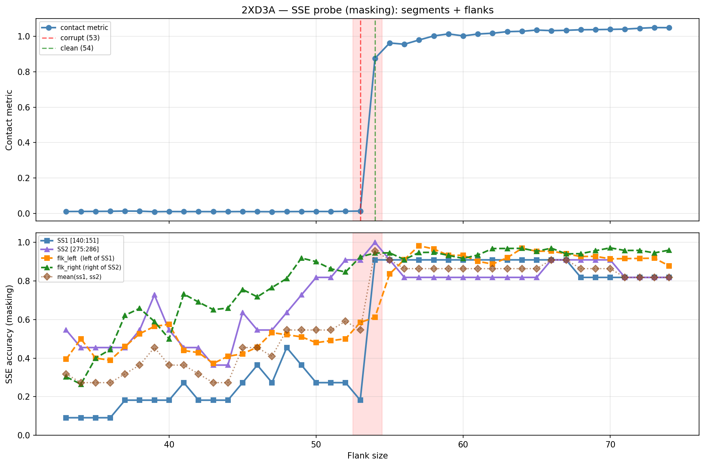

# SSE Probe Analysis: 2XD3A

Generated: 2026-03-03 15:57:52   Model: facebook/esm2_t33_650M_UR50D

## Configuration

| Parameter | Value |
|-----------|-------|
| Protein | 2XD3A |
| Contact pair | (145, 280) |
| ss1 | [140, 151) |
| ss2 | [275, 286) |
| Clean flank | 54 |
| Corrupt flank | 53 |
| Segment radius | 5 |
| Flank sweep | [33, 74] |
| Train sequences | 1,000 |
| Val sequences | 100 |
| Test sequences | 100 |

## SSE Probe Performance

| Split | Accuracy |
|-------|----------|
| Val   | 0.8240 |
| Test  | 0.8259 |

**Test classification report:**

```
              precision    recall  f1-score   support

           H       0.87      0.86      0.86     13101
           E       0.78      0.86      0.82     11471
           C       0.82      0.78      0.80     18602

    accuracy                           0.83     43174
   macro avg       0.83      0.83      0.83     43174
weighted avg       0.83      0.83      0.83     43174

```

## Ground-Truth SSE (full-sequence probe)

| Segment | Sequence |
|---------|----------|
| SS1 [140:151] | `EEEEEEEEHCC` |
| SS2 [275:286] | `CCCEEEEEECE` |

## Flank Sweep Results

| flank | contact | mk_ss1 | mk_ss2 | mk_mean | mk_flkL | mk_flkR | mk_flk |
|-------|---------|--------|--------|---------|---------|---------|--------|
| 33 | 0.0106 | 0.091 | 0.545 | 0.318 | 0.394 | 0.303 | 0.348 |
| 34 | 0.0109 | 0.091 | 0.455 | 0.273 | 0.500 | 0.265 | 0.382 |
| 35 | 0.0113 | 0.091 | 0.455 | 0.273 | 0.400 | 0.400 | 0.400 |
| 36 | 0.0118 | 0.091 | 0.455 | 0.273 | 0.389 | 0.444 | 0.417 |
| 37 | 0.0132 | 0.182 | 0.455 | 0.318 | 0.459 | 0.622 | 0.541 |
| 38 | 0.0126 | 0.182 | 0.545 | 0.364 | 0.526 | 0.658 | 0.592 |
| 39 | 0.0094 | 0.182 | 0.727 | 0.455 | 0.564 | 0.590 | 0.577 |
| 40 | 0.0104 | 0.182 | 0.545 | 0.364 | 0.575 | 0.500 | 0.537 |
| 41 | 0.0100 | 0.273 | 0.455 | 0.364 | 0.439 | 0.732 | 0.585 |
| 42 | 0.0100 | 0.182 | 0.455 | 0.318 | 0.429 | 0.690 | 0.560 |
| 43 | 0.0098 | 0.182 | 0.364 | 0.273 | 0.372 | 0.651 | 0.512 |
| 44 | 0.0098 | 0.182 | 0.364 | 0.273 | 0.409 | 0.659 | 0.534 |
| 45 | 0.0102 | 0.273 | 0.636 | 0.455 | 0.422 | 0.756 | 0.589 |
| 46 | 0.0098 | 0.364 | 0.545 | 0.455 | 0.457 | 0.717 | 0.587 |
| 47 | 0.0094 | 0.273 | 0.545 | 0.409 | 0.532 | 0.766 | 0.649 |
| 48 | 0.0100 | 0.455 | 0.636 | 0.545 | 0.521 | 0.812 | 0.667 |
| 49 | 0.0103 | 0.364 | 0.727 | 0.545 | 0.510 | 0.918 | 0.714 |
| 50 | 0.0107 | 0.273 | 0.818 | 0.545 | 0.480 | 0.900 | 0.690 |
| 51 | 0.0106 | 0.273 | 0.818 | 0.545 | 0.490 | 0.863 | 0.676 |
| 52 | 0.0118 | 0.273 | 0.909 | 0.591 | 0.500 | 0.846 | 0.673 |
| 53 | 0.0131 | 0.182 | 0.909 | 0.545 | 0.585 | 0.925 | 0.755 |
| 54 | 0.8758 | 0.909 | 1.000 | 0.955 | 0.611 | 0.944 | 0.778 |
| 55 | 0.9632 | 0.909 | 0.909 | 0.909 | 0.836 | 0.945 | 0.891 |
| 56 | 0.9560 | 0.909 | 0.818 | 0.864 | 0.911 | 0.911 | 0.911 |
| 57 | 0.9801 | 0.909 | 0.818 | 0.864 | 0.982 | 0.947 | 0.965 |
| 58 | 1.0030 | 0.909 | 0.818 | 0.864 | 0.966 | 0.948 | 0.957 |
| 59 | 1.0144 | 0.909 | 0.818 | 0.864 | 0.932 | 0.932 | 0.932 |
| 60 | 1.0031 | 0.909 | 0.818 | 0.864 | 0.933 | 0.917 | 0.925 |
| 61 | 1.0138 | 0.909 | 0.818 | 0.864 | 0.902 | 0.934 | 0.918 |
| 62 | 1.0183 | 0.909 | 0.818 | 0.864 | 0.887 | 0.968 | 0.927 |
| 63 | 1.0271 | 0.909 | 0.818 | 0.864 | 0.921 | 0.968 | 0.944 |
| 64 | 1.0292 | 0.909 | 0.818 | 0.864 | 0.969 | 0.969 | 0.969 |
| 65 | 1.0362 | 0.909 | 0.818 | 0.864 | 0.954 | 0.954 | 0.954 |
| 66 | 1.0329 | 0.909 | 0.909 | 0.909 | 0.955 | 0.970 | 0.962 |
| 67 | 1.0346 | 0.909 | 0.909 | 0.909 | 0.940 | 0.940 | 0.940 |
| 68 | 1.0379 | 0.818 | 0.909 | 0.864 | 0.926 | 0.941 | 0.934 |
| 69 | 1.0385 | 0.818 | 0.909 | 0.864 | 0.928 | 0.957 | 0.942 |
| 70 | 1.0400 | 0.818 | 0.909 | 0.864 | 0.914 | 0.971 | 0.943 |
| 71 | 1.0415 | 0.818 | 0.818 | 0.818 | 0.915 | 0.958 | 0.937 |
| 72 | 1.0463 | 0.818 | 0.818 | 0.818 | 0.917 | 0.958 | 0.938 |
| 73 | 1.0503 | 0.818 | 0.818 | 0.818 | 0.918 | 0.945 | 0.932 |
| 74 | 1.0496 | 0.818 | 0.818 | 0.818 | 0.878 | 0.959 | 0.919 |

## Residue-Level Prediction Changes (clean=54, focus ±2)

### Flank 51 → 52

| Seg | Direction | Pos | gt | prev | now |
|-----|-----------|-----|----|------|-----|
| SS2 | incorr→corr | 283 | E | C | E |
| flk_L | incorr→corr | 121 | H | C | H |
| flk_L | corr→incorr | 137 | E | E | H |
| flk_R | corr→incorr | 331 | H | H | C |
| flk_R | corr→incorr | 332 | H | H | C |
| flk_R | incorr→corr | 333 | C | H | C |

### Flank 52 → 53

| Seg | Direction | Pos | gt | prev | now |
|-----|-----------|-----|----|------|-----|
| SS1 | corr→incorr | 144 | E | E | H |
| SS2 | corr→incorr | 283 | E | E | C |
| SS2 | incorr→corr | 285 | E | C | E |
| flk_L | incorr→corr | 91 | E | C | E |
| flk_L | incorr→corr | 106 | C | E | C |
| flk_L | incorr→corr | 120 | H | C | H |
| flk_L | incorr→corr | 124 | H | C | H |
| flk_R | incorr→corr | 291 | E | C | E |
| flk_R | incorr→corr | 299 | C | E | C |
| flk_R | incorr→corr | 321 | H | C | H |
| flk_R | incorr→corr | 331 | H | C | H |

### Flank 53 → 54

| Seg | Direction | Pos | gt | prev | now |
|-----|-----------|-----|----|------|-----|
| SS1 | incorr→corr | 140 | E | H | E |
| SS1 | incorr→corr | 141 | E | H | E |
| SS1 | incorr→corr | 142 | E | H | E |
| SS1 | incorr→corr | 143 | E | H | E |
| SS1 | incorr→corr | 144 | E | H | E |
| SS1 | incorr→corr | 145 | E | C | E |
| SS1 | incorr→corr | 146 | E | C | E |
| SS1 | incorr→corr | 147 | E | C | E |
| SS1 | incorr→corr | 148 | H | C | H |
| SS1 | corr→incorr | 150 | C | C | H |
| SS2 | incorr→corr | 283 | E | C | E |
| flk_L | corr→incorr | 88 | C | C | E |
| flk_L | incorr→corr | 89 | E | C | E |
| flk_L | incorr→corr | 92 | E | C | E |
| flk_L | corr→incorr | 106 | C | C | E |
| flk_L | corr→incorr | 109 | E | E | C |
| flk_L | corr→incorr | 120 | H | H | C |
| flk_L | corr→incorr | 121 | H | H | C |
| flk_L | corr→incorr | 124 | H | H | C |
| flk_L | incorr→corr | 125 | C | H | C |
| flk_L | incorr→corr | 135 | E | C | E |
| flk_L | incorr→corr | 136 | E | H | E |
| flk_L | incorr→corr | 138 | E | H | E |
| flk_L | incorr→corr | 139 | E | H | E |
| flk_R | incorr→corr | 295 | E | C | E |
| flk_R | incorr→corr | 296 | E | C | E |
| flk_R | incorr→corr | 332 | H | C | H |
| flk_R | corr→incorr | 335 | C | C | E |
| flk_R | corr→incorr | 336 | C | C | E |

### Flank 54 → 55

| Seg | Direction | Pos | gt | prev | now |
|-----|-----------|-----|----|------|-----|
| SS2 | corr→incorr | 283 | E | E | C |
| flk_L | incorr→corr | 88 | C | E | C |
| flk_L | incorr→corr | 95 | H | C | H |
| flk_L | incorr→corr | 96 | H | C | H |
| flk_L | incorr→corr | 97 | H | C | H |
| flk_L | incorr→corr | 98 | H | C | H |
| flk_L | incorr→corr | 99 | H | C | H |
| flk_L | incorr→corr | 106 | C | E | C |
| flk_L | incorr→corr | 114 | H | C | H |
| flk_L | incorr→corr | 120 | H | C | H |
| flk_L | incorr→corr | 121 | H | C | H |
| flk_L | incorr→corr | 122 | H | C | H |
| flk_L | incorr→corr | 123 | H | C | H |

### Flank 55 → 56

| Seg | Direction | Pos | gt | prev | now |
|-----|-----------|-----|----|------|-----|
| SS2 | corr→incorr | 285 | E | E | C |
| flk_L | incorr→corr | 100 | H | C | H |
| flk_L | incorr→corr | 101 | H | C | H |
| flk_L | incorr→corr | 102 | H | C | H |
| flk_L | incorr→corr | 109 | E | C | E |
| flk_L | corr→incorr | 127 | C | C | E |
| flk_L | incorr→corr | 137 | E | C | E |
| flk_R | corr→incorr | 340 | H | H | C |

## Plot


