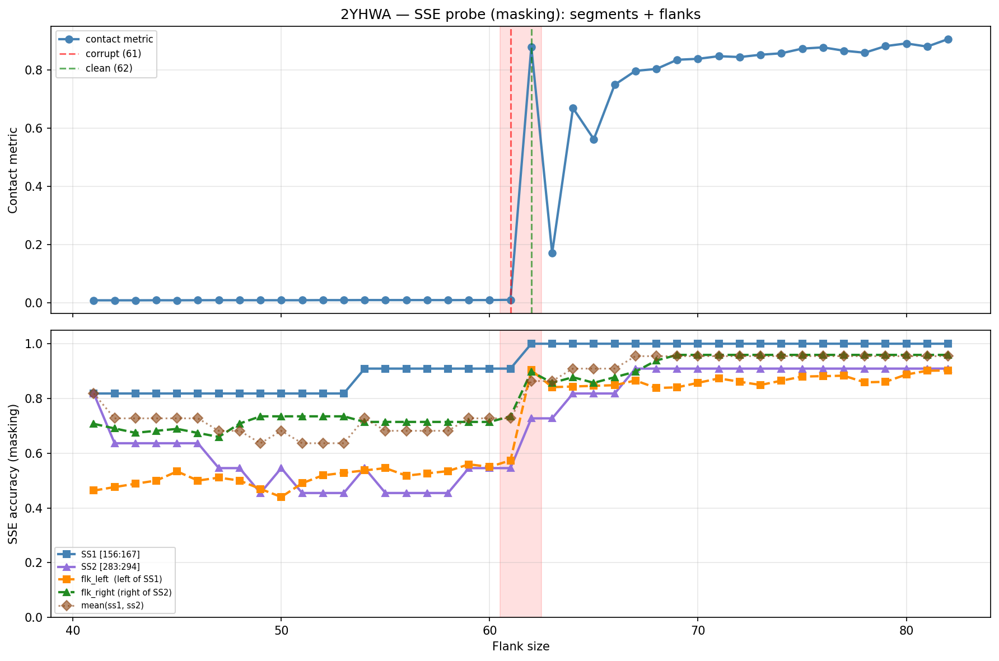

# SSE Probe Analysis: 2YHWA

Generated: 2026-03-03 15:57:59   Model: facebook/esm2_t33_650M_UR50D

## Configuration

| Parameter | Value |
|-----------|-------|
| Protein | 2YHWA |
| Contact pair | (161, 288) |
| ss1 | [156, 167) |
| ss2 | [283, 294) |
| Clean flank | 62 |
| Corrupt flank | 61 |
| Segment radius | 5 |
| Flank sweep | [41, 82] |
| Train sequences | 1,000 |
| Val sequences | 100 |
| Test sequences | 100 |

## SSE Probe Performance

| Split | Accuracy |
|-------|----------|
| Val   | 0.8240 |
| Test  | 0.8259 |

**Test classification report:**

```
              precision    recall  f1-score   support

           H       0.87      0.86      0.86     13101
           E       0.78      0.86      0.82     11471
           C       0.82      0.78      0.80     18602

    accuracy                           0.83     43174
   macro avg       0.83      0.83      0.83     43174
weighted avg       0.83      0.83      0.83     43174

```

## Ground-Truth SSE (full-sequence probe)

| Segment | Sequence |
|---------|----------|
| SS1 [156:167] | `CCCEEEEEECC` |
| SS2 [283:294] | `CCCEEEECCHH` |

## Flank Sweep Results

| flank | contact | mk_ss1 | mk_ss2 | mk_mean | mk_flkL | mk_flkR | mk_flk |
|-------|---------|--------|--------|---------|---------|---------|--------|
| 41 | 0.0088 | 0.818 | 0.818 | 0.818 | 0.463 | 0.707 | 0.585 |
| 42 | 0.0088 | 0.818 | 0.636 | 0.727 | 0.476 | 0.690 | 0.583 |
| 43 | 0.0088 | 0.818 | 0.636 | 0.727 | 0.488 | 0.674 | 0.581 |
| 44 | 0.0089 | 0.818 | 0.636 | 0.727 | 0.500 | 0.682 | 0.591 |
| 45 | 0.0088 | 0.818 | 0.636 | 0.727 | 0.533 | 0.689 | 0.611 |
| 46 | 0.0091 | 0.818 | 0.636 | 0.727 | 0.500 | 0.674 | 0.587 |
| 47 | 0.0092 | 0.818 | 0.545 | 0.682 | 0.511 | 0.660 | 0.585 |
| 48 | 0.0091 | 0.818 | 0.545 | 0.682 | 0.500 | 0.708 | 0.604 |
| 49 | 0.0090 | 0.818 | 0.455 | 0.636 | 0.469 | 0.735 | 0.602 |
| 50 | 0.0091 | 0.818 | 0.545 | 0.682 | 0.440 | 0.735 | 0.587 |
| 51 | 0.0091 | 0.818 | 0.455 | 0.636 | 0.490 | 0.735 | 0.612 |
| 52 | 0.0095 | 0.818 | 0.455 | 0.636 | 0.519 | 0.735 | 0.627 |
| 53 | 0.0094 | 0.818 | 0.455 | 0.636 | 0.528 | 0.735 | 0.631 |
| 54 | 0.0096 | 0.909 | 0.545 | 0.727 | 0.537 | 0.714 | 0.626 |
| 55 | 0.0096 | 0.909 | 0.455 | 0.682 | 0.545 | 0.714 | 0.630 |
| 56 | 0.0096 | 0.909 | 0.455 | 0.682 | 0.518 | 0.714 | 0.616 |
| 57 | 0.0096 | 0.909 | 0.455 | 0.682 | 0.526 | 0.714 | 0.620 |
| 58 | 0.0095 | 0.909 | 0.455 | 0.682 | 0.534 | 0.714 | 0.624 |
| 59 | 0.0096 | 0.909 | 0.545 | 0.727 | 0.559 | 0.714 | 0.637 |
| 60 | 0.0096 | 0.909 | 0.545 | 0.727 | 0.550 | 0.714 | 0.632 |
| 61 | 0.0104 | 0.909 | 0.545 | 0.727 | 0.574 | 0.735 | 0.654 |
| 62 | 0.8796 | 1.000 | 0.727 | 0.864 | 0.903 | 0.898 | 0.901 |
| 63 | 0.1706 | 1.000 | 0.727 | 0.864 | 0.841 | 0.857 | 0.849 |
| 64 | 0.6689 | 1.000 | 0.818 | 0.909 | 0.844 | 0.878 | 0.861 |
| 65 | 0.5623 | 1.000 | 0.818 | 0.909 | 0.846 | 0.857 | 0.852 |
| 66 | 0.7493 | 1.000 | 0.818 | 0.909 | 0.848 | 0.878 | 0.863 |
| 67 | 0.7971 | 1.000 | 0.909 | 0.955 | 0.866 | 0.898 | 0.882 |
| 68 | 0.8035 | 1.000 | 0.909 | 0.955 | 0.838 | 0.939 | 0.889 |
| 69 | 0.8352 | 1.000 | 0.909 | 0.955 | 0.841 | 0.959 | 0.900 |
| 70 | 0.8384 | 1.000 | 0.909 | 0.955 | 0.857 | 0.959 | 0.908 |
| 71 | 0.8475 | 1.000 | 0.909 | 0.955 | 0.873 | 0.959 | 0.916 |
| 72 | 0.8445 | 1.000 | 0.909 | 0.955 | 0.861 | 0.959 | 0.910 |
| 73 | 0.8524 | 1.000 | 0.909 | 0.955 | 0.849 | 0.959 | 0.904 |
| 74 | 0.8574 | 1.000 | 0.909 | 0.955 | 0.865 | 0.959 | 0.912 |
| 75 | 0.8735 | 1.000 | 0.909 | 0.955 | 0.880 | 0.959 | 0.920 |
| 76 | 0.8778 | 1.000 | 0.909 | 0.955 | 0.882 | 0.959 | 0.920 |
| 77 | 0.8663 | 1.000 | 0.909 | 0.955 | 0.883 | 0.959 | 0.921 |
| 78 | 0.8594 | 1.000 | 0.909 | 0.955 | 0.859 | 0.959 | 0.909 |
| 79 | 0.8821 | 1.000 | 0.909 | 0.955 | 0.861 | 0.959 | 0.910 |
| 80 | 0.8913 | 1.000 | 0.909 | 0.955 | 0.887 | 0.959 | 0.923 |
| 81 | 0.8804 | 1.000 | 0.909 | 0.955 | 0.901 | 0.959 | 0.930 |
| 82 | 0.9062 | 1.000 | 0.909 | 0.955 | 0.902 | 0.959 | 0.931 |

## Residue-Level Prediction Changes (clean=62, focus ±2)

### Flank 59 → 60

| Seg | Direction | Pos | gt | prev | now |
|-----|-----------|-----|----|------|-----|
| flk_L | corr→incorr | 127 | H | H | C |

### Flank 60 → 61

| Seg | Direction | Pos | gt | prev | now |
|-----|-----------|-----|----|------|-----|
| flk_L | incorr→corr | 100 | E | C | E |
| flk_L | corr→incorr | 109 | E | E | C |
| flk_L | corr→incorr | 112 | C | C | H |
| flk_L | incorr→corr | 113 | C | E | C |
| flk_L | incorr→corr | 127 | H | C | H |
| flk_L | incorr→corr | 147 | H | C | H |
| flk_R | incorr→corr | 323 | C | H | C |

### Flank 61 → 62

| Seg | Direction | Pos | gt | prev | now |
|-----|-----------|-----|----|------|-----|
| SS1 | incorr→corr | 164 | E | C | E |
| SS2 | corr→incorr | 285 | C | C | E |
| SS2 | incorr→corr | 286 | E | H | E |
| SS2 | incorr→corr | 287 | E | H | E |
| SS2 | incorr→corr | 289 | E | H | E |
| SS2 | incorr→corr | 291 | C | H | C |
| SS2 | corr→incorr | 292 | H | H | C |
| flk_L | corr→incorr | 99 | C | C | E |
| flk_L | incorr→corr | 109 | E | C | E |
| flk_L | incorr→corr | 112 | C | H | C |
| flk_L | incorr→corr | 114 | C | H | C |
| flk_L | incorr→corr | 122 | H | C | H |
| flk_L | incorr→corr | 123 | H | C | H |
| flk_L | incorr→corr | 124 | H | C | H |
| flk_L | incorr→corr | 125 | H | C | H |
| flk_L | incorr→corr | 126 | H | C | H |
| flk_L | incorr→corr | 128 | H | C | H |
| flk_L | incorr→corr | 129 | H | C | H |
| flk_L | incorr→corr | 131 | C | E | C |
| flk_L | incorr→corr | 134 | E | C | E |
| flk_L | incorr→corr | 137 | E | C | E |
| flk_L | incorr→corr | 140 | H | C | H |
| flk_L | incorr→corr | 141 | H | C | H |
| flk_L | incorr→corr | 142 | H | E | H |
| flk_L | incorr→corr | 143 | H | E | H |
| flk_L | incorr→corr | 144 | H | E | H |
| flk_L | incorr→corr | 149 | H | C | H |
| flk_L | incorr→corr | 150 | H | C | H |
| flk_L | incorr→corr | 151 | H | C | H |
| flk_R | corr→incorr | 297 | H | H | C |
| flk_R | corr→incorr | 312 | H | H | C |
| flk_R | corr→incorr | 313 | H | H | C |
| flk_R | incorr→corr | 314 | C | H | C |
| flk_R | incorr→corr | 315 | C | H | C |
| flk_R | incorr→corr | 316 | C | H | C |
| flk_R | incorr→corr | 317 | E | H | E |
| flk_R | incorr→corr | 318 | E | H | E |
| flk_R | incorr→corr | 319 | E | H | E |
| flk_R | incorr→corr | 320 | E | H | E |
| flk_R | incorr→corr | 321 | C | H | C |
| flk_R | incorr→corr | 337 | H | C | H |
| flk_R | incorr→corr | 338 | H | C | H |
| flk_R | incorr→corr | 340 | H | C | H |

### Flank 62 → 63

| Seg | Direction | Pos | gt | prev | now |
|-----|-----------|-----|----|------|-----|
| SS2 | incorr→corr | 285 | C | E | C |
| SS2 | corr→incorr | 291 | C | C | H |
| flk_L | corr→incorr | 96 | C | C | E |
| flk_L | incorr→corr | 117 | H | C | H |
| flk_L | corr→incorr | 121 | C | C | E |
| flk_L | corr→incorr | 122 | H | H | C |
| flk_L | corr→incorr | 139 | C | C | H |
| flk_L | corr→incorr | 151 | H | H | C |
| flk_R | incorr→corr | 297 | H | C | H |
| flk_R | corr→incorr | 308 | H | H | C |
| flk_R | incorr→corr | 309 | C | H | C |
| flk_R | incorr→corr | 310 | C | H | C |
| flk_R | corr→incorr | 311 | H | H | C |
| flk_R | corr→incorr | 317 | E | E | C |
| flk_R | corr→incorr | 321 | C | C | E |
| flk_R | corr→incorr | 340 | H | H | C |

### Flank 63 → 64

| Seg | Direction | Pos | gt | prev | now |
|-----|-----------|-----|----|------|-----|
| SS2 | incorr→corr | 291 | C | H | C |
| flk_L | incorr→corr | 95 | E | C | E |
| flk_L | incorr→corr | 99 | C | E | C |
| flk_L | corr→incorr | 109 | E | E | C |
| flk_L | corr→incorr | 137 | E | E | C |
| flk_R | corr→incorr | 294 | H | H | C |
| flk_R | incorr→corr | 308 | H | C | H |
| flk_R | incorr→corr | 317 | E | C | E |

## Plot


