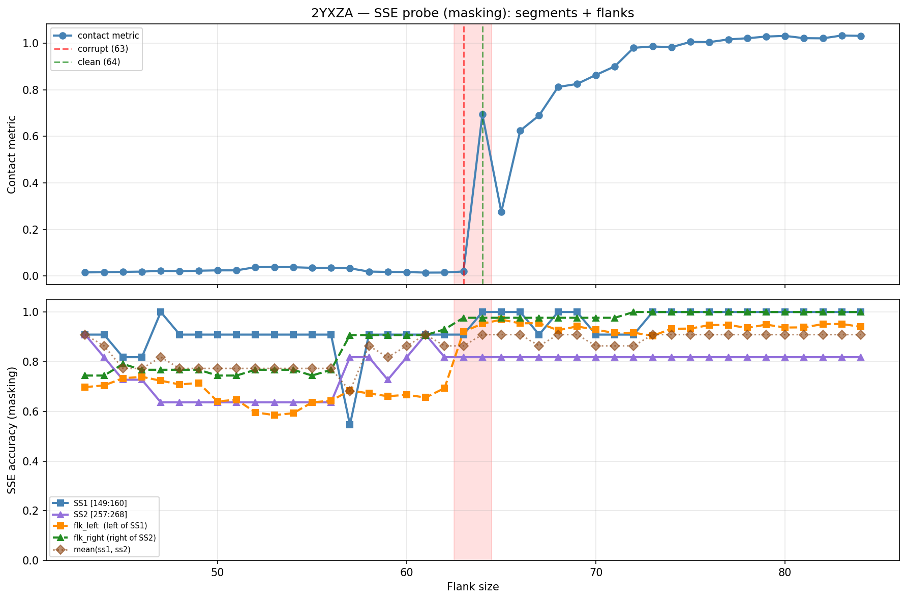

# SSE Probe Analysis: 2YXZA

Generated: 2026-03-03 15:58:06   Model: facebook/esm2_t33_650M_UR50D

## Configuration

| Parameter | Value |
|-----------|-------|
| Protein | 2YXZA |
| Contact pair | (154, 262) |
| ss1 | [149, 160) |
| ss2 | [257, 268) |
| Clean flank | 64 |
| Corrupt flank | 63 |
| Segment radius | 5 |
| Flank sweep | [43, 84] |
| Train sequences | 1,000 |
| Val sequences | 100 |
| Test sequences | 100 |

## SSE Probe Performance

| Split | Accuracy |
|-------|----------|
| Val   | 0.8240 |
| Test  | 0.8259 |

**Test classification report:**

```
              precision    recall  f1-score   support

           H       0.87      0.86      0.86     13101
           E       0.78      0.86      0.82     11471
           C       0.82      0.78      0.80     18602

    accuracy                           0.83     43174
   macro avg       0.83      0.83      0.83     43174
weighted avg       0.83      0.83      0.83     43174

```

## Ground-Truth SSE (full-sequence probe)

| Segment | Sequence |
|---------|----------|
| SS1 [149:160] | `CCCEEEEECCC` |
| SS2 [257:268] | `CCEEEEEECHC` |

## Flank Sweep Results

| flank | contact | mk_ss1 | mk_ss2 | mk_mean | mk_flkL | mk_flkR | mk_flk |
|-------|---------|--------|--------|---------|---------|---------|--------|
| 43 | 0.0151 | 0.909 | 0.909 | 0.909 | 0.698 | 0.744 | 0.721 |
| 44 | 0.0159 | 0.909 | 0.818 | 0.864 | 0.705 | 0.744 | 0.724 |
| 45 | 0.0176 | 0.818 | 0.727 | 0.773 | 0.733 | 0.791 | 0.762 |
| 46 | 0.0186 | 0.818 | 0.727 | 0.773 | 0.739 | 0.767 | 0.753 |
| 47 | 0.0219 | 1.000 | 0.636 | 0.818 | 0.723 | 0.767 | 0.745 |
| 48 | 0.0206 | 0.909 | 0.636 | 0.773 | 0.708 | 0.767 | 0.738 |
| 49 | 0.0225 | 0.909 | 0.636 | 0.773 | 0.714 | 0.767 | 0.741 |
| 50 | 0.0240 | 0.909 | 0.636 | 0.773 | 0.640 | 0.744 | 0.692 |
| 51 | 0.0239 | 0.909 | 0.636 | 0.773 | 0.647 | 0.744 | 0.696 |
| 52 | 0.0376 | 0.909 | 0.636 | 0.773 | 0.596 | 0.767 | 0.682 |
| 53 | 0.0382 | 0.909 | 0.636 | 0.773 | 0.585 | 0.767 | 0.676 |
| 54 | 0.0374 | 0.909 | 0.636 | 0.773 | 0.593 | 0.767 | 0.680 |
| 55 | 0.0348 | 0.909 | 0.636 | 0.773 | 0.636 | 0.744 | 0.690 |
| 56 | 0.0350 | 0.909 | 0.636 | 0.773 | 0.643 | 0.767 | 0.705 |
| 57 | 0.0328 | 0.545 | 0.818 | 0.682 | 0.684 | 0.907 | 0.796 |
| 58 | 0.0187 | 0.909 | 0.818 | 0.864 | 0.672 | 0.907 | 0.790 |
| 59 | 0.0174 | 0.909 | 0.727 | 0.818 | 0.661 | 0.907 | 0.784 |
| 60 | 0.0166 | 0.909 | 0.818 | 0.864 | 0.667 | 0.907 | 0.787 |
| 61 | 0.0143 | 0.909 | 0.909 | 0.909 | 0.656 | 0.907 | 0.781 |
| 62 | 0.0146 | 0.909 | 0.818 | 0.864 | 0.694 | 0.930 | 0.812 |
| 63 | 0.0192 | 0.909 | 0.818 | 0.864 | 0.921 | 0.977 | 0.949 |
| 64 | 0.6947 | 1.000 | 0.818 | 0.909 | 0.953 | 0.977 | 0.965 |
| 65 | 0.2750 | 1.000 | 0.818 | 0.909 | 0.969 | 0.977 | 0.973 |
| 66 | 0.6247 | 1.000 | 0.818 | 0.909 | 0.955 | 0.977 | 0.966 |
| 67 | 0.6900 | 0.909 | 0.818 | 0.864 | 0.955 | 0.977 | 0.966 |
| 68 | 0.8122 | 1.000 | 0.818 | 0.909 | 0.926 | 0.977 | 0.952 |
| 69 | 0.8251 | 1.000 | 0.818 | 0.909 | 0.942 | 0.977 | 0.959 |
| 70 | 0.8638 | 0.909 | 0.818 | 0.864 | 0.929 | 0.977 | 0.953 |
| 71 | 0.9009 | 0.909 | 0.818 | 0.864 | 0.915 | 0.977 | 0.946 |
| 72 | 0.9806 | 0.909 | 0.818 | 0.864 | 0.917 | 1.000 | 0.958 |
| 73 | 0.9864 | 1.000 | 0.818 | 0.909 | 0.904 | 1.000 | 0.952 |
| 74 | 0.9832 | 1.000 | 0.818 | 0.909 | 0.932 | 1.000 | 0.966 |
| 75 | 1.0061 | 1.000 | 0.818 | 0.909 | 0.933 | 1.000 | 0.967 |
| 76 | 1.0049 | 1.000 | 0.818 | 0.909 | 0.947 | 1.000 | 0.974 |
| 77 | 1.0166 | 1.000 | 0.818 | 0.909 | 0.948 | 1.000 | 0.974 |
| 78 | 1.0217 | 1.000 | 0.818 | 0.909 | 0.936 | 1.000 | 0.968 |
| 79 | 1.0289 | 1.000 | 0.818 | 0.909 | 0.949 | 1.000 | 0.975 |
| 80 | 1.0318 | 1.000 | 0.818 | 0.909 | 0.938 | 1.000 | 0.969 |
| 81 | 1.0220 | 1.000 | 0.818 | 0.909 | 0.938 | 1.000 | 0.969 |
| 82 | 1.0213 | 1.000 | 0.818 | 0.909 | 0.951 | 1.000 | 0.976 |
| 83 | 1.0336 | 1.000 | 0.818 | 0.909 | 0.952 | 1.000 | 0.976 |
| 84 | 1.0320 | 1.000 | 0.818 | 0.909 | 0.940 | 1.000 | 0.970 |

## Residue-Level Prediction Changes (clean=64, focus ±2)

### Flank 61 → 62

| Seg | Direction | Pos | gt | prev | now |
|-----|-----------|-----|----|------|-----|
| SS2 | corr→incorr | 266 | H | H | C |
| flk_L | incorr→corr | 97 | H | C | H |
| flk_L | incorr→corr | 120 | E | C | E |
| flk_R | incorr→corr | 300 | C | E | C |

### Flank 62 → 63

| Seg | Direction | Pos | gt | prev | now |
|-----|-----------|-----|----|------|-----|
| SS2 | corr→incorr | 258 | C | C | E |
| SS2 | incorr→corr | 266 | H | C | H |
| flk_L | incorr→corr | 91 | E | C | E |
| flk_L | incorr→corr | 114 | H | C | H |
| flk_L | incorr→corr | 121 | E | C | E |
| flk_L | incorr→corr | 122 | E | C | E |
| flk_L | incorr→corr | 124 | C | H | C |
| flk_L | incorr→corr | 125 | C | H | C |
| flk_L | incorr→corr | 126 | C | H | C |
| flk_L | incorr→corr | 127 | C | H | C |
| flk_L | incorr→corr | 128 | E | H | E |
| flk_L | incorr→corr | 129 | E | H | E |
| flk_L | incorr→corr | 130 | E | H | E |
| flk_L | incorr→corr | 131 | E | H | E |
| flk_L | incorr→corr | 132 | E | H | E |
| flk_L | incorr→corr | 133 | E | H | E |
| flk_R | incorr→corr | 291 | C | E | C |
| flk_R | incorr→corr | 294 | E | C | E |
| flk_R | incorr→corr | 298 | C | E | C |
| flk_R | corr→incorr | 300 | C | C | E |

### Flank 63 → 64

| Seg | Direction | Pos | gt | prev | now |
|-----|-----------|-----|----|------|-----|
| SS1 | incorr→corr | 156 | E | C | E |
| flk_L | corr→incorr | 123 | C | C | E |
| flk_L | corr→incorr | 128 | E | E | C |
| flk_L | incorr→corr | 134 | E | C | E |
| flk_L | incorr→corr | 135 | E | C | E |
| flk_L | incorr→corr | 136 | E | C | E |
| flk_L | incorr→corr | 137 | E | C | E |

### Flank 64 → 65

| Seg | Direction | Pos | gt | prev | now |
|-----|-----------|-----|----|------|-----|
| flk_L | incorr→corr | 128 | E | C | E |

### Flank 65 → 66

| Seg | Direction | Pos | gt | prev | now |
|-----|-----------|-----|----|------|-----|
| flk_L | corr→incorr | 128 | E | E | C |

## Plot


