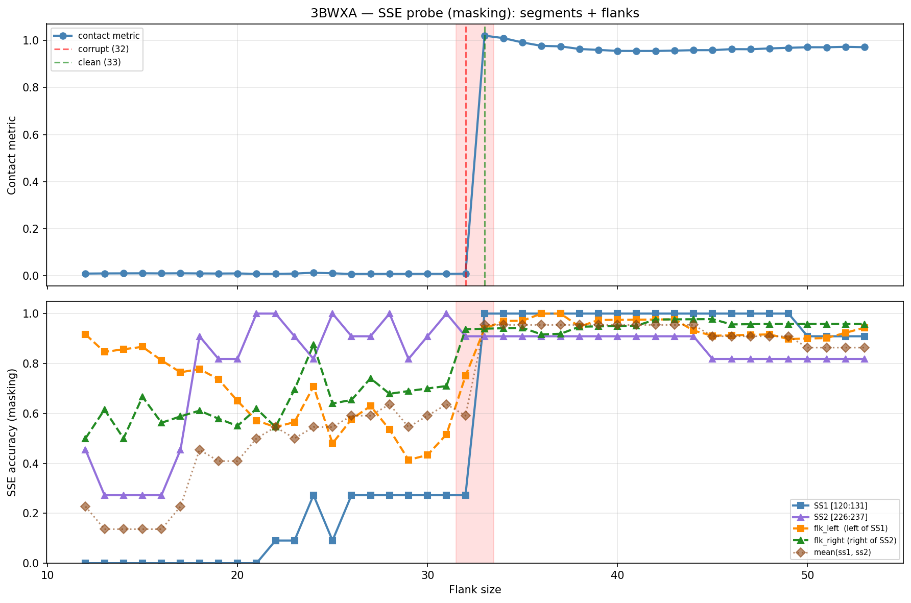

# SSE Probe Analysis: 3BWXA

Generated: 2026-03-03 15:58:12   Model: facebook/esm2_t33_650M_UR50D

## Configuration

| Parameter | Value |
|-----------|-------|
| Protein | 3BWXA |
| Contact pair | (125, 231) |
| ss1 | [120, 131) |
| ss2 | [226, 237) |
| Clean flank | 33 |
| Corrupt flank | 32 |
| Segment radius | 5 |
| Flank sweep | [12, 53] |
| Train sequences | 1,000 |
| Val sequences | 100 |
| Test sequences | 100 |

## SSE Probe Performance

| Split | Accuracy |
|-------|----------|
| Val   | 0.8240 |
| Test  | 0.8259 |

**Test classification report:**

```
              precision    recall  f1-score   support

           H       0.87      0.86      0.86     13101
           E       0.78      0.86      0.82     11471
           C       0.82      0.78      0.80     18602

    accuracy                           0.83     43174
   macro avg       0.83      0.83      0.83     43174
weighted avg       0.83      0.83      0.83     43174

```

## Ground-Truth SSE (full-sequence probe)

| Segment | Sequence |
|---------|----------|
| SS1 [120:131] | `CEEEEEEECCC` |
| SS2 [226:237] | `CCCEEEECCCC` |

## Flank Sweep Results

| flank | contact | mk_ss1 | mk_ss2 | mk_mean | mk_flkL | mk_flkR | mk_flk |
|-------|---------|--------|--------|---------|---------|---------|--------|
| 12 | 0.0097 | 0.000 | 0.455 | 0.227 | 0.917 | 0.500 | 0.708 |
| 13 | 0.0104 | 0.000 | 0.273 | 0.136 | 0.846 | 0.615 | 0.731 |
| 14 | 0.0106 | 0.000 | 0.273 | 0.136 | 0.857 | 0.500 | 0.679 |
| 15 | 0.0108 | 0.000 | 0.273 | 0.136 | 0.867 | 0.667 | 0.767 |
| 16 | 0.0104 | 0.000 | 0.273 | 0.136 | 0.812 | 0.562 | 0.688 |
| 17 | 0.0108 | 0.000 | 0.455 | 0.227 | 0.765 | 0.588 | 0.676 |
| 18 | 0.0103 | 0.000 | 0.909 | 0.455 | 0.778 | 0.611 | 0.694 |
| 19 | 0.0099 | 0.000 | 0.818 | 0.409 | 0.737 | 0.579 | 0.658 |
| 20 | 0.0103 | 0.000 | 0.818 | 0.409 | 0.650 | 0.550 | 0.600 |
| 21 | 0.0086 | 0.000 | 1.000 | 0.500 | 0.571 | 0.619 | 0.595 |
| 22 | 0.0087 | 0.091 | 1.000 | 0.545 | 0.545 | 0.545 | 0.545 |
| 23 | 0.0097 | 0.091 | 0.909 | 0.500 | 0.565 | 0.696 | 0.630 |
| 24 | 0.0134 | 0.273 | 0.818 | 0.545 | 0.708 | 0.875 | 0.792 |
| 25 | 0.0108 | 0.091 | 1.000 | 0.545 | 0.480 | 0.640 | 0.560 |
| 26 | 0.0081 | 0.273 | 0.909 | 0.591 | 0.577 | 0.654 | 0.615 |
| 27 | 0.0083 | 0.273 | 0.909 | 0.591 | 0.630 | 0.741 | 0.685 |
| 28 | 0.0085 | 0.273 | 1.000 | 0.636 | 0.536 | 0.679 | 0.607 |
| 29 | 0.0084 | 0.273 | 0.818 | 0.545 | 0.414 | 0.690 | 0.552 |
| 30 | 0.0087 | 0.273 | 0.909 | 0.591 | 0.433 | 0.700 | 0.567 |
| 31 | 0.0087 | 0.273 | 1.000 | 0.636 | 0.516 | 0.710 | 0.613 |
| 32 | 0.0095 | 0.273 | 0.909 | 0.591 | 0.750 | 0.938 | 0.844 |
| 33 | 1.0200 | 1.000 | 0.909 | 0.955 | 0.939 | 0.939 | 0.939 |
| 34 | 1.0095 | 1.000 | 0.909 | 0.955 | 0.971 | 0.941 | 0.956 |
| 35 | 0.9910 | 1.000 | 0.909 | 0.955 | 0.971 | 0.943 | 0.957 |
| 36 | 0.9767 | 1.000 | 0.909 | 0.955 | 1.000 | 0.917 | 0.958 |
| 37 | 0.9745 | 1.000 | 0.909 | 0.955 | 1.000 | 0.919 | 0.959 |
| 38 | 0.9634 | 1.000 | 0.909 | 0.955 | 0.947 | 0.947 | 0.947 |
| 39 | 0.9595 | 1.000 | 0.909 | 0.955 | 0.974 | 0.949 | 0.962 |
| 40 | 0.9552 | 1.000 | 0.909 | 0.955 | 0.975 | 0.950 | 0.962 |
| 41 | 0.9550 | 1.000 | 0.909 | 0.955 | 0.976 | 0.951 | 0.963 |
| 42 | 0.9550 | 1.000 | 0.909 | 0.955 | 0.976 | 0.976 | 0.976 |
| 43 | 0.9565 | 1.000 | 0.909 | 0.955 | 0.977 | 0.977 | 0.977 |
| 44 | 0.9583 | 1.000 | 0.909 | 0.955 | 0.932 | 0.977 | 0.955 |
| 45 | 0.9585 | 1.000 | 0.818 | 0.909 | 0.911 | 0.978 | 0.944 |
| 46 | 0.9627 | 1.000 | 0.818 | 0.909 | 0.913 | 0.957 | 0.935 |
| 47 | 0.9623 | 1.000 | 0.818 | 0.909 | 0.915 | 0.957 | 0.936 |
| 48 | 0.9658 | 1.000 | 0.818 | 0.909 | 0.917 | 0.958 | 0.938 |
| 49 | 0.9684 | 1.000 | 0.818 | 0.909 | 0.898 | 0.958 | 0.928 |
| 50 | 0.9709 | 0.909 | 0.818 | 0.864 | 0.900 | 0.958 | 0.929 |
| 51 | 0.9707 | 0.909 | 0.818 | 0.864 | 0.902 | 0.958 | 0.930 |
| 52 | 0.9726 | 0.909 | 0.818 | 0.864 | 0.923 | 0.958 | 0.941 |
| 53 | 0.9709 | 0.909 | 0.818 | 0.864 | 0.943 | 0.958 | 0.951 |

## Residue-Level Prediction Changes (clean=33, focus ±2)

### Flank 30 → 31

| Seg | Direction | Pos | gt | prev | now |
|-----|-----------|-----|----|------|-----|
| SS2 | incorr→corr | 229 | E | C | E |
| flk_L | incorr→corr | 91 | H | C | H |
| flk_L | incorr→corr | 105 | H | C | H |

### Flank 31 → 32

| Seg | Direction | Pos | gt | prev | now |
|-----|-----------|-----|----|------|-----|
| SS2 | corr→incorr | 233 | C | C | E |
| flk_L | corr→incorr | 92 | H | H | C |
| flk_L | incorr→corr | 93 | C | H | C |
| flk_L | incorr→corr | 94 | C | H | C |
| flk_L | incorr→corr | 95 | C | H | C |
| flk_L | incorr→corr | 96 | C | H | C |
| flk_L | incorr→corr | 97 | E | H | E |
| flk_L | incorr→corr | 98 | E | H | E |
| flk_L | incorr→corr | 99 | E | H | E |
| flk_L | incorr→corr | 100 | E | C | E |
| flk_L | incorr→corr | 101 | E | H | E |
| flk_L | incorr→corr | 104 | C | H | C |
| flk_L | corr→incorr | 105 | H | H | C |
| flk_L | corr→incorr | 113 | H | H | C |
| flk_R | incorr→corr | 240 | C | H | C |
| flk_R | incorr→corr | 241 | C | H | C |
| flk_R | incorr→corr | 249 | H | C | H |
| flk_R | incorr→corr | 255 | E | C | E |
| flk_R | incorr→corr | 257 | E | C | E |
| flk_R | incorr→corr | 258 | E | C | E |
| flk_R | incorr→corr | 259 | E | C | E |

### Flank 32 → 33

| Seg | Direction | Pos | gt | prev | now |
|-----|-----------|-----|----|------|-----|
| SS1 | incorr→corr | 120 | C | H | C |
| SS1 | incorr→corr | 121 | E | H | E |
| SS1 | incorr→corr | 122 | E | H | E |
| SS1 | incorr→corr | 123 | E | H | E |
| SS1 | incorr→corr | 124 | E | H | E |
| SS1 | incorr→corr | 125 | E | H | E |
| SS1 | incorr→corr | 126 | E | H | E |
| SS1 | incorr→corr | 127 | E | C | E |
| flk_L | incorr→corr | 92 | H | C | H |
| flk_L | corr→incorr | 93 | C | C | H |
| flk_L | incorr→corr | 102 | E | C | E |
| flk_L | incorr→corr | 105 | H | C | H |
| flk_L | incorr→corr | 113 | H | C | H |
| flk_L | incorr→corr | 114 | H | C | H |
| flk_L | incorr→corr | 115 | H | C | H |
| flk_L | incorr→corr | 116 | H | C | H |
| flk_L | corr→incorr | 118 | H | H | C |
| flk_L | incorr→corr | 119 | C | H | C |
| flk_R | incorr→corr | 239 | C | H | C |
| flk_R | corr→incorr | 268 | H | H | C |

### Flank 33 → 34

| Seg | Direction | Pos | gt | prev | now |
|-----|-----------|-----|----|------|-----|
| flk_L | incorr→corr | 93 | C | H | C |
| flk_R | corr→incorr | 241 | C | C | H |
| flk_R | incorr→corr | 268 | H | C | H |

### Flank 34 → 35

| Seg | Direction | Pos | gt | prev | now |
|-----|-----------|-----|----|------|-----|
| flk_L | corr→incorr | 103 | C | C | E |
| flk_L | incorr→corr | 118 | H | C | H |
| flk_R | incorr→corr | 241 | C | H | C |

## Plot


