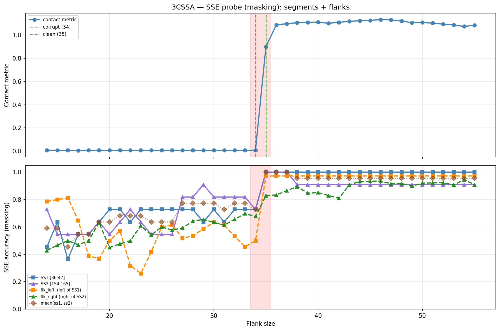

# SSE Probe Analysis: 3CSSA

Generated: 2026-03-03 15:58:18   Model: facebook/esm2_t33_650M_UR50D

## Configuration

| Parameter | Value |
|-----------|-------|
| Protein | 3CSSA |
| Contact pair | (41, 159) |
| ss1 | [36, 47) |
| ss2 | [154, 165) |
| Clean flank | 35 |
| Corrupt flank | 34 |
| Segment radius | 5 |
| Flank sweep | [14, 55] |
| Train sequences | 1,000 |
| Val sequences | 100 |
| Test sequences | 100 |

## SSE Probe Performance

| Split | Accuracy |
|-------|----------|
| Val   | 0.8240 |
| Test  | 0.8259 |

**Test classification report:**

```
              precision    recall  f1-score   support

           H       0.87      0.86      0.86     13101
           E       0.78      0.86      0.82     11471
           C       0.82      0.78      0.80     18602

    accuracy                           0.83     43174
   macro avg       0.83      0.83      0.83     43174
weighted avg       0.83      0.83      0.83     43174

```

## Ground-Truth SSE (full-sequence probe)

| Segment | Sequence |
|---------|----------|
| SS1 [36:47] | `CCEEEEECCCC` |
| SS2 [154:165] | `CCCEEEEEECC` |

## Flank Sweep Results

| flank | contact | mk_ss1 | mk_ss2 | mk_mean | mk_flkL | mk_flkR | mk_flk |
|-------|---------|--------|--------|---------|---------|---------|--------|
| 14 | 0.0080 | 0.455 | 0.727 | 0.591 | 0.786 | 0.429 | 0.607 |
| 15 | 0.0081 | 0.636 | 0.545 | 0.591 | 0.800 | 0.467 | 0.633 |
| 16 | 0.0067 | 0.364 | 0.545 | 0.455 | 0.812 | 0.500 | 0.656 |
| 17 | 0.0065 | 0.545 | 0.545 | 0.545 | 0.647 | 0.471 | 0.559 |
| 18 | 0.0072 | 0.545 | 0.545 | 0.545 | 0.389 | 0.500 | 0.444 |
| 19 | 0.0082 | 0.636 | 0.636 | 0.636 | 0.368 | 0.632 | 0.500 |
| 20 | 0.0071 | 0.727 | 0.545 | 0.636 | 0.500 | 0.450 | 0.475 |
| 21 | 0.0082 | 0.727 | 0.636 | 0.682 | 0.571 | 0.476 | 0.524 |
| 22 | 0.0074 | 0.636 | 0.727 | 0.682 | 0.318 | 0.500 | 0.409 |
| 23 | 0.0074 | 0.727 | 0.636 | 0.682 | 0.261 | 0.609 | 0.435 |
| 24 | 0.0076 | 0.727 | 0.545 | 0.636 | 0.417 | 0.542 | 0.479 |
| 25 | 0.0077 | 0.727 | 0.545 | 0.636 | 0.600 | 0.600 | 0.600 |
| 26 | 0.0078 | 0.727 | 0.545 | 0.636 | 0.615 | 0.577 | 0.596 |
| 27 | 0.0077 | 0.727 | 0.818 | 0.773 | 0.519 | 0.593 | 0.556 |
| 28 | 0.0074 | 0.727 | 0.818 | 0.773 | 0.536 | 0.643 | 0.589 |
| 29 | 0.0074 | 0.636 | 0.909 | 0.773 | 0.586 | 0.655 | 0.621 |
| 30 | 0.0075 | 0.727 | 0.818 | 0.773 | 0.633 | 0.633 | 0.633 |
| 31 | 0.0074 | 0.636 | 0.818 | 0.727 | 0.613 | 0.613 | 0.613 |
| 32 | 0.0076 | 0.727 | 0.818 | 0.773 | 0.531 | 0.656 | 0.594 |
| 33 | 0.0076 | 0.727 | 0.818 | 0.773 | 0.455 | 0.697 | 0.576 |
| 34 | 0.0082 | 0.727 | 0.727 | 0.727 | 0.500 | 0.676 | 0.588 |
| 35 | 0.9002 | 1.000 | 1.000 | 1.000 | 0.971 | 0.829 | 0.900 |
| 36 | 1.0887 | 1.000 | 1.000 | 1.000 | 0.972 | 0.833 | 0.903 |
| 37 | 1.0988 | 1.000 | 1.000 | 1.000 | 0.972 | 0.865 | 0.919 |
| 38 | 1.1073 | 1.000 | 0.909 | 0.955 | 0.972 | 0.895 | 0.933 |
| 39 | 1.1103 | 1.000 | 0.909 | 0.955 | 0.972 | 0.846 | 0.909 |
| 40 | 1.1126 | 1.000 | 0.909 | 0.955 | 0.972 | 0.850 | 0.911 |
| 41 | 1.1023 | 1.000 | 0.909 | 0.955 | 0.972 | 0.829 | 0.901 |
| 42 | 1.1106 | 1.000 | 0.909 | 0.955 | 0.972 | 0.810 | 0.891 |
| 43 | 1.1188 | 1.000 | 0.909 | 0.955 | 0.972 | 0.907 | 0.940 |
| 44 | 1.1245 | 1.000 | 0.909 | 0.955 | 0.972 | 0.932 | 0.952 |
| 45 | 1.1277 | 1.000 | 0.909 | 0.955 | 0.972 | 0.933 | 0.953 |
| 46 | 1.1342 | 1.000 | 0.909 | 0.955 | 0.972 | 0.935 | 0.954 |
| 47 | 1.1320 | 1.000 | 0.909 | 0.955 | 0.972 | 0.915 | 0.944 |
| 48 | 1.1206 | 1.000 | 0.909 | 0.955 | 0.972 | 0.917 | 0.944 |
| 49 | 1.1080 | 1.000 | 0.909 | 0.955 | 0.972 | 0.898 | 0.935 |
| 50 | 1.1087 | 1.000 | 0.909 | 0.955 | 0.972 | 0.920 | 0.946 |
| 51 | 1.1038 | 1.000 | 0.909 | 0.955 | 0.972 | 0.922 | 0.947 |
| 52 | 1.0945 | 1.000 | 0.909 | 0.955 | 0.972 | 0.923 | 0.948 |
| 53 | 1.0885 | 1.000 | 0.909 | 0.955 | 0.972 | 0.906 | 0.939 |
| 54 | 1.0747 | 1.000 | 0.909 | 0.955 | 0.972 | 0.944 | 0.958 |
| 55 | 1.0857 | 1.000 | 0.909 | 0.955 | 0.972 | 0.909 | 0.941 |

## Residue-Level Prediction Changes (clean=35, focus ±2)

### Flank 32 → 33

| Seg | Direction | Pos | gt | prev | now |
|-----|-----------|-----|----|------|-----|
| flk_L | corr→incorr | 21 | H | H | C |
| flk_L | corr→incorr | 22 | H | H | C |
| flk_L | corr→incorr | 27 | H | H | C |
| flk_R | incorr→corr | 171 | C | E | C |

### Flank 33 → 34

| Seg | Direction | Pos | gt | prev | now |
|-----|-----------|-----|----|------|-----|
| SS2 | corr→incorr | 162 | E | E | C |
| flk_L | incorr→corr | 18 | H | C | H |
| flk_R | corr→incorr | 171 | C | C | E |

### Flank 34 → 35

| Seg | Direction | Pos | gt | prev | now |
|-----|-----------|-----|----|------|-----|
| SS1 | incorr→corr | 38 | E | C | E |
| SS1 | incorr→corr | 39 | E | C | E |
| SS1 | incorr→corr | 41 | E | C | E |
| SS2 | incorr→corr | 156 | C | E | C |
| SS2 | incorr→corr | 161 | E | C | E |
| SS2 | incorr→corr | 162 | E | C | E |
| flk_L | incorr→corr | 6 | E | C | E |
| flk_L | incorr→corr | 7 | E | C | E |
| flk_L | incorr→corr | 8 | E | C | E |
| flk_L | incorr→corr | 9 | E | C | E |
| flk_L | incorr→corr | 10 | E | C | E |
| flk_L | incorr→corr | 13 | H | C | H |
| flk_L | incorr→corr | 14 | H | C | H |
| flk_L | incorr→corr | 15 | H | C | H |
| flk_L | incorr→corr | 16 | H | C | H |
| flk_L | incorr→corr | 17 | H | C | H |
| flk_L | incorr→corr | 20 | H | C | H |
| flk_L | incorr→corr | 21 | H | C | H |
| flk_L | incorr→corr | 22 | H | C | H |
| flk_L | incorr→corr | 27 | H | C | H |
| flk_L | incorr→corr | 30 | H | C | H |
| flk_L | incorr→corr | 31 | H | C | H |
| flk_R | incorr→corr | 168 | E | C | E |
| flk_R | incorr→corr | 171 | C | E | C |
| flk_R | incorr→corr | 183 | C | E | C |
| flk_R | incorr→corr | 187 | E | C | E |
| flk_R | incorr→corr | 188 | E | C | E |

### Flank 35 → 36

| Seg | Direction | Pos | gt | prev | now |
|-----|-----------|-----|----|------|-----|
| flk_R | incorr→corr | 170 | C | E | C |
| flk_R | incorr→corr | 176 | H | C | H |
| flk_R | incorr→corr | 177 | H | C | H |
| flk_R | incorr→corr | 178 | H | C | H |
| flk_R | corr→incorr | 184 | E | E | C |
| flk_R | corr→incorr | 196 | C | C | H |
| flk_R | corr→incorr | 199 | E | E | C |

### Flank 36 → 37

| Seg | Direction | Pos | gt | prev | now |
|-----|-----------|-----|----|------|-----|
| flk_R | incorr→corr | 169 | H | C | H |
| flk_R | incorr→corr | 196 | C | H | C |

## Plot


