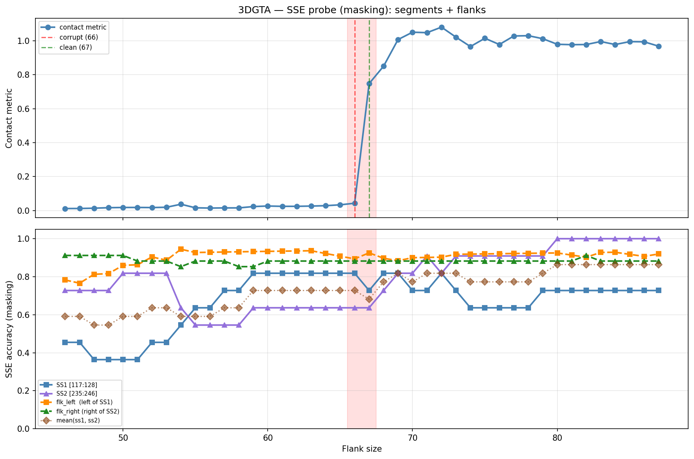

# SSE Probe Analysis: 3DGTA

Generated: 2026-03-03 15:58:24   Model: facebook/esm2_t33_650M_UR50D

## Configuration

| Parameter | Value |
|-----------|-------|
| Protein | 3DGTA |
| Contact pair | (122, 240) |
| ss1 | [117, 128) |
| ss2 | [235, 246) |
| Clean flank | 67 |
| Corrupt flank | 66 |
| Segment radius | 5 |
| Flank sweep | [46, 87] |
| Train sequences | 1,000 |
| Val sequences | 100 |
| Test sequences | 100 |

## SSE Probe Performance

| Split | Accuracy |
|-------|----------|
| Val   | 0.8240 |
| Test  | 0.8259 |

**Test classification report:**

```
              precision    recall  f1-score   support

           H       0.87      0.86      0.86     13101
           E       0.78      0.86      0.82     11471
           C       0.82      0.78      0.80     18602

    accuracy                           0.83     43174
   macro avg       0.83      0.83      0.83     43174
weighted avg       0.83      0.83      0.83     43174

```

## Ground-Truth SSE (full-sequence probe)

| Segment | Sequence |
|---------|----------|
| SS1 [117:128] | `EEEEEEEEEEH` |
| SS2 [235:246] | `CEEEEEEEEEC` |

## Flank Sweep Results

| flank | contact | mk_ss1 | mk_ss2 | mk_mean | mk_flkL | mk_flkR | mk_flk |
|-------|---------|--------|--------|---------|---------|---------|--------|
| 46 | 0.0114 | 0.455 | 0.727 | 0.591 | 0.783 | 0.912 | 0.847 |
| 47 | 0.0117 | 0.455 | 0.727 | 0.591 | 0.766 | 0.912 | 0.839 |
| 48 | 0.0135 | 0.364 | 0.727 | 0.545 | 0.812 | 0.912 | 0.862 |
| 49 | 0.0164 | 0.364 | 0.727 | 0.545 | 0.816 | 0.912 | 0.864 |
| 50 | 0.0177 | 0.364 | 0.818 | 0.591 | 0.860 | 0.912 | 0.886 |
| 51 | 0.0178 | 0.364 | 0.818 | 0.591 | 0.863 | 0.882 | 0.873 |
| 52 | 0.0172 | 0.455 | 0.818 | 0.636 | 0.904 | 0.882 | 0.893 |
| 53 | 0.0189 | 0.455 | 0.818 | 0.636 | 0.887 | 0.882 | 0.885 |
| 54 | 0.0368 | 0.545 | 0.636 | 0.591 | 0.944 | 0.853 | 0.899 |
| 55 | 0.0158 | 0.636 | 0.545 | 0.591 | 0.927 | 0.882 | 0.905 |
| 56 | 0.0141 | 0.636 | 0.545 | 0.591 | 0.929 | 0.882 | 0.905 |
| 57 | 0.0152 | 0.727 | 0.545 | 0.636 | 0.930 | 0.882 | 0.906 |
| 58 | 0.0152 | 0.727 | 0.545 | 0.636 | 0.931 | 0.853 | 0.892 |
| 59 | 0.0230 | 0.818 | 0.636 | 0.727 | 0.932 | 0.853 | 0.893 |
| 60 | 0.0262 | 0.818 | 0.636 | 0.727 | 0.933 | 0.882 | 0.908 |
| 61 | 0.0244 | 0.818 | 0.636 | 0.727 | 0.934 | 0.882 | 0.908 |
| 62 | 0.0244 | 0.818 | 0.636 | 0.727 | 0.935 | 0.882 | 0.909 |
| 63 | 0.0260 | 0.818 | 0.636 | 0.727 | 0.937 | 0.882 | 0.909 |
| 64 | 0.0283 | 0.818 | 0.636 | 0.727 | 0.922 | 0.882 | 0.902 |
| 65 | 0.0333 | 0.818 | 0.636 | 0.727 | 0.908 | 0.882 | 0.895 |
| 66 | 0.0428 | 0.818 | 0.636 | 0.727 | 0.894 | 0.882 | 0.888 |
| 67 | 0.7477 | 0.727 | 0.636 | 0.682 | 0.925 | 0.882 | 0.904 |
| 68 | 0.8504 | 0.818 | 0.727 | 0.773 | 0.897 | 0.882 | 0.890 |
| 69 | 1.0075 | 0.818 | 0.818 | 0.818 | 0.884 | 0.882 | 0.883 |
| 70 | 1.0507 | 0.727 | 0.818 | 0.773 | 0.900 | 0.882 | 0.891 |
| 71 | 1.0480 | 0.727 | 0.909 | 0.818 | 0.901 | 0.882 | 0.892 |
| 72 | 1.0806 | 0.818 | 0.818 | 0.818 | 0.903 | 0.882 | 0.893 |
| 73 | 1.0216 | 0.727 | 0.909 | 0.818 | 0.918 | 0.882 | 0.900 |
| 74 | 0.9661 | 0.636 | 0.909 | 0.773 | 0.919 | 0.882 | 0.901 |
| 75 | 1.0150 | 0.636 | 0.909 | 0.773 | 0.920 | 0.882 | 0.901 |
| 76 | 0.9782 | 0.636 | 0.909 | 0.773 | 0.921 | 0.882 | 0.902 |
| 77 | 1.0286 | 0.636 | 0.909 | 0.773 | 0.922 | 0.882 | 0.902 |
| 78 | 1.0301 | 0.636 | 0.909 | 0.773 | 0.923 | 0.882 | 0.903 |
| 79 | 1.0125 | 0.727 | 0.909 | 0.818 | 0.924 | 0.882 | 0.903 |
| 80 | 0.9795 | 0.727 | 1.000 | 0.864 | 0.925 | 0.882 | 0.904 |
| 81 | 0.9772 | 0.727 | 1.000 | 0.864 | 0.914 | 0.882 | 0.898 |
| 82 | 0.9781 | 0.727 | 1.000 | 0.864 | 0.902 | 0.912 | 0.907 |
| 83 | 0.9957 | 0.727 | 1.000 | 0.864 | 0.928 | 0.882 | 0.905 |
| 84 | 0.9782 | 0.727 | 1.000 | 0.864 | 0.929 | 0.882 | 0.905 |
| 85 | 0.9951 | 0.727 | 1.000 | 0.864 | 0.918 | 0.882 | 0.900 |
| 86 | 0.9942 | 0.727 | 1.000 | 0.864 | 0.907 | 0.882 | 0.895 |
| 87 | 0.9684 | 0.727 | 1.000 | 0.864 | 0.920 | 0.882 | 0.901 |

## Residue-Level Prediction Changes (clean=67, focus ±2)

### Flank 64 → 65

_(no prediction changes)_

### Flank 65 → 66

_(no prediction changes)_

### Flank 66 → 67

| Seg | Direction | Pos | gt | prev | now |
|-----|-----------|-----|----|------|-----|
| SS1 | corr→incorr | 121 | E | E | C |
| SS2 | incorr→corr | 241 | E | C | E |
| SS2 | corr→incorr | 242 | E | E | C |
| flk_L | incorr→corr | 52 | C | E | C |
| flk_L | incorr→corr | 114 | H | C | H |

### Flank 67 → 68

| Seg | Direction | Pos | gt | prev | now |
|-----|-----------|-----|----|------|-----|
| SS1 | incorr→corr | 121 | E | C | E |
| SS2 | incorr→corr | 242 | E | C | E |
| flk_L | corr→incorr | 50 | C | C | E |
| flk_L | incorr→corr | 51 | E | C | E |
| flk_L | corr→incorr | 110 | C | C | E |
| flk_L | corr→incorr | 114 | H | H | C |

### Flank 68 → 69

| Seg | Direction | Pos | gt | prev | now |
|-----|-----------|-----|----|------|-----|
| SS2 | incorr→corr | 243 | E | C | E |

## Plot


