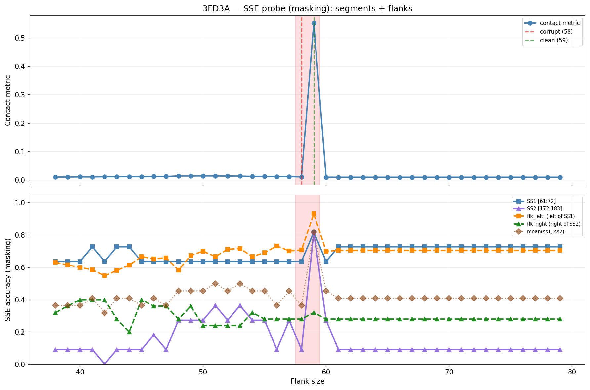

# SSE Probe Analysis: 3FD3A

Generated: 2026-03-03 15:58:29   Model: facebook/esm2_t33_650M_UR50D

## Configuration

| Parameter | Value |
|-----------|-------|
| Protein | 3FD3A |
| Contact pair | (66, 177) |
| ss1 | [61, 72) |
| ss2 | [172, 183) |
| Clean flank | 59 |
| Corrupt flank | 58 |
| Segment radius | 5 |
| Flank sweep | [38, 79] |
| Train sequences | 1,000 |
| Val sequences | 100 |
| Test sequences | 100 |

## SSE Probe Performance

| Split | Accuracy |
|-------|----------|
| Val   | 0.8240 |
| Test  | 0.8259 |

**Test classification report:**

```
              precision    recall  f1-score   support

           H       0.87      0.86      0.86     13101
           E       0.78      0.86      0.82     11471
           C       0.82      0.78      0.80     18602

    accuracy                           0.83     43174
   macro avg       0.83      0.83      0.83     43174
weighted avg       0.83      0.83      0.83     43174

```

## Ground-Truth SSE (full-sequence probe)

| Segment | Sequence |
|---------|----------|
| SS1 [61:72] | `CCCEEEEEEEE` |
| SS2 [172:183] | `EEEEEEEEECC` |

## Flank Sweep Results

| flank | contact | mk_ss1 | mk_ss2 | mk_mean | mk_flkL | mk_flkR | mk_flk |
|-------|---------|--------|--------|---------|---------|---------|--------|
| 38 | 0.0110 | 0.636 | 0.091 | 0.364 | 0.632 | 0.320 | 0.476 |
| 39 | 0.0109 | 0.636 | 0.091 | 0.364 | 0.615 | 0.360 | 0.488 |
| 40 | 0.0114 | 0.636 | 0.091 | 0.364 | 0.600 | 0.400 | 0.500 |
| 41 | 0.0112 | 0.727 | 0.091 | 0.409 | 0.585 | 0.400 | 0.493 |
| 42 | 0.0121 | 0.636 | 0.000 | 0.318 | 0.548 | 0.400 | 0.474 |
| 43 | 0.0119 | 0.727 | 0.091 | 0.409 | 0.581 | 0.280 | 0.431 |
| 44 | 0.0125 | 0.727 | 0.091 | 0.409 | 0.614 | 0.200 | 0.407 |
| 45 | 0.0119 | 0.636 | 0.091 | 0.364 | 0.667 | 0.400 | 0.533 |
| 46 | 0.0127 | 0.636 | 0.182 | 0.409 | 0.652 | 0.360 | 0.506 |
| 47 | 0.0127 | 0.636 | 0.091 | 0.364 | 0.660 | 0.360 | 0.510 |
| 48 | 0.0146 | 0.636 | 0.273 | 0.455 | 0.583 | 0.280 | 0.432 |
| 49 | 0.0146 | 0.636 | 0.273 | 0.455 | 0.673 | 0.360 | 0.517 |
| 50 | 0.0148 | 0.636 | 0.273 | 0.455 | 0.700 | 0.240 | 0.470 |
| 51 | 0.0147 | 0.636 | 0.364 | 0.500 | 0.667 | 0.240 | 0.453 |
| 52 | 0.0143 | 0.636 | 0.273 | 0.455 | 0.712 | 0.240 | 0.476 |
| 53 | 0.0140 | 0.636 | 0.364 | 0.500 | 0.717 | 0.240 | 0.478 |
| 54 | 0.0130 | 0.636 | 0.273 | 0.455 | 0.667 | 0.320 | 0.493 |
| 55 | 0.0130 | 0.636 | 0.273 | 0.455 | 0.691 | 0.280 | 0.485 |
| 56 | 0.0124 | 0.636 | 0.091 | 0.364 | 0.732 | 0.280 | 0.506 |
| 57 | 0.0125 | 0.636 | 0.273 | 0.455 | 0.702 | 0.280 | 0.491 |
| 58 | 0.0112 | 0.636 | 0.091 | 0.364 | 0.707 | 0.280 | 0.493 |
| 59 | 0.5526 | 0.818 | 0.818 | 0.818 | 0.932 | 0.320 | 0.626 |
| 60 | 0.0102 | 0.636 | 0.273 | 0.455 | 0.700 | 0.280 | 0.490 |
| 61 | 0.0102 | 0.727 | 0.091 | 0.409 | 0.705 | 0.280 | 0.492 |
| 62 | 0.0102 | 0.727 | 0.091 | 0.409 | 0.705 | 0.280 | 0.492 |
| 63 | 0.0102 | 0.727 | 0.091 | 0.409 | 0.705 | 0.280 | 0.492 |
| 64 | 0.0102 | 0.727 | 0.091 | 0.409 | 0.705 | 0.280 | 0.492 |
| 65 | 0.0102 | 0.727 | 0.091 | 0.409 | 0.705 | 0.280 | 0.492 |
| 66 | 0.0102 | 0.727 | 0.091 | 0.409 | 0.705 | 0.280 | 0.492 |
| 67 | 0.0102 | 0.727 | 0.091 | 0.409 | 0.705 | 0.280 | 0.492 |
| 68 | 0.0102 | 0.727 | 0.091 | 0.409 | 0.705 | 0.280 | 0.492 |
| 69 | 0.0102 | 0.727 | 0.091 | 0.409 | 0.705 | 0.280 | 0.492 |
| 70 | 0.0102 | 0.727 | 0.091 | 0.409 | 0.705 | 0.280 | 0.492 |
| 71 | 0.0102 | 0.727 | 0.091 | 0.409 | 0.705 | 0.280 | 0.492 |
| 72 | 0.0102 | 0.727 | 0.091 | 0.409 | 0.705 | 0.280 | 0.492 |
| 73 | 0.0102 | 0.727 | 0.091 | 0.409 | 0.705 | 0.280 | 0.492 |
| 74 | 0.0102 | 0.727 | 0.091 | 0.409 | 0.705 | 0.280 | 0.492 |
| 75 | 0.0102 | 0.727 | 0.091 | 0.409 | 0.705 | 0.280 | 0.492 |
| 76 | 0.0102 | 0.727 | 0.091 | 0.409 | 0.705 | 0.280 | 0.492 |
| 77 | 0.0102 | 0.727 | 0.091 | 0.409 | 0.705 | 0.280 | 0.492 |
| 78 | 0.0102 | 0.727 | 0.091 | 0.409 | 0.705 | 0.280 | 0.492 |
| 79 | 0.0102 | 0.727 | 0.091 | 0.409 | 0.705 | 0.280 | 0.492 |

## Residue-Level Prediction Changes (clean=59, focus ±2)

### Flank 56 → 57

| Seg | Direction | Pos | gt | prev | now |
|-----|-----------|-----|----|------|-----|
| SS2 | incorr→corr | 177 | E | C | E |
| SS2 | incorr→corr | 178 | E | H | E |
| flk_L | corr→incorr | 5 | E | E | C |
| flk_L | corr→incorr | 6 | E | E | C |

### Flank 57 → 58

| Seg | Direction | Pos | gt | prev | now |
|-----|-----------|-----|----|------|-----|
| SS2 | corr→incorr | 177 | E | E | C |
| SS2 | corr→incorr | 178 | E | E | H |
| flk_L | incorr→corr | 5 | E | C | E |
| flk_L | corr→incorr | 13 | H | H | C |

### Flank 58 → 59

| Seg | Direction | Pos | gt | prev | now |
|-----|-----------|-----|----|------|-----|
| SS1 | incorr→corr | 62 | C | E | C |
| SS1 | incorr→corr | 63 | C | E | C |
| SS1 | corr→incorr | 64 | E | E | C |
| SS1 | incorr→corr | 68 | E | C | E |
| SS2 | incorr→corr | 172 | E | C | E |
| SS2 | incorr→corr | 175 | E | C | E |
| SS2 | incorr→corr | 176 | E | C | E |
| SS2 | incorr→corr | 177 | E | C | E |
| SS2 | incorr→corr | 178 | E | H | E |
| SS2 | incorr→corr | 180 | E | H | E |
| SS2 | incorr→corr | 181 | C | H | C |
| SS2 | incorr→corr | 182 | C | H | C |
| flk_L | incorr→corr | 6 | E | C | E |
| flk_L | corr→incorr | 11 | H | H | C |
| flk_L | incorr→corr | 12 | H | C | H |
| flk_L | incorr→corr | 13 | H | C | H |
| flk_L | incorr→corr | 23 | H | C | H |
| flk_L | incorr→corr | 24 | H | C | H |
| flk_L | incorr→corr | 36 | C | E | C |
| flk_L | incorr→corr | 40 | H | E | H |
| flk_L | incorr→corr | 41 | H | E | H |
| flk_L | incorr→corr | 42 | H | E | H |
| flk_L | incorr→corr | 43 | H | E | H |
| flk_L | incorr→corr | 44 | H | E | H |
| flk_L | incorr→corr | 45 | H | E | H |
| flk_L | incorr→corr | 46 | H | E | H |
| flk_L | incorr→corr | 49 | C | E | C |
| flk_L | incorr→corr | 50 | C | E | C |
| flk_L | corr→incorr | 51 | E | E | C |
| flk_R | incorr→corr | 183 | C | H | C |
| flk_R | corr→incorr | 189 | H | H | C |
| flk_R | incorr→corr | 195 | H | C | H |

### Flank 59 → 60

| Seg | Direction | Pos | gt | prev | now |
|-----|-----------|-----|----|------|-----|
| SS1 | corr→incorr | 62 | C | C | E |
| SS1 | corr→incorr | 63 | C | C | E |
| SS1 | incorr→corr | 64 | E | C | E |
| SS1 | corr→incorr | 68 | E | E | C |
| SS2 | corr→incorr | 172 | E | E | C |
| SS2 | corr→incorr | 175 | E | E | C |
| SS2 | corr→incorr | 176 | E | E | C |
| SS2 | corr→incorr | 180 | E | E | H |
| SS2 | corr→incorr | 181 | C | C | H |
| SS2 | corr→incorr | 182 | C | C | H |
| flk_L | incorr→corr | 11 | H | C | H |
| flk_L | corr→incorr | 12 | H | H | C |
| flk_L | corr→incorr | 16 | H | H | E |
| flk_L | corr→incorr | 23 | H | H | C |
| flk_L | corr→incorr | 24 | H | H | C |
| flk_L | corr→incorr | 36 | C | C | E |
| flk_L | corr→incorr | 40 | H | H | E |
| flk_L | corr→incorr | 41 | H | H | E |
| flk_L | corr→incorr | 42 | H | H | E |
| flk_L | corr→incorr | 43 | H | H | E |
| flk_L | corr→incorr | 44 | H | H | E |
| flk_L | corr→incorr | 45 | H | H | E |
| flk_L | corr→incorr | 46 | H | H | E |
| flk_L | corr→incorr | 49 | C | C | E |
| flk_L | corr→incorr | 50 | C | C | E |
| flk_L | incorr→corr | 51 | E | C | E |
| flk_L | corr→incorr | 56 | C | C | E |
| flk_R | corr→incorr | 183 | C | C | H |
| flk_R | incorr→corr | 189 | H | C | H |
| flk_R | corr→incorr | 195 | H | H | C |

### Flank 60 → 61

| Seg | Direction | Pos | gt | prev | now |
|-----|-----------|-----|----|------|-----|
| SS1 | incorr→corr | 68 | E | C | E |
| SS2 | corr→incorr | 177 | E | E | C |
| SS2 | corr→incorr | 178 | E | E | H |

## Plot


