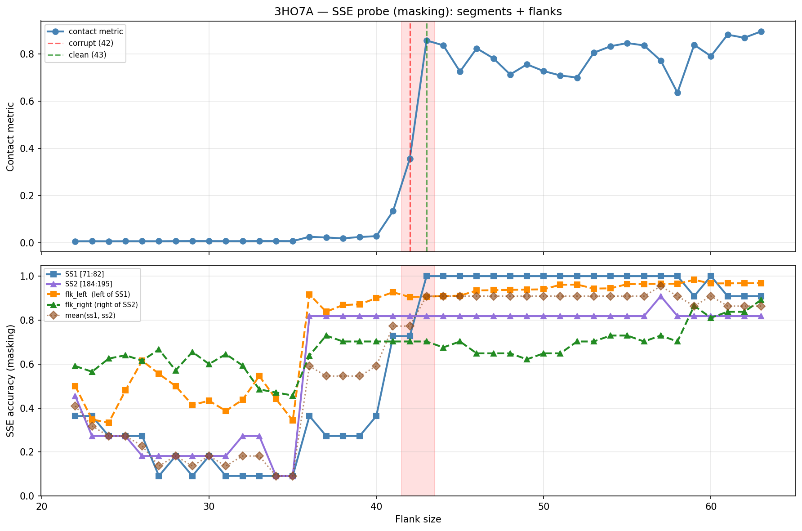

# SSE Probe Analysis: 3HO7A

Generated: 2026-03-03 15:58:33   Model: facebook/esm2_t33_650M_UR50D

## Configuration

| Parameter | Value |
|-----------|-------|
| Protein | 3HO7A |
| Contact pair | (76, 189) |
| ss1 | [71, 82) |
| ss2 | [184, 195) |
| Clean flank | 43 |
| Corrupt flank | 42 |
| Segment radius | 5 |
| Flank sweep | [22, 63] |
| Train sequences | 1,000 |
| Val sequences | 100 |
| Test sequences | 100 |

## SSE Probe Performance

| Split | Accuracy |
|-------|----------|
| Val   | 0.8240 |
| Test  | 0.8259 |

**Test classification report:**

```
              precision    recall  f1-score   support

           H       0.87      0.86      0.86     13101
           E       0.78      0.86      0.82     11471
           C       0.82      0.78      0.80     18602

    accuracy                           0.83     43174
   macro avg       0.83      0.83      0.83     43174
weighted avg       0.83      0.83      0.83     43174

```

## Ground-Truth SSE (full-sequence probe)

| Segment | Sequence |
|---------|----------|
| SS1 [71:82] | `CCCCEEEEEEE` |
| SS2 [184:195] | `CEEEEEEEECC` |

## Flank Sweep Results

| flank | contact | mk_ss1 | mk_ss2 | mk_mean | mk_flkL | mk_flkR | mk_flk |
|-------|---------|--------|--------|---------|---------|---------|--------|
| 22 | 0.0062 | 0.364 | 0.455 | 0.409 | 0.500 | 0.591 | 0.545 |
| 23 | 0.0063 | 0.364 | 0.273 | 0.318 | 0.348 | 0.565 | 0.457 |
| 24 | 0.0061 | 0.273 | 0.273 | 0.273 | 0.333 | 0.625 | 0.479 |
| 25 | 0.0063 | 0.273 | 0.273 | 0.273 | 0.480 | 0.640 | 0.560 |
| 26 | 0.0063 | 0.273 | 0.182 | 0.227 | 0.615 | 0.615 | 0.615 |
| 27 | 0.0062 | 0.091 | 0.182 | 0.136 | 0.556 | 0.667 | 0.611 |
| 28 | 0.0067 | 0.182 | 0.182 | 0.182 | 0.500 | 0.571 | 0.536 |
| 29 | 0.0069 | 0.091 | 0.182 | 0.136 | 0.414 | 0.655 | 0.534 |
| 30 | 0.0068 | 0.182 | 0.182 | 0.182 | 0.433 | 0.600 | 0.517 |
| 31 | 0.0066 | 0.091 | 0.182 | 0.136 | 0.387 | 0.645 | 0.516 |
| 32 | 0.0066 | 0.091 | 0.273 | 0.182 | 0.438 | 0.594 | 0.516 |
| 33 | 0.0069 | 0.091 | 0.273 | 0.182 | 0.545 | 0.485 | 0.515 |
| 34 | 0.0068 | 0.091 | 0.091 | 0.091 | 0.441 | 0.471 | 0.456 |
| 35 | 0.0067 | 0.091 | 0.091 | 0.091 | 0.343 | 0.457 | 0.400 |
| 36 | 0.0252 | 0.364 | 0.818 | 0.591 | 0.917 | 0.639 | 0.778 |
| 37 | 0.0219 | 0.273 | 0.818 | 0.545 | 0.838 | 0.730 | 0.784 |
| 38 | 0.0186 | 0.273 | 0.818 | 0.545 | 0.868 | 0.703 | 0.786 |
| 39 | 0.0240 | 0.273 | 0.818 | 0.545 | 0.872 | 0.703 | 0.787 |
| 40 | 0.0277 | 0.364 | 0.818 | 0.591 | 0.900 | 0.703 | 0.801 |
| 41 | 0.1343 | 0.727 | 0.818 | 0.773 | 0.927 | 0.703 | 0.815 |
| 42 | 0.3557 | 0.727 | 0.818 | 0.773 | 0.905 | 0.703 | 0.804 |
| 43 | 0.8569 | 1.000 | 0.818 | 0.909 | 0.907 | 0.703 | 0.805 |
| 44 | 0.8363 | 1.000 | 0.818 | 0.909 | 0.909 | 0.676 | 0.792 |
| 45 | 0.7249 | 1.000 | 0.818 | 0.909 | 0.911 | 0.703 | 0.807 |
| 46 | 0.8234 | 1.000 | 0.818 | 0.909 | 0.935 | 0.649 | 0.792 |
| 47 | 0.7811 | 1.000 | 0.818 | 0.909 | 0.936 | 0.649 | 0.792 |
| 48 | 0.7127 | 1.000 | 0.818 | 0.909 | 0.938 | 0.649 | 0.793 |
| 49 | 0.7556 | 1.000 | 0.818 | 0.909 | 0.939 | 0.622 | 0.780 |
| 50 | 0.7271 | 1.000 | 0.818 | 0.909 | 0.940 | 0.649 | 0.794 |
| 51 | 0.7085 | 1.000 | 0.818 | 0.909 | 0.961 | 0.649 | 0.805 |
| 52 | 0.6996 | 1.000 | 0.818 | 0.909 | 0.962 | 0.703 | 0.832 |
| 53 | 0.8048 | 1.000 | 0.818 | 0.909 | 0.943 | 0.703 | 0.823 |
| 54 | 0.8323 | 1.000 | 0.818 | 0.909 | 0.944 | 0.730 | 0.837 |
| 55 | 0.8458 | 1.000 | 0.818 | 0.909 | 0.964 | 0.730 | 0.847 |
| 56 | 0.8359 | 1.000 | 0.818 | 0.909 | 0.964 | 0.703 | 0.833 |
| 57 | 0.7717 | 1.000 | 0.909 | 0.955 | 0.965 | 0.730 | 0.847 |
| 58 | 0.6354 | 1.000 | 0.818 | 0.909 | 0.966 | 0.703 | 0.834 |
| 59 | 0.8382 | 0.909 | 0.818 | 0.864 | 0.983 | 0.865 | 0.924 |
| 60 | 0.7906 | 1.000 | 0.818 | 0.909 | 0.967 | 0.811 | 0.889 |
| 61 | 0.8814 | 0.909 | 0.818 | 0.864 | 0.967 | 0.838 | 0.903 |
| 62 | 0.8682 | 0.909 | 0.818 | 0.864 | 0.968 | 0.838 | 0.903 |
| 63 | 0.8952 | 0.909 | 0.818 | 0.864 | 0.968 | 0.892 | 0.930 |

## Residue-Level Prediction Changes (clean=43, focus ±2)

### Flank 40 → 41

| Seg | Direction | Pos | gt | prev | now |
|-----|-----------|-----|----|------|-----|
| SS1 | incorr→corr | 71 | C | H | C |
| SS1 | incorr→corr | 78 | E | C | E |
| SS1 | incorr→corr | 79 | E | C | E |
| SS1 | incorr→corr | 81 | E | C | E |
| flk_L | incorr→corr | 32 | H | C | H |
| flk_L | corr→incorr | 66 | E | E | C |
| flk_L | incorr→corr | 69 | C | H | C |

### Flank 41 → 42

_(no prediction changes)_

### Flank 42 → 43

| Seg | Direction | Pos | gt | prev | now |
|-----|-----------|-----|----|------|-----|
| SS1 | incorr→corr | 75 | E | C | E |
| SS1 | incorr→corr | 76 | E | C | E |
| SS1 | incorr→corr | 77 | E | C | E |
| flk_L | incorr→corr | 29 | H | C | H |
| flk_R | incorr→corr | 211 | H | C | H |
| flk_R | incorr→corr | 214 | C | H | C |
| flk_R | corr→incorr | 225 | C | C | H |
| flk_R | corr→incorr | 226 | C | C | H |

### Flank 43 → 44

| Seg | Direction | Pos | gt | prev | now |
|-----|-----------|-----|----|------|-----|
| flk_L | incorr→corr | 28 | H | C | H |
| flk_R | corr→incorr | 214 | C | C | H |

### Flank 44 → 45

| Seg | Direction | Pos | gt | prev | now |
|-----|-----------|-----|----|------|-----|
| flk_R | incorr→corr | 226 | C | H | C |

## Plot


