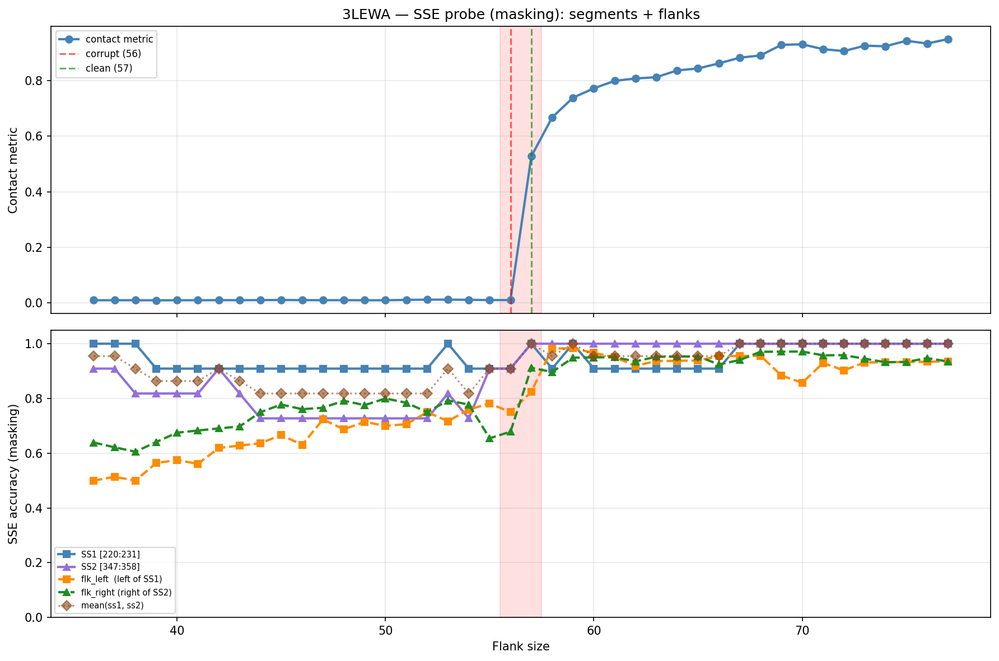

# SSE Probe Analysis: 3LEWA

Generated: 2026-03-03 15:58:43   Model: facebook/esm2_t33_650M_UR50D

## Configuration

| Parameter | Value |
|-----------|-------|
| Protein | 3LEWA |
| Contact pair | (225, 352) |
| ss1 | [220, 231) |
| ss2 | [347, 358) |
| Clean flank | 57 |
| Corrupt flank | 56 |
| Segment radius | 5 |
| Flank sweep | [36, 77] |
| Train sequences | 1,000 |
| Val sequences | 100 |
| Test sequences | 100 |

## SSE Probe Performance

| Split | Accuracy |
|-------|----------|
| Val   | 0.8240 |
| Test  | 0.8259 |

**Test classification report:**

```
              precision    recall  f1-score   support

           H       0.87      0.86      0.86     13101
           E       0.78      0.86      0.82     11471
           C       0.82      0.78      0.80     18602

    accuracy                           0.83     43174
   macro avg       0.83      0.83      0.83     43174
weighted avg       0.83      0.83      0.83     43174

```

## Ground-Truth SSE (full-sequence probe)

| Segment | Sequence |
|---------|----------|
| SS1 [220:231] | `HHHHHHHHHHC` |
| SS2 [347:358] | `HHHHHHHHHHH` |

## Flank Sweep Results

| flank | contact | mk_ss1 | mk_ss2 | mk_mean | mk_flkL | mk_flkR | mk_flk |
|-------|---------|--------|--------|---------|---------|---------|--------|
| 36 | 0.0092 | 1.000 | 0.909 | 0.955 | 0.500 | 0.639 | 0.569 |
| 37 | 0.0093 | 1.000 | 0.909 | 0.955 | 0.514 | 0.622 | 0.568 |
| 38 | 0.0093 | 1.000 | 0.818 | 0.909 | 0.500 | 0.605 | 0.553 |
| 39 | 0.0090 | 0.909 | 0.818 | 0.864 | 0.564 | 0.641 | 0.603 |
| 40 | 0.0093 | 0.909 | 0.818 | 0.864 | 0.575 | 0.675 | 0.625 |
| 41 | 0.0093 | 0.909 | 0.818 | 0.864 | 0.561 | 0.683 | 0.622 |
| 42 | 0.0096 | 0.909 | 0.909 | 0.909 | 0.619 | 0.690 | 0.655 |
| 43 | 0.0094 | 0.909 | 0.818 | 0.864 | 0.628 | 0.698 | 0.663 |
| 44 | 0.0098 | 0.909 | 0.727 | 0.818 | 0.636 | 0.750 | 0.693 |
| 45 | 0.0101 | 0.909 | 0.727 | 0.818 | 0.667 | 0.778 | 0.722 |
| 46 | 0.0097 | 0.909 | 0.727 | 0.818 | 0.630 | 0.761 | 0.696 |
| 47 | 0.0094 | 0.909 | 0.727 | 0.818 | 0.723 | 0.766 | 0.745 |
| 48 | 0.0096 | 0.909 | 0.727 | 0.818 | 0.688 | 0.792 | 0.740 |
| 49 | 0.0092 | 0.909 | 0.727 | 0.818 | 0.714 | 0.776 | 0.745 |
| 50 | 0.0092 | 0.909 | 0.727 | 0.818 | 0.700 | 0.800 | 0.750 |
| 51 | 0.0105 | 0.909 | 0.727 | 0.818 | 0.706 | 0.784 | 0.745 |
| 52 | 0.0114 | 0.909 | 0.727 | 0.818 | 0.750 | 0.750 | 0.750 |
| 53 | 0.0114 | 1.000 | 0.818 | 0.909 | 0.717 | 0.792 | 0.755 |
| 54 | 0.0108 | 0.909 | 0.727 | 0.818 | 0.759 | 0.778 | 0.769 |
| 55 | 0.0099 | 0.909 | 0.909 | 0.909 | 0.782 | 0.655 | 0.718 |
| 56 | 0.0099 | 0.909 | 0.909 | 0.909 | 0.750 | 0.679 | 0.714 |
| 57 | 0.5274 | 1.000 | 1.000 | 1.000 | 0.825 | 0.912 | 0.868 |
| 58 | 0.6676 | 0.909 | 1.000 | 0.955 | 0.983 | 0.897 | 0.940 |
| 59 | 0.7385 | 1.000 | 1.000 | 1.000 | 0.983 | 0.949 | 0.966 |
| 60 | 0.7722 | 0.909 | 1.000 | 0.955 | 0.967 | 0.950 | 0.958 |
| 61 | 0.7992 | 0.909 | 1.000 | 0.955 | 0.951 | 0.951 | 0.951 |
| 62 | 0.8077 | 0.909 | 1.000 | 0.955 | 0.919 | 0.935 | 0.927 |
| 63 | 0.8123 | 0.909 | 1.000 | 0.955 | 0.937 | 0.952 | 0.944 |
| 64 | 0.8369 | 0.909 | 1.000 | 0.955 | 0.938 | 0.953 | 0.945 |
| 65 | 0.8438 | 0.909 | 1.000 | 0.955 | 0.938 | 0.954 | 0.946 |
| 66 | 0.8621 | 0.909 | 1.000 | 0.955 | 0.955 | 0.924 | 0.939 |
| 67 | 0.8826 | 1.000 | 1.000 | 1.000 | 0.955 | 0.940 | 0.948 |
| 68 | 0.8907 | 1.000 | 1.000 | 1.000 | 0.956 | 0.971 | 0.963 |
| 69 | 0.9287 | 1.000 | 1.000 | 1.000 | 0.884 | 0.971 | 0.928 |
| 70 | 0.9309 | 1.000 | 1.000 | 1.000 | 0.857 | 0.971 | 0.914 |
| 71 | 0.9133 | 1.000 | 1.000 | 1.000 | 0.930 | 0.958 | 0.944 |
| 72 | 0.9063 | 1.000 | 1.000 | 1.000 | 0.903 | 0.958 | 0.931 |
| 73 | 0.9258 | 1.000 | 1.000 | 1.000 | 0.932 | 0.945 | 0.938 |
| 74 | 0.9236 | 1.000 | 1.000 | 1.000 | 0.932 | 0.932 | 0.932 |
| 75 | 0.9435 | 1.000 | 1.000 | 1.000 | 0.933 | 0.933 | 0.933 |
| 76 | 0.9336 | 1.000 | 1.000 | 1.000 | 0.934 | 0.947 | 0.941 |
| 77 | 0.9496 | 1.000 | 1.000 | 1.000 | 0.935 | 0.935 | 0.935 |

## Residue-Level Prediction Changes (clean=57, focus ±2)

### Flank 54 → 55

| Seg | Direction | Pos | gt | prev | now |
|-----|-----------|-----|----|------|-----|
| SS2 | incorr→corr | 350 | H | C | H |
| SS2 | incorr→corr | 351 | H | C | H |
| flk_L | incorr→corr | 168 | C | H | C |
| flk_L | incorr→corr | 174 | H | C | H |
| flk_L | incorr→corr | 175 | H | C | H |
| flk_L | incorr→corr | 178 | H | C | H |
| flk_L | corr→incorr | 192 | C | C | H |
| flk_L | corr→incorr | 195 | C | C | H |
| flk_L | corr→incorr | 197 | C | C | H |
| flk_R | corr→incorr | 359 | C | C | H |
| flk_R | incorr→corr | 374 | H | C | H |
| flk_R | incorr→corr | 375 | H | C | H |
| flk_R | corr→incorr | 379 | C | C | H |
| flk_R | corr→incorr | 380 | C | C | H |
| flk_R | corr→incorr | 381 | C | C | H |
| flk_R | corr→incorr | 382 | C | C | H |
| flk_R | corr→incorr | 383 | C | C | H |
| flk_R | corr→incorr | 384 | C | C | H |
| flk_R | corr→incorr | 385 | C | C | H |
| flk_R | corr→incorr | 394 | H | H | C |
| flk_R | incorr→corr | 402 | C | H | C |

### Flank 55 → 56

| Seg | Direction | Pos | gt | prev | now |
|-----|-----------|-----|----|------|-----|
| flk_L | corr→incorr | 175 | H | H | C |
| flk_L | corr→incorr | 200 | C | C | H |
| flk_R | corr→incorr | 374 | H | H | C |
| flk_R | incorr→corr | 410 | H | C | H |
| flk_R | incorr→corr | 411 | H | C | H |
| flk_R | incorr→corr | 412 | H | C | H |

### Flank 56 → 57

| Seg | Direction | Pos | gt | prev | now |
|-----|-----------|-----|----|------|-----|
| SS1 | incorr→corr | 222 | H | C | H |
| SS2 | incorr→corr | 347 | H | C | H |
| flk_L | corr→incorr | 169 | H | H | C |
| flk_L | corr→incorr | 178 | H | H | C |
| flk_L | corr→incorr | 189 | C | C | H |
| flk_L | incorr→corr | 195 | C | H | C |
| flk_L | incorr→corr | 196 | C | H | C |
| flk_L | incorr→corr | 197 | C | H | C |
| flk_L | incorr→corr | 200 | C | H | C |
| flk_L | incorr→corr | 215 | C | H | C |
| flk_L | incorr→corr | 216 | C | H | C |
| flk_L | incorr→corr | 217 | C | H | C |
| flk_R | incorr→corr | 359 | C | H | C |
| flk_R | incorr→corr | 362 | C | H | C |
| flk_R | incorr→corr | 363 | C | H | C |
| flk_R | incorr→corr | 374 | H | C | H |
| flk_R | incorr→corr | 376 | C | H | C |
| flk_R | incorr→corr | 378 | C | H | C |
| flk_R | incorr→corr | 379 | C | H | C |
| flk_R | incorr→corr | 380 | C | H | C |
| flk_R | incorr→corr | 381 | C | H | C |
| flk_R | incorr→corr | 382 | C | H | C |
| flk_R | incorr→corr | 383 | C | H | C |
| flk_R | incorr→corr | 384 | C | H | C |
| flk_R | incorr→corr | 385 | C | H | C |
| flk_R | incorr→corr | 394 | H | C | H |
| flk_R | corr→incorr | 412 | H | H | C |

### Flank 57 → 58

| Seg | Direction | Pos | gt | prev | now |
|-----|-----------|-----|----|------|-----|
| SS1 | corr→incorr | 230 | C | C | H |
| flk_L | incorr→corr | 169 | H | C | H |
| flk_L | incorr→corr | 175 | H | C | H |
| flk_L | incorr→corr | 178 | H | C | H |
| flk_L | incorr→corr | 188 | C | H | C |
| flk_L | incorr→corr | 189 | C | H | C |
| flk_L | incorr→corr | 190 | C | H | C |
| flk_L | incorr→corr | 191 | C | H | C |
| flk_L | incorr→corr | 192 | C | H | C |
| flk_L | incorr→corr | 194 | C | H | C |
| flk_R | corr→incorr | 375 | H | H | C |
| flk_R | corr→incorr | 403 | C | C | H |
| flk_R | incorr→corr | 408 | H | C | H |
| flk_R | corr→incorr | 411 | H | H | C |
| flk_R | incorr→corr | 412 | H | C | H |

### Flank 58 → 59

| Seg | Direction | Pos | gt | prev | now |
|-----|-----------|-----|----|------|-----|
| SS1 | incorr→corr | 230 | C | H | C |
| flk_R | incorr→corr | 403 | C | H | C |
| flk_R | incorr→corr | 411 | H | C | H |
| flk_R | incorr→corr | 413 | H | C | H |

## Plot


