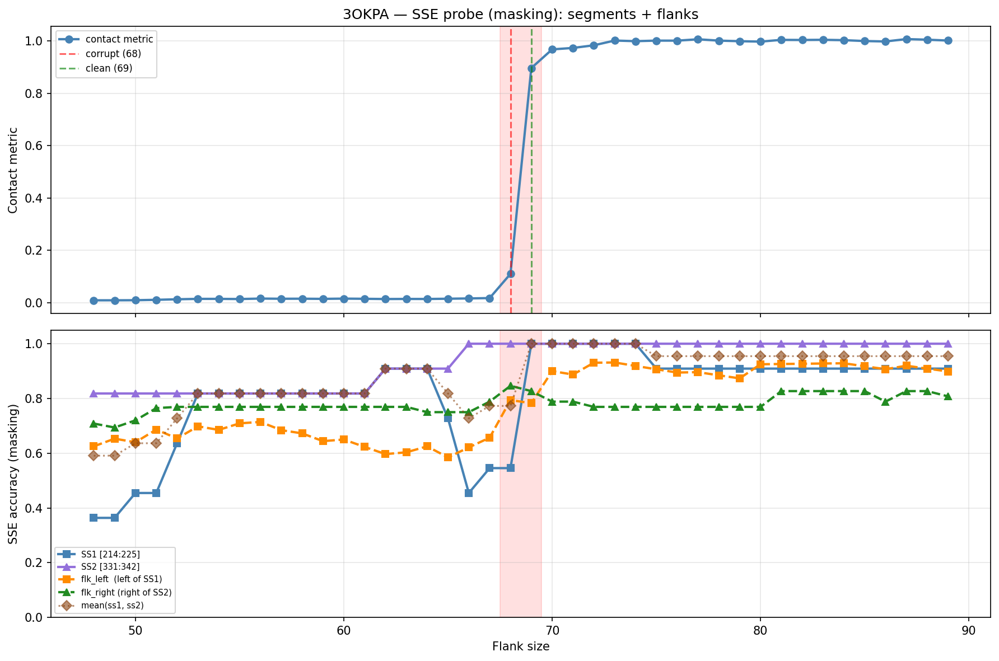

# SSE Probe Analysis: 3OKPA

Generated: 2026-03-03 15:58:51   Model: facebook/esm2_t33_650M_UR50D

## Configuration

| Parameter | Value |
|-----------|-------|
| Protein | 3OKPA |
| Contact pair | (219, 336) |
| ss1 | [214, 225) |
| ss2 | [331, 342) |
| Clean flank | 69 |
| Corrupt flank | 68 |
| Segment radius | 5 |
| Flank sweep | [48, 89] |
| Train sequences | 1,000 |
| Val sequences | 100 |
| Test sequences | 100 |

## SSE Probe Performance

| Split | Accuracy |
|-------|----------|
| Val   | 0.8240 |
| Test  | 0.8259 |

**Test classification report:**

```
              precision    recall  f1-score   support

           H       0.87      0.86      0.86     13101
           E       0.78      0.86      0.82     11471
           C       0.82      0.78      0.80     18602

    accuracy                           0.83     43174
   macro avg       0.83      0.83      0.83     43174
weighted avg       0.83      0.83      0.83     43174

```

## Ground-Truth SSE (full-sequence probe)

| Segment | Sequence |
|---------|----------|
| SS1 [214:225] | `HHHHHHHHHHH` |
| SS2 [331:342] | `HHHHHHHHHHH` |

## Flank Sweep Results

| flank | contact | mk_ss1 | mk_ss2 | mk_mean | mk_flkL | mk_flkR | mk_flk |
|-------|---------|--------|--------|---------|---------|---------|--------|
| 48 | 0.0093 | 0.364 | 0.818 | 0.591 | 0.625 | 0.708 | 0.667 |
| 49 | 0.0093 | 0.364 | 0.818 | 0.591 | 0.653 | 0.694 | 0.673 |
| 50 | 0.0096 | 0.455 | 0.818 | 0.636 | 0.640 | 0.720 | 0.680 |
| 51 | 0.0112 | 0.455 | 0.818 | 0.636 | 0.686 | 0.765 | 0.725 |
| 52 | 0.0132 | 0.636 | 0.818 | 0.727 | 0.654 | 0.769 | 0.712 |
| 53 | 0.0148 | 0.818 | 0.818 | 0.818 | 0.698 | 0.769 | 0.734 |
| 54 | 0.0148 | 0.818 | 0.818 | 0.818 | 0.685 | 0.769 | 0.727 |
| 55 | 0.0141 | 0.818 | 0.818 | 0.818 | 0.709 | 0.769 | 0.739 |
| 56 | 0.0159 | 0.818 | 0.818 | 0.818 | 0.714 | 0.769 | 0.742 |
| 57 | 0.0152 | 0.818 | 0.818 | 0.818 | 0.684 | 0.769 | 0.727 |
| 58 | 0.0154 | 0.818 | 0.818 | 0.818 | 0.672 | 0.769 | 0.721 |
| 59 | 0.0148 | 0.818 | 0.818 | 0.818 | 0.644 | 0.769 | 0.707 |
| 60 | 0.0158 | 0.818 | 0.818 | 0.818 | 0.650 | 0.769 | 0.710 |
| 61 | 0.0151 | 0.818 | 0.818 | 0.818 | 0.623 | 0.769 | 0.696 |
| 62 | 0.0142 | 0.909 | 0.909 | 0.909 | 0.597 | 0.769 | 0.683 |
| 63 | 0.0145 | 0.909 | 0.909 | 0.909 | 0.603 | 0.769 | 0.686 |
| 64 | 0.0143 | 0.909 | 0.909 | 0.909 | 0.625 | 0.750 | 0.688 |
| 65 | 0.0153 | 0.727 | 0.909 | 0.818 | 0.585 | 0.750 | 0.667 |
| 66 | 0.0164 | 0.455 | 1.000 | 0.727 | 0.621 | 0.750 | 0.686 |
| 67 | 0.0178 | 0.545 | 1.000 | 0.773 | 0.657 | 0.788 | 0.723 |
| 68 | 0.1103 | 0.545 | 1.000 | 0.773 | 0.794 | 0.846 | 0.820 |
| 69 | 0.8964 | 1.000 | 1.000 | 1.000 | 0.783 | 0.827 | 0.805 |
| 70 | 0.9677 | 1.000 | 1.000 | 1.000 | 0.900 | 0.788 | 0.844 |
| 71 | 0.9733 | 1.000 | 1.000 | 1.000 | 0.887 | 0.788 | 0.838 |
| 72 | 0.9833 | 1.000 | 1.000 | 1.000 | 0.931 | 0.769 | 0.850 |
| 73 | 1.0014 | 1.000 | 1.000 | 1.000 | 0.932 | 0.769 | 0.850 |
| 74 | 0.9991 | 1.000 | 1.000 | 1.000 | 0.919 | 0.769 | 0.844 |
| 75 | 1.0012 | 0.909 | 1.000 | 0.955 | 0.907 | 0.769 | 0.838 |
| 76 | 1.0010 | 0.909 | 1.000 | 0.955 | 0.895 | 0.769 | 0.832 |
| 77 | 1.0063 | 0.909 | 1.000 | 0.955 | 0.896 | 0.769 | 0.833 |
| 78 | 1.0011 | 0.909 | 1.000 | 0.955 | 0.885 | 0.769 | 0.827 |
| 79 | 0.9990 | 0.909 | 1.000 | 0.955 | 0.873 | 0.769 | 0.821 |
| 80 | 0.9974 | 0.909 | 1.000 | 0.955 | 0.925 | 0.769 | 0.847 |
| 81 | 1.0041 | 0.909 | 1.000 | 0.955 | 0.926 | 0.827 | 0.876 |
| 82 | 1.0036 | 0.909 | 1.000 | 0.955 | 0.927 | 0.827 | 0.877 |
| 83 | 1.0043 | 0.909 | 1.000 | 0.955 | 0.928 | 0.827 | 0.877 |
| 84 | 1.0029 | 0.909 | 1.000 | 0.955 | 0.929 | 0.827 | 0.878 |
| 85 | 0.9996 | 0.909 | 1.000 | 0.955 | 0.918 | 0.827 | 0.872 |
| 86 | 0.9980 | 0.909 | 1.000 | 0.955 | 0.907 | 0.788 | 0.848 |
| 87 | 1.0070 | 0.909 | 1.000 | 0.955 | 0.920 | 0.827 | 0.873 |
| 88 | 1.0048 | 0.909 | 1.000 | 0.955 | 0.909 | 0.827 | 0.868 |
| 89 | 1.0013 | 0.909 | 1.000 | 0.955 | 0.899 | 0.808 | 0.853 |

## Residue-Level Prediction Changes (clean=69, focus ±2)

### Flank 66 → 67

| Seg | Direction | Pos | gt | prev | now |
|-----|-----------|-----|----|------|-----|
| SS1 | incorr→corr | 214 | H | C | H |
| flk_L | incorr→corr | 152 | H | C | H |
| flk_L | incorr→corr | 191 | H | C | H |
| flk_L | incorr→corr | 200 | E | H | E |
| flk_L | corr→incorr | 211 | C | C | H |
| flk_R | incorr→corr | 359 | H | C | H |
| flk_R | corr→incorr | 360 | C | C | H |
| flk_R | incorr→corr | 361 | H | C | H |
| flk_R | incorr→corr | 376 | H | C | H |
| flk_R | corr→incorr | 377 | C | C | H |
| flk_R | corr→incorr | 378 | C | C | H |
| flk_R | incorr→corr | 389 | C | H | C |
| flk_R | incorr→corr | 390 | C | H | C |

### Flank 67 → 68

| Seg | Direction | Pos | gt | prev | now |
|-----|-----------|-----|----|------|-----|
| SS1 | incorr→corr | 217 | H | C | H |
| SS1 | incorr→corr | 218 | H | C | H |
| SS1 | corr→incorr | 220 | H | H | C |
| SS1 | corr→incorr | 223 | H | H | E |
| flk_L | corr→incorr | 147 | C | C | H |
| flk_L | incorr→corr | 148 | H | C | H |
| flk_L | incorr→corr | 149 | H | C | H |
| flk_L | incorr→corr | 150 | H | C | H |
| flk_L | incorr→corr | 151 | H | C | H |
| flk_L | incorr→corr | 155 | H | C | H |
| flk_L | incorr→corr | 172 | C | E | C |
| flk_L | incorr→corr | 182 | H | C | H |
| flk_L | incorr→corr | 211 | C | H | C |
| flk_L | incorr→corr | 212 | H | C | H |
| flk_L | incorr→corr | 213 | H | C | H |
| flk_R | incorr→corr | 360 | C | H | C |
| flk_R | incorr→corr | 377 | C | H | C |
| flk_R | incorr→corr | 378 | C | H | C |

### Flank 68 → 69

| Seg | Direction | Pos | gt | prev | now |
|-----|-----------|-----|----|------|-----|
| SS1 | incorr→corr | 219 | H | C | H |
| SS1 | incorr→corr | 220 | H | C | H |
| SS1 | incorr→corr | 221 | H | C | H |
| SS1 | incorr→corr | 223 | H | E | H |
| SS1 | incorr→corr | 224 | H | E | H |
| flk_L | corr→incorr | 146 | C | C | H |
| flk_L | corr→incorr | 151 | H | H | C |
| flk_L | corr→incorr | 152 | H | H | C |
| flk_L | incorr→corr | 165 | E | C | E |
| flk_L | incorr→corr | 166 | E | C | E |
| flk_L | incorr→corr | 167 | E | C | E |
| flk_L | incorr→corr | 207 | E | C | E |
| flk_L | corr→incorr | 209 | C | C | H |
| flk_R | incorr→corr | 342 | H | C | H |
| flk_R | corr→incorr | 378 | C | C | H |
| flk_R | corr→incorr | 387 | C | C | H |

### Flank 69 → 70

| Seg | Direction | Pos | gt | prev | now |
|-----|-----------|-----|----|------|-----|
| flk_L | incorr→corr | 147 | C | H | C |
| flk_L | incorr→corr | 151 | H | C | H |
| flk_L | incorr→corr | 152 | H | C | H |
| flk_L | incorr→corr | 153 | H | C | H |
| flk_L | incorr→corr | 154 | H | C | H |
| flk_L | incorr→corr | 156 | H | C | H |
| flk_L | incorr→corr | 158 | H | C | H |
| flk_L | incorr→corr | 164 | E | C | E |
| flk_R | corr→incorr | 388 | C | C | H |
| flk_R | corr→incorr | 390 | C | C | H |

### Flank 70 → 71

| Seg | Direction | Pos | gt | prev | now |
|-----|-----------|-----|----|------|-----|
| flk_L | corr→incorr | 204 | C | C | E |

## Plot


