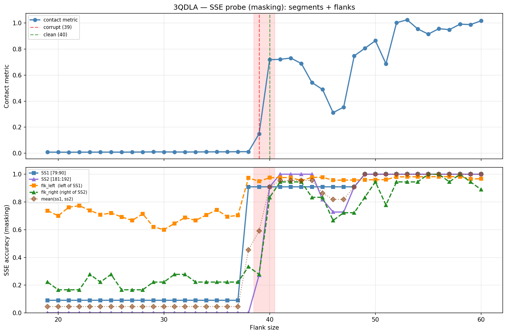

# SSE Probe Analysis: 3QDLA

Generated: 2026-03-03 15:58:55   Model: facebook/esm2_t33_650M_UR50D

## Configuration

| Parameter | Value |
|-----------|-------|
| Protein | 3QDLA |
| Contact pair | (84, 186) |
| ss1 | [79, 90) |
| ss2 | [181, 192) |
| Clean flank | 40 |
| Corrupt flank | 39 |
| Segment radius | 5 |
| Flank sweep | [19, 60] |
| Train sequences | 1,000 |
| Val sequences | 100 |
| Test sequences | 100 |

## SSE Probe Performance

| Split | Accuracy |
|-------|----------|
| Val   | 0.8240 |
| Test  | 0.8259 |

**Test classification report:**

```
              precision    recall  f1-score   support

           H       0.87      0.86      0.86     13101
           E       0.78      0.86      0.82     11471
           C       0.82      0.78      0.80     18602

    accuracy                           0.83     43174
   macro avg       0.83      0.83      0.83     43174
weighted avg       0.83      0.83      0.83     43174

```

## Ground-Truth SSE (full-sequence probe)

| Segment | Sequence |
|---------|----------|
| SS1 [79:90] | `CCEEEEEEEEC` |
| SS2 [181:192] | `EEEEEEEEECC` |

## Flank Sweep Results

| flank | contact | mk_ss1 | mk_ss2 | mk_mean | mk_flkL | mk_flkR | mk_flk |
|-------|---------|--------|--------|---------|---------|---------|--------|
| 19 | 0.0083 | 0.091 | 0.000 | 0.045 | 0.737 | 0.222 | 0.480 |
| 20 | 0.0079 | 0.091 | 0.000 | 0.045 | 0.700 | 0.167 | 0.433 |
| 21 | 0.0077 | 0.091 | 0.000 | 0.045 | 0.762 | 0.167 | 0.464 |
| 22 | 0.0080 | 0.091 | 0.000 | 0.045 | 0.773 | 0.167 | 0.470 |
| 23 | 0.0082 | 0.091 | 0.000 | 0.045 | 0.739 | 0.278 | 0.508 |
| 24 | 0.0084 | 0.091 | 0.000 | 0.045 | 0.708 | 0.222 | 0.465 |
| 25 | 0.0084 | 0.091 | 0.000 | 0.045 | 0.720 | 0.278 | 0.499 |
| 26 | 0.0082 | 0.091 | 0.000 | 0.045 | 0.692 | 0.167 | 0.429 |
| 27 | 0.0086 | 0.091 | 0.000 | 0.045 | 0.667 | 0.167 | 0.417 |
| 28 | 0.0092 | 0.091 | 0.000 | 0.045 | 0.714 | 0.167 | 0.440 |
| 29 | 0.0102 | 0.091 | 0.000 | 0.045 | 0.621 | 0.222 | 0.421 |
| 30 | 0.0099 | 0.091 | 0.000 | 0.045 | 0.600 | 0.222 | 0.411 |
| 31 | 0.0094 | 0.091 | 0.000 | 0.045 | 0.645 | 0.278 | 0.461 |
| 32 | 0.0092 | 0.091 | 0.000 | 0.045 | 0.688 | 0.278 | 0.483 |
| 33 | 0.0097 | 0.091 | 0.000 | 0.045 | 0.667 | 0.222 | 0.444 |
| 34 | 0.0102 | 0.091 | 0.000 | 0.045 | 0.706 | 0.222 | 0.464 |
| 35 | 0.0105 | 0.091 | 0.000 | 0.045 | 0.743 | 0.222 | 0.483 |
| 36 | 0.0107 | 0.091 | 0.000 | 0.045 | 0.694 | 0.222 | 0.458 |
| 37 | 0.0116 | 0.091 | 0.000 | 0.045 | 0.703 | 0.222 | 0.462 |
| 38 | 0.0119 | 0.909 | 0.000 | 0.455 | 0.974 | 0.333 | 0.654 |
| 39 | 0.1492 | 0.909 | 0.273 | 0.591 | 0.949 | 0.278 | 0.613 |
| 40 | 0.7185 | 0.909 | 0.909 | 0.909 | 0.975 | 0.833 | 0.904 |
| 41 | 0.7213 | 0.909 | 1.000 | 0.955 | 0.976 | 0.944 | 0.960 |
| 42 | 0.7313 | 0.909 | 1.000 | 0.955 | 0.976 | 0.944 | 0.960 |
| 43 | 0.6886 | 0.909 | 1.000 | 0.955 | 0.953 | 0.944 | 0.949 |
| 44 | 0.5428 | 0.909 | 1.000 | 0.955 | 0.977 | 0.833 | 0.905 |
| 45 | 0.4898 | 0.909 | 0.818 | 0.864 | 0.978 | 0.833 | 0.906 |
| 46 | 0.3117 | 0.909 | 0.727 | 0.818 | 0.957 | 0.667 | 0.812 |
| 47 | 0.3539 | 0.909 | 0.727 | 0.818 | 0.957 | 0.722 | 0.840 |
| 48 | 0.7481 | 0.909 | 0.909 | 0.909 | 0.958 | 0.722 | 0.840 |
| 49 | 0.8061 | 1.000 | 1.000 | 1.000 | 0.959 | 0.833 | 0.896 |
| 50 | 0.8644 | 1.000 | 1.000 | 1.000 | 0.960 | 0.944 | 0.952 |
| 51 | 0.6871 | 1.000 | 1.000 | 1.000 | 0.961 | 0.778 | 0.869 |
| 52 | 1.0028 | 1.000 | 1.000 | 1.000 | 0.981 | 0.944 | 0.963 |
| 53 | 1.0249 | 1.000 | 1.000 | 1.000 | 0.981 | 0.944 | 0.963 |
| 54 | 0.9551 | 1.000 | 1.000 | 1.000 | 0.981 | 0.944 | 0.963 |
| 55 | 0.9151 | 1.000 | 1.000 | 1.000 | 0.982 | 1.000 | 0.991 |
| 56 | 0.9567 | 1.000 | 1.000 | 1.000 | 0.982 | 1.000 | 0.991 |
| 57 | 0.9493 | 1.000 | 1.000 | 1.000 | 0.982 | 0.944 | 0.963 |
| 58 | 0.9913 | 1.000 | 1.000 | 1.000 | 0.983 | 1.000 | 0.991 |
| 59 | 0.9879 | 1.000 | 1.000 | 1.000 | 0.966 | 0.944 | 0.955 |
| 60 | 1.0177 | 1.000 | 1.000 | 1.000 | 0.967 | 0.889 | 0.928 |

## Residue-Level Prediction Changes (clean=40, focus ±2)

### Flank 37 → 38

| Seg | Direction | Pos | gt | prev | now |
|-----|-----------|-----|----|------|-----|
| SS1 | incorr→corr | 79 | C | H | C |
| SS1 | incorr→corr | 80 | C | H | C |
| SS1 | incorr→corr | 81 | E | H | E |
| SS1 | incorr→corr | 82 | E | H | E |
| SS1 | incorr→corr | 83 | E | H | E |
| SS1 | incorr→corr | 84 | E | H | E |
| SS1 | incorr→corr | 85 | E | C | E |
| SS1 | incorr→corr | 86 | E | H | E |
| SS1 | incorr→corr | 87 | E | H | E |
| flk_L | incorr→corr | 51 | E | C | E |
| flk_L | incorr→corr | 52 | E | C | E |
| flk_L | incorr→corr | 56 | E | C | E |
| flk_L | incorr→corr | 57 | E | C | E |
| flk_L | incorr→corr | 58 | C | H | C |
| flk_L | incorr→corr | 67 | H | C | H |
| flk_L | incorr→corr | 70 | C | H | C |
| flk_L | incorr→corr | 72 | C | H | C |
| flk_L | incorr→corr | 77 | H | C | H |
| flk_L | incorr→corr | 78 | C | H | C |
| flk_R | incorr→corr | 199 | C | H | C |
| flk_R | incorr→corr | 201 | C | H | C |
| flk_R | corr→incorr | 202 | H | H | C |
| flk_R | incorr→corr | 208 | E | H | E |

### Flank 38 → 39

| Seg | Direction | Pos | gt | prev | now |
|-----|-----------|-----|----|------|-----|
| SS2 | incorr→corr | 182 | E | H | E |
| SS2 | incorr→corr | 184 | E | H | E |
| SS2 | incorr→corr | 186 | E | H | E |
| flk_R | incorr→corr | 197 | C | H | C |
| flk_R | corr→incorr | 200 | C | C | H |
| flk_R | corr→incorr | 208 | E | E | C |

### Flank 39 → 40

| Seg | Direction | Pos | gt | prev | now |
|-----|-----------|-----|----|------|-----|
| SS2 | incorr→corr | 181 | E | C | E |
| SS2 | incorr→corr | 183 | E | H | E |
| SS2 | incorr→corr | 185 | E | H | E |
| SS2 | incorr→corr | 187 | E | H | E |
| SS2 | incorr→corr | 189 | E | H | E |
| SS2 | incorr→corr | 190 | C | H | C |
| SS2 | incorr→corr | 191 | C | H | C |
| flk_L | incorr→corr | 40 | H | C | H |
| flk_R | incorr→corr | 192 | C | H | C |
| flk_R | incorr→corr | 193 | C | H | C |
| flk_R | incorr→corr | 194 | C | H | C |
| flk_R | incorr→corr | 195 | C | H | C |
| flk_R | incorr→corr | 196 | C | H | C |
| flk_R | incorr→corr | 198 | C | H | C |
| flk_R | incorr→corr | 200 | C | H | C |
| flk_R | incorr→corr | 203 | H | C | H |
| flk_R | incorr→corr | 207 | E | C | E |
| flk_R | incorr→corr | 208 | E | C | E |

### Flank 40 → 41

| Seg | Direction | Pos | gt | prev | now |
|-----|-----------|-----|----|------|-----|
| SS2 | incorr→corr | 188 | E | C | E |
| flk_R | incorr→corr | 202 | H | C | H |
| flk_R | incorr→corr | 206 | E | C | E |

### Flank 41 → 42

_(no prediction changes)_

## Plot


