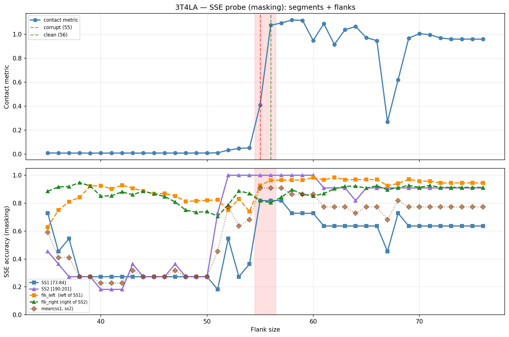

# SSE Probe Analysis: 3T4LA

Generated: 2026-03-03 15:59:01   Model: facebook/esm2_t33_650M_UR50D

## Configuration

| Parameter | Value |
|-----------|-------|
| Protein | 3T4LA |
| Contact pair | (78, 195) |
| ss1 | [73, 84) |
| ss2 | [190, 201) |
| Clean flank | 56 |
| Corrupt flank | 55 |
| Segment radius | 5 |
| Flank sweep | [35, 76] |
| Train sequences | 1,000 |
| Val sequences | 100 |
| Test sequences | 100 |

## SSE Probe Performance

| Split | Accuracy |
|-------|----------|
| Val   | 0.8240 |
| Test  | 0.8259 |

**Test classification report:**

```
              precision    recall  f1-score   support

           H       0.87      0.86      0.86     13101
           E       0.78      0.86      0.82     11471
           C       0.82      0.78      0.80     18602

    accuracy                           0.83     43174
   macro avg       0.83      0.83      0.83     43174
weighted avg       0.83      0.83      0.83     43174

```

## Ground-Truth SSE (full-sequence probe)

| Segment | Sequence |
|---------|----------|
| SS1 [73:84] | `CEEEEEEEECC` |
| SS2 [190:201] | `EEEEEEEEEHH` |

## Flank Sweep Results

| flank | contact | mk_ss1 | mk_ss2 | mk_mean | mk_flkL | mk_flkR | mk_flk |
|-------|---------|--------|--------|---------|---------|---------|--------|
| 35 | 0.0093 | 0.727 | 0.455 | 0.591 | 0.629 | 0.886 | 0.757 |
| 36 | 0.0079 | 0.455 | 0.364 | 0.409 | 0.750 | 0.917 | 0.833 |
| 37 | 0.0080 | 0.545 | 0.273 | 0.409 | 0.811 | 0.919 | 0.865 |
| 38 | 0.0083 | 0.273 | 0.273 | 0.273 | 0.842 | 0.947 | 0.895 |
| 39 | 0.0077 | 0.273 | 0.273 | 0.273 | 0.923 | 0.923 | 0.923 |
| 40 | 0.0079 | 0.273 | 0.182 | 0.227 | 0.925 | 0.850 | 0.887 |
| 41 | 0.0081 | 0.273 | 0.182 | 0.227 | 0.902 | 0.854 | 0.878 |
| 42 | 0.0082 | 0.273 | 0.182 | 0.227 | 0.929 | 0.881 | 0.905 |
| 43 | 0.0080 | 0.273 | 0.364 | 0.318 | 0.907 | 0.860 | 0.884 |
| 44 | 0.0079 | 0.273 | 0.273 | 0.273 | 0.886 | 0.886 | 0.886 |
| 45 | 0.0081 | 0.273 | 0.273 | 0.273 | 0.867 | 0.867 | 0.867 |
| 46 | 0.0084 | 0.273 | 0.273 | 0.273 | 0.870 | 0.848 | 0.859 |
| 47 | 0.0080 | 0.273 | 0.364 | 0.318 | 0.851 | 0.809 | 0.830 |
| 48 | 0.0079 | 0.273 | 0.273 | 0.273 | 0.812 | 0.750 | 0.781 |
| 49 | 0.0085 | 0.273 | 0.273 | 0.273 | 0.816 | 0.735 | 0.776 |
| 50 | 0.0084 | 0.273 | 0.273 | 0.273 | 0.820 | 0.740 | 0.780 |
| 51 | 0.0102 | 0.182 | 0.727 | 0.455 | 0.824 | 0.706 | 0.765 |
| 52 | 0.0323 | 0.545 | 1.000 | 0.773 | 0.750 | 0.788 | 0.769 |
| 53 | 0.0461 | 0.273 | 1.000 | 0.636 | 0.830 | 0.887 | 0.858 |
| 54 | 0.0523 | 0.364 | 1.000 | 0.682 | 0.741 | 0.870 | 0.806 |
| 55 | 0.4087 | 0.818 | 1.000 | 0.909 | 0.927 | 0.818 | 0.873 |
| 56 | 1.0758 | 0.818 | 1.000 | 0.909 | 0.964 | 0.804 | 0.884 |
| 57 | 1.0936 | 0.818 | 1.000 | 0.909 | 0.965 | 0.842 | 0.904 |
| 58 | 1.1196 | 0.727 | 1.000 | 0.864 | 0.966 | 0.897 | 0.931 |
| 59 | 1.1154 | 0.727 | 1.000 | 0.864 | 0.966 | 0.864 | 0.915 |
| 60 | 0.9479 | 0.727 | 1.000 | 0.864 | 0.983 | 0.850 | 0.917 |
| 61 | 1.0878 | 0.636 | 0.909 | 0.773 | 0.967 | 0.869 | 0.918 |
| 62 | 0.9153 | 0.636 | 0.909 | 0.773 | 0.984 | 0.903 | 0.944 |
| 63 | 1.0385 | 0.636 | 0.909 | 0.773 | 0.968 | 0.921 | 0.944 |
| 64 | 1.0643 | 0.636 | 0.818 | 0.727 | 0.969 | 0.922 | 0.945 |
| 65 | 0.9721 | 0.636 | 0.909 | 0.773 | 0.969 | 0.908 | 0.938 |
| 66 | 0.9463 | 0.636 | 0.909 | 0.773 | 0.970 | 0.924 | 0.947 |
| 67 | 0.2697 | 0.455 | 0.909 | 0.682 | 0.925 | 0.896 | 0.910 |
| 68 | 0.6199 | 0.727 | 0.909 | 0.818 | 0.941 | 0.912 | 0.926 |
| 69 | 0.9674 | 0.636 | 0.909 | 0.773 | 0.971 | 0.928 | 0.949 |
| 70 | 1.0045 | 0.636 | 0.909 | 0.773 | 0.957 | 0.913 | 0.935 |
| 71 | 0.9963 | 0.636 | 0.909 | 0.773 | 0.958 | 0.928 | 0.943 |
| 72 | 0.9689 | 0.636 | 0.909 | 0.773 | 0.944 | 0.913 | 0.929 |
| 73 | 0.9593 | 0.636 | 0.909 | 0.773 | 0.945 | 0.913 | 0.929 |
| 74 | 0.9593 | 0.636 | 0.909 | 0.773 | 0.945 | 0.913 | 0.929 |
| 75 | 0.9593 | 0.636 | 0.909 | 0.773 | 0.945 | 0.913 | 0.929 |
| 76 | 0.9593 | 0.636 | 0.909 | 0.773 | 0.945 | 0.913 | 0.929 |

## Residue-Level Prediction Changes (clean=56, focus ±2)

### Flank 53 → 54

| Seg | Direction | Pos | gt | prev | now |
|-----|-----------|-----|----|------|-----|
| SS1 | incorr→corr | 73 | C | H | C |
| flk_L | corr→incorr | 31 | H | H | C |
| flk_L | corr→incorr | 35 | H | H | C |
| flk_L | corr→incorr | 40 | H | H | E |
| flk_L | corr→incorr | 42 | H | H | C |
| flk_L | corr→incorr | 43 | H | H | C |
| flk_L | corr→incorr | 45 | H | H | C |
| flk_L | incorr→corr | 50 | C | H | C |
| flk_L | incorr→corr | 52 | C | H | C |
| flk_L | corr→incorr | 63 | H | H | C |
| flk_R | corr→incorr | 232 | E | E | C |
| flk_R | corr→incorr | 234 | E | E | C |
| flk_R | incorr→corr | 241 | H | C | H |

### Flank 54 → 55

| Seg | Direction | Pos | gt | prev | now |
|-----|-----------|-----|----|------|-----|
| SS1 | incorr→corr | 74 | E | H | E |
| SS1 | incorr→corr | 77 | E | H | E |
| SS1 | incorr→corr | 78 | E | H | E |
| SS1 | incorr→corr | 81 | E | H | E |
| SS1 | incorr→corr | 82 | C | H | C |
| flk_L | incorr→corr | 28 | H | C | H |
| flk_L | incorr→corr | 29 | H | C | H |
| flk_L | incorr→corr | 30 | H | C | H |
| flk_L | incorr→corr | 31 | H | C | H |
| flk_L | incorr→corr | 35 | H | C | H |
| flk_L | incorr→corr | 40 | H | E | H |
| flk_L | incorr→corr | 42 | H | C | H |
| flk_L | incorr→corr | 43 | H | C | H |
| flk_L | incorr→corr | 45 | H | C | H |
| flk_L | incorr→corr | 47 | C | H | C |
| flk_L | incorr→corr | 63 | H | C | H |
| flk_L | corr→incorr | 67 | H | H | C |
| flk_R | corr→incorr | 249 | E | E | C |
| flk_R | corr→incorr | 250 | E | E | C |
| flk_R | corr→incorr | 251 | E | E | C |

### Flank 55 → 56

| Seg | Direction | Pos | gt | prev | now |
|-----|-----------|-----|----|------|-----|
| SS1 | corr→incorr | 73 | C | C | E |
| SS1 | incorr→corr | 75 | E | C | E |
| SS1 | incorr→corr | 80 | E | C | E |
| SS1 | corr→incorr | 83 | C | C | E |
| flk_L | corr→incorr | 46 | H | H | C |
| flk_L | incorr→corr | 66 | H | C | H |
| flk_L | incorr→corr | 67 | H | C | H |
| flk_L | incorr→corr | 70 | C | H | C |
| flk_R | incorr→corr | 216 | C | E | C |
| flk_R | corr→incorr | 241 | H | H | C |
| flk_R | corr→incorr | 248 | E | E | C |

### Flank 56 → 57

| Seg | Direction | Pos | gt | prev | now |
|-----|-----------|-----|----|------|-----|
| flk_L | incorr→corr | 46 | H | C | H |
| flk_L | corr→incorr | 67 | H | H | C |
| flk_R | incorr→corr | 234 | E | C | E |
| flk_R | incorr→corr | 246 | E | C | E |
| flk_R | incorr→corr | 248 | E | C | E |

### Flank 57 → 58

| Seg | Direction | Pos | gt | prev | now |
|-----|-----------|-----|----|------|-----|
| SS1 | corr→incorr | 79 | E | E | C |
| flk_R | corr→incorr | 211 | C | C | H |
| flk_R | incorr→corr | 232 | E | C | E |
| flk_R | corr→incorr | 234 | E | E | C |
| flk_R | incorr→corr | 241 | H | C | H |
| flk_R | incorr→corr | 247 | E | C | E |
| flk_R | incorr→corr | 249 | E | C | E |
| flk_R | incorr→corr | 257 | C | E | C |

## Plot


