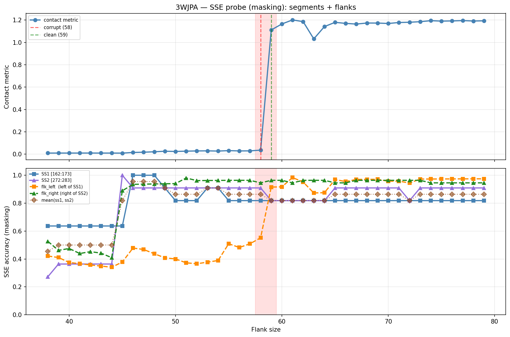

# SSE Probe Analysis: 3WJPA

Generated: 2026-03-03 15:59:08   Model: facebook/esm2_t33_650M_UR50D

## Configuration

| Parameter | Value |
|-----------|-------|
| Protein | 3WJPA |
| Contact pair | (167, 277) |
| ss1 | [162, 173) |
| ss2 | [272, 283) |
| Clean flank | 59 |
| Corrupt flank | 58 |
| Segment radius | 5 |
| Flank sweep | [38, 79] |
| Train sequences | 1,000 |
| Val sequences | 100 |
| Test sequences | 100 |

## SSE Probe Performance

| Split | Accuracy |
|-------|----------|
| Val   | 0.8240 |
| Test  | 0.8259 |

**Test classification report:**

```
              precision    recall  f1-score   support

           H       0.87      0.86      0.86     13101
           E       0.78      0.86      0.82     11471
           C       0.82      0.78      0.80     18602

    accuracy                           0.83     43174
   macro avg       0.83      0.83      0.83     43174
weighted avg       0.83      0.83      0.83     43174

```

## Ground-Truth SSE (full-sequence probe)

| Segment | Sequence |
|---------|----------|
| SS1 [162:173] | `CCCEEEECCCE` |
| SS2 [272:283] | `CEEEEEECHHH` |

## Flank Sweep Results

| flank | contact | mk_ss1 | mk_ss2 | mk_mean | mk_flkL | mk_flkR | mk_flk |
|-------|---------|--------|--------|---------|---------|---------|--------|
| 38 | 0.0099 | 0.636 | 0.273 | 0.455 | 0.421 | 0.526 | 0.474 |
| 39 | 0.0102 | 0.636 | 0.364 | 0.500 | 0.410 | 0.462 | 0.436 |
| 40 | 0.0101 | 0.636 | 0.364 | 0.500 | 0.375 | 0.475 | 0.425 |
| 41 | 0.0102 | 0.636 | 0.364 | 0.500 | 0.366 | 0.439 | 0.402 |
| 42 | 0.0103 | 0.636 | 0.364 | 0.500 | 0.357 | 0.452 | 0.405 |
| 43 | 0.0101 | 0.636 | 0.364 | 0.500 | 0.349 | 0.442 | 0.395 |
| 44 | 0.0101 | 0.636 | 0.364 | 0.500 | 0.341 | 0.409 | 0.375 |
| 45 | 0.0097 | 0.636 | 1.000 | 0.818 | 0.378 | 0.889 | 0.633 |
| 46 | 0.0155 | 1.000 | 0.909 | 0.955 | 0.478 | 0.935 | 0.707 |
| 47 | 0.0178 | 1.000 | 0.909 | 0.955 | 0.468 | 0.936 | 0.702 |
| 48 | 0.0216 | 1.000 | 0.909 | 0.955 | 0.438 | 0.938 | 0.688 |
| 49 | 0.0264 | 0.909 | 0.909 | 0.909 | 0.408 | 0.939 | 0.673 |
| 50 | 0.0245 | 0.818 | 0.909 | 0.864 | 0.400 | 0.940 | 0.670 |
| 51 | 0.0271 | 0.818 | 0.909 | 0.864 | 0.373 | 0.980 | 0.676 |
| 52 | 0.0291 | 0.818 | 0.909 | 0.864 | 0.365 | 0.962 | 0.663 |
| 53 | 0.0300 | 0.909 | 0.909 | 0.909 | 0.377 | 0.962 | 0.670 |
| 54 | 0.0280 | 0.909 | 0.909 | 0.909 | 0.389 | 0.963 | 0.676 |
| 55 | 0.0320 | 0.818 | 0.909 | 0.864 | 0.509 | 0.964 | 0.736 |
| 56 | 0.0292 | 0.818 | 0.909 | 0.864 | 0.482 | 0.964 | 0.723 |
| 57 | 0.0298 | 0.818 | 0.909 | 0.864 | 0.509 | 0.964 | 0.736 |
| 58 | 0.0364 | 0.818 | 0.909 | 0.864 | 0.552 | 0.945 | 0.749 |
| 59 | 1.1112 | 0.818 | 0.818 | 0.818 | 0.915 | 0.964 | 0.939 |
| 60 | 1.1650 | 0.818 | 0.818 | 0.818 | 0.917 | 0.964 | 0.940 |
| 61 | 1.2011 | 0.818 | 0.818 | 0.818 | 0.984 | 0.945 | 0.965 |
| 62 | 1.1858 | 0.818 | 0.818 | 0.818 | 0.952 | 0.964 | 0.958 |
| 63 | 1.0313 | 0.818 | 0.818 | 0.818 | 0.873 | 0.964 | 0.918 |
| 64 | 1.1415 | 0.818 | 0.818 | 0.818 | 0.875 | 0.964 | 0.919 |
| 65 | 1.1795 | 0.818 | 0.909 | 0.864 | 0.969 | 0.945 | 0.957 |
| 66 | 1.1701 | 0.818 | 0.909 | 0.864 | 0.955 | 0.945 | 0.950 |
| 67 | 1.1641 | 0.818 | 0.909 | 0.864 | 0.970 | 0.964 | 0.967 |
| 68 | 1.1733 | 0.818 | 0.909 | 0.864 | 0.971 | 0.964 | 0.967 |
| 69 | 1.1731 | 0.818 | 0.909 | 0.864 | 0.971 | 0.964 | 0.967 |
| 70 | 1.1692 | 0.818 | 0.909 | 0.864 | 0.957 | 0.964 | 0.960 |
| 71 | 1.1780 | 0.818 | 0.909 | 0.864 | 0.958 | 0.964 | 0.961 |
| 72 | 1.1804 | 0.818 | 0.818 | 0.818 | 0.944 | 0.964 | 0.954 |
| 73 | 1.1853 | 0.818 | 0.909 | 0.864 | 0.973 | 0.964 | 0.968 |
| 74 | 1.1944 | 0.818 | 0.909 | 0.864 | 0.973 | 0.945 | 0.959 |
| 75 | 1.1905 | 0.818 | 0.909 | 0.864 | 0.973 | 0.945 | 0.959 |
| 76 | 1.1921 | 0.818 | 0.909 | 0.864 | 0.974 | 0.945 | 0.960 |
| 77 | 1.1951 | 0.818 | 0.909 | 0.864 | 0.974 | 0.945 | 0.960 |
| 78 | 1.1914 | 0.818 | 0.909 | 0.864 | 0.974 | 0.945 | 0.960 |
| 79 | 1.1931 | 0.818 | 0.909 | 0.864 | 0.975 | 0.945 | 0.960 |

## Residue-Level Prediction Changes (clean=59, focus ±2)

### Flank 56 → 57

| Seg | Direction | Pos | gt | prev | now |
|-----|-----------|-----|----|------|-----|
| flk_L | incorr→corr | 106 | H | C | H |

### Flank 57 → 58

| Seg | Direction | Pos | gt | prev | now |
|-----|-----------|-----|----|------|-----|
| flk_L | incorr→corr | 113 | H | C | H |
| flk_L | incorr→corr | 114 | H | C | H |
| flk_R | corr→incorr | 295 | C | C | H |

### Flank 58 → 59

| Seg | Direction | Pos | gt | prev | now |
|-----|-----------|-----|----|------|-----|
| SS2 | corr→incorr | 272 | C | C | E |
| flk_L | incorr→corr | 107 | H | C | H |
| flk_L | incorr→corr | 116 | H | C | H |
| flk_L | incorr→corr | 117 | H | C | H |
| flk_L | incorr→corr | 118 | H | C | H |
| flk_L | incorr→corr | 120 | H | C | H |
| flk_L | incorr→corr | 121 | H | C | H |
| flk_L | incorr→corr | 122 | H | C | H |
| flk_L | incorr→corr | 123 | H | C | H |
| flk_L | corr→incorr | 126 | E | E | C |
| flk_L | incorr→corr | 128 | E | C | E |
| flk_L | incorr→corr | 130 | E | C | E |
| flk_L | incorr→corr | 131 | E | C | E |
| flk_L | incorr→corr | 132 | E | C | E |
| flk_L | incorr→corr | 133 | E | C | E |
| flk_L | incorr→corr | 134 | E | C | E |
| flk_L | incorr→corr | 139 | C | E | C |
| flk_L | incorr→corr | 140 | C | E | C |
| flk_L | incorr→corr | 146 | E | C | E |
| flk_L | incorr→corr | 147 | E | C | E |
| flk_L | incorr→corr | 148 | E | C | E |
| flk_L | incorr→corr | 149 | E | C | E |
| flk_L | incorr→corr | 150 | E | C | E |
| flk_L | incorr→corr | 159 | C | H | C |
| flk_R | incorr→corr | 295 | C | H | C |

### Flank 59 → 60

| Seg | Direction | Pos | gt | prev | now |
|-----|-----------|-----|----|------|-----|
| flk_L | incorr→corr | 126 | E | C | E |
| flk_L | corr→incorr | 141 | E | E | C |

### Flank 60 → 61

| Seg | Direction | Pos | gt | prev | now |
|-----|-----------|-----|----|------|-----|
| flk_L | incorr→corr | 135 | E | C | E |
| flk_L | incorr→corr | 141 | E | C | E |
| flk_L | incorr→corr | 151 | E | C | E |
| flk_L | incorr→corr | 155 | E | C | E |
| flk_R | corr→incorr | 297 | H | H | C |

## Plot


