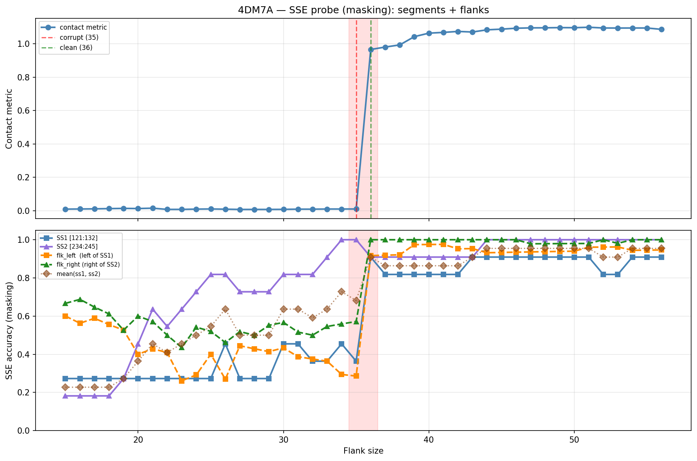

# SSE Probe Analysis: 4DM7A

Generated: 2026-03-03 15:59:15   Model: facebook/esm2_t33_650M_UR50D

## Configuration

| Parameter | Value |
|-----------|-------|
| Protein | 4DM7A |
| Contact pair | (126, 239) |
| ss1 | [121, 132) |
| ss2 | [234, 245) |
| Clean flank | 36 |
| Corrupt flank | 35 |
| Segment radius | 5 |
| Flank sweep | [15, 56] |
| Train sequences | 1,000 |
| Val sequences | 100 |
| Test sequences | 100 |

## SSE Probe Performance

| Split | Accuracy |
|-------|----------|
| Val   | 0.8240 |
| Test  | 0.8259 |

**Test classification report:**

```
              precision    recall  f1-score   support

           H       0.87      0.86      0.86     13101
           E       0.78      0.86      0.82     11471
           C       0.82      0.78      0.80     18602

    accuracy                           0.83     43174
   macro avg       0.83      0.83      0.83     43174
weighted avg       0.83      0.83      0.83     43174

```

## Ground-Truth SSE (full-sequence probe)

| Segment | Sequence |
|---------|----------|
| SS1 [121:132] | `ECEEEEEECCC` |
| SS2 [234:245] | `CCEEEEECCCC` |

## Flank Sweep Results

| flank | contact | mk_ss1 | mk_ss2 | mk_mean | mk_flkL | mk_flkR | mk_flk |
|-------|---------|--------|--------|---------|---------|---------|--------|
| 15 | 0.0101 | 0.273 | 0.182 | 0.227 | 0.600 | 0.667 | 0.633 |
| 16 | 0.0108 | 0.273 | 0.182 | 0.227 | 0.562 | 0.688 | 0.625 |
| 17 | 0.0117 | 0.273 | 0.182 | 0.227 | 0.588 | 0.647 | 0.618 |
| 18 | 0.0131 | 0.273 | 0.182 | 0.227 | 0.556 | 0.611 | 0.583 |
| 19 | 0.0145 | 0.273 | 0.273 | 0.273 | 0.526 | 0.526 | 0.526 |
| 20 | 0.0136 | 0.273 | 0.455 | 0.364 | 0.400 | 0.600 | 0.500 |
| 21 | 0.0157 | 0.273 | 0.636 | 0.455 | 0.429 | 0.571 | 0.500 |
| 22 | 0.0084 | 0.273 | 0.545 | 0.409 | 0.409 | 0.500 | 0.455 |
| 23 | 0.0084 | 0.273 | 0.636 | 0.455 | 0.261 | 0.435 | 0.348 |
| 24 | 0.0101 | 0.273 | 0.727 | 0.500 | 0.292 | 0.542 | 0.417 |
| 25 | 0.0110 | 0.273 | 0.818 | 0.545 | 0.400 | 0.520 | 0.460 |
| 26 | 0.0096 | 0.455 | 0.818 | 0.636 | 0.269 | 0.462 | 0.365 |
| 27 | 0.0081 | 0.273 | 0.727 | 0.500 | 0.444 | 0.519 | 0.481 |
| 28 | 0.0082 | 0.273 | 0.727 | 0.500 | 0.429 | 0.500 | 0.464 |
| 29 | 0.0082 | 0.273 | 0.727 | 0.500 | 0.414 | 0.552 | 0.483 |
| 30 | 0.0086 | 0.455 | 0.818 | 0.636 | 0.433 | 0.567 | 0.500 |
| 31 | 0.0098 | 0.455 | 0.818 | 0.636 | 0.387 | 0.516 | 0.452 |
| 32 | 0.0098 | 0.364 | 0.818 | 0.591 | 0.375 | 0.500 | 0.438 |
| 33 | 0.0106 | 0.364 | 0.909 | 0.636 | 0.364 | 0.545 | 0.455 |
| 34 | 0.0106 | 0.455 | 1.000 | 0.727 | 0.294 | 0.559 | 0.426 |
| 35 | 0.0108 | 0.364 | 1.000 | 0.682 | 0.286 | 0.571 | 0.429 |
| 36 | 0.9652 | 0.909 | 0.909 | 0.909 | 0.917 | 1.000 | 0.958 |
| 37 | 0.9799 | 0.818 | 0.909 | 0.864 | 0.919 | 1.000 | 0.959 |
| 38 | 0.9927 | 0.818 | 0.909 | 0.864 | 0.921 | 1.000 | 0.961 |
| 39 | 1.0421 | 0.818 | 0.909 | 0.864 | 0.974 | 1.000 | 0.987 |
| 40 | 1.0630 | 0.818 | 0.909 | 0.864 | 0.975 | 1.000 | 0.988 |
| 41 | 1.0675 | 0.818 | 0.909 | 0.864 | 0.976 | 1.000 | 0.988 |
| 42 | 1.0733 | 0.818 | 0.909 | 0.864 | 0.952 | 1.000 | 0.976 |
| 43 | 1.0699 | 0.909 | 0.909 | 0.909 | 0.953 | 1.000 | 0.977 |
| 44 | 1.0829 | 0.909 | 1.000 | 0.955 | 0.932 | 1.000 | 0.966 |
| 45 | 1.0870 | 0.909 | 1.000 | 0.955 | 0.933 | 1.000 | 0.967 |
| 46 | 1.0925 | 0.909 | 1.000 | 0.955 | 0.935 | 1.000 | 0.967 |
| 47 | 1.0946 | 0.909 | 1.000 | 0.955 | 0.936 | 0.979 | 0.957 |
| 48 | 1.0951 | 0.909 | 1.000 | 0.955 | 0.938 | 0.979 | 0.958 |
| 49 | 1.0961 | 0.909 | 1.000 | 0.955 | 0.939 | 0.980 | 0.959 |
| 50 | 1.0957 | 0.909 | 1.000 | 0.955 | 0.940 | 0.980 | 0.960 |
| 51 | 1.0983 | 0.909 | 1.000 | 0.955 | 0.961 | 0.980 | 0.971 |
| 52 | 1.0940 | 0.818 | 1.000 | 0.909 | 0.962 | 1.000 | 0.981 |
| 53 | 1.0936 | 0.818 | 1.000 | 0.909 | 0.962 | 0.981 | 0.972 |
| 54 | 1.0939 | 0.909 | 1.000 | 0.955 | 0.944 | 1.000 | 0.972 |
| 55 | 1.0939 | 0.909 | 1.000 | 0.955 | 0.945 | 1.000 | 0.973 |
| 56 | 1.0858 | 0.909 | 1.000 | 0.955 | 0.946 | 1.000 | 0.973 |

## Residue-Level Prediction Changes (clean=36, focus ±2)

### Flank 33 → 34

| Seg | Direction | Pos | gt | prev | now |
|-----|-----------|-----|----|------|-----|
| SS1 | incorr→corr | 124 | E | H | E |
| SS2 | incorr→corr | 236 | E | C | E |
| flk_L | corr→incorr | 118 | H | H | C |
| flk_L | corr→incorr | 119 | H | H | C |
| flk_R | incorr→corr | 256 | H | C | H |
| flk_R | corr→incorr | 260 | C | C | E |

### Flank 34 → 35

| Seg | Direction | Pos | gt | prev | now |
|-----|-----------|-----|----|------|-----|
| SS1 | corr→incorr | 124 | E | E | H |
| flk_R | incorr→corr | 260 | C | E | C |
| flk_R | incorr→corr | 276 | H | C | H |
| flk_R | corr→incorr | 278 | C | C | H |

### Flank 35 → 36

| Seg | Direction | Pos | gt | prev | now |
|-----|-----------|-----|----|------|-----|
| SS1 | incorr→corr | 121 | E | H | E |
| SS1 | incorr→corr | 122 | C | H | C |
| SS1 | incorr→corr | 124 | E | H | E |
| SS1 | incorr→corr | 125 | E | H | E |
| SS1 | incorr→corr | 126 | E | C | E |
| SS1 | incorr→corr | 127 | E | C | E |
| SS2 | corr→incorr | 235 | C | C | E |
| flk_L | incorr→corr | 86 | H | C | H |
| flk_L | incorr→corr | 87 | H | C | H |
| flk_L | incorr→corr | 88 | H | C | H |
| flk_L | incorr→corr | 89 | H | C | H |
| flk_L | incorr→corr | 90 | H | C | H |
| flk_L | incorr→corr | 91 | H | C | H |
| flk_L | incorr→corr | 92 | H | C | H |
| flk_L | incorr→corr | 98 | E | C | E |
| flk_L | incorr→corr | 100 | E | C | E |
| flk_L | incorr→corr | 101 | E | C | E |
| flk_L | incorr→corr | 102 | E | C | E |
| flk_L | incorr→corr | 103 | E | C | E |
| flk_L | incorr→corr | 108 | H | C | H |
| flk_L | incorr→corr | 109 | H | C | H |
| flk_L | incorr→corr | 110 | H | C | H |
| flk_L | incorr→corr | 111 | H | C | H |
| flk_L | incorr→corr | 112 | H | C | H |
| flk_L | incorr→corr | 113 | H | C | H |
| flk_L | incorr→corr | 114 | H | E | H |
| flk_L | incorr→corr | 115 | H | C | H |
| flk_L | incorr→corr | 116 | H | C | H |
| flk_L | corr→incorr | 117 | C | C | H |
| flk_L | incorr→corr | 118 | H | C | H |
| flk_L | incorr→corr | 120 | C | H | C |
| flk_R | incorr→corr | 248 | H | C | H |
| flk_R | incorr→corr | 249 | H | C | H |
| flk_R | incorr→corr | 251 | H | C | H |
| flk_R | incorr→corr | 257 | C | H | C |
| flk_R | incorr→corr | 258 | C | H | C |
| flk_R | incorr→corr | 259 | C | H | C |
| flk_R | incorr→corr | 261 | E | H | E |
| flk_R | incorr→corr | 262 | E | C | E |
| flk_R | incorr→corr | 263 | E | C | E |
| flk_R | incorr→corr | 264 | E | C | E |
| flk_R | incorr→corr | 265 | E | C | E |
| flk_R | incorr→corr | 266 | E | C | E |
| flk_R | incorr→corr | 267 | E | C | E |
| flk_R | incorr→corr | 278 | C | H | C |
| flk_R | incorr→corr | 279 | H | C | H |

### Flank 36 → 37

| Seg | Direction | Pos | gt | prev | now |
|-----|-----------|-----|----|------|-----|
| SS1 | corr→incorr | 129 | C | C | E |

### Flank 37 → 38

_(no prediction changes)_

## Plot


