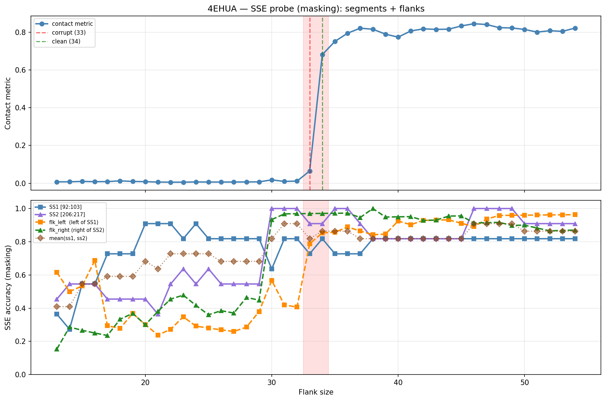

# SSE Probe Analysis: 4EHUA

Generated: 2026-03-03 15:59:21   Model: facebook/esm2_t33_650M_UR50D

## Configuration

| Parameter | Value |
|-----------|-------|
| Protein | 4EHUA |
| Contact pair | (97, 211) |
| ss1 | [92, 103) |
| ss2 | [206, 217) |
| Clean flank | 34 |
| Corrupt flank | 33 |
| Segment radius | 5 |
| Flank sweep | [13, 54] |
| Train sequences | 1,000 |
| Val sequences | 100 |
| Test sequences | 100 |

## SSE Probe Performance

| Split | Accuracy |
|-------|----------|
| Val   | 0.8240 |
| Test  | 0.8259 |

**Test classification report:**

```
              precision    recall  f1-score   support

           H       0.87      0.86      0.86     13101
           E       0.78      0.86      0.82     11471
           C       0.82      0.78      0.80     18602

    accuracy                           0.83     43174
   macro avg       0.83      0.83      0.83     43174
weighted avg       0.83      0.83      0.83     43174

```

## Ground-Truth SSE (full-sequence probe)

| Segment | Sequence |
|---------|----------|
| SS1 [92:103] | `HCEEEEEECCC` |
| SS2 [206:217] | `CCEEEEECCHH` |

## Flank Sweep Results

| flank | contact | mk_ss1 | mk_ss2 | mk_mean | mk_flkL | mk_flkR | mk_flk |
|-------|---------|--------|--------|---------|---------|---------|--------|
| 13 | 0.0072 | 0.364 | 0.455 | 0.409 | 0.615 | 0.154 | 0.385 |
| 14 | 0.0075 | 0.273 | 0.545 | 0.409 | 0.500 | 0.286 | 0.393 |
| 15 | 0.0094 | 0.545 | 0.545 | 0.545 | 0.533 | 0.267 | 0.400 |
| 16 | 0.0082 | 0.545 | 0.545 | 0.545 | 0.688 | 0.250 | 0.469 |
| 17 | 0.0085 | 0.727 | 0.455 | 0.591 | 0.294 | 0.235 | 0.265 |
| 18 | 0.0125 | 0.727 | 0.455 | 0.591 | 0.278 | 0.333 | 0.306 |
| 19 | 0.0093 | 0.727 | 0.455 | 0.591 | 0.368 | 0.368 | 0.368 |
| 20 | 0.0083 | 0.909 | 0.455 | 0.682 | 0.300 | 0.300 | 0.300 |
| 21 | 0.0061 | 0.909 | 0.364 | 0.636 | 0.238 | 0.381 | 0.310 |
| 22 | 0.0054 | 0.909 | 0.545 | 0.727 | 0.273 | 0.455 | 0.364 |
| 23 | 0.0054 | 0.818 | 0.636 | 0.727 | 0.348 | 0.478 | 0.413 |
| 24 | 0.0068 | 0.909 | 0.545 | 0.727 | 0.292 | 0.417 | 0.354 |
| 25 | 0.0061 | 0.818 | 0.636 | 0.727 | 0.280 | 0.360 | 0.320 |
| 26 | 0.0062 | 0.818 | 0.545 | 0.682 | 0.269 | 0.385 | 0.327 |
| 27 | 0.0063 | 0.818 | 0.545 | 0.682 | 0.259 | 0.370 | 0.315 |
| 28 | 0.0067 | 0.818 | 0.545 | 0.682 | 0.286 | 0.464 | 0.375 |
| 29 | 0.0071 | 0.818 | 0.545 | 0.682 | 0.379 | 0.448 | 0.414 |
| 30 | 0.0178 | 0.636 | 1.000 | 0.818 | 0.567 | 0.933 | 0.750 |
| 31 | 0.0094 | 0.818 | 1.000 | 0.909 | 0.419 | 0.968 | 0.694 |
| 32 | 0.0112 | 0.818 | 1.000 | 0.909 | 0.406 | 0.969 | 0.688 |
| 33 | 0.0645 | 0.727 | 0.909 | 0.818 | 0.788 | 0.970 | 0.879 |
| 34 | 0.6809 | 0.818 | 0.909 | 0.864 | 0.853 | 0.971 | 0.912 |
| 35 | 0.7511 | 0.727 | 1.000 | 0.864 | 0.857 | 0.971 | 0.914 |
| 36 | 0.7944 | 0.727 | 1.000 | 0.864 | 0.889 | 0.972 | 0.931 |
| 37 | 0.8209 | 0.727 | 0.909 | 0.818 | 0.865 | 0.946 | 0.905 |
| 38 | 0.8153 | 0.818 | 0.818 | 0.818 | 0.842 | 1.000 | 0.921 |
| 39 | 0.7893 | 0.818 | 0.818 | 0.818 | 0.846 | 0.949 | 0.897 |
| 40 | 0.7735 | 0.818 | 0.818 | 0.818 | 0.925 | 0.950 | 0.938 |
| 41 | 0.8062 | 0.818 | 0.818 | 0.818 | 0.902 | 0.951 | 0.927 |
| 42 | 0.8175 | 0.818 | 0.818 | 0.818 | 0.929 | 0.929 | 0.929 |
| 43 | 0.8146 | 0.818 | 0.818 | 0.818 | 0.930 | 0.930 | 0.930 |
| 44 | 0.8157 | 0.818 | 0.818 | 0.818 | 0.932 | 0.955 | 0.943 |
| 45 | 0.8328 | 0.818 | 0.818 | 0.818 | 0.911 | 0.956 | 0.933 |
| 46 | 0.8446 | 0.818 | 1.000 | 0.909 | 0.891 | 0.913 | 0.902 |
| 47 | 0.8403 | 0.818 | 1.000 | 0.909 | 0.936 | 0.915 | 0.926 |
| 48 | 0.8237 | 0.818 | 1.000 | 0.909 | 0.958 | 0.917 | 0.938 |
| 49 | 0.8223 | 0.818 | 1.000 | 0.909 | 0.959 | 0.898 | 0.929 |
| 50 | 0.8143 | 0.818 | 0.909 | 0.864 | 0.960 | 0.900 | 0.930 |
| 51 | 0.8002 | 0.818 | 0.909 | 0.864 | 0.961 | 0.882 | 0.922 |
| 52 | 0.8076 | 0.818 | 0.909 | 0.864 | 0.962 | 0.865 | 0.913 |
| 53 | 0.8041 | 0.818 | 0.909 | 0.864 | 0.962 | 0.868 | 0.915 |
| 54 | 0.8217 | 0.818 | 0.909 | 0.864 | 0.963 | 0.870 | 0.917 |

## Residue-Level Prediction Changes (clean=34, focus ±2)

### Flank 31 → 32

| Seg | Direction | Pos | gt | prev | now |
|-----|-----------|-----|----|------|-----|
| flk_L | incorr→corr | 61 | E | C | E |
| flk_L | corr→incorr | 62 | C | C | E |
| flk_L | corr→incorr | 69 | C | C | H |

### Flank 32 → 33

| Seg | Direction | Pos | gt | prev | now |
|-----|-----------|-----|----|------|-----|
| SS1 | corr→incorr | 94 | E | E | C |
| SS2 | corr→incorr | 213 | C | C | E |
| flk_L | incorr→corr | 69 | C | H | C |
| flk_L | incorr→corr | 72 | C | H | C |
| flk_L | incorr→corr | 73 | C | H | C |
| flk_L | incorr→corr | 74 | E | H | E |
| flk_L | incorr→corr | 75 | E | H | E |
| flk_L | incorr→corr | 77 | C | H | C |
| flk_L | corr→incorr | 78 | H | H | C |
| flk_L | incorr→corr | 83 | H | C | H |
| flk_L | incorr→corr | 84 | H | C | H |
| flk_L | incorr→corr | 85 | H | C | H |
| flk_L | incorr→corr | 86 | H | C | H |
| flk_L | incorr→corr | 87 | H | E | H |
| flk_L | incorr→corr | 88 | H | E | H |
| flk_L | incorr→corr | 89 | H | C | H |
| flk_R | incorr→corr | 219 | H | C | H |
| flk_R | corr→incorr | 231 | C | C | E |

### Flank 33 → 34

| Seg | Direction | Pos | gt | prev | now |
|-----|-----------|-----|----|------|-----|
| SS1 | incorr→corr | 99 | E | C | E |
| flk_L | incorr→corr | 62 | C | E | C |
| flk_L | incorr→corr | 78 | H | C | H |

### Flank 34 → 35

| Seg | Direction | Pos | gt | prev | now |
|-----|-----------|-----|----|------|-----|
| SS1 | corr→incorr | 99 | E | E | C |
| SS2 | incorr→corr | 213 | C | E | C |

### Flank 35 → 36

| Seg | Direction | Pos | gt | prev | now |
|-----|-----------|-----|----|------|-----|
| flk_L | incorr→corr | 66 | H | C | H |

## Plot


