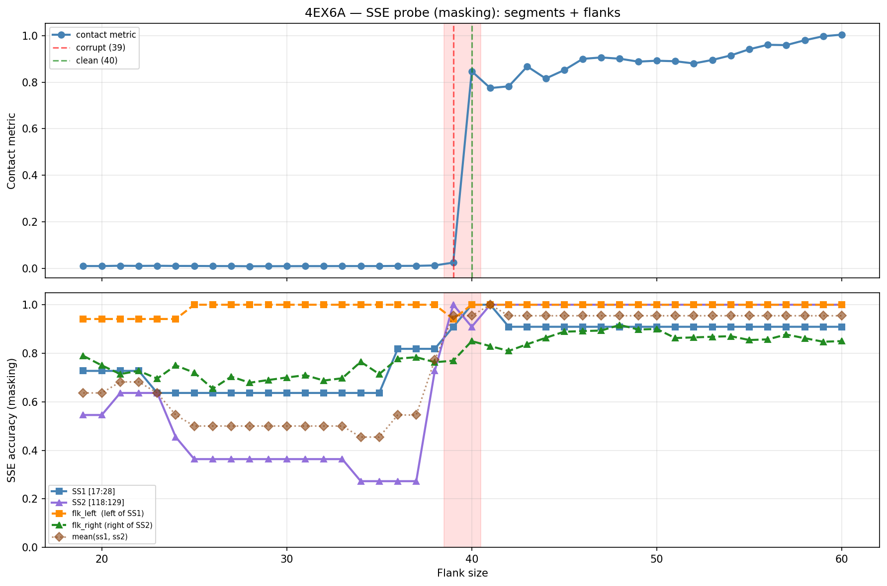

# SSE Probe Analysis: 4EX6A

Generated: 2026-03-03 15:59:26   Model: facebook/esm2_t33_650M_UR50D

## Configuration

| Parameter | Value |
|-----------|-------|
| Protein | 4EX6A |
| Contact pair | (22, 123) |
| ss1 | [17, 28) |
| ss2 | [118, 129) |
| Clean flank | 40 |
| Corrupt flank | 39 |
| Segment radius | 5 |
| Flank sweep | [19, 60] |
| Train sequences | 1,000 |
| Val sequences | 100 |
| Test sequences | 100 |

## SSE Probe Performance

| Split | Accuracy |
|-------|----------|
| Val   | 0.8240 |
| Test  | 0.8259 |

**Test classification report:**

```
              precision    recall  f1-score   support

           H       0.87      0.86      0.86     13101
           E       0.78      0.86      0.82     11471
           C       0.82      0.78      0.80     18602

    accuracy                           0.83     43174
   macro avg       0.83      0.83      0.83     43174
weighted avg       0.83      0.83      0.83     43174

```

## Ground-Truth SSE (full-sequence probe)

| Segment | Sequence |
|---------|----------|
| SS1 [17:28] | `CCCEEEECCCC` |
| SS2 [118:129] | `CCCEEEEECCC` |

## Flank Sweep Results

| flank | contact | mk_ss1 | mk_ss2 | mk_mean | mk_flkL | mk_flkR | mk_flk |
|-------|---------|--------|--------|---------|---------|---------|--------|
| 19 | 0.0095 | 0.727 | 0.545 | 0.636 | 0.941 | 0.789 | 0.865 |
| 20 | 0.0093 | 0.727 | 0.545 | 0.636 | 0.941 | 0.750 | 0.846 |
| 21 | 0.0107 | 0.727 | 0.636 | 0.682 | 0.941 | 0.714 | 0.828 |
| 22 | 0.0100 | 0.727 | 0.636 | 0.682 | 0.941 | 0.727 | 0.834 |
| 23 | 0.0106 | 0.636 | 0.636 | 0.636 | 0.941 | 0.696 | 0.818 |
| 24 | 0.0099 | 0.636 | 0.455 | 0.545 | 0.941 | 0.750 | 0.846 |
| 25 | 0.0097 | 0.636 | 0.364 | 0.500 | 1.000 | 0.720 | 0.860 |
| 26 | 0.0093 | 0.636 | 0.364 | 0.500 | 1.000 | 0.654 | 0.827 |
| 27 | 0.0092 | 0.636 | 0.364 | 0.500 | 1.000 | 0.704 | 0.852 |
| 28 | 0.0086 | 0.636 | 0.364 | 0.500 | 1.000 | 0.679 | 0.839 |
| 29 | 0.0088 | 0.636 | 0.364 | 0.500 | 1.000 | 0.690 | 0.845 |
| 30 | 0.0089 | 0.636 | 0.364 | 0.500 | 1.000 | 0.700 | 0.850 |
| 31 | 0.0091 | 0.636 | 0.364 | 0.500 | 1.000 | 0.710 | 0.855 |
| 32 | 0.0091 | 0.636 | 0.364 | 0.500 | 1.000 | 0.688 | 0.844 |
| 33 | 0.0093 | 0.636 | 0.364 | 0.500 | 1.000 | 0.697 | 0.848 |
| 34 | 0.0093 | 0.636 | 0.273 | 0.455 | 1.000 | 0.765 | 0.882 |
| 35 | 0.0093 | 0.636 | 0.273 | 0.455 | 1.000 | 0.714 | 0.857 |
| 36 | 0.0100 | 0.818 | 0.273 | 0.545 | 1.000 | 0.778 | 0.889 |
| 37 | 0.0103 | 0.818 | 0.273 | 0.545 | 1.000 | 0.784 | 0.892 |
| 38 | 0.0121 | 0.818 | 0.727 | 0.773 | 1.000 | 0.763 | 0.882 |
| 39 | 0.0242 | 0.909 | 1.000 | 0.955 | 0.941 | 0.769 | 0.855 |
| 40 | 0.8468 | 1.000 | 0.909 | 0.955 | 1.000 | 0.850 | 0.925 |
| 41 | 0.7747 | 1.000 | 1.000 | 1.000 | 1.000 | 0.829 | 0.915 |
| 42 | 0.7821 | 0.909 | 1.000 | 0.955 | 1.000 | 0.810 | 0.905 |
| 43 | 0.8675 | 0.909 | 1.000 | 0.955 | 1.000 | 0.837 | 0.919 |
| 44 | 0.8156 | 0.909 | 1.000 | 0.955 | 1.000 | 0.864 | 0.932 |
| 45 | 0.8519 | 0.909 | 1.000 | 0.955 | 1.000 | 0.889 | 0.944 |
| 46 | 0.9001 | 0.909 | 1.000 | 0.955 | 1.000 | 0.891 | 0.946 |
| 47 | 0.9062 | 0.909 | 1.000 | 0.955 | 1.000 | 0.894 | 0.947 |
| 48 | 0.9008 | 0.909 | 1.000 | 0.955 | 1.000 | 0.917 | 0.958 |
| 49 | 0.8883 | 0.909 | 1.000 | 0.955 | 1.000 | 0.898 | 0.949 |
| 50 | 0.8921 | 0.909 | 1.000 | 0.955 | 1.000 | 0.900 | 0.950 |
| 51 | 0.8899 | 0.909 | 1.000 | 0.955 | 1.000 | 0.863 | 0.931 |
| 52 | 0.8805 | 0.909 | 1.000 | 0.955 | 1.000 | 0.865 | 0.933 |
| 53 | 0.8953 | 0.909 | 1.000 | 0.955 | 1.000 | 0.868 | 0.934 |
| 54 | 0.9149 | 0.909 | 1.000 | 0.955 | 1.000 | 0.870 | 0.935 |
| 55 | 0.9414 | 0.909 | 1.000 | 0.955 | 1.000 | 0.855 | 0.927 |
| 56 | 0.9605 | 0.909 | 1.000 | 0.955 | 1.000 | 0.857 | 0.929 |
| 57 | 0.9592 | 0.909 | 1.000 | 0.955 | 1.000 | 0.877 | 0.939 |
| 58 | 0.9801 | 0.909 | 1.000 | 0.955 | 1.000 | 0.862 | 0.931 |
| 59 | 0.9974 | 0.909 | 1.000 | 0.955 | 1.000 | 0.847 | 0.924 |
| 60 | 1.0042 | 0.909 | 1.000 | 0.955 | 1.000 | 0.850 | 0.925 |

## Residue-Level Prediction Changes (clean=40, focus ±2)

### Flank 37 → 38

| Seg | Direction | Pos | gt | prev | now |
|-----|-----------|-----|----|------|-----|
| SS2 | incorr→corr | 121 | E | C | E |
| SS2 | incorr→corr | 122 | E | H | E |
| SS2 | incorr→corr | 123 | E | C | E |
| SS2 | incorr→corr | 127 | C | H | C |
| SS2 | incorr→corr | 128 | C | H | C |

### Flank 38 → 39

| Seg | Direction | Pos | gt | prev | now |
|-----|-----------|-----|----|------|-----|
| SS1 | incorr→corr | 22 | E | C | E |
| SS2 | incorr→corr | 120 | C | H | C |
| SS2 | incorr→corr | 124 | E | H | E |
| SS2 | incorr→corr | 125 | E | C | E |
| flk_L | corr→incorr | 3 | C | C | H |
| flk_R | incorr→corr | 129 | C | H | C |
| flk_R | corr→incorr | 162 | C | C | H |
| flk_R | incorr→corr | 165 | H | C | H |

### Flank 39 → 40

| Seg | Direction | Pos | gt | prev | now |
|-----|-----------|-----|----|------|-----|
| SS1 | incorr→corr | 20 | E | C | E |
| SS2 | corr→incorr | 126 | C | C | E |
| flk_L | incorr→corr | 3 | C | H | C |
| flk_R | corr→incorr | 140 | C | C | H |
| flk_R | incorr→corr | 143 | H | C | H |
| flk_R | incorr→corr | 163 | H | C | H |
| flk_R | incorr→corr | 166 | H | C | H |
| flk_R | incorr→corr | 167 | H | C | H |

### Flank 40 → 41

| Seg | Direction | Pos | gt | prev | now |
|-----|-----------|-----|----|------|-----|
| SS2 | incorr→corr | 126 | C | E | C |
| flk_R | corr→incorr | 142 | C | C | H |

### Flank 41 → 42

| Seg | Direction | Pos | gt | prev | now |
|-----|-----------|-----|----|------|-----|
| SS1 | corr→incorr | 19 | C | C | E |
| flk_R | corr→incorr | 143 | H | H | C |

## Plot


