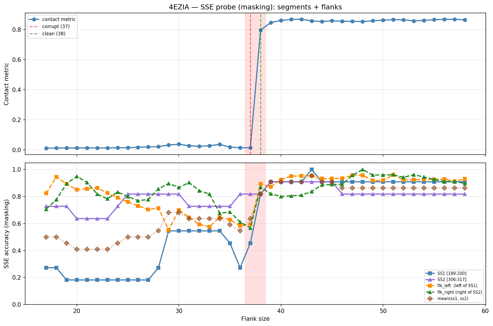

# SSE Probe Analysis: 4EZIA

Generated: 2026-03-03 15:59:33   Model: facebook/esm2_t33_650M_UR50D

## Configuration

| Parameter | Value |
|-----------|-------|
| Protein | 4EZIA |
| Contact pair | (194, 311) |
| ss1 | [189, 200) |
| ss2 | [306, 317) |
| Clean flank | 38 |
| Corrupt flank | 37 |
| Segment radius | 5 |
| Flank sweep | [17, 58] |
| Train sequences | 1,000 |
| Val sequences | 100 |
| Test sequences | 100 |

## SSE Probe Performance

| Split | Accuracy |
|-------|----------|
| Val   | 0.8240 |
| Test  | 0.8259 |

**Test classification report:**

```
              precision    recall  f1-score   support

           H       0.87      0.86      0.86     13101
           E       0.78      0.86      0.82     11471
           C       0.82      0.78      0.80     18602

    accuracy                           0.83     43174
   macro avg       0.83      0.83      0.83     43174
weighted avg       0.83      0.83      0.83     43174

```

## Ground-Truth SSE (full-sequence probe)

| Segment | Sequence |
|---------|----------|
| SS1 [189:200] | `CEEEEEEEECC` |
| SS2 [306:317] | `CCEEEEEECHC` |

## Flank Sweep Results

| flank | contact | mk_ss1 | mk_ss2 | mk_mean | mk_flkL | mk_flkR | mk_flk |
|-------|---------|--------|--------|---------|---------|---------|--------|
| 17 | 0.0113 | 0.273 | 0.727 | 0.500 | 0.824 | 0.706 | 0.765 |
| 18 | 0.0117 | 0.273 | 0.727 | 0.500 | 0.944 | 0.778 | 0.861 |
| 19 | 0.0121 | 0.182 | 0.727 | 0.455 | 0.895 | 0.895 | 0.895 |
| 20 | 0.0121 | 0.182 | 0.636 | 0.409 | 0.850 | 0.950 | 0.900 |
| 21 | 0.0128 | 0.182 | 0.636 | 0.409 | 0.857 | 0.905 | 0.881 |
| 22 | 0.0121 | 0.182 | 0.636 | 0.409 | 0.864 | 0.818 | 0.841 |
| 23 | 0.0124 | 0.182 | 0.636 | 0.409 | 0.826 | 0.783 | 0.804 |
| 24 | 0.0134 | 0.182 | 0.727 | 0.455 | 0.792 | 0.833 | 0.812 |
| 25 | 0.0138 | 0.182 | 0.818 | 0.500 | 0.760 | 0.800 | 0.780 |
| 26 | 0.0169 | 0.182 | 0.818 | 0.500 | 0.731 | 0.769 | 0.750 |
| 27 | 0.0191 | 0.182 | 0.818 | 0.500 | 0.704 | 0.778 | 0.741 |
| 28 | 0.0212 | 0.273 | 0.818 | 0.545 | 0.714 | 0.857 | 0.786 |
| 29 | 0.0319 | 0.545 | 0.818 | 0.682 | 0.552 | 0.897 | 0.724 |
| 30 | 0.0373 | 0.545 | 0.818 | 0.682 | 0.700 | 0.867 | 0.783 |
| 31 | 0.0269 | 0.545 | 0.727 | 0.636 | 0.645 | 0.903 | 0.774 |
| 32 | 0.0234 | 0.545 | 0.727 | 0.636 | 0.594 | 0.844 | 0.719 |
| 33 | 0.0267 | 0.545 | 0.727 | 0.636 | 0.576 | 0.818 | 0.697 |
| 34 | 0.0361 | 0.545 | 0.727 | 0.636 | 0.647 | 0.676 | 0.662 |
| 35 | 0.0178 | 0.455 | 0.727 | 0.591 | 0.629 | 0.686 | 0.657 |
| 36 | 0.0137 | 0.273 | 0.818 | 0.545 | 0.583 | 0.611 | 0.597 |
| 37 | 0.0133 | 0.455 | 0.818 | 0.636 | 0.595 | 0.568 | 0.581 |
| 38 | 0.7957 | 0.818 | 0.818 | 0.818 | 0.895 | 0.868 | 0.882 |
| 39 | 0.8457 | 0.909 | 0.909 | 0.909 | 0.872 | 0.821 | 0.846 |
| 40 | 0.8603 | 0.909 | 0.909 | 0.909 | 0.925 | 0.800 | 0.863 |
| 41 | 0.8664 | 0.909 | 0.909 | 0.909 | 0.951 | 0.805 | 0.878 |
| 42 | 0.8676 | 0.909 | 0.909 | 0.909 | 0.952 | 0.810 | 0.881 |
| 43 | 0.8572 | 1.000 | 0.909 | 0.955 | 0.953 | 0.837 | 0.895 |
| 44 | 0.8524 | 0.909 | 0.909 | 0.909 | 0.932 | 0.886 | 0.909 |
| 45 | 0.8574 | 0.909 | 0.909 | 0.909 | 0.933 | 0.889 | 0.911 |
| 46 | 0.8547 | 0.909 | 0.818 | 0.864 | 0.935 | 0.891 | 0.913 |
| 47 | 0.8542 | 0.909 | 0.818 | 0.864 | 0.957 | 0.957 | 0.957 |
| 48 | 0.8524 | 0.909 | 0.818 | 0.864 | 0.958 | 1.000 | 0.979 |
| 49 | 0.8573 | 0.909 | 0.818 | 0.864 | 0.918 | 0.959 | 0.939 |
| 50 | 0.8618 | 0.909 | 0.818 | 0.864 | 0.920 | 0.960 | 0.940 |
| 51 | 0.8652 | 0.909 | 0.818 | 0.864 | 0.961 | 0.961 | 0.961 |
| 52 | 0.8641 | 0.909 | 0.818 | 0.864 | 0.923 | 0.942 | 0.933 |
| 53 | 0.8571 | 0.909 | 0.818 | 0.864 | 0.925 | 0.962 | 0.943 |
| 54 | 0.8600 | 0.909 | 0.818 | 0.864 | 0.926 | 0.944 | 0.935 |
| 55 | 0.8649 | 0.909 | 0.818 | 0.864 | 0.927 | 0.927 | 0.927 |
| 56 | 0.8673 | 0.909 | 0.818 | 0.864 | 0.929 | 0.911 | 0.920 |
| 57 | 0.8672 | 0.909 | 0.818 | 0.864 | 0.912 | 0.912 | 0.912 |
| 58 | 0.8641 | 0.909 | 0.818 | 0.864 | 0.931 | 0.897 | 0.914 |

## Residue-Level Prediction Changes (clean=38, focus ±2)

### Flank 35 → 36

| Seg | Direction | Pos | gt | prev | now |
|-----|-----------|-----|----|------|-----|
| SS1 | corr→incorr | 191 | E | E | C |
| SS1 | corr→incorr | 192 | E | E | C |
| SS2 | incorr→corr | 308 | E | C | E |
| SS2 | incorr→corr | 313 | E | C | E |
| SS2 | corr→incorr | 314 | C | C | E |
| flk_L | incorr→corr | 160 | C | H | C |
| flk_L | incorr→corr | 163 | E | H | E |
| flk_L | incorr→corr | 164 | E | H | E |
| flk_L | incorr→corr | 165 | E | C | E |
| flk_L | corr→incorr | 173 | H | H | C |
| flk_L | corr→incorr | 174 | H | H | E |
| flk_L | corr→incorr | 182 | H | H | C |
| flk_L | corr→incorr | 183 | H | H | C |
| flk_L | corr→incorr | 184 | H | H | C |
| flk_R | corr→incorr | 323 | H | H | C |
| flk_R | corr→incorr | 328 | H | H | C |
| flk_R | corr→incorr | 339 | E | E | H |
| flk_R | incorr→corr | 343 | E | C | E |
| flk_R | incorr→corr | 349 | C | H | C |
| flk_R | corr→incorr | 351 | H | H | C |

### Flank 36 → 37

| Seg | Direction | Pos | gt | prev | now |
|-----|-----------|-----|----|------|-----|
| SS1 | incorr→corr | 191 | E | C | E |
| SS1 | incorr→corr | 192 | E | C | E |
| flk_L | incorr→corr | 162 | E | H | E |
| flk_L | corr→incorr | 177 | H | H | E |
| flk_L | incorr→corr | 182 | H | C | H |
| flk_R | corr→incorr | 349 | C | C | H |

### Flank 37 → 38

| Seg | Direction | Pos | gt | prev | now |
|-----|-----------|-----|----|------|-----|
| SS1 | incorr→corr | 193 | E | C | E |
| SS1 | incorr→corr | 194 | E | C | E |
| SS1 | incorr→corr | 195 | E | C | E |
| SS1 | incorr→corr | 196 | E | C | E |
| SS2 | corr→incorr | 308 | E | E | C |
| SS2 | incorr→corr | 314 | C | E | C |
| flk_L | incorr→corr | 152 | H | C | H |
| flk_L | incorr→corr | 161 | C | H | C |
| flk_L | incorr→corr | 166 | E | C | E |
| flk_L | incorr→corr | 167 | E | C | E |
| flk_L | incorr→corr | 170 | H | C | H |
| flk_L | incorr→corr | 171 | H | C | H |
| flk_L | incorr→corr | 172 | H | C | H |
| flk_L | incorr→corr | 173 | H | C | H |
| flk_L | incorr→corr | 174 | H | E | H |
| flk_L | incorr→corr | 177 | H | E | H |
| flk_L | incorr→corr | 183 | H | C | H |
| flk_L | incorr→corr | 184 | H | C | H |
| flk_R | incorr→corr | 322 | H | C | H |
| flk_R | incorr→corr | 323 | H | C | H |
| flk_R | incorr→corr | 328 | H | C | H |
| flk_R | incorr→corr | 333 | H | C | H |
| flk_R | incorr→corr | 339 | E | H | E |
| flk_R | incorr→corr | 345 | C | H | C |
| flk_R | incorr→corr | 346 | C | H | C |
| flk_R | incorr→corr | 347 | C | H | C |
| flk_R | incorr→corr | 348 | C | H | C |
| flk_R | incorr→corr | 351 | H | C | H |
| flk_R | incorr→corr | 352 | H | C | H |
| flk_R | incorr→corr | 353 | H | C | H |

### Flank 38 → 39

| Seg | Direction | Pos | gt | prev | now |
|-----|-----------|-----|----|------|-----|
| SS1 | incorr→corr | 190 | E | C | E |
| SS1 | corr→incorr | 191 | E | E | C |
| SS1 | incorr→corr | 197 | E | C | E |
| SS2 | incorr→corr | 308 | E | C | E |
| flk_R | incorr→corr | 349 | C | H | C |
| flk_R | incorr→corr | 350 | C | H | C |
| flk_R | corr→incorr | 351 | H | H | C |
| flk_R | corr→incorr | 352 | H | H | C |
| flk_R | corr→incorr | 353 | H | H | C |

### Flank 39 → 40

| Seg | Direction | Pos | gt | prev | now |
|-----|-----------|-----|----|------|-----|
| SS1 | incorr→corr | 191 | E | C | E |
| SS1 | corr→incorr | 197 | E | E | C |
| flk_L | incorr→corr | 150 | H | C | H |
| flk_L | incorr→corr | 151 | H | C | H |
| flk_L | incorr→corr | 153 | H | C | H |

## Plot


