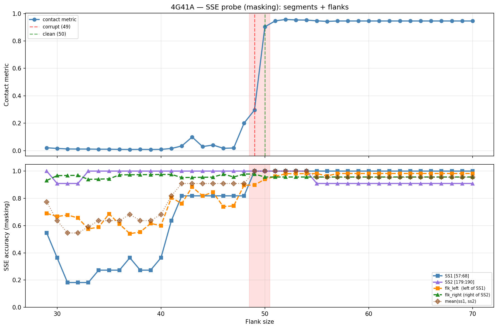

# SSE Probe Analysis: 4G41A

Generated: 2026-03-03 15:59:38   Model: facebook/esm2_t33_650M_UR50D

## Configuration

| Parameter | Value |
|-----------|-------|
| Protein | 4G41A |
| Contact pair | (62, 184) |
| ss1 | [57, 68) |
| ss2 | [179, 190) |
| Clean flank | 50 |
| Corrupt flank | 49 |
| Segment radius | 5 |
| Flank sweep | [29, 70] |
| Train sequences | 1,000 |
| Val sequences | 100 |
| Test sequences | 100 |

## SSE Probe Performance

| Split | Accuracy |
|-------|----------|
| Val   | 0.8240 |
| Test  | 0.8259 |

**Test classification report:**

```
              precision    recall  f1-score   support

           H       0.87      0.86      0.86     13101
           E       0.78      0.86      0.82     11471
           C       0.82      0.78      0.80     18602

    accuracy                           0.83     43174
   macro avg       0.83      0.83      0.83     43174
weighted avg       0.83      0.83      0.83     43174

```

## Ground-Truth SSE (full-sequence probe)

| Segment | Sequence |
|---------|----------|
| SS1 [57:68] | `HHHHHHHHHHH` |
| SS2 [179:190] | `HHHHHHHHHHC` |

## Flank Sweep Results

| flank | contact | mk_ss1 | mk_ss2 | mk_mean | mk_flkL | mk_flkR | mk_flk |
|-------|---------|--------|--------|---------|---------|---------|--------|
| 29 | 0.0209 | 0.545 | 1.000 | 0.773 | 0.690 | 0.931 | 0.810 |
| 30 | 0.0162 | 0.364 | 0.909 | 0.636 | 0.667 | 0.967 | 0.817 |
| 31 | 0.0124 | 0.182 | 0.909 | 0.545 | 0.677 | 0.968 | 0.823 |
| 32 | 0.0118 | 0.182 | 0.909 | 0.545 | 0.656 | 0.969 | 0.812 |
| 33 | 0.0116 | 0.182 | 1.000 | 0.591 | 0.576 | 0.939 | 0.758 |
| 34 | 0.0105 | 0.273 | 1.000 | 0.636 | 0.588 | 0.941 | 0.765 |
| 35 | 0.0106 | 0.273 | 1.000 | 0.636 | 0.686 | 0.943 | 0.814 |
| 36 | 0.0092 | 0.273 | 1.000 | 0.636 | 0.611 | 0.972 | 0.792 |
| 37 | 0.0087 | 0.364 | 1.000 | 0.682 | 0.541 | 0.973 | 0.757 |
| 38 | 0.0091 | 0.273 | 1.000 | 0.636 | 0.553 | 0.974 | 0.763 |
| 39 | 0.0086 | 0.273 | 1.000 | 0.636 | 0.615 | 0.974 | 0.795 |
| 40 | 0.0092 | 0.364 | 1.000 | 0.682 | 0.600 | 0.975 | 0.787 |
| 41 | 0.0159 | 0.636 | 1.000 | 0.818 | 0.805 | 0.976 | 0.890 |
| 42 | 0.0341 | 0.818 | 1.000 | 0.909 | 0.762 | 0.952 | 0.857 |
| 43 | 0.0994 | 0.818 | 1.000 | 0.909 | 0.884 | 0.953 | 0.919 |
| 44 | 0.0297 | 0.818 | 1.000 | 0.909 | 0.818 | 0.955 | 0.886 |
| 45 | 0.0411 | 0.818 | 1.000 | 0.909 | 0.844 | 0.956 | 0.900 |
| 46 | 0.0172 | 0.818 | 1.000 | 0.909 | 0.739 | 0.978 | 0.859 |
| 47 | 0.0194 | 0.818 | 1.000 | 0.909 | 0.745 | 0.957 | 0.851 |
| 48 | 0.2009 | 0.818 | 1.000 | 0.909 | 0.896 | 0.978 | 0.937 |
| 49 | 0.2966 | 1.000 | 1.000 | 1.000 | 0.898 | 0.978 | 0.938 |
| 50 | 0.9031 | 1.000 | 1.000 | 1.000 | 0.940 | 0.957 | 0.948 |
| 51 | 0.9464 | 1.000 | 1.000 | 1.000 | 0.961 | 0.957 | 0.959 |
| 52 | 0.9568 | 1.000 | 1.000 | 1.000 | 0.981 | 0.957 | 0.969 |
| 53 | 0.9531 | 1.000 | 1.000 | 1.000 | 0.981 | 0.957 | 0.969 |
| 54 | 0.9525 | 1.000 | 1.000 | 1.000 | 0.981 | 0.957 | 0.969 |
| 55 | 0.9466 | 1.000 | 0.909 | 0.955 | 0.982 | 0.957 | 0.969 |
| 56 | 0.9429 | 1.000 | 0.909 | 0.955 | 0.964 | 0.957 | 0.960 |
| 57 | 0.9457 | 1.000 | 0.909 | 0.955 | 0.982 | 0.957 | 0.969 |
| 58 | 0.9457 | 1.000 | 0.909 | 0.955 | 0.982 | 0.957 | 0.969 |
| 59 | 0.9457 | 1.000 | 0.909 | 0.955 | 0.982 | 0.957 | 0.969 |
| 60 | 0.9457 | 1.000 | 0.909 | 0.955 | 0.982 | 0.957 | 0.969 |
| 61 | 0.9457 | 1.000 | 0.909 | 0.955 | 0.982 | 0.957 | 0.969 |
| 62 | 0.9457 | 1.000 | 0.909 | 0.955 | 0.982 | 0.957 | 0.969 |
| 63 | 0.9457 | 1.000 | 0.909 | 0.955 | 0.982 | 0.957 | 0.969 |
| 64 | 0.9457 | 1.000 | 0.909 | 0.955 | 0.982 | 0.957 | 0.969 |
| 65 | 0.9457 | 1.000 | 0.909 | 0.955 | 0.982 | 0.957 | 0.969 |
| 66 | 0.9457 | 1.000 | 0.909 | 0.955 | 0.982 | 0.957 | 0.969 |
| 67 | 0.9457 | 1.000 | 0.909 | 0.955 | 0.982 | 0.957 | 0.969 |
| 68 | 0.9457 | 1.000 | 0.909 | 0.955 | 0.982 | 0.957 | 0.969 |
| 69 | 0.9457 | 1.000 | 0.909 | 0.955 | 0.982 | 0.957 | 0.969 |
| 70 | 0.9457 | 1.000 | 0.909 | 0.955 | 0.982 | 0.957 | 0.969 |

## Residue-Level Prediction Changes (clean=50, focus ±2)

### Flank 47 → 48

| Seg | Direction | Pos | gt | prev | now |
|-----|-----------|-----|----|------|-----|
| flk_L | incorr→corr | 10 | E | H | E |
| flk_L | incorr→corr | 11 | E | H | E |
| flk_L | incorr→corr | 12 | C | H | C |
| flk_L | incorr→corr | 13 | C | H | C |
| flk_L | corr→incorr | 24 | H | H | C |
| flk_L | incorr→corr | 30 | E | C | E |
| flk_L | incorr→corr | 31 | E | C | E |
| flk_L | incorr→corr | 32 | E | C | E |
| flk_L | corr→incorr | 35 | C | C | E |
| flk_L | incorr→corr | 36 | E | C | E |
| flk_L | incorr→corr | 53 | C | E | C |
| flk_R | incorr→corr | 192 | E | C | E |

### Flank 48 → 49

| Seg | Direction | Pos | gt | prev | now |
|-----|-----------|-----|----|------|-----|
| SS1 | incorr→corr | 57 | H | C | H |
| SS1 | incorr→corr | 58 | H | C | H |

### Flank 49 → 50

| Seg | Direction | Pos | gt | prev | now |
|-----|-----------|-----|----|------|-----|
| flk_L | incorr→corr | 52 | C | E | C |
| flk_L | incorr→corr | 56 | H | C | H |
| flk_R | corr→incorr | 192 | E | E | C |

### Flank 50 → 51

| Seg | Direction | Pos | gt | prev | now |
|-----|-----------|-----|----|------|-----|
| flk_L | incorr→corr | 35 | C | E | C |

### Flank 51 → 52

| Seg | Direction | Pos | gt | prev | now |
|-----|-----------|-----|----|------|-----|
| flk_L | incorr→corr | 24 | H | C | H |

## Plot


