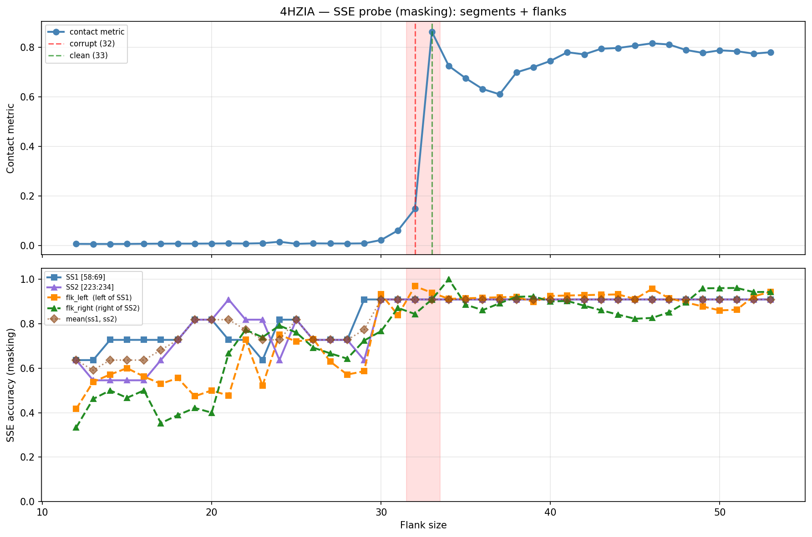

# SSE Probe Analysis: 4HZIA

Generated: 2026-03-03 15:59:45   Model: facebook/esm2_t33_650M_UR50D

## Configuration

| Parameter | Value |
|-----------|-------|
| Protein | 4HZIA |
| Contact pair | (63, 228) |
| ss1 | [58, 69) |
| ss2 | [223, 234) |
| Clean flank | 33 |
| Corrupt flank | 32 |
| Segment radius | 5 |
| Flank sweep | [12, 53] |
| Train sequences | 1,000 |
| Val sequences | 100 |
| Test sequences | 100 |

## SSE Probe Performance

| Split | Accuracy |
|-------|----------|
| Val   | 0.8240 |
| Test  | 0.8259 |

**Test classification report:**

```
              precision    recall  f1-score   support

           H       0.87      0.86      0.86     13101
           E       0.78      0.86      0.82     11471
           C       0.82      0.78      0.80     18602

    accuracy                           0.83     43174
   macro avg       0.83      0.83      0.83     43174
weighted avg       0.83      0.83      0.83     43174

```

## Ground-Truth SSE (full-sequence probe)

| Segment | Sequence |
|---------|----------|
| SS1 [58:69] | `CCEEEEEEECC` |
| SS2 [223:234] | `CCEEEEECCCC` |

## Flank Sweep Results

| flank | contact | mk_ss1 | mk_ss2 | mk_mean | mk_flkL | mk_flkR | mk_flk |
|-------|---------|--------|--------|---------|---------|---------|--------|
| 12 | 0.0068 | 0.636 | 0.636 | 0.636 | 0.417 | 0.333 | 0.375 |
| 13 | 0.0066 | 0.636 | 0.545 | 0.591 | 0.538 | 0.462 | 0.500 |
| 14 | 0.0065 | 0.727 | 0.545 | 0.636 | 0.571 | 0.500 | 0.536 |
| 15 | 0.0066 | 0.727 | 0.545 | 0.636 | 0.600 | 0.467 | 0.533 |
| 16 | 0.0073 | 0.727 | 0.545 | 0.636 | 0.562 | 0.500 | 0.531 |
| 17 | 0.0078 | 0.727 | 0.636 | 0.682 | 0.529 | 0.353 | 0.441 |
| 18 | 0.0080 | 0.727 | 0.727 | 0.727 | 0.556 | 0.389 | 0.472 |
| 19 | 0.0078 | 0.818 | 0.818 | 0.818 | 0.474 | 0.421 | 0.447 |
| 20 | 0.0082 | 0.818 | 0.818 | 0.818 | 0.500 | 0.400 | 0.450 |
| 21 | 0.0088 | 0.727 | 0.909 | 0.818 | 0.476 | 0.667 | 0.571 |
| 22 | 0.0082 | 0.727 | 0.818 | 0.773 | 0.727 | 0.773 | 0.750 |
| 23 | 0.0095 | 0.636 | 0.818 | 0.727 | 0.522 | 0.739 | 0.630 |
| 24 | 0.0155 | 0.818 | 0.636 | 0.727 | 0.750 | 0.792 | 0.771 |
| 25 | 0.0070 | 0.818 | 0.818 | 0.818 | 0.720 | 0.760 | 0.740 |
| 26 | 0.0089 | 0.727 | 0.727 | 0.727 | 0.731 | 0.692 | 0.712 |
| 27 | 0.0085 | 0.727 | 0.727 | 0.727 | 0.630 | 0.667 | 0.648 |
| 28 | 0.0083 | 0.727 | 0.727 | 0.727 | 0.571 | 0.643 | 0.607 |
| 29 | 0.0089 | 0.909 | 0.636 | 0.773 | 0.586 | 0.724 | 0.655 |
| 30 | 0.0225 | 0.909 | 0.909 | 0.909 | 0.933 | 0.767 | 0.850 |
| 31 | 0.0613 | 0.909 | 0.909 | 0.909 | 0.839 | 0.871 | 0.855 |
| 32 | 0.1481 | 0.909 | 0.909 | 0.909 | 0.969 | 0.844 | 0.906 |
| 33 | 0.8632 | 0.909 | 0.909 | 0.909 | 0.939 | 0.909 | 0.924 |
| 34 | 0.7252 | 0.909 | 0.909 | 0.909 | 0.912 | 1.000 | 0.956 |
| 35 | 0.6754 | 0.909 | 0.909 | 0.909 | 0.914 | 0.886 | 0.900 |
| 36 | 0.6320 | 0.909 | 0.909 | 0.909 | 0.917 | 0.861 | 0.889 |
| 37 | 0.6107 | 0.909 | 0.909 | 0.909 | 0.919 | 0.892 | 0.905 |
| 38 | 0.6993 | 0.909 | 0.909 | 0.909 | 0.921 | 0.921 | 0.921 |
| 39 | 0.7205 | 0.909 | 0.909 | 0.909 | 0.897 | 0.923 | 0.910 |
| 40 | 0.7454 | 0.909 | 0.909 | 0.909 | 0.925 | 0.900 | 0.913 |
| 41 | 0.7804 | 0.909 | 0.909 | 0.909 | 0.927 | 0.902 | 0.915 |
| 42 | 0.7719 | 0.909 | 0.909 | 0.909 | 0.929 | 0.881 | 0.905 |
| 43 | 0.7946 | 0.909 | 0.909 | 0.909 | 0.930 | 0.860 | 0.895 |
| 44 | 0.7976 | 0.909 | 0.909 | 0.909 | 0.932 | 0.841 | 0.886 |
| 45 | 0.8070 | 0.909 | 0.909 | 0.909 | 0.911 | 0.822 | 0.867 |
| 46 | 0.8165 | 0.909 | 0.909 | 0.909 | 0.957 | 0.826 | 0.891 |
| 47 | 0.8117 | 0.909 | 0.909 | 0.909 | 0.915 | 0.851 | 0.883 |
| 48 | 0.7896 | 0.909 | 0.909 | 0.909 | 0.896 | 0.896 | 0.896 |
| 49 | 0.7780 | 0.909 | 0.909 | 0.909 | 0.878 | 0.959 | 0.918 |
| 50 | 0.7882 | 0.909 | 0.909 | 0.909 | 0.860 | 0.960 | 0.910 |
| 51 | 0.7847 | 0.909 | 0.909 | 0.909 | 0.863 | 0.961 | 0.912 |
| 52 | 0.7749 | 0.909 | 0.909 | 0.909 | 0.923 | 0.942 | 0.933 |
| 53 | 0.7805 | 0.909 | 0.909 | 0.909 | 0.943 | 0.943 | 0.943 |

## Residue-Level Prediction Changes (clean=33, focus ±2)

### Flank 30 → 31

| Seg | Direction | Pos | gt | prev | now |
|-----|-----------|-----|----|------|-----|
| flk_L | incorr→corr | 32 | C | E | C |
| flk_L | corr→incorr | 33 | E | E | C |
| flk_L | corr→incorr | 43 | C | C | E |
| flk_L | corr→incorr | 48 | C | C | E |
| flk_L | corr→incorr | 51 | C | C | E |
| flk_R | corr→incorr | 238 | C | C | H |
| flk_R | corr→incorr | 239 | C | C | H |
| flk_R | incorr→corr | 256 | C | E | C |
| flk_R | incorr→corr | 257 | H | C | H |
| flk_R | incorr→corr | 258 | H | C | H |
| flk_R | incorr→corr | 259 | H | C | H |
| flk_R | incorr→corr | 260 | H | C | H |

### Flank 31 → 32

| Seg | Direction | Pos | gt | prev | now |
|-----|-----------|-----|----|------|-----|
| flk_L | incorr→corr | 33 | E | C | E |
| flk_L | incorr→corr | 43 | C | E | C |
| flk_L | incorr→corr | 48 | C | E | C |
| flk_L | incorr→corr | 51 | C | E | C |

### Flank 32 → 33

| Seg | Direction | Pos | gt | prev | now |
|-----|-----------|-----|----|------|-----|
| flk_L | corr→incorr | 33 | E | E | C |
| flk_R | corr→incorr | 234 | C | C | H |
| flk_R | incorr→corr | 235 | H | C | H |
| flk_R | incorr→corr | 238 | C | H | C |
| flk_R | incorr→corr | 239 | C | H | C |
| flk_R | incorr→corr | 265 | H | C | H |

### Flank 33 → 34

| Seg | Direction | Pos | gt | prev | now |
|-----|-----------|-----|----|------|-----|
| flk_L | incorr→corr | 33 | E | C | E |
| flk_L | corr→incorr | 38 | E | E | C |
| flk_L | corr→incorr | 48 | C | C | E |
| flk_R | incorr→corr | 234 | C | H | C |
| flk_R | incorr→corr | 263 | H | C | H |
| flk_R | incorr→corr | 266 | H | C | H |

### Flank 34 → 35

| Seg | Direction | Pos | gt | prev | now |
|-----|-----------|-----|----|------|-----|
| flk_R | corr→incorr | 236 | C | C | E |
| flk_R | corr→incorr | 263 | H | H | C |
| flk_R | corr→incorr | 264 | H | H | C |

## Plot


