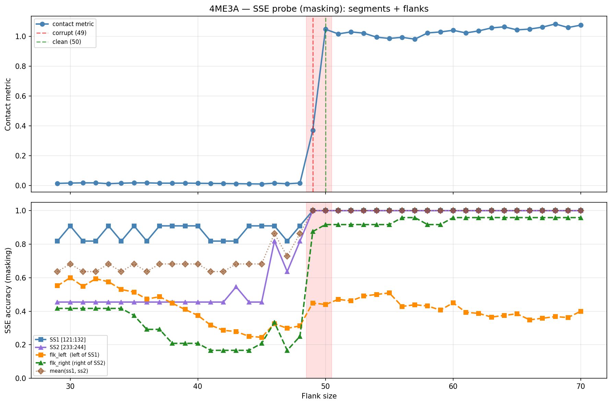

# SSE Probe Analysis: 4ME3A

Generated: 2026-03-03 15:59:51   Model: facebook/esm2_t33_650M_UR50D

## Configuration

| Parameter | Value |
|-----------|-------|
| Protein | 4ME3A |
| Contact pair | (126, 238) |
| ss1 | [121, 132) |
| ss2 | [233, 244) |
| Clean flank | 50 |
| Corrupt flank | 49 |
| Segment radius | 5 |
| Flank sweep | [29, 70] |
| Train sequences | 1,000 |
| Val sequences | 100 |
| Test sequences | 100 |

## SSE Probe Performance

| Split | Accuracy |
|-------|----------|
| Val   | 0.8240 |
| Test  | 0.8259 |

**Test classification report:**

```
              precision    recall  f1-score   support

           H       0.87      0.86      0.86     13101
           E       0.78      0.86      0.82     11471
           C       0.82      0.78      0.80     18602

    accuracy                           0.83     43174
   macro avg       0.83      0.83      0.83     43174
weighted avg       0.83      0.83      0.83     43174

```

## Ground-Truth SSE (full-sequence probe)

| Segment | Sequence |
|---------|----------|
| SS1 [121:132] | `CEEEEEEEEEE` |
| SS2 [233:244] | `EEEEEEEEEEE` |

## Flank Sweep Results

| flank | contact | mk_ss1 | mk_ss2 | mk_mean | mk_flkL | mk_flkR | mk_flk |
|-------|---------|--------|--------|---------|---------|---------|--------|
| 29 | 0.0145 | 0.818 | 0.455 | 0.636 | 0.552 | 0.417 | 0.484 |
| 30 | 0.0168 | 0.909 | 0.455 | 0.682 | 0.600 | 0.417 | 0.508 |
| 31 | 0.0181 | 0.818 | 0.455 | 0.636 | 0.548 | 0.417 | 0.483 |
| 32 | 0.0181 | 0.818 | 0.455 | 0.636 | 0.594 | 0.417 | 0.505 |
| 33 | 0.0125 | 0.909 | 0.455 | 0.682 | 0.576 | 0.417 | 0.496 |
| 34 | 0.0160 | 0.818 | 0.455 | 0.636 | 0.529 | 0.417 | 0.473 |
| 35 | 0.0181 | 0.909 | 0.455 | 0.682 | 0.514 | 0.375 | 0.445 |
| 36 | 0.0182 | 0.818 | 0.455 | 0.636 | 0.472 | 0.292 | 0.382 |
| 37 | 0.0161 | 0.909 | 0.455 | 0.682 | 0.486 | 0.292 | 0.389 |
| 38 | 0.0160 | 0.909 | 0.455 | 0.682 | 0.447 | 0.208 | 0.328 |
| 39 | 0.0165 | 0.909 | 0.455 | 0.682 | 0.410 | 0.208 | 0.309 |
| 40 | 0.0153 | 0.909 | 0.455 | 0.682 | 0.375 | 0.208 | 0.292 |
| 41 | 0.0143 | 0.818 | 0.455 | 0.636 | 0.317 | 0.167 | 0.242 |
| 42 | 0.0136 | 0.818 | 0.455 | 0.636 | 0.286 | 0.167 | 0.226 |
| 43 | 0.0127 | 0.818 | 0.545 | 0.682 | 0.279 | 0.167 | 0.223 |
| 44 | 0.0115 | 0.909 | 0.455 | 0.682 | 0.250 | 0.167 | 0.208 |
| 45 | 0.0105 | 0.909 | 0.455 | 0.682 | 0.244 | 0.208 | 0.226 |
| 46 | 0.0162 | 0.909 | 0.818 | 0.864 | 0.326 | 0.333 | 0.330 |
| 47 | 0.0120 | 0.818 | 0.636 | 0.727 | 0.298 | 0.167 | 0.232 |
| 48 | 0.0170 | 0.909 | 0.818 | 0.864 | 0.312 | 0.250 | 0.281 |
| 49 | 0.3699 | 1.000 | 1.000 | 1.000 | 0.449 | 0.875 | 0.662 |
| 50 | 1.0465 | 1.000 | 1.000 | 1.000 | 0.440 | 0.917 | 0.678 |
| 51 | 1.0157 | 1.000 | 1.000 | 1.000 | 0.471 | 0.917 | 0.694 |
| 52 | 1.0289 | 1.000 | 1.000 | 1.000 | 0.462 | 0.917 | 0.689 |
| 53 | 1.0208 | 1.000 | 1.000 | 1.000 | 0.491 | 0.917 | 0.704 |
| 54 | 0.9937 | 1.000 | 1.000 | 1.000 | 0.500 | 0.917 | 0.708 |
| 55 | 0.9852 | 1.000 | 1.000 | 1.000 | 0.509 | 0.917 | 0.713 |
| 56 | 0.9928 | 1.000 | 1.000 | 1.000 | 0.429 | 0.958 | 0.693 |
| 57 | 0.9805 | 1.000 | 1.000 | 1.000 | 0.439 | 0.958 | 0.698 |
| 58 | 1.0221 | 1.000 | 1.000 | 1.000 | 0.431 | 0.917 | 0.674 |
| 59 | 1.0287 | 1.000 | 1.000 | 1.000 | 0.407 | 0.917 | 0.662 |
| 60 | 1.0397 | 1.000 | 1.000 | 1.000 | 0.450 | 0.958 | 0.704 |
| 61 | 1.0221 | 1.000 | 1.000 | 1.000 | 0.393 | 0.958 | 0.676 |
| 62 | 1.0358 | 1.000 | 1.000 | 1.000 | 0.387 | 0.958 | 0.673 |
| 63 | 1.0556 | 1.000 | 1.000 | 1.000 | 0.365 | 0.958 | 0.662 |
| 64 | 1.0628 | 1.000 | 1.000 | 1.000 | 0.375 | 0.958 | 0.667 |
| 65 | 1.0426 | 1.000 | 1.000 | 1.000 | 0.385 | 0.958 | 0.671 |
| 66 | 1.0479 | 1.000 | 1.000 | 1.000 | 0.348 | 0.958 | 0.653 |
| 67 | 1.0609 | 1.000 | 1.000 | 1.000 | 0.358 | 0.958 | 0.658 |
| 68 | 1.0822 | 1.000 | 1.000 | 1.000 | 0.368 | 0.958 | 0.663 |
| 69 | 1.0583 | 1.000 | 1.000 | 1.000 | 0.362 | 0.958 | 0.660 |
| 70 | 1.0744 | 1.000 | 1.000 | 1.000 | 0.400 | 0.958 | 0.679 |

## Residue-Level Prediction Changes (clean=50, focus ±2)

### Flank 47 → 48

| Seg | Direction | Pos | gt | prev | now |
|-----|-----------|-----|----|------|-----|
| SS1 | incorr→corr | 126 | E | C | E |
| SS2 | incorr→corr | 236 | E | C | E |
| SS2 | incorr→corr | 237 | E | C | E |
| flk_L | corr→incorr | 93 | C | C | E |
| flk_L | incorr→corr | 98 | E | C | E |
| flk_L | incorr→corr | 100 | E | H | E |
| flk_L | incorr→corr | 103 | C | H | C |
| flk_L | incorr→corr | 105 | C | H | C |
| flk_L | corr→incorr | 106 | C | C | E |
| flk_L | incorr→corr | 109 | E | H | E |
| flk_L | corr→incorr | 112 | H | H | E |
| flk_L | corr→incorr | 116 | C | C | E |
| flk_R | incorr→corr | 262 | E | C | E |
| flk_R | incorr→corr | 265 | E | C | E |

### Flank 48 → 49

| Seg | Direction | Pos | gt | prev | now |
|-----|-----------|-----|----|------|-----|
| SS1 | incorr→corr | 121 | C | E | C |
| SS2 | incorr→corr | 242 | E | H | E |
| SS2 | incorr→corr | 243 | E | H | E |
| flk_L | incorr→corr | 83 | C | H | C |
| flk_L | incorr→corr | 87 | C | H | C |
| flk_L | incorr→corr | 88 | C | H | C |
| flk_L | corr→incorr | 89 | H | H | C |
| flk_L | incorr→corr | 91 | C | H | C |
| flk_L | incorr→corr | 92 | C | H | C |
| flk_L | incorr→corr | 97 | E | H | E |
| flk_L | incorr→corr | 99 | E | H | E |
| flk_L | incorr→corr | 102 | C | H | C |
| flk_L | corr→incorr | 107 | C | C | E |
| flk_L | corr→incorr | 111 | H | H | E |
| flk_L | incorr→corr | 114 | C | H | C |
| flk_L | incorr→corr | 116 | C | E | C |
| flk_R | incorr→corr | 244 | E | H | E |
| flk_R | incorr→corr | 245 | E | C | E |
| flk_R | incorr→corr | 246 | E | C | E |
| flk_R | incorr→corr | 252 | C | H | C |
| flk_R | incorr→corr | 253 | E | H | E |
| flk_R | incorr→corr | 254 | E | H | E |
| flk_R | incorr→corr | 255 | E | H | E |
| flk_R | incorr→corr | 256 | E | H | E |
| flk_R | incorr→corr | 257 | E | H | E |
| flk_R | incorr→corr | 258 | E | H | E |
| flk_R | incorr→corr | 259 | E | H | E |
| flk_R | incorr→corr | 260 | E | C | E |
| flk_R | incorr→corr | 261 | E | H | E |
| flk_R | incorr→corr | 263 | E | C | E |
| flk_R | incorr→corr | 264 | E | C | E |

### Flank 49 → 50

| Seg | Direction | Pos | gt | prev | now |
|-----|-----------|-----|----|------|-----|
| flk_L | corr→incorr | 87 | C | C | E |
| flk_L | incorr→corr | 90 | C | E | C |
| flk_L | corr→incorr | 99 | E | E | C |
| flk_L | incorr→corr | 106 | C | E | C |
| flk_L | incorr→corr | 107 | C | E | C |
| flk_L | corr→incorr | 116 | C | C | H |
| flk_R | incorr→corr | 250 | E | C | E |
| flk_R | incorr→corr | 251 | E | C | E |
| flk_R | corr→incorr | 252 | C | C | E |

### Flank 50 → 51

| Seg | Direction | Pos | gt | prev | now |
|-----|-----------|-----|----|------|-----|
| flk_L | incorr→corr | 87 | C | E | C |
| flk_L | incorr→corr | 101 | C | E | C |

### Flank 51 → 52

| Seg | Direction | Pos | gt | prev | now |
|-----|-----------|-----|----|------|-----|
| flk_L | corr→incorr | 87 | C | C | E |
| flk_L | corr→incorr | 92 | C | C | E |
| flk_L | incorr→corr | 99 | E | C | E |
| flk_L | corr→incorr | 101 | C | C | E |
| flk_L | incorr→corr | 111 | H | C | H |
| flk_L | incorr→corr | 113 | H | C | H |

## Plot


