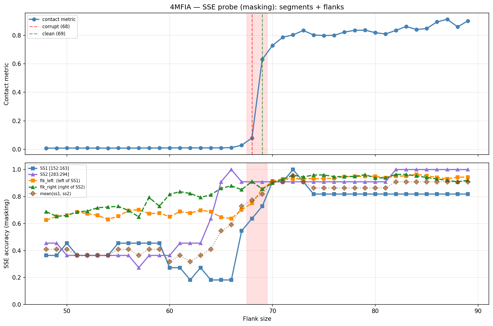

# SSE Probe Analysis: 4MFIA

Generated: 2026-03-03 15:59:59   Model: facebook/esm2_t33_650M_UR50D

## Configuration

| Parameter | Value |
|-----------|-------|
| Protein | 4MFIA |
| Contact pair | (157, 288) |
| ss1 | [152, 163) |
| ss2 | [283, 294) |
| Clean flank | 69 |
| Corrupt flank | 68 |
| Segment radius | 5 |
| Flank sweep | [48, 89] |
| Train sequences | 1,000 |
| Val sequences | 100 |
| Test sequences | 100 |

## SSE Probe Performance

| Split | Accuracy |
|-------|----------|
| Val   | 0.8240 |
| Test  | 0.8259 |

**Test classification report:**

```
              precision    recall  f1-score   support

           H       0.87      0.86      0.86     13101
           E       0.78      0.86      0.82     11471
           C       0.82      0.78      0.80     18602

    accuracy                           0.83     43174
   macro avg       0.83      0.83      0.83     43174
weighted avg       0.83      0.83      0.83     43174

```

## Ground-Truth SSE (full-sequence probe)

| Segment | Sequence |
|---------|----------|
| SS1 [152:163] | `ECEEEEEEHHH` |
| SS2 [283:294] | `CCCEEEEECCC` |

## Flank Sweep Results

| flank | contact | mk_ss1 | mk_ss2 | mk_mean | mk_flkL | mk_flkR | mk_flk |
|-------|---------|--------|--------|---------|---------|---------|--------|
| 48 | 0.0088 | 0.364 | 0.455 | 0.409 | 0.625 | 0.688 | 0.656 |
| 49 | 0.0088 | 0.364 | 0.455 | 0.409 | 0.653 | 0.653 | 0.653 |
| 50 | 0.0089 | 0.455 | 0.364 | 0.409 | 0.660 | 0.660 | 0.660 |
| 51 | 0.0090 | 0.364 | 0.364 | 0.364 | 0.686 | 0.686 | 0.686 |
| 52 | 0.0090 | 0.364 | 0.364 | 0.364 | 0.673 | 0.692 | 0.683 |
| 53 | 0.0089 | 0.364 | 0.364 | 0.364 | 0.660 | 0.717 | 0.689 |
| 54 | 0.0089 | 0.364 | 0.364 | 0.364 | 0.630 | 0.722 | 0.676 |
| 55 | 0.0089 | 0.455 | 0.364 | 0.409 | 0.655 | 0.727 | 0.691 |
| 56 | 0.0089 | 0.455 | 0.364 | 0.409 | 0.696 | 0.696 | 0.696 |
| 57 | 0.0090 | 0.455 | 0.273 | 0.364 | 0.702 | 0.649 | 0.675 |
| 58 | 0.0097 | 0.455 | 0.364 | 0.409 | 0.672 | 0.793 | 0.733 |
| 59 | 0.0097 | 0.455 | 0.364 | 0.409 | 0.678 | 0.729 | 0.703 |
| 60 | 0.0103 | 0.273 | 0.364 | 0.318 | 0.650 | 0.817 | 0.733 |
| 61 | 0.0104 | 0.273 | 0.455 | 0.364 | 0.689 | 0.836 | 0.762 |
| 62 | 0.0107 | 0.182 | 0.455 | 0.318 | 0.677 | 0.823 | 0.750 |
| 63 | 0.0102 | 0.273 | 0.455 | 0.364 | 0.698 | 0.794 | 0.746 |
| 64 | 0.0103 | 0.182 | 0.636 | 0.409 | 0.688 | 0.812 | 0.750 |
| 65 | 0.0108 | 0.182 | 0.909 | 0.545 | 0.646 | 0.862 | 0.754 |
| 66 | 0.0122 | 0.182 | 1.000 | 0.591 | 0.636 | 0.879 | 0.758 |
| 67 | 0.0287 | 0.545 | 0.909 | 0.727 | 0.701 | 0.851 | 0.776 |
| 68 | 0.0796 | 0.636 | 0.909 | 0.773 | 0.750 | 0.912 | 0.831 |
| 69 | 0.6302 | 0.727 | 0.909 | 0.818 | 0.855 | 0.855 | 0.855 |
| 70 | 0.7285 | 0.909 | 0.909 | 0.909 | 0.914 | 0.900 | 0.907 |
| 71 | 0.7855 | 0.909 | 0.909 | 0.909 | 0.930 | 0.930 | 0.930 |
| 72 | 0.8026 | 1.000 | 0.909 | 0.955 | 0.931 | 0.958 | 0.944 |
| 73 | 0.8334 | 0.909 | 0.909 | 0.909 | 0.932 | 0.945 | 0.938 |
| 74 | 0.8019 | 0.818 | 0.909 | 0.864 | 0.932 | 0.959 | 0.946 |
| 75 | 0.7983 | 0.818 | 0.909 | 0.864 | 0.933 | 0.960 | 0.947 |
| 76 | 0.7994 | 0.818 | 0.909 | 0.864 | 0.934 | 0.947 | 0.941 |
| 77 | 0.8224 | 0.818 | 0.909 | 0.864 | 0.948 | 0.948 | 0.948 |
| 78 | 0.8346 | 0.818 | 0.909 | 0.864 | 0.949 | 0.949 | 0.949 |
| 79 | 0.8358 | 0.818 | 0.909 | 0.864 | 0.949 | 0.962 | 0.956 |
| 80 | 0.8180 | 0.818 | 0.909 | 0.864 | 0.950 | 0.938 | 0.944 |
| 81 | 0.8090 | 0.818 | 0.909 | 0.864 | 0.938 | 0.938 | 0.938 |
| 82 | 0.8339 | 0.818 | 1.000 | 0.909 | 0.951 | 0.963 | 0.957 |
| 83 | 0.8615 | 0.818 | 1.000 | 0.909 | 0.952 | 0.964 | 0.958 |
| 84 | 0.8400 | 0.818 | 1.000 | 0.909 | 0.964 | 0.952 | 0.958 |
| 85 | 0.8472 | 0.818 | 1.000 | 0.909 | 0.953 | 0.941 | 0.947 |
| 86 | 0.8937 | 0.818 | 1.000 | 0.909 | 0.942 | 0.930 | 0.936 |
| 87 | 0.9119 | 0.818 | 1.000 | 0.909 | 0.931 | 0.920 | 0.925 |
| 88 | 0.8590 | 0.818 | 1.000 | 0.909 | 0.943 | 0.909 | 0.926 |
| 89 | 0.9003 | 0.818 | 1.000 | 0.909 | 0.944 | 0.921 | 0.933 |

## Residue-Level Prediction Changes (clean=69, focus ±2)

### Flank 66 → 67

| Seg | Direction | Pos | gt | prev | now |
|-----|-----------|-----|----|------|-----|
| SS1 | incorr→corr | 154 | E | C | E |
| SS1 | incorr→corr | 155 | E | C | E |
| SS1 | incorr→corr | 156 | E | H | E |
| SS1 | incorr→corr | 158 | E | C | E |
| SS2 | corr→incorr | 291 | C | C | E |
| flk_L | corr→incorr | 87 | H | H | C |
| flk_L | incorr→corr | 103 | H | E | H |
| flk_L | incorr→corr | 104 | H | C | H |
| flk_L | incorr→corr | 108 | H | C | H |
| flk_L | incorr→corr | 109 | H | C | H |
| flk_L | incorr→corr | 111 | C | H | C |
| flk_L | incorr→corr | 138 | E | C | E |
| flk_R | corr→incorr | 353 | H | H | C |
| flk_R | corr→incorr | 356 | H | H | C |
| flk_R | incorr→corr | 357 | H | C | H |

### Flank 67 → 68

| Seg | Direction | Pos | gt | prev | now |
|-----|-----------|-----|----|------|-----|
| SS1 | incorr→corr | 160 | H | C | H |
| flk_L | incorr→corr | 85 | H | C | H |
| flk_L | incorr→corr | 115 | C | H | C |
| flk_L | incorr→corr | 121 | H | C | H |
| flk_L | incorr→corr | 147 | E | C | E |
| flk_R | incorr→corr | 330 | H | C | H |
| flk_R | incorr→corr | 354 | C | H | C |
| flk_R | incorr→corr | 358 | H | C | H |
| flk_R | incorr→corr | 359 | H | C | H |
| flk_R | incorr→corr | 360 | H | C | H |

### Flank 68 → 69

| Seg | Direction | Pos | gt | prev | now |
|-----|-----------|-----|----|------|-----|
| SS1 | corr→incorr | 153 | C | C | E |
| SS1 | incorr→corr | 159 | E | C | E |
| SS1 | incorr→corr | 162 | H | C | H |
| flk_L | incorr→corr | 84 | H | C | H |
| flk_L | incorr→corr | 87 | H | C | H |
| flk_L | incorr→corr | 88 | H | C | H |
| flk_L | corr→incorr | 102 | C | C | H |
| flk_L | incorr→corr | 114 | E | C | E |
| flk_L | corr→incorr | 115 | C | C | E |
| flk_L | incorr→corr | 122 | H | C | H |
| flk_L | incorr→corr | 127 | C | H | C |
| flk_L | incorr→corr | 128 | C | H | C |
| flk_L | incorr→corr | 130 | C | H | C |
| flk_L | incorr→corr | 131 | C | H | C |
| flk_L | incorr→corr | 135 | H | C | H |
| flk_L | corr→incorr | 138 | E | E | C |
| flk_L | corr→incorr | 139 | E | E | C |
| flk_L | corr→incorr | 143 | E | E | C |
| flk_L | incorr→corr | 148 | E | C | E |
| flk_L | incorr→corr | 149 | E | C | E |
| flk_L | corr→incorr | 150 | C | C | E |
| flk_L | incorr→corr | 151 | E | C | E |
| flk_R | corr→incorr | 301 | E | E | C |
| flk_R | corr→incorr | 330 | H | H | C |
| flk_R | corr→incorr | 340 | H | H | C |
| flk_R | corr→incorr | 341 | H | H | C |
| flk_R | incorr→corr | 345 | E | C | E |
| flk_R | corr→incorr | 355 | H | H | C |
| flk_R | incorr→corr | 361 | H | C | H |

### Flank 69 → 70

| Seg | Direction | Pos | gt | prev | now |
|-----|-----------|-----|----|------|-----|
| SS1 | incorr→corr | 152 | E | C | E |
| SS1 | incorr→corr | 161 | H | C | H |
| flk_L | incorr→corr | 115 | C | E | C |
| flk_L | incorr→corr | 136 | H | C | H |
| flk_L | incorr→corr | 137 | H | C | H |
| flk_L | incorr→corr | 139 | E | C | E |
| flk_R | incorr→corr | 304 | E | C | E |
| flk_R | incorr→corr | 340 | H | C | H |
| flk_R | incorr→corr | 341 | H | C | H |
| flk_R | incorr→corr | 355 | H | C | H |
| flk_R | incorr→corr | 356 | H | C | H |
| flk_R | corr→incorr | 361 | H | H | C |

### Flank 70 → 71

| Seg | Direction | Pos | gt | prev | now |
|-----|-----------|-----|----|------|-----|
| flk_L | incorr→corr | 116 | C | H | C |
| flk_R | incorr→corr | 301 | E | C | E |
| flk_R | incorr→corr | 330 | H | C | H |

## Plot


