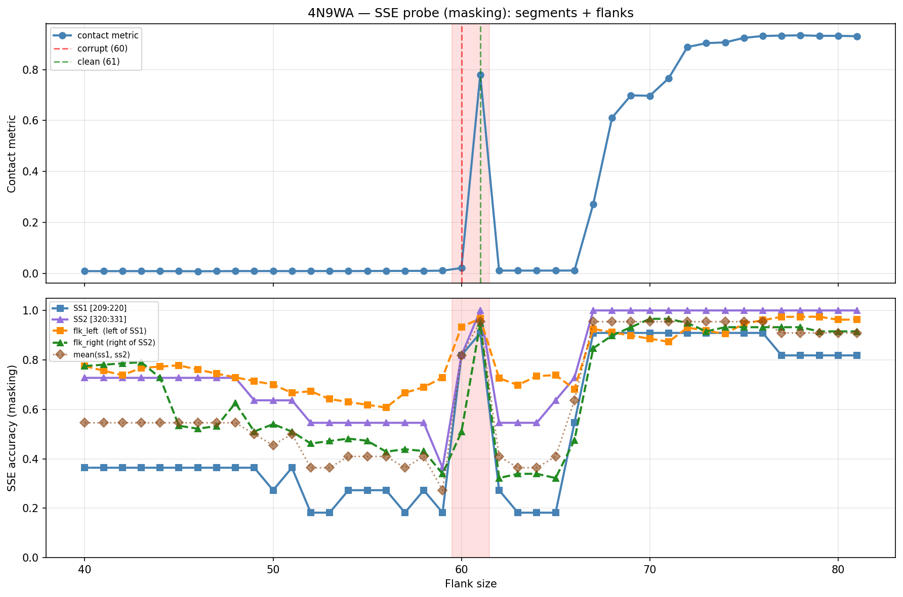

# SSE Probe Analysis: 4N9WA

Generated: 2026-03-03 16:00:06   Model: facebook/esm2_t33_650M_UR50D

## Configuration

| Parameter | Value |
|-----------|-------|
| Protein | 4N9WA |
| Contact pair | (214, 325) |
| ss1 | [209, 220) |
| ss2 | [320, 331) |
| Clean flank | 61 |
| Corrupt flank | 60 |
| Segment radius | 5 |
| Flank sweep | [40, 81] |
| Train sequences | 1,000 |
| Val sequences | 100 |
| Test sequences | 100 |

## SSE Probe Performance

| Split | Accuracy |
|-------|----------|
| Val   | 0.8240 |
| Test  | 0.8259 |

**Test classification report:**

```
              precision    recall  f1-score   support

           H       0.87      0.86      0.86     13101
           E       0.78      0.86      0.82     11471
           C       0.82      0.78      0.80     18602

    accuracy                           0.83     43174
   macro avg       0.83      0.83      0.83     43174
weighted avg       0.83      0.83      0.83     43174

```

## Ground-Truth SSE (full-sequence probe)

| Segment | Sequence |
|---------|----------|
| SS1 [209:220] | `HHHHHHHHHHH` |
| SS2 [320:331] | `HHHHHHHHHHH` |

## Flank Sweep Results

| flank | contact | mk_ss1 | mk_ss2 | mk_mean | mk_flkL | mk_flkR | mk_flk |
|-------|---------|--------|--------|---------|---------|---------|--------|
| 40 | 0.0089 | 0.364 | 0.727 | 0.545 | 0.775 | 0.775 | 0.775 |
| 41 | 0.0088 | 0.364 | 0.727 | 0.545 | 0.756 | 0.780 | 0.768 |
| 42 | 0.0090 | 0.364 | 0.727 | 0.545 | 0.738 | 0.786 | 0.762 |
| 43 | 0.0089 | 0.364 | 0.727 | 0.545 | 0.767 | 0.791 | 0.779 |
| 44 | 0.0089 | 0.364 | 0.727 | 0.545 | 0.773 | 0.727 | 0.750 |
| 45 | 0.0087 | 0.364 | 0.727 | 0.545 | 0.778 | 0.533 | 0.656 |
| 46 | 0.0085 | 0.364 | 0.727 | 0.545 | 0.761 | 0.522 | 0.641 |
| 47 | 0.0087 | 0.364 | 0.727 | 0.545 | 0.745 | 0.532 | 0.638 |
| 48 | 0.0091 | 0.364 | 0.727 | 0.545 | 0.729 | 0.625 | 0.677 |
| 49 | 0.0092 | 0.364 | 0.636 | 0.500 | 0.714 | 0.510 | 0.612 |
| 50 | 0.0092 | 0.273 | 0.636 | 0.455 | 0.700 | 0.540 | 0.620 |
| 51 | 0.0091 | 0.364 | 0.636 | 0.500 | 0.667 | 0.510 | 0.588 |
| 52 | 0.0092 | 0.182 | 0.545 | 0.364 | 0.673 | 0.462 | 0.567 |
| 53 | 0.0093 | 0.182 | 0.545 | 0.364 | 0.642 | 0.472 | 0.557 |
| 54 | 0.0091 | 0.273 | 0.545 | 0.409 | 0.630 | 0.481 | 0.556 |
| 55 | 0.0094 | 0.273 | 0.545 | 0.409 | 0.618 | 0.473 | 0.545 |
| 56 | 0.0096 | 0.273 | 0.545 | 0.409 | 0.607 | 0.429 | 0.518 |
| 57 | 0.0099 | 0.182 | 0.545 | 0.364 | 0.667 | 0.439 | 0.553 |
| 58 | 0.0099 | 0.273 | 0.545 | 0.409 | 0.690 | 0.431 | 0.560 |
| 59 | 0.0107 | 0.182 | 0.364 | 0.273 | 0.729 | 0.339 | 0.534 |
| 60 | 0.0212 | 0.818 | 0.818 | 0.818 | 0.933 | 0.508 | 0.721 |
| 61 | 0.7791 | 0.909 | 1.000 | 0.955 | 0.967 | 0.949 | 0.958 |
| 62 | 0.0111 | 0.273 | 0.545 | 0.409 | 0.726 | 0.322 | 0.524 |
| 63 | 0.0110 | 0.182 | 0.545 | 0.364 | 0.698 | 0.339 | 0.519 |
| 64 | 0.0111 | 0.182 | 0.545 | 0.364 | 0.734 | 0.339 | 0.537 |
| 65 | 0.0110 | 0.182 | 0.636 | 0.409 | 0.738 | 0.322 | 0.530 |
| 66 | 0.0113 | 0.545 | 0.727 | 0.636 | 0.682 | 0.475 | 0.578 |
| 67 | 0.2721 | 0.909 | 1.000 | 0.955 | 0.925 | 0.847 | 0.886 |
| 68 | 0.6112 | 0.909 | 1.000 | 0.955 | 0.912 | 0.898 | 0.905 |
| 69 | 0.6987 | 0.909 | 1.000 | 0.955 | 0.899 | 0.932 | 0.915 |
| 70 | 0.6969 | 0.909 | 1.000 | 0.955 | 0.886 | 0.966 | 0.926 |
| 71 | 0.7653 | 0.909 | 1.000 | 0.955 | 0.873 | 0.966 | 0.920 |
| 72 | 0.8881 | 0.909 | 1.000 | 0.955 | 0.931 | 0.949 | 0.940 |
| 73 | 0.9034 | 0.909 | 1.000 | 0.955 | 0.918 | 0.915 | 0.917 |
| 74 | 0.9065 | 0.909 | 1.000 | 0.955 | 0.905 | 0.932 | 0.919 |
| 75 | 0.9241 | 0.909 | 1.000 | 0.955 | 0.947 | 0.932 | 0.939 |
| 76 | 0.9316 | 0.909 | 1.000 | 0.955 | 0.961 | 0.932 | 0.946 |
| 77 | 0.9329 | 0.818 | 1.000 | 0.909 | 0.974 | 0.932 | 0.953 |
| 78 | 0.9342 | 0.818 | 1.000 | 0.909 | 0.974 | 0.932 | 0.953 |
| 79 | 0.9321 | 0.818 | 1.000 | 0.909 | 0.975 | 0.915 | 0.945 |
| 80 | 0.9321 | 0.818 | 1.000 | 0.909 | 0.963 | 0.915 | 0.939 |
| 81 | 0.9307 | 0.818 | 1.000 | 0.909 | 0.963 | 0.915 | 0.939 |

## Residue-Level Prediction Changes (clean=61, focus ±2)

### Flank 58 → 59

| Seg | Direction | Pos | gt | prev | now |
|-----|-----------|-----|----|------|-----|
| SS1 | corr→incorr | 211 | H | H | C |
| SS2 | corr→incorr | 323 | H | H | C |
| SS2 | corr→incorr | 329 | H | H | C |
| flk_L | incorr→corr | 156 | H | C | H |
| flk_L | incorr→corr | 174 | C | E | C |
| flk_R | corr→incorr | 341 | H | H | E |
| flk_R | corr→incorr | 343 | H | H | C |
| flk_R | corr→incorr | 344 | H | H | C |
| flk_R | corr→incorr | 356 | H | H | C |
| flk_R | corr→incorr | 381 | C | C | E |
| flk_R | corr→incorr | 388 | C | C | E |

### Flank 59 → 60

| Seg | Direction | Pos | gt | prev | now |
|-----|-----------|-----|----|------|-----|
| SS1 | incorr→corr | 211 | H | C | H |
| SS1 | incorr→corr | 212 | H | C | H |
| SS1 | incorr→corr | 213 | H | C | H |
| SS1 | incorr→corr | 214 | H | C | H |
| SS1 | incorr→corr | 215 | H | C | H |
| SS1 | incorr→corr | 216 | H | C | H |
| SS1 | incorr→corr | 217 | H | C | H |
| SS2 | incorr→corr | 321 | H | C | H |
| SS2 | incorr→corr | 323 | H | C | H |
| SS2 | incorr→corr | 327 | H | C | H |
| SS2 | incorr→corr | 328 | H | C | H |
| SS2 | incorr→corr | 329 | H | C | H |
| flk_L | incorr→corr | 152 | H | C | H |
| flk_L | incorr→corr | 155 | H | C | H |
| flk_L | incorr→corr | 158 | H | C | H |
| flk_L | incorr→corr | 161 | H | C | H |
| flk_L | incorr→corr | 167 | E | C | E |
| flk_L | incorr→corr | 168 | E | C | E |
| flk_L | incorr→corr | 169 | E | C | E |
| flk_L | incorr→corr | 176 | H | C | H |
| flk_L | incorr→corr | 177 | H | C | H |
| flk_L | incorr→corr | 178 | H | C | H |
| flk_L | incorr→corr | 196 | E | C | E |
| flk_L | incorr→corr | 197 | E | C | E |
| flk_L | corr→incorr | 203 | H | H | C |
| flk_L | incorr→corr | 207 | H | C | H |
| flk_R | incorr→corr | 338 | H | C | H |
| flk_R | incorr→corr | 339 | H | C | H |
| flk_R | incorr→corr | 340 | H | C | H |
| flk_R | incorr→corr | 341 | H | E | H |
| flk_R | incorr→corr | 342 | H | E | H |
| flk_R | incorr→corr | 343 | H | C | H |
| flk_R | incorr→corr | 344 | H | C | H |
| flk_R | incorr→corr | 346 | H | E | H |
| flk_R | incorr→corr | 347 | H | C | H |
| flk_R | incorr→corr | 350 | C | E | C |
| flk_R | incorr→corr | 352 | H | C | H |
| flk_R | incorr→corr | 354 | H | E | H |
| flk_R | incorr→corr | 356 | H | C | H |
| flk_R | incorr→corr | 358 | H | C | H |
| flk_R | incorr→corr | 359 | H | E | H |
| flk_R | incorr→corr | 360 | H | C | H |
| flk_R | incorr→corr | 362 | H | E | H |
| flk_R | incorr→corr | 363 | H | E | H |
| flk_R | corr→incorr | 370 | C | C | E |
| flk_R | corr→incorr | 371 | C | C | E |
| flk_R | corr→incorr | 372 | C | C | E |
| flk_R | corr→incorr | 376 | C | C | E |
| flk_R | corr→incorr | 379 | C | C | E |
| flk_R | incorr→corr | 381 | C | E | C |
| flk_R | corr→incorr | 382 | C | C | E |
| flk_R | corr→incorr | 384 | C | C | E |
| flk_R | corr→incorr | 385 | C | C | E |
| flk_R | corr→incorr | 389 | C | C | E |

### Flank 60 → 61

| Seg | Direction | Pos | gt | prev | now |
|-----|-----------|-----|----|------|-----|
| SS1 | incorr→corr | 218 | H | C | H |
| SS2 | incorr→corr | 320 | H | C | H |
| SS2 | incorr→corr | 330 | H | C | H |
| flk_L | incorr→corr | 179 | H | C | H |
| flk_L | incorr→corr | 203 | H | C | H |
| flk_R | incorr→corr | 333 | H | C | H |
| flk_R | incorr→corr | 334 | H | C | H |
| flk_R | incorr→corr | 336 | H | C | H |
| flk_R | incorr→corr | 337 | H | C | H |
| flk_R | incorr→corr | 345 | H | C | H |
| flk_R | incorr→corr | 349 | H | C | H |
| flk_R | incorr→corr | 353 | H | E | H |
| flk_R | incorr→corr | 355 | H | C | H |
| flk_R | incorr→corr | 357 | H | C | H |
| flk_R | incorr→corr | 361 | H | E | H |
| flk_R | incorr→corr | 364 | H | C | H |
| flk_R | incorr→corr | 365 | H | E | H |
| flk_R | incorr→corr | 366 | H | C | H |
| flk_R | incorr→corr | 367 | H | C | H |
| flk_R | incorr→corr | 370 | C | E | C |
| flk_R | incorr→corr | 371 | C | E | C |
| flk_R | incorr→corr | 372 | C | E | C |
| flk_R | incorr→corr | 373 | C | E | C |
| flk_R | incorr→corr | 375 | C | E | C |
| flk_R | incorr→corr | 376 | C | E | C |
| flk_R | incorr→corr | 379 | C | E | C |
| flk_R | incorr→corr | 382 | C | E | C |
| flk_R | incorr→corr | 384 | C | E | C |
| flk_R | incorr→corr | 385 | C | E | C |
| flk_R | incorr→corr | 388 | C | E | C |
| flk_R | incorr→corr | 389 | C | E | C |

### Flank 61 → 62

| Seg | Direction | Pos | gt | prev | now |
|-----|-----------|-----|----|------|-----|
| SS1 | corr→incorr | 212 | H | H | C |
| SS1 | corr→incorr | 213 | H | H | C |
| SS1 | corr→incorr | 214 | H | H | C |
| SS1 | corr→incorr | 215 | H | H | C |
| SS1 | corr→incorr | 216 | H | H | C |
| SS1 | corr→incorr | 217 | H | H | C |
| SS1 | corr→incorr | 218 | H | H | C |
| SS2 | corr→incorr | 320 | H | H | C |
| SS2 | corr→incorr | 321 | H | H | C |
| SS2 | corr→incorr | 327 | H | H | C |
| SS2 | corr→incorr | 328 | H | H | C |
| SS2 | corr→incorr | 330 | H | H | C |
| flk_L | corr→incorr | 148 | E | E | C |
| flk_L | corr→incorr | 149 | E | E | C |
| flk_L | corr→incorr | 151 | C | C | H |
| flk_L | corr→incorr | 152 | H | H | C |
| flk_L | corr→incorr | 158 | H | H | C |
| flk_L | corr→incorr | 167 | E | E | C |
| flk_L | corr→incorr | 168 | E | E | C |
| flk_L | corr→incorr | 169 | E | E | C |
| flk_L | corr→incorr | 176 | H | H | C |
| flk_L | corr→incorr | 177 | H | H | C |
| flk_L | corr→incorr | 178 | H | H | C |
| flk_L | corr→incorr | 179 | H | H | C |
| flk_L | corr→incorr | 192 | C | C | E |
| flk_L | corr→incorr | 207 | H | H | C |
| flk_R | corr→incorr | 333 | H | H | C |
| flk_R | corr→incorr | 334 | H | H | C |
| flk_R | corr→incorr | 337 | H | H | C |
| flk_R | corr→incorr | 338 | H | H | C |
| flk_R | corr→incorr | 339 | H | H | C |
| flk_R | corr→incorr | 340 | H | H | C |
| flk_R | corr→incorr | 341 | H | H | E |
| flk_R | corr→incorr | 342 | H | H | E |
| flk_R | corr→incorr | 345 | H | H | C |
| flk_R | corr→incorr | 346 | H | H | E |
| flk_R | corr→incorr | 347 | H | H | C |
| flk_R | corr→incorr | 349 | H | H | E |
| flk_R | corr→incorr | 350 | C | C | E |
| flk_R | corr→incorr | 352 | H | H | E |
| flk_R | corr→incorr | 353 | H | H | E |
| flk_R | corr→incorr | 354 | H | H | E |
| flk_R | corr→incorr | 355 | H | H | C |
| flk_R | corr→incorr | 356 | H | H | C |
| flk_R | corr→incorr | 357 | H | H | C |
| flk_R | corr→incorr | 358 | H | H | C |
| flk_R | corr→incorr | 359 | H | H | E |
| flk_R | corr→incorr | 360 | H | H | E |
| flk_R | corr→incorr | 361 | H | H | E |
| flk_R | corr→incorr | 362 | H | H | E |
| flk_R | corr→incorr | 363 | H | H | E |
| flk_R | corr→incorr | 364 | H | H | C |
| flk_R | corr→incorr | 365 | H | H | E |
| flk_R | corr→incorr | 366 | H | H | C |
| flk_R | corr→incorr | 367 | H | H | C |
| flk_R | corr→incorr | 370 | C | C | E |
| flk_R | corr→incorr | 372 | C | C | E |
| flk_R | corr→incorr | 373 | C | C | E |
| flk_R | corr→incorr | 375 | C | C | E |
| flk_R | corr→incorr | 376 | C | C | E |
| flk_R | corr→incorr | 381 | C | C | E |
| flk_R | corr→incorr | 388 | C | C | E |
| flk_R | corr→incorr | 389 | C | C | E |

### Flank 62 → 63

| Seg | Direction | Pos | gt | prev | now |
|-----|-----------|-----|----|------|-----|
| SS1 | corr→incorr | 211 | H | H | E |
| flk_L | incorr→corr | 151 | C | H | C |
| flk_L | corr→incorr | 155 | H | H | C |
| flk_L | corr→incorr | 156 | H | H | C |
| flk_R | incorr→corr | 370 | C | E | C |

## Plot


