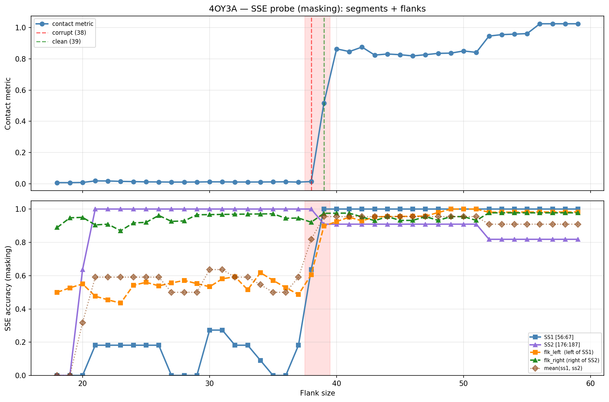

# SSE Probe Analysis: 4OY3A

Generated: 2026-03-03 16:00:11   Model: facebook/esm2_t33_650M_UR50D

## Configuration

| Parameter | Value |
|-----------|-------|
| Protein | 4OY3A |
| Contact pair | (61, 181) |
| ss1 | [56, 67) |
| ss2 | [176, 187) |
| Clean flank | 39 |
| Corrupt flank | 38 |
| Segment radius | 5 |
| Flank sweep | [18, 59] |
| Train sequences | 1,000 |
| Val sequences | 100 |
| Test sequences | 100 |

## SSE Probe Performance

| Split | Accuracy |
|-------|----------|
| Val   | 0.8240 |
| Test  | 0.8259 |

**Test classification report:**

```
              precision    recall  f1-score   support

           H       0.87      0.86      0.86     13101
           E       0.78      0.86      0.82     11471
           C       0.82      0.78      0.80     18602

    accuracy                           0.83     43174
   macro avg       0.83      0.83      0.83     43174
weighted avg       0.83      0.83      0.83     43174

```

## Ground-Truth SSE (full-sequence probe)

| Segment | Sequence |
|---------|----------|
| SS1 [56:67] | `HHHHHHHHHHH` |
| SS2 [176:187] | `HHHHHHHHHHH` |

## Flank Sweep Results

| flank | contact | mk_ss1 | mk_ss2 | mk_mean | mk_flkL | mk_flkR | mk_flk |
|-------|---------|--------|--------|---------|---------|---------|--------|
| 18 | 0.0071 | 0.000 | 0.000 | 0.000 | 0.500 | 0.889 | 0.694 |
| 19 | 0.0069 | 0.000 | 0.000 | 0.000 | 0.526 | 0.947 | 0.737 |
| 20 | 0.0080 | 0.000 | 0.636 | 0.318 | 0.550 | 0.950 | 0.750 |
| 21 | 0.0181 | 0.182 | 1.000 | 0.591 | 0.476 | 0.905 | 0.690 |
| 22 | 0.0178 | 0.182 | 1.000 | 0.591 | 0.455 | 0.909 | 0.682 |
| 23 | 0.0150 | 0.182 | 1.000 | 0.591 | 0.435 | 0.870 | 0.652 |
| 24 | 0.0136 | 0.182 | 1.000 | 0.591 | 0.542 | 0.917 | 0.729 |
| 25 | 0.0118 | 0.182 | 1.000 | 0.591 | 0.560 | 0.920 | 0.740 |
| 26 | 0.0114 | 0.182 | 1.000 | 0.591 | 0.538 | 0.962 | 0.750 |
| 27 | 0.0105 | 0.000 | 1.000 | 0.500 | 0.556 | 0.926 | 0.741 |
| 28 | 0.0106 | 0.000 | 1.000 | 0.500 | 0.571 | 0.929 | 0.750 |
| 29 | 0.0109 | 0.000 | 1.000 | 0.500 | 0.552 | 0.966 | 0.759 |
| 30 | 0.0122 | 0.273 | 1.000 | 0.636 | 0.533 | 0.967 | 0.750 |
| 31 | 0.0117 | 0.273 | 1.000 | 0.636 | 0.581 | 0.968 | 0.774 |
| 32 | 0.0110 | 0.182 | 1.000 | 0.591 | 0.594 | 0.969 | 0.781 |
| 33 | 0.0109 | 0.182 | 1.000 | 0.591 | 0.515 | 0.970 | 0.742 |
| 34 | 0.0110 | 0.091 | 1.000 | 0.545 | 0.618 | 0.971 | 0.794 |
| 35 | 0.0115 | 0.000 | 1.000 | 0.500 | 0.571 | 0.971 | 0.771 |
| 36 | 0.0123 | 0.000 | 1.000 | 0.500 | 0.528 | 0.944 | 0.736 |
| 37 | 0.0103 | 0.182 | 1.000 | 0.591 | 0.486 | 0.946 | 0.716 |
| 38 | 0.0137 | 0.636 | 1.000 | 0.818 | 0.605 | 0.921 | 0.763 |
| 39 | 0.5170 | 1.000 | 0.909 | 0.955 | 0.897 | 0.974 | 0.936 |
| 40 | 0.8642 | 1.000 | 0.909 | 0.955 | 0.925 | 0.975 | 0.950 |
| 41 | 0.8468 | 1.000 | 0.909 | 0.955 | 0.951 | 0.976 | 0.963 |
| 42 | 0.8757 | 1.000 | 0.909 | 0.955 | 0.929 | 0.952 | 0.940 |
| 43 | 0.8243 | 1.000 | 0.909 | 0.955 | 0.953 | 0.930 | 0.942 |
| 44 | 0.8312 | 1.000 | 0.909 | 0.955 | 0.955 | 0.955 | 0.955 |
| 45 | 0.8267 | 1.000 | 0.909 | 0.955 | 0.956 | 0.932 | 0.944 |
| 46 | 0.8189 | 1.000 | 0.909 | 0.955 | 0.957 | 0.932 | 0.944 |
| 47 | 0.8268 | 1.000 | 0.909 | 0.955 | 0.957 | 0.955 | 0.956 |
| 48 | 0.8353 | 1.000 | 0.909 | 0.955 | 0.979 | 0.932 | 0.955 |
| 49 | 0.8368 | 1.000 | 0.909 | 0.955 | 1.000 | 0.955 | 0.977 |
| 50 | 0.8508 | 1.000 | 0.909 | 0.955 | 1.000 | 0.955 | 0.977 |
| 51 | 0.8415 | 1.000 | 0.909 | 0.955 | 1.000 | 0.932 | 0.966 |
| 52 | 0.9461 | 1.000 | 0.818 | 0.909 | 0.981 | 0.977 | 0.979 |
| 53 | 0.9554 | 1.000 | 0.818 | 0.909 | 0.981 | 0.977 | 0.979 |
| 54 | 0.9585 | 1.000 | 0.818 | 0.909 | 0.981 | 0.977 | 0.979 |
| 55 | 0.9620 | 1.000 | 0.818 | 0.909 | 0.982 | 0.977 | 0.980 |
| 56 | 1.0249 | 1.000 | 0.818 | 0.909 | 0.982 | 0.977 | 0.980 |
| 57 | 1.0249 | 1.000 | 0.818 | 0.909 | 0.982 | 0.977 | 0.980 |
| 58 | 1.0249 | 1.000 | 0.818 | 0.909 | 0.982 | 0.977 | 0.980 |
| 59 | 1.0249 | 1.000 | 0.818 | 0.909 | 0.982 | 0.977 | 0.980 |

## Residue-Level Prediction Changes (clean=39, focus ±2)

### Flank 36 → 37

| Seg | Direction | Pos | gt | prev | now |
|-----|-----------|-----|----|------|-----|
| SS1 | incorr→corr | 62 | H | C | H |
| SS1 | incorr→corr | 63 | H | E | H |
| flk_L | corr→incorr | 24 | C | C | E |
| flk_L | incorr→corr | 25 | C | E | C |
| flk_L | corr→incorr | 34 | E | E | C |
| flk_L | corr→incorr | 36 | E | E | C |
| flk_L | incorr→corr | 53 | C | E | C |

### Flank 37 → 38

| Seg | Direction | Pos | gt | prev | now |
|-----|-----------|-----|----|------|-----|
| SS1 | incorr→corr | 60 | H | E | H |
| SS1 | incorr→corr | 61 | H | E | H |
| SS1 | incorr→corr | 64 | H | E | H |
| SS1 | incorr→corr | 65 | H | C | H |
| SS1 | incorr→corr | 66 | H | E | H |
| flk_L | incorr→corr | 22 | C | E | C |
| flk_L | incorr→corr | 24 | C | E | C |
| flk_L | incorr→corr | 29 | E | C | E |
| flk_L | incorr→corr | 33 | C | E | C |
| flk_R | corr→incorr | 189 | C | C | E |

### Flank 38 → 39

| Seg | Direction | Pos | gt | prev | now |
|-----|-----------|-----|----|------|-----|
| SS1 | incorr→corr | 56 | H | C | H |
| SS1 | incorr→corr | 57 | H | C | H |
| SS1 | incorr→corr | 58 | H | E | H |
| SS1 | incorr→corr | 59 | H | E | H |
| SS2 | corr→incorr | 186 | H | H | C |
| flk_L | incorr→corr | 19 | H | C | H |
| flk_L | incorr→corr | 20 | H | C | H |
| flk_L | incorr→corr | 28 | E | C | E |
| flk_L | incorr→corr | 34 | E | C | E |
| flk_L | incorr→corr | 36 | E | C | E |
| flk_L | incorr→corr | 37 | E | C | E |
| flk_L | incorr→corr | 38 | E | C | E |
| flk_L | incorr→corr | 43 | E | C | E |
| flk_L | incorr→corr | 44 | E | C | E |
| flk_L | incorr→corr | 51 | C | E | C |
| flk_L | incorr→corr | 55 | H | C | H |
| flk_R | incorr→corr | 189 | C | E | C |
| flk_R | incorr→corr | 198 | C | H | C |

### Flank 39 → 40

| Seg | Direction | Pos | gt | prev | now |
|-----|-----------|-----|----|------|-----|
| flk_L | corr→incorr | 33 | C | C | E |
| flk_L | incorr→corr | 50 | C | E | C |
| flk_L | incorr→corr | 54 | H | C | H |

### Flank 40 → 41

| Seg | Direction | Pos | gt | prev | now |
|-----|-----------|-----|----|------|-----|
| flk_L | incorr→corr | 21 | H | C | H |

## Plot


