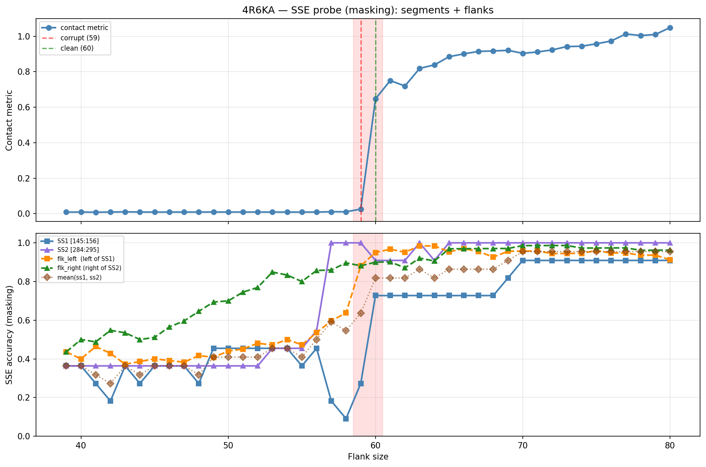

# SSE Probe Analysis: 4R6KA

Generated: 2026-03-03 16:00:20   Model: facebook/esm2_t33_650M_UR50D

## Configuration

| Parameter | Value |
|-----------|-------|
| Protein | 4R6KA |
| Contact pair | (150, 289) |
| ss1 | [145, 156) |
| ss2 | [284, 295) |
| Clean flank | 60 |
| Corrupt flank | 59 |
| Segment radius | 5 |
| Flank sweep | [39, 80] |
| Train sequences | 1,000 |
| Val sequences | 100 |
| Test sequences | 100 |

## SSE Probe Performance

| Split | Accuracy |
|-------|----------|
| Val   | 0.8240 |
| Test  | 0.8259 |

**Test classification report:**

```
              precision    recall  f1-score   support

           H       0.87      0.86      0.86     13101
           E       0.78      0.86      0.82     11471
           C       0.82      0.78      0.80     18602

    accuracy                           0.83     43174
   macro avg       0.83      0.83      0.83     43174
weighted avg       0.83      0.83      0.83     43174

```

## Ground-Truth SSE (full-sequence probe)

| Segment | Sequence |
|---------|----------|
| SS1 [145:156] | `CECEEEEEEEH` |
| SS2 [284:295] | `CCCEEEEECCC` |

## Flank Sweep Results

| flank | contact | mk_ss1 | mk_ss2 | mk_mean | mk_flkL | mk_flkR | mk_flk |
|-------|---------|--------|--------|---------|---------|---------|--------|
| 39 | 0.0091 | 0.364 | 0.364 | 0.364 | 0.436 | 0.436 | 0.436 |
| 40 | 0.0089 | 0.364 | 0.364 | 0.364 | 0.400 | 0.500 | 0.450 |
| 41 | 0.0085 | 0.273 | 0.364 | 0.318 | 0.463 | 0.488 | 0.476 |
| 42 | 0.0089 | 0.182 | 0.364 | 0.273 | 0.429 | 0.548 | 0.488 |
| 43 | 0.0104 | 0.364 | 0.364 | 0.364 | 0.372 | 0.535 | 0.453 |
| 44 | 0.0093 | 0.273 | 0.364 | 0.318 | 0.386 | 0.500 | 0.443 |
| 45 | 0.0090 | 0.364 | 0.364 | 0.364 | 0.400 | 0.511 | 0.456 |
| 46 | 0.0090 | 0.364 | 0.364 | 0.364 | 0.391 | 0.565 | 0.478 |
| 47 | 0.0091 | 0.364 | 0.364 | 0.364 | 0.383 | 0.596 | 0.489 |
| 48 | 0.0092 | 0.273 | 0.364 | 0.318 | 0.417 | 0.646 | 0.531 |
| 49 | 0.0094 | 0.455 | 0.364 | 0.409 | 0.408 | 0.694 | 0.551 |
| 50 | 0.0093 | 0.455 | 0.364 | 0.409 | 0.440 | 0.700 | 0.570 |
| 51 | 0.0092 | 0.455 | 0.364 | 0.409 | 0.451 | 0.745 | 0.598 |
| 52 | 0.0092 | 0.455 | 0.364 | 0.409 | 0.481 | 0.769 | 0.625 |
| 53 | 0.0091 | 0.455 | 0.455 | 0.455 | 0.472 | 0.849 | 0.660 |
| 54 | 0.0089 | 0.455 | 0.455 | 0.455 | 0.500 | 0.833 | 0.667 |
| 55 | 0.0088 | 0.364 | 0.455 | 0.409 | 0.473 | 0.800 | 0.636 |
| 56 | 0.0091 | 0.455 | 0.545 | 0.500 | 0.536 | 0.857 | 0.696 |
| 57 | 0.0108 | 0.182 | 1.000 | 0.591 | 0.596 | 0.860 | 0.728 |
| 58 | 0.0108 | 0.091 | 1.000 | 0.545 | 0.638 | 0.897 | 0.767 |
| 59 | 0.0256 | 0.273 | 1.000 | 0.636 | 0.881 | 0.881 | 0.881 |
| 60 | 0.6467 | 0.727 | 0.909 | 0.818 | 0.950 | 0.900 | 0.925 |
| 61 | 0.7503 | 0.727 | 0.909 | 0.818 | 0.967 | 0.902 | 0.934 |
| 62 | 0.7194 | 0.727 | 0.909 | 0.818 | 0.952 | 0.871 | 0.911 |
| 63 | 0.8188 | 0.727 | 1.000 | 0.864 | 0.984 | 0.921 | 0.952 |
| 64 | 0.8384 | 0.727 | 0.909 | 0.818 | 0.984 | 0.906 | 0.945 |
| 65 | 0.8847 | 0.727 | 1.000 | 0.864 | 0.954 | 0.969 | 0.962 |
| 66 | 0.9006 | 0.727 | 1.000 | 0.864 | 0.970 | 0.970 | 0.970 |
| 67 | 0.9146 | 0.727 | 1.000 | 0.864 | 0.955 | 0.970 | 0.963 |
| 68 | 0.9169 | 0.727 | 1.000 | 0.864 | 0.926 | 0.971 | 0.949 |
| 69 | 0.9205 | 0.818 | 1.000 | 0.909 | 0.957 | 0.971 | 0.964 |
| 70 | 0.9037 | 0.909 | 1.000 | 0.955 | 0.957 | 0.986 | 0.971 |
| 71 | 0.9111 | 0.909 | 1.000 | 0.955 | 0.958 | 0.986 | 0.972 |
| 72 | 0.9229 | 0.909 | 1.000 | 0.955 | 0.944 | 0.986 | 0.965 |
| 73 | 0.9418 | 0.909 | 1.000 | 0.955 | 0.945 | 0.986 | 0.966 |
| 74 | 0.9436 | 0.909 | 1.000 | 0.955 | 0.946 | 0.973 | 0.959 |
| 75 | 0.9573 | 0.909 | 1.000 | 0.955 | 0.960 | 0.973 | 0.967 |
| 76 | 0.9730 | 0.909 | 1.000 | 0.955 | 0.947 | 0.974 | 0.961 |
| 77 | 1.0127 | 0.909 | 1.000 | 0.955 | 0.948 | 0.974 | 0.961 |
| 78 | 1.0038 | 0.909 | 1.000 | 0.955 | 0.936 | 0.962 | 0.949 |
| 79 | 1.0095 | 0.909 | 1.000 | 0.955 | 0.937 | 0.962 | 0.949 |
| 80 | 1.0485 | 0.909 | 1.000 | 0.955 | 0.912 | 0.963 | 0.938 |

## Residue-Level Prediction Changes (clean=60, focus ±2)

### Flank 57 → 58

| Seg | Direction | Pos | gt | prev | now |
|-----|-----------|-----|----|------|-----|
| SS1 | corr→incorr | 145 | C | C | H |
| SS1 | corr→incorr | 147 | C | C | H |
| SS1 | incorr→corr | 155 | H | C | H |
| flk_L | incorr→corr | 96 | C | H | C |
| flk_L | corr→incorr | 105 | H | H | C |
| flk_L | incorr→corr | 109 | E | C | E |
| flk_L | corr→incorr | 134 | E | E | C |
| flk_L | corr→incorr | 135 | E | E | C |
| flk_L | incorr→corr | 138 | E | C | E |
| flk_L | incorr→corr | 140 | E | C | E |
| flk_L | incorr→corr | 141 | E | C | E |
| flk_L | incorr→corr | 142 | E | C | E |
| flk_L | corr→incorr | 143 | E | E | C |
| flk_R | incorr→corr | 296 | C | H | C |
| flk_R | corr→incorr | 301 | C | C | E |
| flk_R | incorr→corr | 305 | C | E | C |
| flk_R | incorr→corr | 351 | H | C | H |

### Flank 58 → 59

| Seg | Direction | Pos | gt | prev | now |
|-----|-----------|-----|----|------|-----|
| SS1 | incorr→corr | 145 | C | H | C |
| SS1 | incorr→corr | 147 | C | H | C |
| SS1 | incorr→corr | 154 | E | H | E |
| SS1 | corr→incorr | 155 | H | H | C |
| flk_L | incorr→corr | 104 | H | C | H |
| flk_L | incorr→corr | 112 | H | C | H |
| flk_L | incorr→corr | 113 | H | C | H |
| flk_L | incorr→corr | 114 | H | C | H |
| flk_L | incorr→corr | 120 | C | E | C |
| flk_L | incorr→corr | 121 | C | E | C |
| flk_L | incorr→corr | 123 | C | E | C |
| flk_L | incorr→corr | 124 | C | E | C |
| flk_L | incorr→corr | 127 | H | C | H |
| flk_L | incorr→corr | 129 | H | C | H |
| flk_L | incorr→corr | 130 | H | C | H |
| flk_L | incorr→corr | 134 | E | C | E |
| flk_L | incorr→corr | 135 | E | C | E |
| flk_L | incorr→corr | 143 | E | C | E |
| flk_R | corr→incorr | 312 | C | C | E |
| flk_R | corr→incorr | 317 | C | C | E |
| flk_R | incorr→corr | 349 | H | C | H |

### Flank 59 → 60

| Seg | Direction | Pos | gt | prev | now |
|-----|-----------|-----|----|------|-----|
| SS1 | corr→incorr | 145 | C | C | E |
| SS1 | incorr→corr | 146 | E | C | E |
| SS1 | corr→incorr | 147 | C | C | E |
| SS1 | incorr→corr | 148 | E | C | E |
| SS1 | incorr→corr | 149 | E | H | E |
| SS1 | incorr→corr | 150 | E | H | E |
| SS1 | incorr→corr | 151 | E | H | E |
| SS1 | incorr→corr | 152 | E | H | E |
| SS1 | incorr→corr | 153 | E | H | E |
| SS2 | corr→incorr | 294 | C | C | H |
| flk_L | incorr→corr | 115 | H | C | H |
| flk_L | incorr→corr | 116 | H | C | H |
| flk_L | incorr→corr | 131 | H | C | H |
| flk_L | incorr→corr | 132 | H | C | H |
| flk_L | corr→incorr | 134 | E | E | H |
| flk_L | incorr→corr | 144 | E | C | E |
| flk_R | corr→incorr | 296 | C | C | H |
| flk_R | incorr→corr | 301 | C | E | C |
| flk_R | incorr→corr | 339 | C | H | C |

### Flank 60 → 61

| Seg | Direction | Pos | gt | prev | now |
|-----|-----------|-----|----|------|-----|
| SS2 | corr→incorr | 291 | E | E | C |
| SS2 | incorr→corr | 294 | C | H | C |
| flk_L | incorr→corr | 133 | H | C | H |
| flk_R | incorr→corr | 312 | C | E | C |

### Flank 61 → 62

| Seg | Direction | Pos | gt | prev | now |
|-----|-----------|-----|----|------|-----|
| flk_L | corr→incorr | 133 | H | H | C |
| flk_R | corr→incorr | 305 | C | C | E |
| flk_R | corr→incorr | 354 | H | H | C |

## Plot


