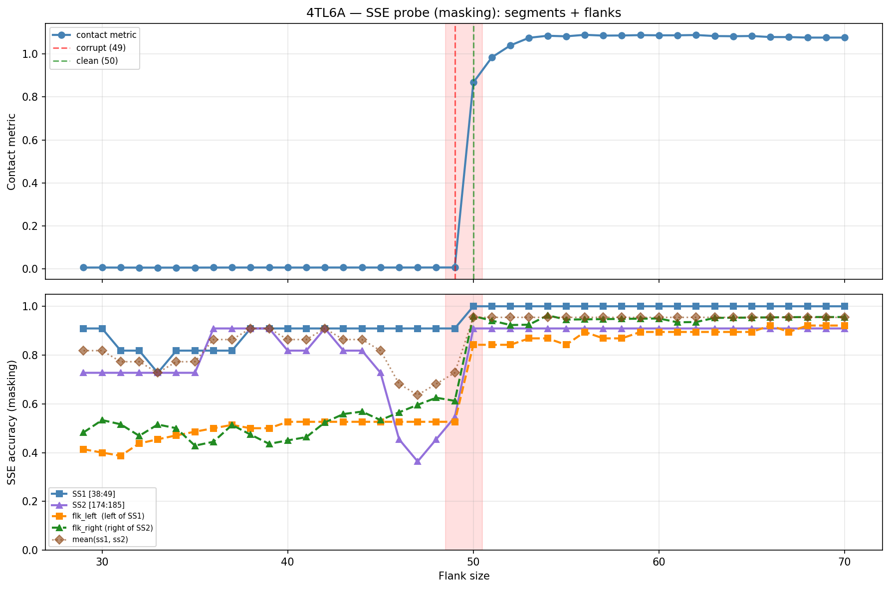

# SSE Probe Analysis: 4TL6A

Generated: 2026-03-03 16:00:25   Model: facebook/esm2_t33_650M_UR50D

## Configuration

| Parameter | Value |
|-----------|-------|
| Protein | 4TL6A |
| Contact pair | (43, 179) |
| ss1 | [38, 49) |
| ss2 | [174, 185) |
| Clean flank | 50 |
| Corrupt flank | 49 |
| Segment radius | 5 |
| Flank sweep | [29, 70] |
| Train sequences | 1,000 |
| Val sequences | 100 |
| Test sequences | 100 |

## SSE Probe Performance

| Split | Accuracy |
|-------|----------|
| Val   | 0.8240 |
| Test  | 0.8259 |

**Test classification report:**

```
              precision    recall  f1-score   support

           H       0.87      0.86      0.86     13101
           E       0.78      0.86      0.82     11471
           C       0.82      0.78      0.80     18602

    accuracy                           0.83     43174
   macro avg       0.83      0.83      0.83     43174
weighted avg       0.83      0.83      0.83     43174

```

## Ground-Truth SSE (full-sequence probe)

| Segment | Sequence |
|---------|----------|
| SS1 [38:49] | `CCEEEEECCCC` |
| SS2 [174:185] | `CCEEEEEEEEC` |

## Flank Sweep Results

| flank | contact | mk_ss1 | mk_ss2 | mk_mean | mk_flkL | mk_flkR | mk_flk |
|-------|---------|--------|--------|---------|---------|---------|--------|
| 29 | 0.0065 | 0.909 | 0.727 | 0.818 | 0.414 | 0.483 | 0.448 |
| 30 | 0.0067 | 0.909 | 0.727 | 0.818 | 0.400 | 0.533 | 0.467 |
| 31 | 0.0064 | 0.818 | 0.727 | 0.773 | 0.387 | 0.516 | 0.452 |
| 32 | 0.0063 | 0.818 | 0.727 | 0.773 | 0.438 | 0.469 | 0.453 |
| 33 | 0.0062 | 0.727 | 0.727 | 0.727 | 0.455 | 0.515 | 0.485 |
| 34 | 0.0063 | 0.818 | 0.727 | 0.773 | 0.471 | 0.500 | 0.485 |
| 35 | 0.0063 | 0.818 | 0.727 | 0.773 | 0.486 | 0.429 | 0.457 |
| 36 | 0.0065 | 0.818 | 0.909 | 0.864 | 0.500 | 0.444 | 0.472 |
| 37 | 0.0066 | 0.818 | 0.909 | 0.864 | 0.514 | 0.514 | 0.514 |
| 38 | 0.0067 | 0.909 | 0.909 | 0.909 | 0.500 | 0.474 | 0.487 |
| 39 | 0.0068 | 0.909 | 0.909 | 0.909 | 0.500 | 0.436 | 0.468 |
| 40 | 0.0066 | 0.909 | 0.818 | 0.864 | 0.526 | 0.450 | 0.488 |
| 41 | 0.0065 | 0.909 | 0.818 | 0.864 | 0.526 | 0.463 | 0.495 |
| 42 | 0.0067 | 0.909 | 0.909 | 0.909 | 0.526 | 0.524 | 0.525 |
| 43 | 0.0067 | 0.909 | 0.818 | 0.864 | 0.526 | 0.558 | 0.542 |
| 44 | 0.0067 | 0.909 | 0.818 | 0.864 | 0.526 | 0.568 | 0.547 |
| 45 | 0.0067 | 0.909 | 0.727 | 0.818 | 0.526 | 0.533 | 0.530 |
| 46 | 0.0067 | 0.909 | 0.455 | 0.682 | 0.526 | 0.565 | 0.546 |
| 47 | 0.0068 | 0.909 | 0.364 | 0.636 | 0.526 | 0.596 | 0.561 |
| 48 | 0.0069 | 0.909 | 0.455 | 0.682 | 0.526 | 0.625 | 0.576 |
| 49 | 0.0069 | 0.909 | 0.545 | 0.727 | 0.526 | 0.612 | 0.569 |
| 50 | 0.8672 | 1.000 | 0.909 | 0.955 | 0.842 | 0.960 | 0.901 |
| 51 | 0.9844 | 1.000 | 0.909 | 0.955 | 0.842 | 0.941 | 0.892 |
| 52 | 1.0401 | 1.000 | 0.909 | 0.955 | 0.842 | 0.923 | 0.883 |
| 53 | 1.0752 | 1.000 | 0.909 | 0.955 | 0.868 | 0.925 | 0.896 |
| 54 | 1.0847 | 1.000 | 0.909 | 0.955 | 0.868 | 0.963 | 0.916 |
| 55 | 1.0820 | 1.000 | 0.909 | 0.955 | 0.842 | 0.945 | 0.894 |
| 56 | 1.0890 | 1.000 | 0.909 | 0.955 | 0.895 | 0.946 | 0.921 |
| 57 | 1.0854 | 1.000 | 0.909 | 0.955 | 0.868 | 0.947 | 0.908 |
| 58 | 1.0860 | 1.000 | 0.909 | 0.955 | 0.868 | 0.948 | 0.908 |
| 59 | 1.0876 | 1.000 | 0.909 | 0.955 | 0.895 | 0.949 | 0.922 |
| 60 | 1.0867 | 1.000 | 0.909 | 0.955 | 0.895 | 0.950 | 0.922 |
| 61 | 1.0868 | 1.000 | 0.909 | 0.955 | 0.895 | 0.934 | 0.915 |
| 62 | 1.0881 | 1.000 | 0.909 | 0.955 | 0.895 | 0.935 | 0.915 |
| 63 | 1.0834 | 1.000 | 0.909 | 0.955 | 0.895 | 0.952 | 0.924 |
| 64 | 1.0825 | 1.000 | 0.909 | 0.955 | 0.895 | 0.953 | 0.924 |
| 65 | 1.0836 | 1.000 | 0.909 | 0.955 | 0.895 | 0.954 | 0.924 |
| 66 | 1.0786 | 1.000 | 0.909 | 0.955 | 0.921 | 0.955 | 0.938 |
| 67 | 1.0785 | 1.000 | 0.909 | 0.955 | 0.895 | 0.955 | 0.925 |
| 68 | 1.0762 | 1.000 | 0.909 | 0.955 | 0.921 | 0.956 | 0.938 |
| 69 | 1.0762 | 1.000 | 0.909 | 0.955 | 0.921 | 0.956 | 0.938 |
| 70 | 1.0762 | 1.000 | 0.909 | 0.955 | 0.921 | 0.956 | 0.938 |

## Residue-Level Prediction Changes (clean=50, focus ±2)

### Flank 47 → 48

| Seg | Direction | Pos | gt | prev | now |
|-----|-----------|-----|----|------|-----|
| SS2 | incorr→corr | 179 | E | C | E |
| flk_R | incorr→corr | 200 | C | E | C |
| flk_R | incorr→corr | 210 | E | C | E |
| flk_R | corr→incorr | 213 | C | C | H |

### Flank 48 → 49

| Seg | Direction | Pos | gt | prev | now |
|-----|-----------|-----|----|------|-----|
| SS2 | incorr→corr | 178 | E | C | E |

### Flank 49 → 50

| Seg | Direction | Pos | gt | prev | now |
|-----|-----------|-----|----|------|-----|
| SS1 | incorr→corr | 40 | E | C | E |
| SS2 | incorr→corr | 176 | E | C | E |
| SS2 | incorr→corr | 180 | E | C | E |
| SS2 | incorr→corr | 181 | E | C | E |
| SS2 | incorr→corr | 182 | E | C | E |
| SS2 | incorr→corr | 183 | E | C | E |
| SS2 | corr→incorr | 184 | C | C | E |
| flk_L | corr→incorr | 1 | C | C | E |
| flk_L | corr→incorr | 2 | C | C | H |
| flk_L | corr→incorr | 3 | C | C | H |
| flk_L | corr→incorr | 4 | C | C | H |
| flk_L | incorr→corr | 12 | C | H | C |
| flk_L | incorr→corr | 13 | C | H | C |
| flk_L | incorr→corr | 15 | C | H | C |
| flk_L | incorr→corr | 16 | C | H | C |
| flk_L | incorr→corr | 17 | C | H | C |
| flk_L | incorr→corr | 18 | C | H | C |
| flk_L | incorr→corr | 19 | C | H | C |
| flk_L | incorr→corr | 20 | E | H | E |
| flk_L | incorr→corr | 21 | C | H | C |
| flk_L | incorr→corr | 22 | C | H | C |
| flk_L | incorr→corr | 23 | C | H | C |
| flk_L | incorr→corr | 26 | H | C | H |
| flk_L | incorr→corr | 27 | H | C | H |
| flk_L | incorr→corr | 28 | H | C | H |
| flk_L | incorr→corr | 29 | H | C | H |
| flk_L | incorr→corr | 30 | H | C | H |
| flk_R | incorr→corr | 197 | H | E | H |
| flk_R | incorr→corr | 198 | H | E | H |
| flk_R | incorr→corr | 199 | H | C | H |
| flk_R | incorr→corr | 202 | E | C | E |
| flk_R | incorr→corr | 209 | E | C | E |
| flk_R | corr→incorr | 211 | C | C | E |
| flk_R | incorr→corr | 212 | C | H | C |
| flk_R | incorr→corr | 213 | C | H | C |
| flk_R | incorr→corr | 214 | C | H | C |
| flk_R | incorr→corr | 215 | E | H | E |
| flk_R | incorr→corr | 216 | E | H | E |
| flk_R | incorr→corr | 217 | E | H | E |
| flk_R | incorr→corr | 218 | E | H | E |
| flk_R | incorr→corr | 219 | E | H | E |
| flk_R | incorr→corr | 220 | E | C | E |
| flk_R | incorr→corr | 221 | E | H | E |
| flk_R | incorr→corr | 222 | E | H | E |
| flk_R | incorr→corr | 223 | E | C | E |
| flk_R | incorr→corr | 233 | E | C | E |

### Flank 50 → 51

| Seg | Direction | Pos | gt | prev | now |
|-----|-----------|-----|----|------|-----|
| flk_R | corr→incorr | 232 | C | C | E |

### Flank 51 → 52

| Seg | Direction | Pos | gt | prev | now |
|-----|-----------|-----|----|------|-----|
| flk_L | incorr→corr | 4 | C | H | C |
| flk_L | corr→incorr | 26 | H | H | C |
| flk_R | corr→incorr | 199 | H | H | C |

## Plot


