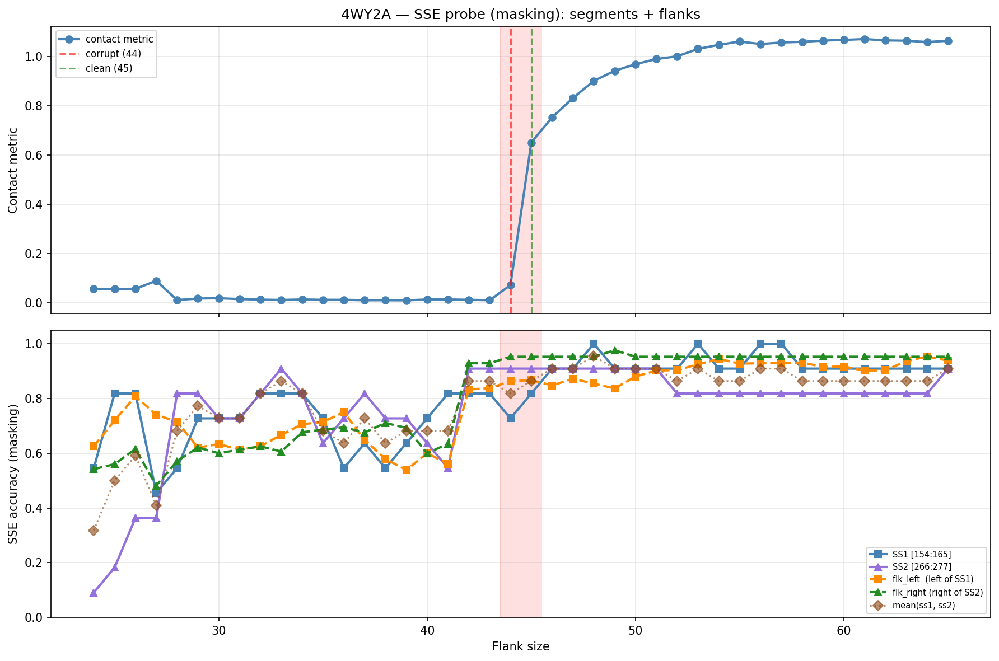

# SSE Probe Analysis: 4WY2A

Generated: 2026-03-03 16:00:31   Model: facebook/esm2_t33_650M_UR50D

## Configuration

| Parameter | Value |
|-----------|-------|
| Protein | 4WY2A |
| Contact pair | (159, 271) |
| ss1 | [154, 165) |
| ss2 | [266, 277) |
| Clean flank | 45 |
| Corrupt flank | 44 |
| Segment radius | 5 |
| Flank sweep | [24, 65] |
| Train sequences | 1,000 |
| Val sequences | 100 |
| Test sequences | 100 |

## SSE Probe Performance

| Split | Accuracy |
|-------|----------|
| Val   | 0.8240 |
| Test  | 0.8259 |

**Test classification report:**

```
              precision    recall  f1-score   support

           H       0.87      0.86      0.86     13101
           E       0.78      0.86      0.82     11471
           C       0.82      0.78      0.80     18602

    accuracy                           0.83     43174
   macro avg       0.83      0.83      0.83     43174
weighted avg       0.83      0.83      0.83     43174

```

## Ground-Truth SSE (full-sequence probe)

| Segment | Sequence |
|---------|----------|
| SS1 [154:165] | `CCCEEEEEECC` |
| SS2 [266:277] | `CCEEEEECECC` |

## Flank Sweep Results

| flank | contact | mk_ss1 | mk_ss2 | mk_mean | mk_flkL | mk_flkR | mk_flk |
|-------|---------|--------|--------|---------|---------|---------|--------|
| 24 | 0.0568 | 0.545 | 0.091 | 0.318 | 0.625 | 0.542 | 0.583 |
| 25 | 0.0560 | 0.818 | 0.182 | 0.500 | 0.720 | 0.560 | 0.640 |
| 26 | 0.0567 | 0.818 | 0.364 | 0.591 | 0.808 | 0.615 | 0.712 |
| 27 | 0.0895 | 0.455 | 0.364 | 0.409 | 0.741 | 0.481 | 0.611 |
| 28 | 0.0111 | 0.545 | 0.818 | 0.682 | 0.714 | 0.571 | 0.643 |
| 29 | 0.0174 | 0.727 | 0.818 | 0.773 | 0.621 | 0.621 | 0.621 |
| 30 | 0.0185 | 0.727 | 0.727 | 0.727 | 0.633 | 0.600 | 0.617 |
| 31 | 0.0151 | 0.727 | 0.727 | 0.727 | 0.613 | 0.613 | 0.613 |
| 32 | 0.0129 | 0.818 | 0.818 | 0.818 | 0.625 | 0.625 | 0.625 |
| 33 | 0.0115 | 0.818 | 0.909 | 0.864 | 0.667 | 0.606 | 0.636 |
| 34 | 0.0136 | 0.818 | 0.818 | 0.818 | 0.706 | 0.676 | 0.691 |
| 35 | 0.0122 | 0.727 | 0.636 | 0.682 | 0.714 | 0.686 | 0.700 |
| 36 | 0.0121 | 0.545 | 0.727 | 0.636 | 0.750 | 0.694 | 0.722 |
| 37 | 0.0104 | 0.636 | 0.818 | 0.727 | 0.649 | 0.676 | 0.662 |
| 38 | 0.0105 | 0.545 | 0.727 | 0.636 | 0.579 | 0.711 | 0.645 |
| 39 | 0.0101 | 0.636 | 0.727 | 0.682 | 0.538 | 0.692 | 0.615 |
| 40 | 0.0133 | 0.727 | 0.636 | 0.682 | 0.600 | 0.600 | 0.600 |
| 41 | 0.0136 | 0.818 | 0.545 | 0.682 | 0.561 | 0.634 | 0.598 |
| 42 | 0.0121 | 0.818 | 0.909 | 0.864 | 0.833 | 0.929 | 0.881 |
| 43 | 0.0105 | 0.818 | 0.909 | 0.864 | 0.837 | 0.929 | 0.883 |
| 44 | 0.0718 | 0.727 | 0.909 | 0.818 | 0.864 | 0.952 | 0.908 |
| 45 | 0.6507 | 0.818 | 0.909 | 0.864 | 0.867 | 0.952 | 0.910 |
| 46 | 0.7532 | 0.909 | 0.909 | 0.909 | 0.848 | 0.952 | 0.900 |
| 47 | 0.8315 | 0.909 | 0.909 | 0.909 | 0.872 | 0.952 | 0.912 |
| 48 | 0.9009 | 1.000 | 0.909 | 0.955 | 0.854 | 0.952 | 0.903 |
| 49 | 0.9419 | 0.909 | 0.909 | 0.909 | 0.837 | 0.976 | 0.906 |
| 50 | 0.9688 | 0.909 | 0.909 | 0.909 | 0.880 | 0.952 | 0.916 |
| 51 | 0.9898 | 0.909 | 0.909 | 0.909 | 0.902 | 0.952 | 0.927 |
| 52 | 1.0009 | 0.909 | 0.818 | 0.864 | 0.904 | 0.952 | 0.928 |
| 53 | 1.0307 | 1.000 | 0.818 | 0.909 | 0.925 | 0.952 | 0.938 |
| 54 | 1.0474 | 0.909 | 0.818 | 0.864 | 0.944 | 0.952 | 0.948 |
| 55 | 1.0609 | 0.909 | 0.818 | 0.864 | 0.927 | 0.952 | 0.940 |
| 56 | 1.0507 | 1.000 | 0.818 | 0.909 | 0.929 | 0.952 | 0.940 |
| 57 | 1.0569 | 1.000 | 0.818 | 0.909 | 0.930 | 0.952 | 0.941 |
| 58 | 1.0596 | 0.909 | 0.818 | 0.864 | 0.931 | 0.952 | 0.942 |
| 59 | 1.0646 | 0.909 | 0.818 | 0.864 | 0.915 | 0.952 | 0.934 |
| 60 | 1.0674 | 0.909 | 0.818 | 0.864 | 0.917 | 0.952 | 0.935 |
| 61 | 1.0708 | 0.909 | 0.818 | 0.864 | 0.902 | 0.952 | 0.927 |
| 62 | 1.0654 | 0.909 | 0.818 | 0.864 | 0.903 | 0.952 | 0.928 |
| 63 | 1.0642 | 0.909 | 0.818 | 0.864 | 0.937 | 0.952 | 0.944 |
| 64 | 1.0587 | 0.909 | 0.818 | 0.864 | 0.953 | 0.952 | 0.953 |
| 65 | 1.0640 | 0.909 | 0.909 | 0.909 | 0.938 | 0.952 | 0.945 |

## Residue-Level Prediction Changes (clean=45, focus ±2)

### Flank 42 → 43

| Seg | Direction | Pos | gt | prev | now |
|-----|-----------|-----|----|------|-----|
| flk_L | incorr→corr | 143 | E | C | E |
| flk_L | corr→incorr | 153 | C | C | H |

### Flank 43 → 44

| Seg | Direction | Pos | gt | prev | now |
|-----|-----------|-----|----|------|-----|
| SS1 | corr→incorr | 160 | E | E | H |
| flk_L | incorr→corr | 117 | E | C | E |
| flk_L | corr→incorr | 143 | E | E | C |
| flk_L | incorr→corr | 153 | C | H | C |
| flk_R | incorr→corr | 279 | H | C | H |

### Flank 44 → 45

| Seg | Direction | Pos | gt | prev | now |
|-----|-----------|-----|----|------|-----|
| SS1 | incorr→corr | 160 | E | H | E |
| SS1 | incorr→corr | 162 | E | C | E |
| SS1 | corr→incorr | 163 | C | C | E |

### Flank 45 → 46

| Seg | Direction | Pos | gt | prev | now |
|-----|-----------|-----|----|------|-----|
| SS1 | incorr→corr | 157 | E | C | E |

### Flank 46 → 47

| Seg | Direction | Pos | gt | prev | now |
|-----|-----------|-----|----|------|-----|
| flk_L | incorr→corr | 125 | H | C | H |
| flk_L | incorr→corr | 126 | H | C | H |

## Plot


