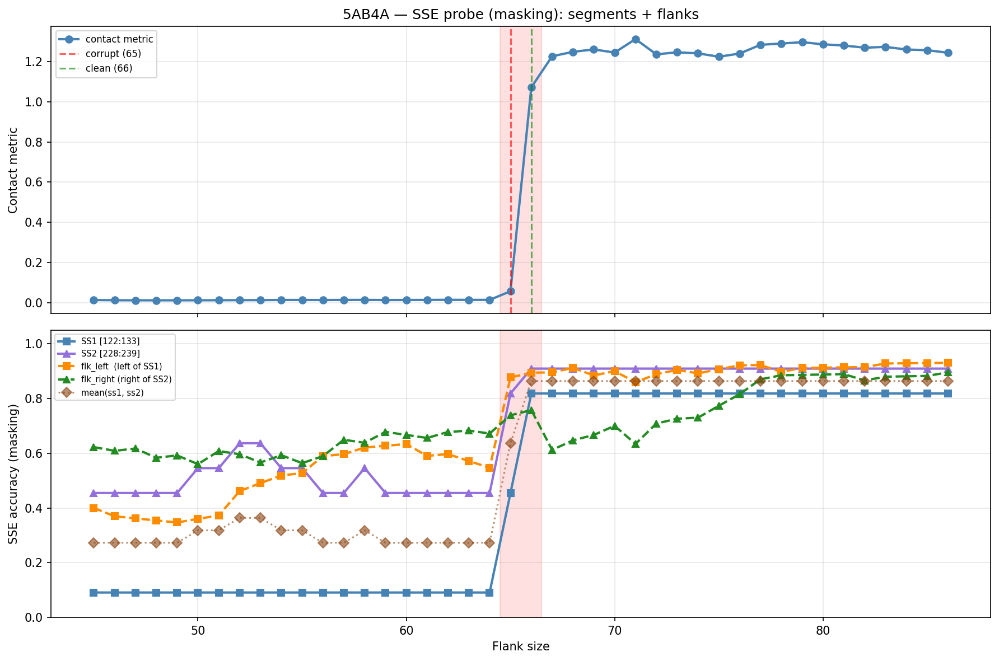

# SSE Probe Analysis: 5AB4A

Generated: 2026-03-03 16:00:39   Model: facebook/esm2_t33_650M_UR50D

## Configuration

| Parameter | Value |
|-----------|-------|
| Protein | 5AB4A |
| Contact pair | (127, 233) |
| ss1 | [122, 133) |
| ss2 | [228, 239) |
| Clean flank | 66 |
| Corrupt flank | 65 |
| Segment radius | 5 |
| Flank sweep | [45, 86] |
| Train sequences | 1,000 |
| Val sequences | 100 |
| Test sequences | 100 |

## SSE Probe Performance

| Split | Accuracy |
|-------|----------|
| Val   | 0.8240 |
| Test  | 0.8259 |

**Test classification report:**

```
              precision    recall  f1-score   support

           H       0.87      0.86      0.86     13101
           E       0.78      0.86      0.82     11471
           C       0.82      0.78      0.80     18602

    accuracy                           0.83     43174
   macro avg       0.83      0.83      0.83     43174
weighted avg       0.83      0.83      0.83     43174

```

## Ground-Truth SSE (full-sequence probe)

| Segment | Sequence |
|---------|----------|
| SS1 [122:133] | `CEEEEEEEEEH` |
| SS2 [228:239] | `CEEEEEEEEEC` |

## Flank Sweep Results

| flank | contact | mk_ss1 | mk_ss2 | mk_mean | mk_flkL | mk_flkR | mk_flk |
|-------|---------|--------|--------|---------|---------|---------|--------|
| 45 | 0.0137 | 0.091 | 0.455 | 0.273 | 0.400 | 0.622 | 0.511 |
| 46 | 0.0125 | 0.091 | 0.455 | 0.273 | 0.370 | 0.609 | 0.489 |
| 47 | 0.0123 | 0.091 | 0.455 | 0.273 | 0.362 | 0.617 | 0.489 |
| 48 | 0.0122 | 0.091 | 0.455 | 0.273 | 0.354 | 0.583 | 0.469 |
| 49 | 0.0122 | 0.091 | 0.455 | 0.273 | 0.347 | 0.592 | 0.469 |
| 50 | 0.0124 | 0.091 | 0.545 | 0.318 | 0.360 | 0.560 | 0.460 |
| 51 | 0.0126 | 0.091 | 0.545 | 0.318 | 0.373 | 0.608 | 0.490 |
| 52 | 0.0130 | 0.091 | 0.636 | 0.364 | 0.462 | 0.596 | 0.529 |
| 53 | 0.0132 | 0.091 | 0.636 | 0.364 | 0.491 | 0.566 | 0.528 |
| 54 | 0.0139 | 0.091 | 0.545 | 0.318 | 0.519 | 0.593 | 0.556 |
| 55 | 0.0140 | 0.091 | 0.545 | 0.318 | 0.527 | 0.564 | 0.545 |
| 56 | 0.0137 | 0.091 | 0.455 | 0.273 | 0.589 | 0.589 | 0.589 |
| 57 | 0.0140 | 0.091 | 0.455 | 0.273 | 0.596 | 0.649 | 0.623 |
| 58 | 0.0143 | 0.091 | 0.545 | 0.318 | 0.621 | 0.638 | 0.629 |
| 59 | 0.0136 | 0.091 | 0.455 | 0.273 | 0.627 | 0.678 | 0.653 |
| 60 | 0.0138 | 0.091 | 0.455 | 0.273 | 0.633 | 0.667 | 0.650 |
| 61 | 0.0141 | 0.091 | 0.455 | 0.273 | 0.590 | 0.656 | 0.623 |
| 62 | 0.0145 | 0.091 | 0.455 | 0.273 | 0.597 | 0.677 | 0.637 |
| 63 | 0.0143 | 0.091 | 0.455 | 0.273 | 0.571 | 0.683 | 0.627 |
| 64 | 0.0143 | 0.091 | 0.455 | 0.273 | 0.547 | 0.672 | 0.609 |
| 65 | 0.0572 | 0.455 | 0.818 | 0.636 | 0.877 | 0.738 | 0.808 |
| 66 | 1.0716 | 0.818 | 0.909 | 0.864 | 0.894 | 0.758 | 0.826 |
| 67 | 1.2260 | 0.818 | 0.909 | 0.864 | 0.896 | 0.612 | 0.754 |
| 68 | 1.2480 | 0.818 | 0.909 | 0.864 | 0.912 | 0.647 | 0.779 |
| 69 | 1.2599 | 0.818 | 0.909 | 0.864 | 0.884 | 0.667 | 0.775 |
| 70 | 1.2443 | 0.818 | 0.909 | 0.864 | 0.900 | 0.700 | 0.800 |
| 71 | 1.3114 | 0.818 | 0.909 | 0.864 | 0.859 | 0.634 | 0.746 |
| 72 | 1.2355 | 0.818 | 0.909 | 0.864 | 0.889 | 0.708 | 0.799 |
| 73 | 1.2456 | 0.818 | 0.909 | 0.864 | 0.904 | 0.726 | 0.815 |
| 74 | 1.2404 | 0.818 | 0.909 | 0.864 | 0.892 | 0.730 | 0.811 |
| 75 | 1.2237 | 0.818 | 0.909 | 0.864 | 0.907 | 0.773 | 0.840 |
| 76 | 1.2396 | 0.818 | 0.909 | 0.864 | 0.921 | 0.816 | 0.868 |
| 77 | 1.2830 | 0.818 | 0.909 | 0.864 | 0.922 | 0.870 | 0.896 |
| 78 | 1.2892 | 0.818 | 0.909 | 0.864 | 0.897 | 0.885 | 0.891 |
| 79 | 1.2960 | 0.818 | 0.909 | 0.864 | 0.911 | 0.886 | 0.899 |
| 80 | 1.2852 | 0.818 | 0.909 | 0.864 | 0.912 | 0.887 | 0.900 |
| 81 | 1.2795 | 0.818 | 0.909 | 0.864 | 0.914 | 0.889 | 0.901 |
| 82 | 1.2685 | 0.818 | 0.909 | 0.864 | 0.915 | 0.866 | 0.890 |
| 83 | 1.2727 | 0.818 | 0.909 | 0.864 | 0.928 | 0.880 | 0.904 |
| 84 | 1.2594 | 0.818 | 0.909 | 0.864 | 0.929 | 0.881 | 0.905 |
| 85 | 1.2562 | 0.818 | 0.909 | 0.864 | 0.929 | 0.882 | 0.906 |
| 86 | 1.2433 | 0.818 | 0.909 | 0.864 | 0.930 | 0.895 | 0.913 |

## Residue-Level Prediction Changes (clean=66, focus ±2)

### Flank 63 → 64

| Seg | Direction | Pos | gt | prev | now |
|-----|-----------|-----|----|------|-----|
| flk_L | corr→incorr | 73 | H | H | C |
| flk_R | corr→incorr | 299 | H | H | C |

### Flank 64 → 65

| Seg | Direction | Pos | gt | prev | now |
|-----|-----------|-----|----|------|-----|
| SS1 | incorr→corr | 124 | E | H | E |
| SS1 | incorr→corr | 125 | E | C | E |
| SS1 | incorr→corr | 127 | E | H | E |
| SS1 | incorr→corr | 128 | E | H | E |
| SS2 | incorr→corr | 230 | E | C | E |
| SS2 | incorr→corr | 231 | E | H | E |
| SS2 | incorr→corr | 236 | E | H | E |
| SS2 | incorr→corr | 238 | C | H | C |
| flk_L | incorr→corr | 60 | E | H | E |
| flk_L | corr→incorr | 61 | C | C | E |
| flk_L | incorr→corr | 62 | E | H | E |
| flk_L | incorr→corr | 63 | E | H | E |
| flk_L | incorr→corr | 64 | E | H | E |
| flk_L | incorr→corr | 65 | E | C | E |
| flk_L | incorr→corr | 66 | E | C | E |
| flk_L | incorr→corr | 67 | C | H | C |
| flk_L | incorr→corr | 72 | H | C | H |
| flk_L | incorr→corr | 73 | H | C | H |
| flk_L | incorr→corr | 79 | H | C | H |
| flk_L | corr→incorr | 84 | H | H | C |
| flk_L | corr→incorr | 93 | C | C | E |
| flk_L | incorr→corr | 95 | E | C | E |
| flk_L | incorr→corr | 96 | E | C | E |
| flk_L | incorr→corr | 97 | E | C | E |
| flk_L | incorr→corr | 98 | E | C | E |
| flk_L | incorr→corr | 105 | H | C | H |
| flk_L | incorr→corr | 106 | H | C | H |
| flk_L | incorr→corr | 107 | H | C | H |
| flk_L | incorr→corr | 108 | H | C | H |
| flk_L | incorr→corr | 109 | H | C | H |
| flk_L | incorr→corr | 110 | H | C | H |
| flk_L | incorr→corr | 111 | H | C | H |
| flk_L | incorr→corr | 112 | H | C | H |
| flk_L | incorr→corr | 114 | H | C | H |
| flk_L | incorr→corr | 117 | H | C | H |
| flk_L | incorr→corr | 118 | H | C | H |
| flk_R | corr→incorr | 239 | H | H | C |
| flk_R | incorr→corr | 240 | H | C | H |
| flk_R | incorr→corr | 246 | C | H | C |
| flk_R | corr→incorr | 248 | H | H | C |
| flk_R | incorr→corr | 249 | C | H | C |
| flk_R | incorr→corr | 250 | C | H | C |
| flk_R | incorr→corr | 251 | C | H | C |
| flk_R | incorr→corr | 261 | E | C | E |
| flk_R | incorr→corr | 262 | E | H | E |
| flk_R | incorr→corr | 264 | E | H | E |
| flk_R | corr→incorr | 287 | H | H | C |

### Flank 65 → 66

| Seg | Direction | Pos | gt | prev | now |
|-----|-----------|-----|----|------|-----|
| SS1 | incorr→corr | 123 | E | H | E |
| SS1 | incorr→corr | 126 | E | H | E |
| SS1 | incorr→corr | 129 | E | C | E |
| SS1 | incorr→corr | 130 | E | H | E |
| SS2 | incorr→corr | 229 | E | C | E |
| flk_L | incorr→corr | 61 | C | E | C |
| flk_L | corr→incorr | 72 | H | H | C |
| flk_L | corr→incorr | 73 | H | H | C |
| flk_L | incorr→corr | 84 | H | C | H |
| flk_L | incorr→corr | 86 | H | C | H |
| flk_R | corr→incorr | 240 | H | H | C |
| flk_R | incorr→corr | 241 | C | H | C |
| flk_R | corr→incorr | 242 | H | H | C |
| flk_R | corr→incorr | 243 | H | H | E |
| flk_R | incorr→corr | 252 | C | H | C |
| flk_R | corr→incorr | 261 | E | E | C |
| flk_R | incorr→corr | 265 | E | H | E |
| flk_R | incorr→corr | 267 | E | C | E |
| flk_R | incorr→corr | 287 | H | C | H |
| flk_R | incorr→corr | 299 | H | C | H |

### Flank 66 → 67

| Seg | Direction | Pos | gt | prev | now |
|-----|-----------|-----|----|------|-----|
| flk_L | incorr→corr | 85 | H | C | H |
| flk_L | corr→incorr | 86 | H | H | C |
| flk_L | incorr→corr | 93 | C | E | C |
| flk_R | corr→incorr | 244 | H | H | E |
| flk_R | corr→incorr | 247 | C | C | E |
| flk_R | corr→incorr | 250 | C | C | E |
| flk_R | corr→incorr | 252 | C | C | E |
| flk_R | corr→incorr | 253 | C | C | E |
| flk_R | corr→incorr | 265 | E | E | H |
| flk_R | corr→incorr | 267 | E | E | C |
| flk_R | corr→incorr | 287 | H | H | C |
| flk_R | corr→incorr | 299 | H | H | C |

### Flank 67 → 68

| Seg | Direction | Pos | gt | prev | now |
|-----|-----------|-----|----|------|-----|
| flk_L | incorr→corr | 55 | C | H | C |
| flk_R | incorr→corr | 260 | E | C | E |
| flk_R | incorr→corr | 287 | H | C | H |

## Plot


