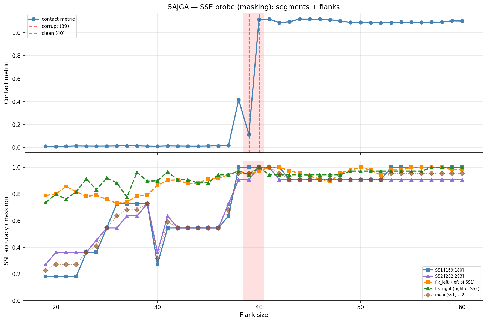

# SSE Probe Analysis: 5AJGA

Generated: 2026-03-03 16:00:46   Model: facebook/esm2_t33_650M_UR50D

## Configuration

| Parameter | Value |
|-----------|-------|
| Protein | 5AJGA |
| Contact pair | (174, 287) |
| ss1 | [169, 180) |
| ss2 | [282, 293) |
| Clean flank | 40 |
| Corrupt flank | 39 |
| Segment radius | 5 |
| Flank sweep | [19, 60] |
| Train sequences | 1,000 |
| Val sequences | 100 |
| Test sequences | 100 |

## SSE Probe Performance

| Split | Accuracy |
|-------|----------|
| Val   | 0.8240 |
| Test  | 0.8259 |

**Test classification report:**

```
              precision    recall  f1-score   support

           H       0.87      0.86      0.86     13101
           E       0.78      0.86      0.82     11471
           C       0.82      0.78      0.80     18602

    accuracy                           0.83     43174
   macro avg       0.83      0.83      0.83     43174
weighted avg       0.83      0.83      0.83     43174

```

## Ground-Truth SSE (full-sequence probe)

| Segment | Sequence |
|---------|----------|
| SS1 [169:180] | `CCEEEEEEECC` |
| SS2 [282:293] | `EEEEEEEEECC` |

## Flank Sweep Results

| flank | contact | mk_ss1 | mk_ss2 | mk_mean | mk_flkL | mk_flkR | mk_flk |
|-------|---------|--------|--------|---------|---------|---------|--------|
| 19 | 0.0110 | 0.182 | 0.273 | 0.227 | 0.789 | 0.737 | 0.763 |
| 20 | 0.0106 | 0.182 | 0.364 | 0.273 | 0.800 | 0.800 | 0.800 |
| 21 | 0.0112 | 0.182 | 0.364 | 0.273 | 0.857 | 0.762 | 0.810 |
| 22 | 0.0137 | 0.182 | 0.364 | 0.273 | 0.818 | 0.818 | 0.818 |
| 23 | 0.0129 | 0.364 | 0.364 | 0.364 | 0.783 | 0.913 | 0.848 |
| 24 | 0.0126 | 0.364 | 0.455 | 0.409 | 0.792 | 0.833 | 0.812 |
| 25 | 0.0129 | 0.545 | 0.545 | 0.545 | 0.760 | 0.920 | 0.840 |
| 26 | 0.0139 | 0.727 | 0.545 | 0.636 | 0.731 | 0.885 | 0.808 |
| 27 | 0.0153 | 0.727 | 0.636 | 0.682 | 0.741 | 0.778 | 0.759 |
| 28 | 0.0147 | 0.727 | 0.636 | 0.682 | 0.786 | 0.964 | 0.875 |
| 29 | 0.0125 | 0.727 | 0.727 | 0.727 | 0.793 | 0.897 | 0.845 |
| 30 | 0.0116 | 0.273 | 0.364 | 0.318 | 0.867 | 0.900 | 0.883 |
| 31 | 0.0142 | 0.545 | 0.636 | 0.591 | 0.903 | 0.968 | 0.935 |
| 32 | 0.0131 | 0.545 | 0.545 | 0.545 | 0.906 | 0.906 | 0.906 |
| 33 | 0.0125 | 0.545 | 0.545 | 0.545 | 0.879 | 0.909 | 0.894 |
| 34 | 0.0120 | 0.545 | 0.545 | 0.545 | 0.882 | 0.882 | 0.882 |
| 35 | 0.0132 | 0.545 | 0.545 | 0.545 | 0.914 | 0.886 | 0.900 |
| 36 | 0.0152 | 0.545 | 0.545 | 0.545 | 0.917 | 0.944 | 0.931 |
| 37 | 0.0184 | 0.636 | 0.727 | 0.682 | 0.946 | 0.944 | 0.945 |
| 38 | 0.4167 | 1.000 | 0.909 | 0.955 | 0.974 | 0.972 | 0.973 |
| 39 | 0.1139 | 1.000 | 0.909 | 0.955 | 0.949 | 0.944 | 0.947 |
| 40 | 1.1176 | 1.000 | 1.000 | 1.000 | 0.975 | 1.000 | 0.988 |
| 41 | 1.1186 | 1.000 | 1.000 | 1.000 | 1.000 | 0.944 | 0.972 |
| 42 | 1.0894 | 1.000 | 0.909 | 0.955 | 1.000 | 0.944 | 0.972 |
| 43 | 1.0966 | 0.909 | 0.909 | 0.909 | 0.977 | 0.944 | 0.961 |
| 44 | 1.1201 | 0.909 | 0.909 | 0.909 | 0.955 | 0.944 | 0.949 |
| 45 | 1.1196 | 0.909 | 0.909 | 0.909 | 0.933 | 0.944 | 0.939 |
| 46 | 1.1189 | 0.909 | 0.909 | 0.909 | 0.913 | 0.944 | 0.929 |
| 47 | 1.1140 | 0.909 | 0.909 | 0.909 | 0.894 | 0.944 | 0.919 |
| 48 | 1.1029 | 0.909 | 0.909 | 0.909 | 0.958 | 0.944 | 0.951 |
| 49 | 1.0907 | 0.909 | 0.909 | 0.909 | 0.980 | 0.972 | 0.976 |
| 50 | 1.0903 | 0.909 | 0.909 | 0.909 | 1.000 | 0.972 | 0.986 |
| 51 | 1.0883 | 0.909 | 0.909 | 0.909 | 0.980 | 0.972 | 0.976 |
| 52 | 1.0866 | 0.909 | 0.909 | 0.909 | 0.942 | 0.972 | 0.957 |
| 53 | 1.0895 | 1.000 | 0.909 | 0.955 | 0.981 | 0.972 | 0.977 |
| 54 | 1.0933 | 1.000 | 0.909 | 0.955 | 0.981 | 0.972 | 0.977 |
| 55 | 1.0924 | 1.000 | 0.909 | 0.955 | 1.000 | 0.972 | 0.986 |
| 56 | 1.0916 | 1.000 | 0.909 | 0.955 | 1.000 | 0.972 | 0.986 |
| 57 | 1.0940 | 1.000 | 0.909 | 0.955 | 1.000 | 1.000 | 1.000 |
| 58 | 1.0928 | 1.000 | 0.909 | 0.955 | 1.000 | 1.000 | 1.000 |
| 59 | 1.1047 | 1.000 | 0.909 | 0.955 | 0.983 | 1.000 | 0.992 |
| 60 | 1.1035 | 1.000 | 0.909 | 0.955 | 0.983 | 1.000 | 0.992 |

## Residue-Level Prediction Changes (clean=40, focus ±2)

### Flank 37 → 38

| Seg | Direction | Pos | gt | prev | now |
|-----|-----------|-----|----|------|-----|
| SS1 | incorr→corr | 171 | E | C | E |
| SS1 | incorr→corr | 172 | E | H | E |
| SS1 | incorr→corr | 176 | E | C | E |
| SS1 | incorr→corr | 177 | E | C | E |
| SS2 | incorr→corr | 282 | E | C | E |
| SS2 | incorr→corr | 284 | E | C | E |
| flk_L | incorr→corr | 151 | C | H | C |
| flk_R | incorr→corr | 317 | H | E | H |

### Flank 38 → 39

| Seg | Direction | Pos | gt | prev | now |
|-----|-----------|-----|----|------|-----|
| flk_L | corr→incorr | 132 | C | C | H |
| flk_L | incorr→corr | 147 | H | C | H |
| flk_L | corr→incorr | 167 | C | C | H |
| flk_R | corr→incorr | 317 | H | H | E |

### Flank 39 → 40

| Seg | Direction | Pos | gt | prev | now |
|-----|-----------|-----|----|------|-----|
| SS2 | incorr→corr | 290 | E | C | E |
| flk_L | incorr→corr | 132 | C | H | C |
| flk_R | incorr→corr | 317 | H | E | H |
| flk_R | incorr→corr | 323 | C | H | C |

### Flank 40 → 41

| Seg | Direction | Pos | gt | prev | now |
|-----|-----------|-----|----|------|-----|
| flk_L | incorr→corr | 167 | C | H | C |
| flk_R | corr→incorr | 323 | C | C | H |
| flk_R | corr→incorr | 327 | C | C | H |

### Flank 41 → 42

| Seg | Direction | Pos | gt | prev | now |
|-----|-----------|-----|----|------|-----|
| SS2 | corr→incorr | 290 | E | E | C |

## Plot


