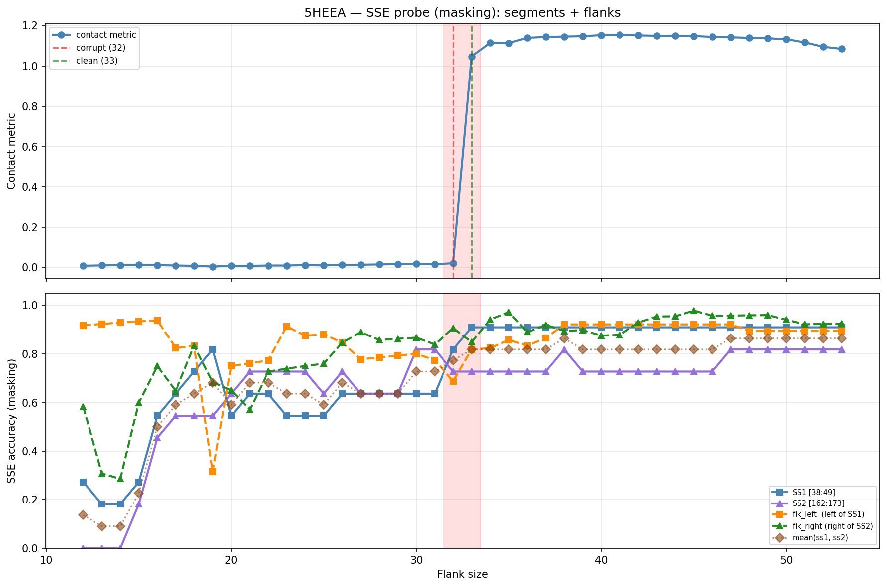

# SSE Probe Analysis: 5HEEA

Generated: 2026-03-03 16:00:52   Model: facebook/esm2_t33_650M_UR50D

## Configuration

| Parameter | Value |
|-----------|-------|
| Protein | 5HEEA |
| Contact pair | (43, 167) |
| ss1 | [38, 49) |
| ss2 | [162, 173) |
| Clean flank | 33 |
| Corrupt flank | 32 |
| Segment radius | 5 |
| Flank sweep | [12, 53] |
| Train sequences | 1,000 |
| Val sequences | 100 |
| Test sequences | 100 |

## SSE Probe Performance

| Split | Accuracy |
|-------|----------|
| Val   | 0.8240 |
| Test  | 0.8259 |

**Test classification report:**

```
              precision    recall  f1-score   support

           H       0.87      0.86      0.86     13101
           E       0.78      0.86      0.82     11471
           C       0.82      0.78      0.80     18602

    accuracy                           0.83     43174
   macro avg       0.83      0.83      0.83     43174
weighted avg       0.83      0.83      0.83     43174

```

## Ground-Truth SSE (full-sequence probe)

| Segment | Sequence |
|---------|----------|
| SS1 [38:49] | `CCEEEEEECEC` |
| SS2 [162:173] | `CCEEEEEECEE` |

## Flank Sweep Results

| flank | contact | mk_ss1 | mk_ss2 | mk_mean | mk_flkL | mk_flkR | mk_flk |
|-------|---------|--------|--------|---------|---------|---------|--------|
| 12 | 0.0083 | 0.273 | 0.000 | 0.136 | 0.917 | 0.583 | 0.750 |
| 13 | 0.0101 | 0.182 | 0.000 | 0.091 | 0.923 | 0.308 | 0.615 |
| 14 | 0.0114 | 0.182 | 0.000 | 0.091 | 0.929 | 0.286 | 0.607 |
| 15 | 0.0139 | 0.273 | 0.182 | 0.227 | 0.933 | 0.600 | 0.767 |
| 16 | 0.0117 | 0.545 | 0.455 | 0.500 | 0.938 | 0.750 | 0.844 |
| 17 | 0.0095 | 0.636 | 0.545 | 0.591 | 0.824 | 0.647 | 0.735 |
| 18 | 0.0080 | 0.727 | 0.545 | 0.636 | 0.833 | 0.833 | 0.833 |
| 19 | 0.0045 | 0.818 | 0.545 | 0.682 | 0.316 | 0.684 | 0.500 |
| 20 | 0.0078 | 0.545 | 0.636 | 0.591 | 0.750 | 0.650 | 0.700 |
| 21 | 0.0079 | 0.636 | 0.727 | 0.682 | 0.762 | 0.571 | 0.667 |
| 22 | 0.0094 | 0.636 | 0.727 | 0.682 | 0.773 | 0.727 | 0.750 |
| 23 | 0.0095 | 0.545 | 0.727 | 0.636 | 0.913 | 0.739 | 0.826 |
| 24 | 0.0116 | 0.545 | 0.727 | 0.636 | 0.875 | 0.750 | 0.812 |
| 25 | 0.0101 | 0.545 | 0.636 | 0.591 | 0.880 | 0.760 | 0.820 |
| 26 | 0.0125 | 0.636 | 0.727 | 0.682 | 0.846 | 0.846 | 0.846 |
| 27 | 0.0134 | 0.636 | 0.636 | 0.636 | 0.778 | 0.889 | 0.833 |
| 28 | 0.0148 | 0.636 | 0.636 | 0.636 | 0.786 | 0.857 | 0.821 |
| 29 | 0.0170 | 0.636 | 0.636 | 0.636 | 0.793 | 0.862 | 0.828 |
| 30 | 0.0172 | 0.636 | 0.818 | 0.727 | 0.800 | 0.867 | 0.833 |
| 31 | 0.0158 | 0.636 | 0.818 | 0.727 | 0.774 | 0.839 | 0.806 |
| 32 | 0.0207 | 0.818 | 0.727 | 0.773 | 0.688 | 0.906 | 0.797 |
| 33 | 1.0469 | 0.909 | 0.727 | 0.818 | 0.818 | 0.848 | 0.833 |
| 34 | 1.1143 | 0.909 | 0.727 | 0.818 | 0.824 | 0.941 | 0.882 |
| 35 | 1.1135 | 0.909 | 0.727 | 0.818 | 0.857 | 0.971 | 0.914 |
| 36 | 1.1390 | 0.909 | 0.727 | 0.818 | 0.833 | 0.889 | 0.861 |
| 37 | 1.1431 | 0.909 | 0.727 | 0.818 | 0.865 | 0.919 | 0.892 |
| 38 | 1.1453 | 0.909 | 0.818 | 0.864 | 0.921 | 0.895 | 0.908 |
| 39 | 1.1468 | 0.909 | 0.727 | 0.818 | 0.921 | 0.897 | 0.909 |
| 40 | 1.1525 | 0.909 | 0.727 | 0.818 | 0.921 | 0.875 | 0.898 |
| 41 | 1.1546 | 0.909 | 0.727 | 0.818 | 0.921 | 0.878 | 0.900 |
| 42 | 1.1510 | 0.909 | 0.727 | 0.818 | 0.921 | 0.929 | 0.925 |
| 43 | 1.1491 | 0.909 | 0.727 | 0.818 | 0.921 | 0.953 | 0.937 |
| 44 | 1.1493 | 0.909 | 0.727 | 0.818 | 0.921 | 0.955 | 0.938 |
| 45 | 1.1479 | 0.909 | 0.727 | 0.818 | 0.921 | 0.978 | 0.949 |
| 46 | 1.1435 | 0.909 | 0.727 | 0.818 | 0.921 | 0.957 | 0.939 |
| 47 | 1.1416 | 0.909 | 0.818 | 0.864 | 0.921 | 0.957 | 0.939 |
| 48 | 1.1387 | 0.909 | 0.818 | 0.864 | 0.895 | 0.958 | 0.927 |
| 49 | 1.1367 | 0.909 | 0.818 | 0.864 | 0.895 | 0.959 | 0.927 |
| 50 | 1.1318 | 0.909 | 0.818 | 0.864 | 0.895 | 0.940 | 0.917 |
| 51 | 1.1166 | 0.909 | 0.818 | 0.864 | 0.895 | 0.922 | 0.908 |
| 52 | 1.0946 | 0.909 | 0.818 | 0.864 | 0.895 | 0.923 | 0.909 |
| 53 | 1.0840 | 0.909 | 0.818 | 0.864 | 0.895 | 0.925 | 0.910 |

## Residue-Level Prediction Changes (clean=33, focus ±2)

### Flank 30 → 31

| Seg | Direction | Pos | gt | prev | now |
|-----|-----------|-----|----|------|-----|
| flk_R | corr→incorr | 202 | C | C | H |

### Flank 31 → 32

| Seg | Direction | Pos | gt | prev | now |
|-----|-----------|-----|----|------|-----|
| SS1 | incorr→corr | 40 | E | C | E |
| SS1 | incorr→corr | 41 | E | C | E |
| SS2 | corr→incorr | 163 | C | C | E |
| flk_L | incorr→corr | 16 | C | H | C |
| flk_L | incorr→corr | 17 | C | H | C |
| flk_L | corr→incorr | 18 | H | H | C |
| flk_L | corr→incorr | 19 | H | H | C |
| flk_L | corr→incorr | 33 | H | H | C |
| flk_L | corr→incorr | 34 | H | H | C |
| flk_L | corr→incorr | 35 | H | H | C |
| flk_R | incorr→corr | 188 | H | C | H |
| flk_R | incorr→corr | 201 | C | H | C |
| flk_R | incorr→corr | 202 | C | H | C |

### Flank 32 → 33

| Seg | Direction | Pos | gt | prev | now |
|-----|-----------|-----|----|------|-----|
| SS1 | incorr→corr | 45 | E | C | E |
| flk_L | incorr→corr | 33 | H | C | H |
| flk_L | incorr→corr | 34 | H | C | H |
| flk_L | incorr→corr | 35 | H | C | H |
| flk_L | incorr→corr | 36 | H | E | H |
| flk_R | corr→incorr | 187 | C | C | H |

### Flank 33 → 34

| Seg | Direction | Pos | gt | prev | now |
|-----|-----------|-----|----|------|-----|
| flk_L | incorr→corr | 13 | H | C | H |
| flk_L | corr→incorr | 36 | H | H | C |
| flk_R | incorr→corr | 187 | C | H | C |
| flk_R | incorr→corr | 204 | H | C | H |
| flk_R | incorr→corr | 205 | H | C | H |

### Flank 34 → 35

| Seg | Direction | Pos | gt | prev | now |
|-----|-----------|-----|----|------|-----|
| flk_L | incorr→corr | 36 | H | C | H |
| flk_R | incorr→corr | 174 | H | C | H |

## Plot


