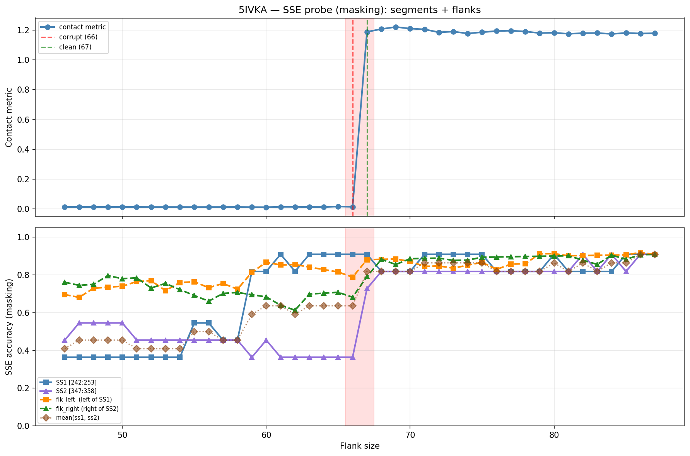

# SSE Probe Analysis: 5IVKA

Generated: 2026-03-03 16:01:04   Model: facebook/esm2_t33_650M_UR50D

## Configuration

| Parameter | Value |
|-----------|-------|
| Protein | 5IVKA |
| Contact pair | (247, 352) |
| ss1 | [242, 253) |
| ss2 | [347, 358) |
| Clean flank | 67 |
| Corrupt flank | 66 |
| Segment radius | 5 |
| Flank sweep | [46, 87] |
| Train sequences | 1,000 |
| Val sequences | 100 |
| Test sequences | 100 |

## SSE Probe Performance

| Split | Accuracy |
|-------|----------|
| Val   | 0.8240 |
| Test  | 0.8259 |

**Test classification report:**

```
              precision    recall  f1-score   support

           H       0.87      0.86      0.86     13101
           E       0.78      0.86      0.82     11471
           C       0.82      0.78      0.80     18602

    accuracy                           0.83     43174
   macro avg       0.83      0.83      0.83     43174
weighted avg       0.83      0.83      0.83     43174

```

## Ground-Truth SSE (full-sequence probe)

| Segment | Sequence |
|---------|----------|
| SS1 [242:253] | `CECHEEEECCC` |
| SS2 [347:358] | `CCEEEEECCHH` |

## Flank Sweep Results

| flank | contact | mk_ss1 | mk_ss2 | mk_mean | mk_flkL | mk_flkR | mk_flk |
|-------|---------|--------|--------|---------|---------|---------|--------|
| 46 | 0.0122 | 0.364 | 0.455 | 0.409 | 0.696 | 0.761 | 0.728 |
| 47 | 0.0123 | 0.364 | 0.545 | 0.455 | 0.681 | 0.745 | 0.713 |
| 48 | 0.0122 | 0.364 | 0.545 | 0.455 | 0.729 | 0.750 | 0.740 |
| 49 | 0.0120 | 0.364 | 0.545 | 0.455 | 0.735 | 0.796 | 0.765 |
| 50 | 0.0121 | 0.364 | 0.545 | 0.455 | 0.740 | 0.780 | 0.760 |
| 51 | 0.0120 | 0.364 | 0.455 | 0.409 | 0.765 | 0.784 | 0.775 |
| 52 | 0.0117 | 0.364 | 0.455 | 0.409 | 0.769 | 0.731 | 0.750 |
| 53 | 0.0116 | 0.364 | 0.455 | 0.409 | 0.717 | 0.755 | 0.736 |
| 54 | 0.0116 | 0.364 | 0.455 | 0.409 | 0.759 | 0.722 | 0.741 |
| 55 | 0.0114 | 0.545 | 0.455 | 0.500 | 0.764 | 0.691 | 0.727 |
| 56 | 0.0116 | 0.545 | 0.455 | 0.500 | 0.732 | 0.661 | 0.696 |
| 57 | 0.0117 | 0.455 | 0.455 | 0.455 | 0.754 | 0.702 | 0.728 |
| 58 | 0.0119 | 0.455 | 0.455 | 0.455 | 0.724 | 0.707 | 0.716 |
| 59 | 0.0111 | 0.818 | 0.364 | 0.591 | 0.814 | 0.695 | 0.754 |
| 60 | 0.0108 | 0.818 | 0.455 | 0.636 | 0.867 | 0.683 | 0.775 |
| 61 | 0.0130 | 0.909 | 0.364 | 0.636 | 0.852 | 0.639 | 0.746 |
| 62 | 0.0129 | 0.818 | 0.364 | 0.591 | 0.855 | 0.613 | 0.734 |
| 63 | 0.0118 | 0.909 | 0.364 | 0.636 | 0.841 | 0.698 | 0.770 |
| 64 | 0.0117 | 0.909 | 0.364 | 0.636 | 0.828 | 0.703 | 0.766 |
| 65 | 0.0149 | 0.909 | 0.364 | 0.636 | 0.815 | 0.708 | 0.762 |
| 66 | 0.0131 | 0.909 | 0.364 | 0.636 | 0.788 | 0.682 | 0.735 |
| 67 | 1.1893 | 0.909 | 0.727 | 0.818 | 0.881 | 0.791 | 0.836 |
| 68 | 1.2084 | 0.818 | 0.818 | 0.818 | 0.882 | 0.882 | 0.882 |
| 69 | 1.2222 | 0.818 | 0.818 | 0.818 | 0.884 | 0.855 | 0.870 |
| 70 | 1.2111 | 0.818 | 0.818 | 0.818 | 0.871 | 0.886 | 0.879 |
| 71 | 1.2061 | 0.909 | 0.818 | 0.864 | 0.845 | 0.887 | 0.866 |
| 72 | 1.1862 | 0.909 | 0.818 | 0.864 | 0.847 | 0.889 | 0.868 |
| 73 | 1.1912 | 0.909 | 0.818 | 0.864 | 0.836 | 0.877 | 0.856 |
| 74 | 1.1784 | 0.909 | 0.818 | 0.864 | 0.851 | 0.878 | 0.865 |
| 75 | 1.1870 | 0.909 | 0.818 | 0.864 | 0.867 | 0.893 | 0.880 |
| 76 | 1.1947 | 0.818 | 0.818 | 0.818 | 0.829 | 0.895 | 0.862 |
| 77 | 1.1971 | 0.818 | 0.818 | 0.818 | 0.857 | 0.896 | 0.877 |
| 78 | 1.1916 | 0.818 | 0.818 | 0.818 | 0.859 | 0.897 | 0.878 |
| 79 | 1.1811 | 0.818 | 0.818 | 0.818 | 0.911 | 0.899 | 0.905 |
| 80 | 1.1833 | 0.909 | 0.818 | 0.864 | 0.912 | 0.900 | 0.906 |
| 81 | 1.1761 | 0.818 | 0.818 | 0.818 | 0.901 | 0.901 | 0.901 |
| 82 | 1.1807 | 0.818 | 0.909 | 0.864 | 0.902 | 0.878 | 0.890 |
| 83 | 1.1816 | 0.818 | 0.818 | 0.818 | 0.904 | 0.855 | 0.880 |
| 84 | 1.1752 | 0.818 | 0.909 | 0.864 | 0.905 | 0.905 | 0.905 |
| 85 | 1.1821 | 0.909 | 0.818 | 0.864 | 0.906 | 0.882 | 0.894 |
| 86 | 1.1784 | 0.909 | 0.909 | 0.909 | 0.919 | 0.907 | 0.913 |
| 87 | 1.1800 | 0.909 | 0.909 | 0.909 | 0.908 | 0.908 | 0.908 |

## Residue-Level Prediction Changes (clean=67, focus ±2)

### Flank 64 → 65

| Seg | Direction | Pos | gt | prev | now |
|-----|-----------|-----|----|------|-----|
| flk_L | corr→incorr | 179 | C | C | E |
| flk_L | incorr→corr | 192 | H | C | H |
| flk_L | incorr→corr | 193 | H | C | H |
| flk_L | corr→incorr | 207 | H | H | C |
| flk_L | corr→incorr | 210 | C | C | H |
| flk_L | corr→incorr | 235 | C | C | H |
| flk_L | incorr→corr | 237 | H | C | H |
| flk_L | incorr→corr | 239 | H | C | H |
| flk_R | incorr→corr | 359 | H | C | H |
| flk_R | incorr→corr | 360 | H | C | H |
| flk_R | corr→incorr | 373 | H | H | C |
| flk_R | corr→incorr | 375 | H | H | C |
| flk_R | incorr→corr | 376 | C | H | C |
| flk_R | incorr→corr | 378 | C | H | C |
| flk_R | corr→incorr | 380 | C | C | E |
| flk_R | corr→incorr | 384 | H | H | C |
| flk_R | incorr→corr | 395 | H | C | H |
| flk_R | corr→incorr | 403 | H | H | C |
| flk_R | incorr→corr | 421 | H | C | H |

### Flank 65 → 66

| Seg | Direction | Pos | gt | prev | now |
|-----|-----------|-----|----|------|-----|
| flk_L | incorr→corr | 179 | C | E | C |
| flk_L | corr→incorr | 192 | H | H | C |
| flk_L | corr→incorr | 193 | H | H | C |
| flk_L | corr→incorr | 237 | H | H | C |
| flk_R | corr→incorr | 359 | H | H | C |
| flk_R | corr→incorr | 360 | H | H | C |
| flk_R | incorr→corr | 366 | H | C | H |
| flk_R | incorr→corr | 373 | H | C | H |
| flk_R | incorr→corr | 375 | H | C | H |
| flk_R | corr→incorr | 376 | C | C | H |
| flk_R | corr→incorr | 378 | C | C | H |
| flk_R | incorr→corr | 379 | H | C | H |
| flk_R | incorr→corr | 380 | C | E | C |
| flk_R | incorr→corr | 384 | H | C | H |
| flk_R | corr→incorr | 389 | C | C | H |
| flk_R | corr→incorr | 395 | H | H | C |
| flk_R | corr→incorr | 401 | H | H | C |
| flk_R | incorr→corr | 403 | H | C | H |
| flk_R | corr→incorr | 421 | H | H | C |

### Flank 66 → 67

| Seg | Direction | Pos | gt | prev | now |
|-----|-----------|-----|----|------|-----|
| SS2 | incorr→corr | 349 | E | C | E |
| SS2 | incorr→corr | 350 | E | H | E |
| SS2 | incorr→corr | 351 | E | C | E |
| SS2 | incorr→corr | 352 | E | C | E |
| flk_L | incorr→corr | 192 | H | C | H |
| flk_L | incorr→corr | 193 | H | C | H |
| flk_L | incorr→corr | 207 | H | C | H |
| flk_L | incorr→corr | 210 | C | H | C |
| flk_L | incorr→corr | 235 | C | H | C |
| flk_L | incorr→corr | 241 | H | C | H |
| flk_R | corr→incorr | 358 | H | H | C |
| flk_R | incorr→corr | 359 | H | C | H |
| flk_R | incorr→corr | 360 | H | C | H |
| flk_R | corr→incorr | 379 | H | H | C |
| flk_R | corr→incorr | 387 | C | C | H |
| flk_R | incorr→corr | 389 | C | H | C |
| flk_R | incorr→corr | 395 | H | C | H |
| flk_R | incorr→corr | 401 | H | C | H |
| flk_R | incorr→corr | 406 | H | C | H |
| flk_R | incorr→corr | 416 | H | C | H |
| flk_R | incorr→corr | 420 | H | C | H |
| flk_R | incorr→corr | 421 | H | C | H |
| flk_R | incorr→corr | 422 | H | C | H |
| flk_R | incorr→corr | 423 | H | C | H |

### Flank 67 → 68

| Seg | Direction | Pos | gt | prev | now |
|-----|-----------|-----|----|------|-----|
| SS1 | corr→incorr | 243 | E | E | C |
| SS2 | incorr→corr | 353 | E | C | E |
| flk_R | incorr→corr | 358 | H | C | H |
| flk_R | corr→incorr | 375 | H | H | C |
| flk_R | incorr→corr | 379 | H | C | H |
| flk_R | incorr→corr | 387 | C | H | C |
| flk_R | incorr→corr | 388 | C | H | C |
| flk_R | incorr→corr | 407 | H | C | H |
| flk_R | incorr→corr | 418 | H | C | H |
| flk_R | incorr→corr | 424 | H | C | H |

### Flank 68 → 69

| Seg | Direction | Pos | gt | prev | now |
|-----|-----------|-----|----|------|-----|
| flk_R | corr→incorr | 374 | H | H | C |
| flk_R | incorr→corr | 376 | C | H | C |
| flk_R | corr→incorr | 379 | H | H | C |
| flk_R | corr→incorr | 416 | H | H | C |

## Plot


