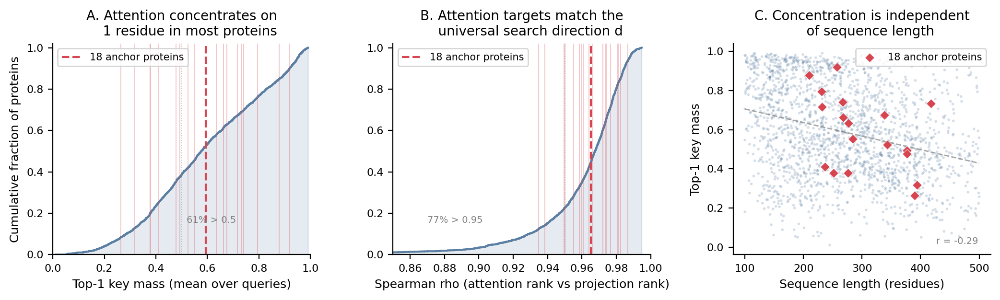
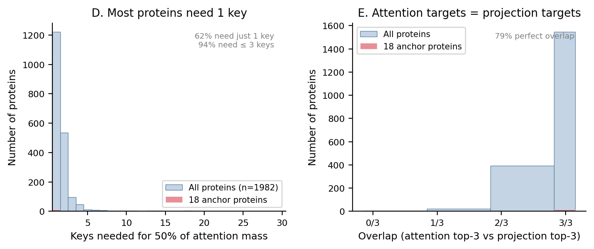

# L10H9 Anchor Behavior Audit

Proteins analyzed: 1982 (from full_seq_dict.json, 100-500 residues).
Known anchor proteins in set: 18/18.
Search direction d: W_K^T @ q_mean from 2B61A (full sequence).

## Key findings

1. L10H9 concentrates attention on 1-3 residues in virtually every protein. 62% of proteins have 50% of mean-key attention mass on a single residue; 94% need 3 or fewer.

2. The residues that receive attention are the ones predicted by the universal search direction d = W_K^T @ q_mean. Spearman rho between attention rank and projection rank averages 0.959 (median 0.968). 77% of proteins exceed rho = 0.95.

3. This concentration is independent of sequence length (r = -0.29 between length and top-1 mass).

4. The 18 previously studied anchor proteins are statistically indistinguishable from the rest on all metrics (all Mann-Whitney p > 0.05).

## Summary statistics

| Metric | All (mean) | All (median) | Std | Known anchors (mean) |
|--------|------------|--------------|-----|---------------------|
| Top-1 key mass | 0.5893 | 0.5767 | 0.2306 | 0.5863 |
| Top-3 key mass | 0.8223 | 0.8783 | 0.1618 | 0.8578 |
| Keys for 50% mass | 1.8365 | 1.0000 | 2.9577 | 1.5000 |
| Effective # keys | 8.2486 | 4.5841 | 13.2319 | 5.3836 |
| Spearman rho | 0.9594 | 0.9676 | 0.0385 | 0.9647 |
| Top-3 overlap | 0.9240 | 1.0000 | 0.1529 | 0.9259 |

## Top 20 most anchor-like proteins (by top-3 key mass)

| Rank | Protein | N res | Top-3 mass | Keys 50% | Rho | Top-3 overlap | Top anchor (pos, AA) | Known? |
|------|---------|-------|------------|----------|-----|---------------|---------------------|--------|
| 1 | 2II1A | 301 | 0.9951 | 1 | 0.956 | 1.00 | 166, V |  |
| 2 | 3RHBA | 113 | 0.9939 | 1 | 0.957 | 1.00 | 22, I |  |
| 3 | 4MZCA | 111 | 0.9932 | 1 | 0.973 | 1.00 | 22, V |  |
| 4 | 1H4XA | 117 | 0.9930 | 1 | 0.978 | 1.00 | 46, W |  |
| 5 | 2GK4A | 232 | 0.9929 | 1 | 0.907 | 1.00 | 87, L |  |
| 6 | 4GS1A | 395 | 0.9919 | 1 | 0.840 | 1.00 | 341, A |  |
| 7 | 1F86A | 115 | 0.9899 | 1 | 0.602 | 1.00 | 61, V |  |
| 8 | 1U2KA | 309 | 0.9893 | 1 | 0.932 | 0.67 | 187, T |  |
| 9 | 3BZMA | 431 | 0.9892 | 1 | 0.965 | 1.00 | 385, L |  |
| 10 | 3N08A | 153 | 0.9888 | 1 | 0.968 | 1.00 | 111, F |  |
| 11 | 2O2KA | 355 | 0.9886 | 1 | 0.896 | 1.00 | 306, V |  |
| 12 | 2D59A | 144 | 0.9886 | 1 | 0.912 | 1.00 | 80, V |  |
| 13 | 1T2WA | 145 | 0.9885 | 1 | 0.898 | 1.00 | 93, M |  |
| 14 | 3R6DA | 221 | 0.9883 | 1 | 0.986 | 1.00 | 151, L |  |
| 15 | 4LH6A | 323 | 0.9878 | 1 | 0.939 | 0.67 | 127, L |  |
| 16 | 2D5MA | 190 | 0.9873 | 1 | 0.921 | 1.00 | 119, L |  |
| 17 | 3G5TA | 299 | 0.9873 | 1 | 0.929 | 0.67 | 116, I |  |
| 18 | 2DYIA | 162 | 0.9871 | 1 | 0.975 | 0.67 | 108, V |  |
| 19 | 1KMVA | 186 | 0.9871 | 1 | 0.971 | 1.00 | 111, V |  |
| 20 | 4PEDA | 393 | 0.9866 | 1 | 0.966 | 1.00 | 89, V |  |

## Bottom 20 least anchor-like proteins (by top-3 key mass)

| Rank | Protein | N res | Top-3 mass | Keys 50% | Rho | Known? |
|------|---------|-------|------------|----------|-----|--------|
| 1963 | 3Q7MA | 376 | 0.2455 | 9 | 0.971 |  |
| 1964 | 5F9OG | 352 | 0.2388 | 14 | 0.924 |  |
| 1965 | 3BGEA | 201 | 0.2361 | 11 | 0.960 |  |
| 1966 | 3VTXA | 184 | 0.2296 | 10 | 0.949 |  |
| 1967 | 1JKEA | 145 | 0.2203 | 12 | 0.958 |  |
| 1968 | 5B0NA | 224 | 0.2193 | 8 | 0.965 |  |
| 1969 | 5CECB | 230 | 0.2064 | 9 | 0.939 |  |
| 1970 | 4PU5A | 453 | 0.2056 | 13 | 0.988 |  |
| 1971 | 3TPDA | 440 | 0.2038 | 11 | 0.987 |  |
| 1972 | 5FA2A | 353 | 0.2023 | 18 | 0.920 |  |
| 1973 | 4XA9A | 297 | 0.1727 | 13 | 0.914 |  |
| 1974 | 4UUCA | 226 | 0.1672 | 11 | 0.942 |  |
| 1975 | 2BM5A | 186 | 0.1600 | 13 | 0.938 |  |
| 1976 | 4U5WA | 149 | 0.1543 | 25 | 0.859 |  |
| 1977 | 4ZLHA | 339 | 0.1491 | 14 | 0.961 |  |
| 1978 | 4TZHA | 190 | 0.1483 | 15 | 0.889 |  |
| 1979 | 2XTYA | 217 | 0.1389 | 14 | 0.946 |  |
| 1980 | 2BWRA | 401 | 0.1248 | 17 | 0.928 |  |
| 1981 | 1O6VA | 466 | 0.1234 | 45 | 0.923 |  |
| 1982 | 1M93B | 245 | 0.0121 | 47 | 0.970 |  |

