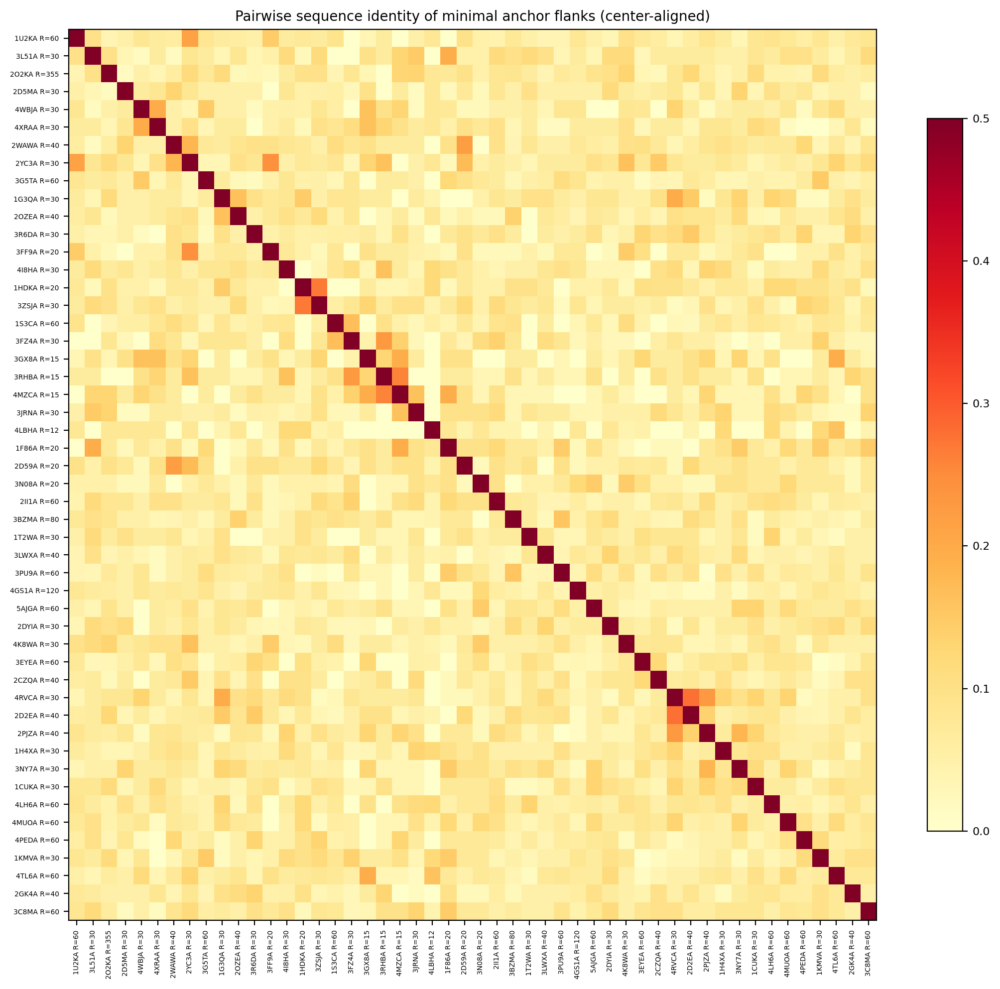
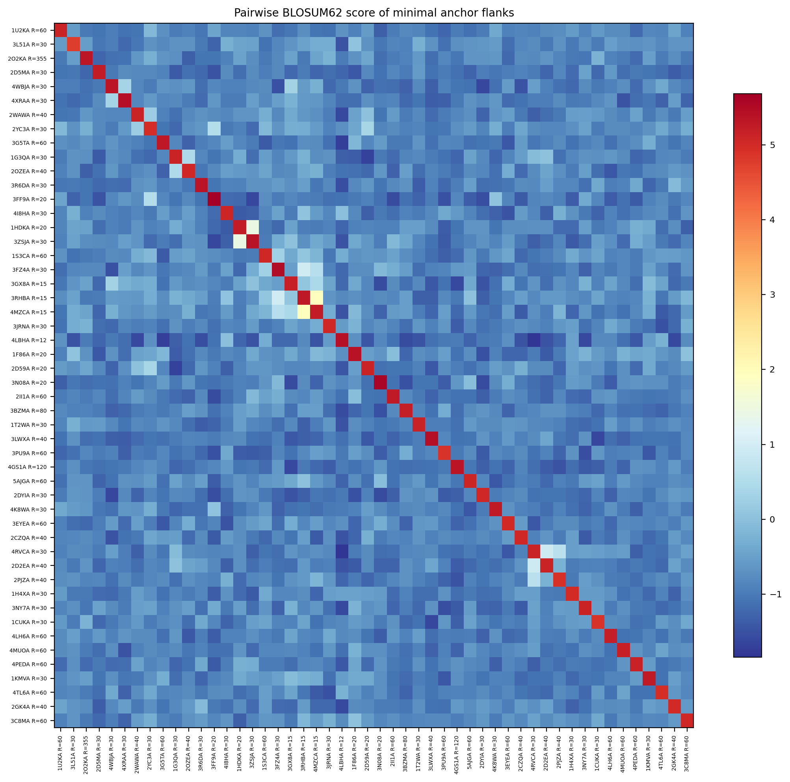
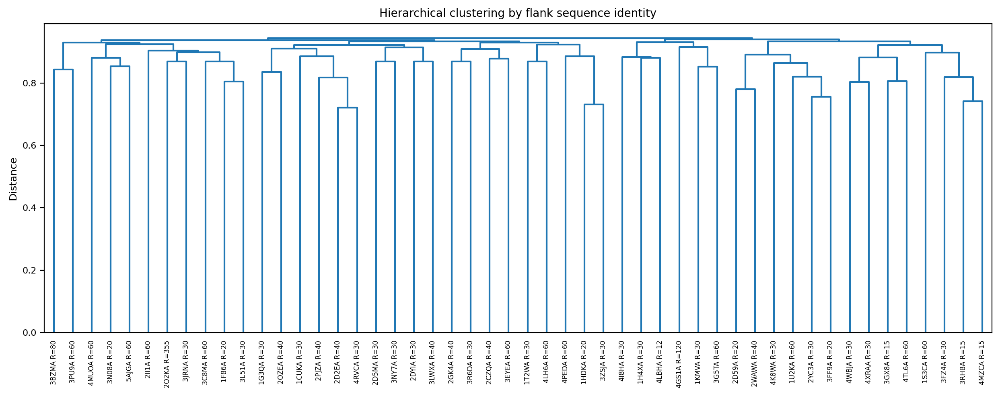
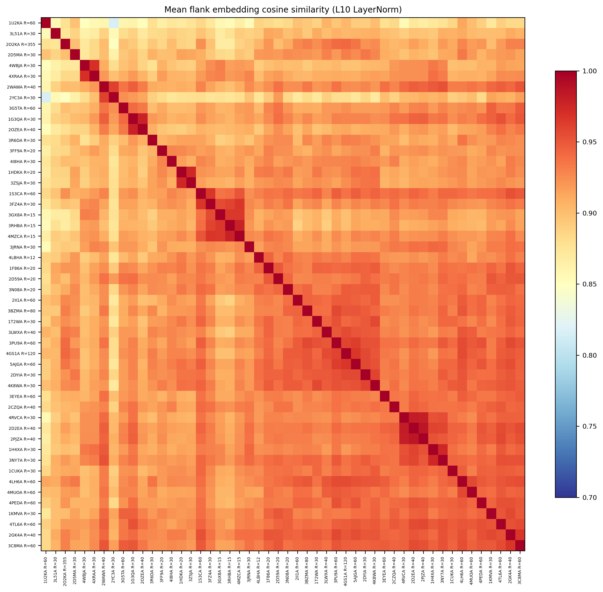
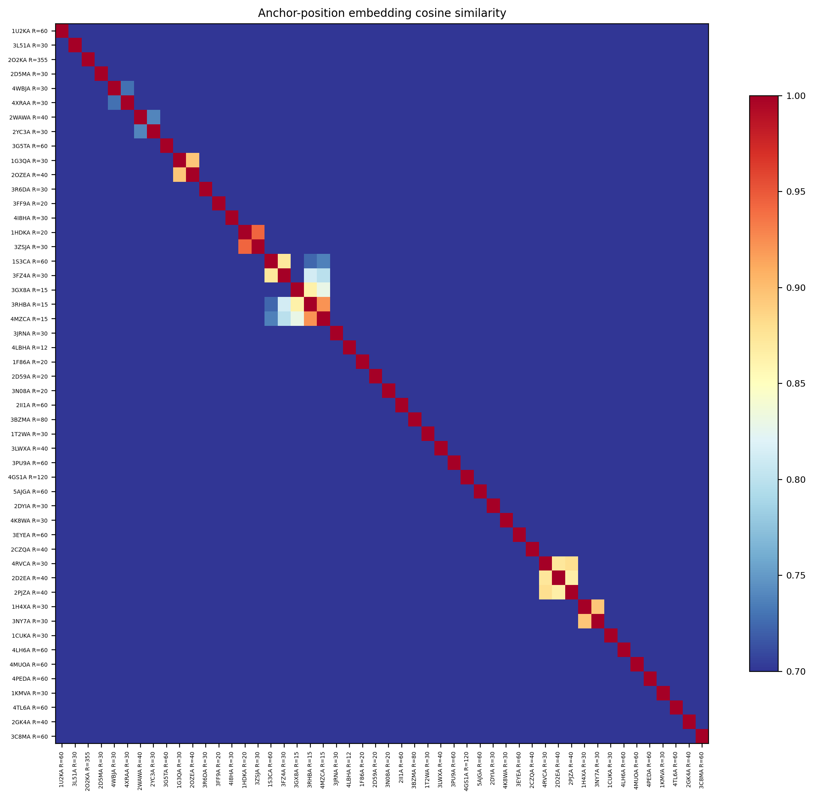
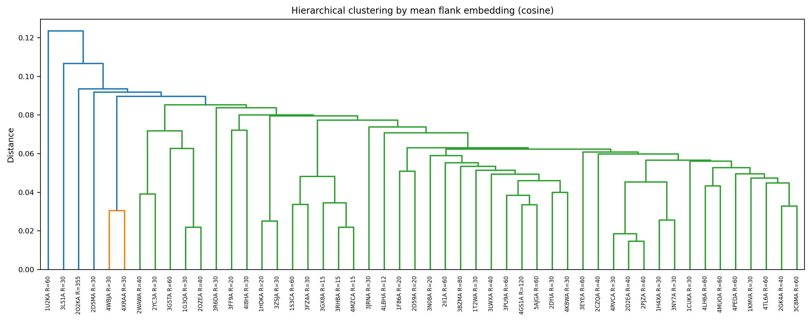
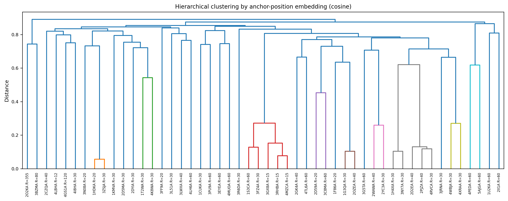
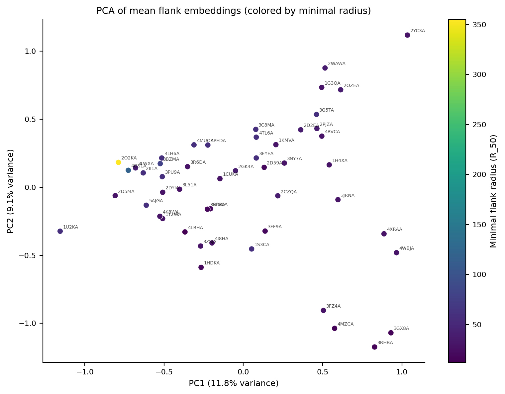
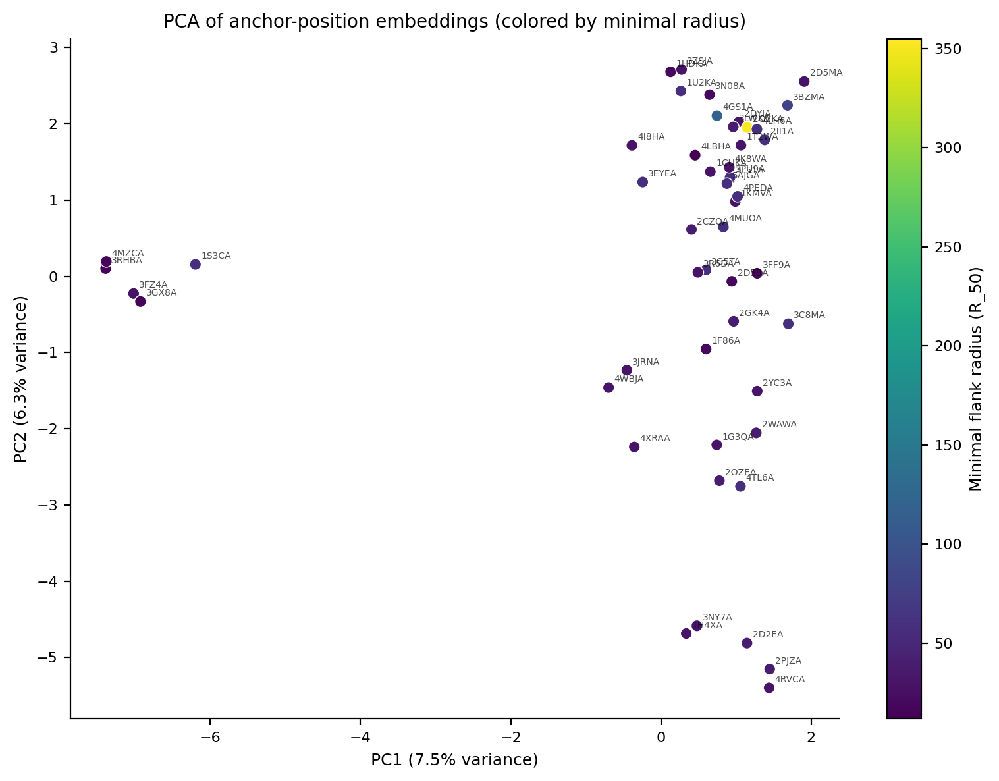
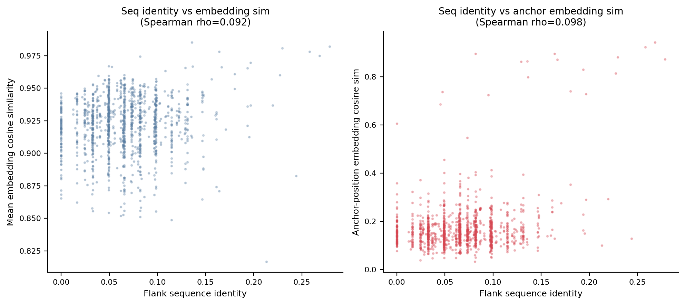

# Anchor Flank Clustering Analysis

Proteins: 50 (from local-flank-v1 experiment, top 50 by anchor confidence).
Minimal flank definition: R_50 recovery threshold on projection (alpha) metric.

## Minimal flank radius distribution

- R=12: 1 proteins
- R=15: 3 proteins
- R=20: 5 proteins
- R=30: 19 proteins
- R=40: 7 proteins
- R=60: 12 proteins
- R=80: 1 proteins
- R=120: 1 proteins
- R=355: 1 proteins

Flank length: min=25, max=355, mean=80, median=61.
Correlation between protein length and minimal radius: Spearman rho=0.830 (p=9.30e-14).

## Anchor residue composition

- L: 15 (30%)
- V: 12 (24%)
- I: 10 (20%)
- G: 3 (6%)
- F: 3 (6%)
- S: 2 (4%)
- W: 1 (2%)
- M: 1 (2%)
- T: 1 (2%)
- C: 1 (2%)
- A: 1 (2%)

## Analysis 1: Pairwise sequence identity of minimal flanks

Center-aligned on anchor position, counting matches in overlapping region.
Mean pairwise identity: 0.065.
Max: 0.279.
Min: 0.000.

Mean pairwise BLOSUM62 score: -0.85.

## Analysis 2: ESM2 embedding similarity

Layer-10 LayerNorm activations from ESM2-650M.
Two embedding types: mean over all flank positions, and anchor position only.

Mean flank embedding cosine similarity (off-diagonal): 0.922.
Anchor-position embedding cosine similarity (off-diagonal): 0.168.

## Cross-analysis

Spearman(seq identity, mean embedding cosine): rho=0.092 (p=1.21e-03).
Spearman(seq identity, anchor embedding cosine): rho=0.098 (p=5.97e-04).
Spearman(BLOSUM62, mean embedding cosine): rho=0.009 (p=7.62e-01).

